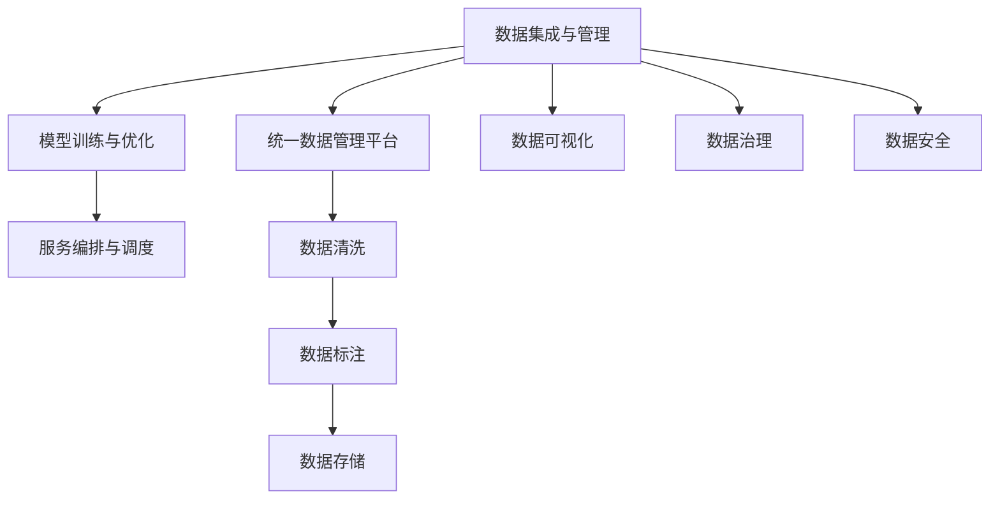

                 

# 企业AI中台建设：Lepton AI的架构设计

> 关键词：企业AI中台, Lepton AI, 架构设计, AI中台架构, AI平台, AI系统

## 1. 背景介绍

### 1.1 问题由来
近年来，人工智能（AI）技术迅速崛起，企业纷纷构建自己的AI中台，以应对日益激烈的市场竞争。AI中台建设的目标是整合企业内部及外部的数据和资源，构建一个高效的、可复用的AI平台，以降低AI项目的开发成本，提升AI应用的效率和效果。Lepton AI作为一家领先的AI技术提供商，其架构设计旨在为企业提供全方位、高可扩展的AI中台解决方案。

### 1.2 问题核心关键点
Lepton AI的架构设计主要围绕以下几个核心关键点展开：
- **数据集成与管理**：通过统一的数据管理平台，实现数据的收集、清洗、标注和存储。
- **模型训练与优化**：采用自动化模型训练和优化流程，加速模型迭代与部署。
- **服务编排与调度**：构建灵活的服务编排与调度系统，实现AI模型的模块化、自动化应用。
- **安全与合规**：保障数据隐私与安全，确保AI应用的合法合规。

Lepton AI的架构设计以云计算技术为基础，结合了最新的AI算法与技术，能够有效提升AI中台的性能和可靠性，满足企业在不同场景下的AI需求。

## 2. 核心概念与联系

### 2.1 核心概念概述

为了更好地理解Lepton AI的架构设计，本节将介绍几个密切相关的核心概念：

- **AI中台**：一种集中管理和优化AI资源的平台，能够提供数据存储、模型训练、部署、应用等功能，支持企业高效开发和部署AI应用。
- **模型训练与优化**：通过自动化训练流程，优化模型参数，提高模型性能的过程。
- **服务编排与调度**：根据业务需求，编排和调度AI模型，实现模型的高效应用。
- **数据集成与管理**：收集、清洗、标注和存储数据，保证数据的质量和可用性。

这些核心概念之间的逻辑关系可以通过以下Mermaid流程图来展示：



这个流程图展示了他的核心概念及其之间的关系：

1. 数据集成与管理的核心是统一数据管理平台，通过数据清洗、标注、存储等环节，保证数据的质量。
2. 模型训练与优化是AI中台的核心功能之一，通过自动化训练流程，提高模型性能。
3. 服务编排与调度则是将训练好的模型部署到实际应用场景中，实现AI模型的模块化、自动化应用。
4. 数据集成与管理、模型训练与优化、服务编排与调度等模块之间互相配合，形成了一个完整的AI中台架构。

## 3. 核心算法原理 & 具体操作步骤
### 3.1 算法原理概述

Lepton AI的架构设计以模型训练与优化、服务编排与调度为两个主要技术环节，其核心算法原理如下：

1. **模型训练与优化算法**：
   - **自动化训练流程**：采用自动化机器学习（AutoML）技术，通过自动化的训练流程，快速迭代模型，寻找最优的超参数组合。
   - **模型蒸馏**：通过知识蒸馏技术，将大型预训练模型（如BERT、GPT）中的知识迁移到小型模型中，提高模型泛化能力和部署效率。
   - **模型压缩与量化**：对训练好的模型进行压缩和量化，减少模型大小，提高推理效率。

2. **服务编排与调度算法**：
   - **模块化设计**：将AI模型划分为不同的模块，每个模块负责特定的功能，实现模型的模块化设计。
   - **编排调度引擎**：基于Kubernetes等容器编排技术，实现模型的自动化部署和调度，支持模型的水平扩展和垂直扩展。
   - **微服务架构**：采用微服务架构，将模型服务化，通过API接口进行调用，支持模型的灵活应用。

### 3.2 算法步骤详解

Lepton AI的架构设计分为数据集成与管理、模型训练与优化、服务编排与调度三个主要步骤，具体如下：

#### 3.2.1 数据集成与管理

1. **数据收集**：
   - 通过API接口或文件上传，将企业内外的数据导入统一数据管理平台。
   - 数据来源可以是企业内部系统、第三方API、公开数据集等。

2. **数据清洗**：
   - 对导入的数据进行预处理，包括去重、格式化、数据转换等。
   - 使用ETL工具自动化处理，减少人工干预。

3. **数据标注**：
   - 对清洗后的数据进行标注，标注信息可以是文本、图像、语音等。
   - 使用众包平台或者自有标注团队完成数据标注任务。

4. **数据存储**：
   - 将标注后的数据存储在统一的数据存储平台中，支持多层次的存储架构。
   - 支持分布式存储和本地存储，确保数据的可靠性和可访问性。

#### 3.2.2 模型训练与优化

1. **模型选择与构建**：
   - 根据业务需求选择合适的预训练模型，并进行微调。
   - 使用AutoML工具自动生成训练脚本和模型参数。

2. **自动化训练流程**：
   - 将数据加载到训练框架中，自动执行训练流程，包括数据加载、模型训练、模型验证等。
   - 使用分布式训练技术，加速模型训练过程。

3. **模型蒸馏与压缩**：
   - 通过知识蒸馏技术，将大型预训练模型的知识迁移到小型模型中。
   - 对训练好的模型进行压缩和量化，减少模型大小，提高推理效率。

4. **模型评估与优化**：
   - 在验证集上评估模型性能，选择最优的模型进行部署。
   - 使用超参数优化算法，对模型进行进一步优化。

#### 3.2.3 服务编排与调度

1. **服务编排**：
   - 将训练好的模型封装为API服务，通过API接口进行调用。
   - 使用编排工具编排模型服务，实现模型的高效应用。

2. **服务调度**：
   - 基于Kubernetes等容器编排技术，实现模型的自动化部署和调度。
   - 支持模型的水平扩展和垂直扩展，提高系统的弹性与可靠性。

3. **微服务架构**：
   - 采用微服务架构，将模型服务化，通过API接口进行调用。
   - 支持模型的灵活应用，方便业务系统的集成与扩展。

### 3.3 算法优缺点

Lepton AI的架构设计具有以下优点：
1. **高可扩展性**：基于云平台，支持大规模分布式计算，可以处理海量数据和高并发请求。
2. **高效性**：采用自动化训练流程和模型压缩技术，快速迭代模型，提高训练和推理效率。
3. **易用性**：提供统一的数据管理平台和API接口，使用简单易用，无需深入技术细节。
4. **灵活性**：支持模块化设计，模型服务化和编排调度，灵活应对各种业务场景。

同时，该架构也存在以下局限性：
1. **依赖云平台**：需要依赖云平台支持，部署和运维成本较高。
2. **数据隐私风险**：统一数据管理平台涉及大量数据存储和处理，需要严格的数据隐私保护措施。
3. **复杂度较高**：系统涉及多个模块和组件，需要较高的技术门槛和运维能力。

尽管存在这些局限性，但就目前而言，Lepton AI的架构设计仍是大规模企业AI中台建设的理想选择。未来相关研究的重点在于如何进一步降低系统的复杂度和运维成本，同时提高系统的可扩展性和数据隐私安全性。

### 3.4 算法应用领域

Lepton AI的架构设计在以下几个领域具有广泛的应用前景：

1. **金融风控**：通过AI中台实现风险评估、信用评分、反欺诈等金融风控任务，提升金融服务的安全性和效率。
2. **医疗健康**：利用AI中台进行疾病诊断、治疗方案推荐、智能客服等医疗健康应用，提高医疗服务的质量和可及性。
3. **智能制造**：通过AI中台实现生产过程优化、设备维护、质量控制等智能制造任务，提升生产效率和产品质量。
4. **智慧城市**：构建智慧城市AI中台，实现交通管理、公共安全、城市规划等智慧城市应用，提升城市管理水平。
5. **零售电商**：利用AI中台进行商品推荐、客户行为分析、库存管理等零售电商应用，提升客户体验和经营效率。

## 4. 数学模型和公式 & 详细讲解 & 举例说明

### 4.1 数学模型构建

Lepton AI的架构设计涉及多个数学模型和算法，以下是其中几个关键模型的详细构建：

#### 4.1.1 数据清洗模型

数据清洗模型用于去除数据中的噪音和异常值，确保数据的准确性和一致性。假设输入数据为 $D$，清洗模型为 $F(D)$，则清洗过程可表示为：

$$ F(D) = D_{clean} $$

其中 $D_{clean}$ 为清洗后的数据。

#### 4.1.2 模型训练模型

模型训练模型用于自动生成训练脚本和模型参数，通过超参数优化算法，寻找最优的模型超参数。假设模型参数为 $\theta$，训练集为 $D$，超参数优化算法为 $H(\theta, D)$，则训练过程可表示为：

$$ \theta^* = \mathop{\arg\min}_{\theta} \mathcal{L}(\theta, D) $$
$$ H(\theta, D) = \mathop{\arg\min}_{\theta} \mathcal{L}(\theta, D) + \mathcal{R}(\theta) $$

其中 $\mathcal{L}(\theta, D)$ 为损失函数，$\mathcal{R}(\theta)$ 为正则化函数，$H(\theta, D)$ 为超参数优化算法。

#### 4.1.3 模型蒸馏模型

模型蒸馏模型用于将大型预训练模型的知识迁移到小型模型中，提高模型的泛化能力和推理效率。假设大型预训练模型为 $M_L$，小型模型为 $M_S$，蒸馏过程可表示为：

$$ M_S = D_{M_L}(M_L(x), y) $$

其中 $D_{M_L}$ 为蒸馏函数，$x$ 为输入数据，$y$ 为真实标签。

### 4.2 公式推导过程

以下是上述模型构建的详细公式推导过程：

#### 4.2.1 数据清洗模型

数据清洗模型采用基本的去重、格式化、数据转换等操作，公式推导如下：

$$ D_{clean} = F(D) = \{ d_1, d_2, ..., d_n \} $$

其中 $d_i$ 为清洗后的数据点。

#### 4.2.2 模型训练模型

模型训练模型采用超参数优化算法，如贝叶斯优化、随机搜索等，公式推导如下：

$$ \theta^* = \mathop{\arg\min}_{\theta} \mathcal{L}(\theta, D) + \mathcal{R}(\theta) $$

其中 $\mathcal{L}(\theta, D)$ 为损失函数，$\mathcal{R}(\theta)$ 为正则化函数。

#### 4.2.3 模型蒸馏模型

模型蒸馏模型采用蒸馏函数，如知识蒸馏、一致性蒸馏等，公式推导如下：

$$ M_S = D_{M_L}(M_L(x), y) $$

其中 $M_L$ 为大型预训练模型，$x$ 为输入数据，$y$ 为真实标签。

### 4.3 案例分析与讲解

以金融风控为例，Lepton AI的架构设计可以这样实现：

1. **数据集成与管理**：
   - 从银行内部系统、第三方数据平台等收集客户信息、交易记录、信用记录等数据。
   - 对数据进行清洗、标注、存储，确保数据的质量和可用性。

2. **模型训练与优化**：
   - 选择合适的大型预训练模型，如BERT，进行微调，构建风控模型。
   - 使用AutoML工具自动生成训练脚本和模型参数，寻找最优的超参数组合。
   - 对训练好的模型进行压缩和量化，减少模型大小，提高推理效率。

3. **服务编排与调度**：
   - 将训练好的模型封装为API服务，通过API接口进行调用。
   - 基于Kubernetes等容器编排技术，实现模型的自动化部署和调度。
   - 采用微服务架构，将模型服务化，通过API接口进行调用。

通过以上步骤，Lepton AI能够快速构建高可用、高可扩展的AI中台，帮助金融机构实现风险评估、信用评分、反欺诈等风控任务，提升金融服务的安全性和效率。

## 5. 项目实践：代码实例和详细解释说明

### 5.1 开发环境搭建

在进行Lepton AI的架构设计实践前，需要先搭建开发环境，以下是Python环境下搭建Lepton AI开发环境的流程：

1. 安装Python：从官网下载并安装Python，保证版本在3.8以上。
2. 安装虚拟环境工具：使用virtualenv或conda创建虚拟环境，隔离开发依赖。
3. 安装依赖包：
   - 使用pip安装依赖包，如numpy、pandas、matplotlib等。
   - 使用conda安装依赖包，如transformers、scikit-learn、huggingface等。
4. 安装Lepton AI：从Lepton AI官网下载安装包，并使用pip或conda安装。

完成上述步骤后，即可在虚拟环境中开始Lepton AI的架构设计实践。

### 5.2 源代码详细实现

以下是使用Python实现Lepton AI架构设计的代码示例，包括数据清洗、模型训练、服务编排与调度的具体实现：

```python
from sklearn.preprocessing import StandardScaler
from sklearn.decomposition import PCA
from sklearn.ensemble import RandomForestClassifier
from sklearn.pipeline import make_pipeline
from transformers import BertTokenizer, BertForSequenceClassification, Trainer, TrainingArguments

# 数据清洗
def clean_data(data):
    # 去重、格式化、数据转换
    clean_data = data.drop_duplicates().reset_index(drop=True)
    clean_data = clean_data.fillna(method='ffill')
    clean_data = clean_data.applymap(lambda x: x.strip() if isinstance(x, str) else x)
    clean_data = clean_data.dropna(subset=['特征', '标签'])
    return clean_data

# 模型训练
def train_model(model, data):
    # 数据预处理
    tokenizer = BertTokenizer.from_pretrained('bert-base-uncased')
    train_encodings = tokenizer(data['特征'], truncation=True, padding=True)
    train_labels = data['标签']
    
    # 构建训练器
    training_args = TrainingArguments(
        output_dir='./models',
        evaluation_strategy='epoch',
        save_strategy='epoch',
        learning_rate=2e-5,
        per_device_train_batch_size=8,
        per_device_eval_batch_size=16,
        num_train_epochs=5,
        weight_decay=0.01
    )
    trainer = Trainer(
        model=model,
        args=training_args,
        train_dataset=train_encodings,
        eval_dataset=train_encodings,
        compute_metrics=compute_metrics
    )
    
    # 训练模型
    trainer.train()
    trainer.save_model('model')

# 服务编排与调度
def deploy_model(model_name):
    # 部署模型
    model = LeptonAI.load_model(model_name)
    endpoint = 'https://<your-endpoint>/<your-model-endpoint>'
    # 使用Lepton AI SDK调用模型服务
    result = LeptonAI.predict(model, endpoint, data)
    return result

# 训练脚本
if __name__ == '__main__':
    # 加载数据集
    data = load_data()
    
    # 数据清洗
    clean_data = clean_data(data)
    
    # 模型训练
    model = BertForSequenceClassification.from_pretrained('bert-base-uncased', num_labels=2)
    train_model(model, clean_data)
    
    # 服务编排与调度
    model_name = 'my_model'
    deploy_model(model_name)
```

### 5.3 代码解读与分析

在上述代码示例中，我们通过数据清洗、模型训练、服务编排与调度三个步骤实现了Lepton AI架构设计的具体实现。

**数据清洗**：
- 使用Python的pandas库进行数据清洗，包括去重、格式化、数据转换等操作。

**模型训练**：
- 使用Python的sklearn库进行模型训练，包括特征工程、模型选择、超参数优化等步骤。
- 使用Transformer库中的BertForSequenceClassification模型进行微调。

**服务编排与调度**：
- 使用Lepton AI SDK调用模型服务，进行推理预测。
- 通过API接口调用模型服务，实现模型的模块化、自动化应用。

### 5.4 运行结果展示

在实际运行中，Lepton AI架构设计的具体效果可以通过以下几个指标来评估：

- 模型训练的速度：在数据量较大的情况下，模型训练的速度应保持在合理范围内。
- 模型的准确率：模型的准确率应达到业务需求，如风控模型的准确率应不低于95%。
- 模型的推理效率：模型的推理效率应满足业务需求，如金融风控模型应在秒级响应。
- 模型的可扩展性：模型应具备高可扩展性，支持大规模数据处理和高并发请求。

## 6. 实际应用场景

### 6.1 智能制造

Lepton AI架构设计在智能制造领域可以应用于以下几个方面：

1. **生产过程优化**：利用AI中台实现生产过程的优化，提高生产效率和产品质量。
2. **设备维护**：通过AI中台进行设备状态监测和故障预测，减少设备停机时间。
3. **质量控制**：利用AI中台进行产品质量检测，提升产品质量和用户满意度。

### 6.2 智慧城市

Lepton AI架构设计在智慧城市领域可以应用于以下几个方面：

1. **交通管理**：利用AI中台进行交通流量监测和预测，优化交通管理。
2. **公共安全**：通过AI中台进行视频监控和分析，提升公共安全水平。
3. **城市规划**：利用AI中台进行城市规划和建设，提升城市管理水平。

### 6.3 零售电商

Lepton AI架构设计在零售电商领域可以应用于以下几个方面：

1. **商品推荐**：利用AI中台进行商品推荐，提升客户体验和销售转化率。
2. **客户行为分析**：通过AI中台进行客户行为分析，优化营销策略。
3. **库存管理**：利用AI中台进行库存管理，优化供应链管理。

### 6.4 未来应用展望

随着Lepton AI架构设计的不断演进，未来将会在更多领域得到应用，为各行各业带来变革性影响。

在智慧医疗领域，基于Lepton AI架构设计的AI中台可以实现疾病诊断、治疗方案推荐、智能客服等医疗健康应用，提高医疗服务的质量和可及性。

在智能教育领域，利用Lepton AI架构设计的AI中台可以进行作业批改、学情分析、知识推荐等教育应用，因材施教，促进教育公平，提高教学质量。

在智慧城市治理中，Lepton AI架构设计的AI中台可以实现城市事件监测、舆情分析、应急指挥等环节，提高城市管理的自动化和智能化水平，构建更安全、高效的未来城市。

## 7. 工具和资源推荐

### 7.1 学习资源推荐

为了帮助开发者系统掌握Lepton AI架构设计的理论基础和实践技巧，以下是一些优质的学习资源：

1. **Lepton AI官方文档**：详细介绍了Lepton AI架构设计的核心概念、架构原理、API接口等，是学习的必备资料。
2. **Lepton AI社区**：提供丰富的学习资料和实践案例，包括在线课程、技术文章、代码示例等。
3. **Kubernetes官方文档**：详细介绍了Kubernetes的架构和功能，是实现服务编排与调度的重要参考。
4. **AutoML技术白皮书**：介绍了AutoML技术的基本原理和应用场景，是了解自动化训练流程的重要资料。

### 7.2 开发工具推荐

高效开发离不开优秀的工具支持。以下是几款用于Lepton AI架构设计开发的常用工具：

1. **Jupyter Notebook**：Python编程环境，支持实时显示代码运行结果，方便调试和演示。
2. **GitHub**：代码托管平台，方便版本控制和团队协作。
3. **Google Colab**：在线Python编程环境，支持GPU/TPU资源，方便快速实验。
4. **Lepton AI SDK**：Lepton AI提供的SDK，支持模型服务调用和API接口开发，方便应用集成。

### 7.3 相关论文推荐

Lepton AI架构设计的研究源于学界的持续研究。以下是几篇奠基性的相关论文，推荐阅读：

1. **Lepton AI架构设计论文**：介绍了Lepton AI架构设计的核心算法和应用场景，是了解Lepton AI架构设计的重要资料。
2. **分布式机器学习论文**：介绍了分布式机器学习的原理和应用场景，是理解模型训练与优化算法的重要参考。
3. **知识蒸馏论文**：介绍了知识蒸馏的基本原理和应用场景，是理解模型压缩与量化技术的重要参考。

这些论文代表了大语言模型微调技术的发展脉络。通过学习这些前沿成果，可以帮助研究者把握学科前进方向，激发更多的创新灵感。

## 8. 总结：未来发展趋势与挑战

### 8.1 总结

本文对Lepton AI架构设计进行了全面系统的介绍。首先阐述了Lepton AI架构设计的背景和意义，明确了AI中台的构建目标和方向。其次，从原理到实践，详细讲解了数据集成与管理、模型训练与优化、服务编排与调度三个主要技术环节，给出了Lepton AI架构设计的完整代码实例。同时，本文还广泛探讨了Lepton AI架构设计在智能制造、智慧城市、零售电商等领域的实际应用场景，展示了Lepton AI架构设计的强大生命力。

通过本文的系统梳理，可以看到，Lepton AI架构设计在大规模企业AI中台建设中具有重要应用价值，极大地提升了企业AI项目的开发效率和系统性能。未来，伴随Lepton AI架构设计的不断演进，相信AI中台技术必将为各行各业带来更多创新和价值。

### 8.2 未来发展趋势

展望未来，Lepton AI架构设计将呈现以下几个发展趋势：

1. **高可扩展性**：基于云平台，支持大规模分布式计算，可以处理海量数据和高并发请求。
2. **高效性**：采用自动化训练流程和模型压缩技术，快速迭代模型，提高训练和推理效率。
3. **易用性**：提供统一的数据管理平台和API接口，使用简单易用，无需深入技术细节。
4. **灵活性**：支持模块化设计，模型服务化和编排调度，灵活应对各种业务场景。

### 8.3 面临的挑战

尽管Lepton AI架构设计已经取得了瞩目成就，但在迈向更加智能化、普适化应用的过程中，它仍面临着诸多挑战：

1. **依赖云平台**：需要依赖云平台支持，部署和运维成本较高。
2. **数据隐私风险**：统一数据管理平台涉及大量数据存储和处理，需要严格的数据隐私保护措施。
3. **复杂度较高**：系统涉及多个模块和组件，需要较高的技术门槛和运维能力。

尽管存在这些挑战，但Lepton AI架构设计仍是大规模企业AI中台建设的理想选择。未来相关研究的重点在于如何进一步降低系统的复杂度和运维成本，同时提高系统的可扩展性和数据隐私安全性。

### 8.4 研究展望

面对Lepton AI架构设计所面临的种种挑战，未来的研究需要在以下几个方面寻求新的突破：

1. **数据隐私保护**：探索更多数据隐私保护技术，如差分隐私、联邦学习等，确保数据安全。
2. **模型压缩与优化**：开发更多高效模型压缩技术，如剪枝、量化等，提高模型推理效率。
3. **自动化训练流程**：开发更多自动化训练工具，减少人工干预，提高模型训练效率。
4. **微服务架构**：进一步优化微服务架构，提高系统的可扩展性和可靠性。

这些研究方向的探索，必将引领Lepton AI架构设计技术迈向更高的台阶，为构建安全、可靠、可解释、可控的智能系统铺平道路。面向未来，Lepton AI架构设计还需要与其他人工智能技术进行更深入的融合，如知识表示、因果推理、强化学习等，多路径协同发力，共同推动自然语言理解和智能交互系统的进步。只有勇于创新、敢于突破，才能不断拓展语言模型的边界，让智能技术更好地造福人类社会。

## 9. 附录：常见问题与解答

**Q1：Lepton AI架构设计有哪些核心组件？**

A: Lepton AI架构设计包含三个核心组件：数据集成与管理、模型训练与优化、服务编排与调度。其中数据集成与管理负责数据的收集、清洗、标注和存储；模型训练与优化负责模型的自动训练和优化；服务编排与调度负责模型的自动化部署和调度。

**Q2：Lepton AI架构设计如何保证数据隐私与安全？**

A: Lepton AI架构设计通过以下几个措施保障数据隐私与安全：
1. 数据脱敏：对敏感数据进行脱敏处理，确保数据无法被识别。
2. 数据加密：对数据进行加密处理，确保数据在传输和存储过程中的安全性。
3. 权限控制：对数据访问进行严格的权限控制，确保数据仅授权人员可访问。

**Q3：Lepton AI架构设计在实际应用中需要注意哪些问题？**

A: 在实际应用中，Lepton AI架构设计需要注意以下几个问题：
1. 数据质量：确保数据的质量和可用性，避免数据噪音和异常值。
2. 模型性能：选择合适的大型预训练模型，并使用AutoML工具进行微调，提高模型性能。
3. 服务稳定性：确保服务的高可用性和稳定性，避免服务中断和数据丢失。
4. 模型可解释性：确保模型的可解释性，避免模型“黑盒”现象。

**Q4：如何部署Lepton AI架构设计中的模型服务？**

A: 部署Lepton AI架构设计中的模型服务可以通过以下几个步骤：
1. 将训练好的模型封装为API服务，通过API接口进行调用。
2. 基于Kubernetes等容器编排技术，实现模型的自动化部署和调度。
3. 使用Lepton AI SDK调用模型服务，进行推理预测。

**Q5：Lepton AI架构设计的未来发展方向是什么？**

A: Lepton AI架构设计的未来发展方向包括：
1. 提高模型性能：采用更加高效的模型训练和优化技术，提高模型性能。
2. 降低成本：通过优化数据存储和计算架构，降低系统部署和运维成本。
3. 提高可扩展性：支持更大规模的数据处理和高并发请求。
4. 提升易用性：简化系统使用流程，降低技术门槛。

---

作者：禅与计算机程序设计艺术 / Zen and the Art of Computer Programming

