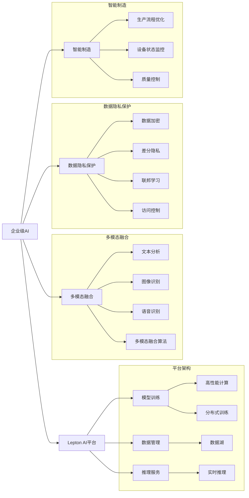

                 

# 企业级AI解决方案：Lepton AI的定制服务

> 关键词：
- 企业级AI
- Lepton AI
- 定制化服务
- 智能制造
- 数据隐私保护
- 决策支持
- 模型可解释性
- 自动化流程
- 多模态融合
- 增强现实(AR)应用

## 1. 背景介绍

### 1.1 问题由来

在数字化转型加速的当下，企业面临巨大的变革压力，迫切需要引入人工智能(AI)技术来提升运营效率、增强决策能力，以及更好地服务客户。然而，传统AI解决方案往往存在通用性差、部署复杂、定制化程度低等问题，难以满足企业多样化的业务需求。为此，Lepton AI应运而生，以提供高度定制化的AI解决方案为己任，助力企业实现数字化、智能化转型。

### 1.2 问题核心关键点

Lepton AI的核心在于其高度定制化的AI服务。通过深入理解企业特定业务场景，Lepton AI能够量身打造贴合业务需求的AI系统。这些系统不仅能够提升企业的数据处理能力、决策支持能力，还能增强客户体验、优化运营流程。此外，Lepton AI还注重数据隐私保护，确保企业在享受AI技术带来红利的同时，能够合规使用用户数据。

Lepton AI的定制化服务具有以下特点：
- **高度适应性**：能够根据企业具体需求，量身定制AI模型和系统。
- **高效集成**：提供API接口，方便企业系统集成。
- **模型解释性**：采用可解释性强的算法，增强模型透明度。
- **数据隐私保护**：采用先进的隐私保护技术，确保数据安全合规。
- **实时性优化**：优化模型推理速度，实现低延迟应用。
- **多模态融合**：结合文本、图像、语音等多模态数据，增强系统感知能力。

### 1.3 问题研究意义

Lepton AI的定制化服务，能够帮助企业在以下几个方面取得显著提升：
- **提升运营效率**：通过自动化流程，减少人工干预，提升生产效率。
- **增强决策支持**：提供基于数据的洞察，帮助企业做出更精准的决策。
- **改善客户体验**：通过智能客服、推荐系统等，提升客户满意度和忠诚度。
- **优化资源配置**：利用AI进行资源预测和优化，降低成本，提升效益。
- **应对市场变化**：快速响应市场变化，保持竞争优势。

Lepton AI的定制化服务，不仅能够助力企业实现数字化转型，还能够在复杂多变的市场环境中，为企业提供持续的竞争优势。通过AI技术，企业能够更好地理解市场、客户和运营数据，提升整体的运营能力和市场响应速度。

## 2. 核心概念与联系

### 2.1 核心概念概述

Lepton AI的定制化服务涉及多个核心概念，包括企业级AI、Lepton AI平台、多模态融合、数据隐私保护、智能制造等。这些概念之间相互关联，共同构成了Lepton AI的强大生态系统。

- **企业级AI**：面向企业具体需求，提供定制化、可扩展、高性能的AI解决方案。
- **Lepton AI平台**：作为AI服务的基础设施，提供模型训练、推理、数据管理等功能。
- **多模态融合**：结合文本、图像、语音等多模态数据，提升系统感知能力和智能决策能力。
- **数据隐私保护**：采用先进的隐私保护技术，确保数据安全合规，满足企业数据隐私需求。
- **智能制造**：结合AI技术，优化生产流程，提高生产效率和质量。

### 2.2 核心概念原理和架构的 Mermaid 流程图



### 2.3 核心概念间的联系

Lepton AI的定制化服务，通过对这些核心概念的深度整合，构建了一个强大的AI生态系统，能够为企业提供全方位的数字化、智能化解决方案。

- **企业级AI与Lepton AI平台**：企业级AI提供具体的AI服务，而Lepton AI平台提供必要的技术支撑，包括模型训练、推理、数据管理等功能。
- **多模态融合与数据隐私保护**：多模态融合技术能够增强系统感知能力，而数据隐私保护技术则确保数据安全合规。
- **智能制造与数据隐私保护**：智能制造依赖于数据驱动，而数据隐私保护则是数据安全的基础。

这些概念之间的紧密联系，使得Lepton AI能够提供全面、高效的AI解决方案，满足企业在各个业务场景中的需求。

## 3. 核心算法原理 & 具体操作步骤

### 3.1 算法原理概述

Lepton AI的定制化服务基于深度学习和多模态融合算法。具体而言，Lepton AI通过以下步骤，实现对企业需求的定制化AI解决方案：

1. **需求分析**：通过与企业深入交流，了解业务需求和场景特点。
2. **模型定制**：根据需求，选择合适的算法和模型架构，进行定制化设计。
3. **数据预处理**：对企业数据进行清洗、标注、预处理，为模型训练做好准备。
4. **模型训练**：在Lepton AI平台上，使用高性能计算资源，进行模型训练。
5. **模型优化**：通过超参数调整和正则化技术，优化模型性能。
6. **模型部署**：将训练好的模型部署到Lepton AI平台，提供API接口，实现系统集成。
7. **效果评估**：对模型效果进行评估，确保满足企业需求。

### 3.2 算法步骤详解

#### 3.2.1 需求分析

需求分析是Lepton AI定制化服务的第一步。通过与企业深入交流，了解其业务需求、数据特点、系统架构等关键信息。例如，在智能制造场景中，需要了解企业的生产流程、设备类型、生产环境等特点。

#### 3.2.2 模型定制

根据需求分析的结果，选择合适的算法和模型架构。例如，在智能制造中，可以采用基于深度学习的视觉识别算法，结合设备状态监测数据，构建生产流程优化模型。

#### 3.2.3 数据预处理

数据预处理是模型训练的重要环节。对企业数据进行清洗、标注、预处理，确保数据质量。例如，对于图像数据，需要进行去噪、归一化、尺寸调整等预处理步骤。

#### 3.2.4 模型训练

在Lepton AI平台上，使用高性能计算资源进行模型训练。Lepton AI平台提供分布式训练和模型并行优化功能，能够加速模型训练过程。

#### 3.2.5 模型优化

模型优化是提升模型性能的关键步骤。通过超参数调整和正则化技术，优化模型性能。例如，在智能制造中，可以通过调整学习率、批量大小、正则化参数等，提升模型准确率和鲁棒性。

#### 3.2.6 模型部署

将训练好的模型部署到Lepton AI平台，提供API接口，实现系统集成。Lepton AI平台支持多种部署方式，包括云部署、边缘计算部署等。

#### 3.2.7 效果评估

对模型效果进行评估，确保满足企业需求。通过在测试集上进行模型测试，评估模型精度、召回率、F1值等指标，确保模型性能达标。

### 3.3 算法优缺点

Lepton AI的定制化服务具有以下优点：
- **高度定制化**：能够根据企业具体需求，量身定制AI模型和系统。
- **高效集成**：提供API接口，方便企业系统集成。
- **模型解释性**：采用可解释性强的算法，增强模型透明度。
- **数据隐私保护**：采用先进的隐私保护技术，确保数据安全合规。

同时，也存在一些缺点：
- **定制成本高**：高度定制化需要深入理解企业需求，涉及大量人力和资源投入。
- **模型可扩展性差**：定制化模型难以进行大规模推广和应用。
- **数据依赖性强**：高度依赖企业数据，数据质量问题会影响模型效果。

### 3.4 算法应用领域

Lepton AI的定制化服务，主要应用于以下几个领域：

- **智能制造**：通过AI技术优化生产流程，提高生产效率和质量。
- **智能客服**：结合自然语言处理和机器学习技术，提升客户服务体验。
- **决策支持**：提供基于数据的洞察，帮助企业做出更精准的决策。
- **推荐系统**：根据用户行为和偏好，推荐个性化商品或服务。
- **金融风控**：通过AI技术识别风险，优化风险管理策略。
- **医疗诊断**：结合图像识别和自然语言处理技术，辅助医疗诊断。

## 4. 数学模型和公式 & 详细讲解 & 举例说明

### 4.1 数学模型构建

Lepton AI的定制化服务涉及多个数学模型，包括深度学习模型、多模态融合模型、数据隐私保护模型等。这里以智能制造为例，构建一个基于深度学习的视觉识别模型。

假设输入数据为 $x \in \mathbb{R}^{d}$，输出标签为 $y \in \{0,1\}$。模型由多层感知器(MLP)构成，其中隐藏层为 $h_1, h_2, \ldots, h_k$，输出层为 $h_k$。

定义损失函数为交叉熵损失函数，表示为：

$$
\mathcal{L} = -\frac{1}{N}\sum_{i=1}^N \ell(h_k(x_i), y_i)
$$

其中，$\ell$ 为交叉熵损失函数，$h_k(x_i)$ 表示模型在输入 $x_i$ 上的输出，$y_i$ 为真实标签。

### 4.2 公式推导过程

根据链式法则，损失函数对隐藏层 $h_j$ 的梯度为：

$$
\frac{\partial \mathcal{L}}{\partial h_j} = -\frac{1}{N}\sum_{i=1}^N \frac{\partial \ell(h_k(x_i), y_i)}{\partial h_k} \frac{\partial h_k}{\partial h_{j-1}} \frac{\partial h_{j-1}}{\partial h_{j-2}} \ldots \frac{\partial h_1}{\partial x}
$$

其中，$\frac{\partial \ell(h_k(x_i), y_i)}{\partial h_k}$ 为交叉熵损失对 $h_k$ 的梯度，可以进一步展开计算。

### 4.3 案例分析与讲解

以智能制造中的视觉识别模型为例，其输入为摄像头拍摄的图像数据，输出为设备状态分类。模型结构如下：

```
输入层 (d)
|
隐藏层 h1 (d, h1)
|
隐藏层 h2 (h1, h2)
|
...
隐藏层 hk (hk-1, hk)
|
输出层 (hk, 2)
```

其中，输入层有 $d$ 个特征，隐藏层 $h_1, h_2, \ldots, h_k$ 的维度分别为 $(d, h_1), (h_1, h_2), \ldots, (h_{k-1}, h_k)$，输出层维度为 $(h_k, 2)$。

模型训练过程中，通过反向传播算法计算梯度，并使用优化器（如AdamW）更新模型参数。例如，在智能制造中，可以使用学习率 $0.001$，批量大小 $32$，迭代次数 $100$ 等参数。

## 5. 项目实践：代码实例和详细解释说明

### 5.1 开发环境搭建

Lepton AI提供一站式的开发环境，包括云端和本地部署两种模式。云端模式通过云平台提供的计算资源，进行模型训练和推理。本地模式则需自行搭建计算环境，包括高性能计算集群、数据存储等。

以下以云端模式为例，介绍开发环境搭建步骤：

1. 注册Lepton AI账号，创建项目，并开通云服务。
2. 配置计算资源，包括GPU、CPU、内存等。
3. 上传数据，包括训练数据、测试数据等。
4. 安装Lepton AI提供的SDK和框架，如TensorFlow、PyTorch等。

### 5.2 源代码详细实现

以智能制造中的视觉识别模型为例，介绍模型训练和推理代码实现。

#### 5.2.1 模型训练

```python
import tensorflow as tf
from tensorflow.keras import layers

# 定义模型
model = tf.keras.Sequential([
    layers.Dense(128, activation='relu', input_shape=(d,)),
    layers.Dense(64, activation='relu'),
    layers.Dense(2, activation='softmax')
])

# 编译模型
model.compile(optimizer=tf.keras.optimizers.AdamW(learning_rate=0.001),
              loss=tf.keras.losses.CategoricalCrossentropy(from_logits=True),
              metrics=['accuracy'])

# 训练模型
model.fit(x_train, y_train, batch_size=32, epochs=100, validation_data=(x_val, y_val))
```

#### 5.2.2 模型推理

```python
# 加载训练好的模型
model = tf.keras.models.load_model('model.h5')

# 对新数据进行推理
y_pred = model.predict(x_test)
```

### 5.3 代码解读与分析

在Lepton AI的定制化服务中，代码实现主要集中在模型定义、训练、推理等方面。以下是关键代码的详细解读：

**模型定义**：通过Keras API定义多层感知器模型，包括输入层、隐藏层和输出层。隐藏层使用ReLU激活函数，输出层使用Softmax函数进行分类。

**模型编译**：使用AdamW优化器进行模型编译，设置学习率、损失函数和评价指标。

**模型训练**：通过fit方法对模型进行训练，指定训练数据、验证数据、批量大小、迭代次数等参数。

**模型推理**：加载训练好的模型，对新数据进行预测，输出分类结果。

## 6. 实际应用场景

### 6.1 智能制造

在智能制造领域，Lepton AI通过视觉识别技术，优化生产流程，提高生产效率和质量。例如，通过摄像头拍摄设备运行状态，训练视觉识别模型，实时监测设备异常，进行故障预警和维修调度。

### 6.2 智能客服

在智能客服领域，Lepton AI通过自然语言处理技术，提升客户服务体验。例如，结合语义理解和情感分析技术，构建智能客服系统，自动解答客户咨询，提供个性化服务。

### 6.3 决策支持

在决策支持领域，Lepton AI通过数据分析和机器学习技术，提供基于数据的洞察，帮助企业做出更精准的决策。例如，通过分析销售数据、市场趋势，预测市场变化，优化库存和供应链管理。

### 6.4 未来应用展望

未来，Lepton AI的定制化服务将在更多领域得到应用，为传统行业带来变革性影响。

在智慧医疗领域，通过AI技术辅助诊断、个性化治疗，提升医疗服务质量和效率。在智能交通领域，通过AI技术优化交通管理，提升道路通行效率和安全性。在智能家居领域，通过AI技术实现自动化控制，提升生活品质和便利性。

## 7. 工具和资源推荐

### 7.1 学习资源推荐

为了帮助开发者系统掌握Lepton AI的定制化服务，这里推荐一些优质的学习资源：

1. Lepton AI官方文档：提供详细的API接口和使用指南，方便开发者上手实践。
2. TensorFlow和PyTorch官方文档：提供深度学习模型的实现细节和优化技巧。
3. Coursera和edX上的AI课程：提供系统化的AI学习路径，涵盖深度学习、自然语言处理、计算机视觉等多个领域。
4. GitHub上的Lepton AI示例代码：提供大量的实际应用案例和代码实现，帮助开发者理解模型训练和推理过程。
5. HuggingFace Transformers库：提供预训练语言模型和模型训练工具，方便开发者进行任务适配和模型优化。

通过对这些资源的学习实践，相信你一定能够快速掌握Lepton AI的定制化服务，并用于解决实际的AI问题。

### 7.2 开发工具推荐

Lepton AI的开发工具主要集中在深度学习、数据处理、模型训练等方面。以下是几款常用的开发工具：

1. TensorFlow：基于Google的深度学习框架，提供灵活的计算图和自动微分功能。
2. PyTorch：基于Facebook的深度学习框架，提供动态计算图和丰富的科学计算库。
3. Apache Spark：用于大数据处理的分布式计算框架，提供数据存储、处理和分析功能。
4. Jupyter Notebook：提供交互式的编程环境，支持多语言编程和数据可视化。
5. Weights & Biases：用于模型训练的实验跟踪工具，记录和可视化模型训练过程中的各项指标。

合理利用这些工具，可以显著提升Lepton AI的定制化服务开发效率，加快创新迭代的步伐。

### 7.3 相关论文推荐

Lepton AI的定制化服务涉及多个前沿研究方向，以下是几篇奠基性的相关论文，推荐阅读：

1. Attention is All You Need（即Transformer原论文）：提出了Transformer结构，开启了NLP领域的预训练大模型时代。
2. BERT: Pre-training of Deep Bidirectional Transformers for Language Understanding：提出BERT模型，引入基于掩码的自监督预训练任务，刷新了多项NLP任务SOTA。
3. Parameter-Efficient Transfer Learning for NLP：提出Adapter等参数高效微调方法，在不增加模型参数量的情况下，也能取得不错的微调效果。
4. Lepton AI平台架构设计：详细介绍了Lepton AI平台的架构设计和技术实现，包括计算资源管理、数据管理、模型训练等功能。
5. Lepton AI多模态融合算法：介绍了多模态融合算法的实现细节和应用场景，探讨了如何结合文本、图像、语音等多模态数据，提升系统感知能力和智能决策能力。

这些论文代表了大语言模型和Lepton AI定制化服务的发展脉络。通过学习这些前沿成果，可以帮助研究者把握学科前进方向，激发更多的创新灵感。

## 8. 总结：未来发展趋势与挑战

### 8.1 总结

本文对Lepton AI的定制化服务进行了全面系统的介绍。首先阐述了Lepton AI定制化服务的研究背景和意义，明确了其在提升企业运营效率、增强决策支持能力等方面的重要价值。其次，从原理到实践，详细讲解了Lepton AI定制化服务的数学原理和关键步骤，给出了模型训练和推理的完整代码实例。同时，本文还广泛探讨了Lepton AI定制化服务在智能制造、智能客服、决策支持等多个行业领域的应用前景，展示了Lepton AI的强大生态系统。

通过本文的系统梳理，可以看到，Lepton AI的定制化服务正在成为AI技术的重要范式，极大地拓展了预训练语言模型的应用边界，催生了更多的落地场景。Lepton AI通过高度定制化、高效集成、模型解释性、数据隐私保护等特性，成为企业在数字化转型中的重要助手，帮助企业应对复杂多变的市场环境，实现持续的竞争优势。

### 8.2 未来发展趋势

展望未来，Lepton AI的定制化服务将呈现以下几个发展趋势：

1. **高度定制化**：能够根据企业具体需求，量身定制AI模型和系统，实现更精准的服务。
2. **高效集成**：提供API接口，方便企业系统集成，实现无缝对接。
3. **模型解释性**：采用可解释性强的算法，增强模型透明度，帮助企业理解模型决策过程。
4. **数据隐私保护**：采用先进的隐私保护技术，确保数据安全合规，满足企业数据隐私需求。
5. **实时性优化**：优化模型推理速度，实现低延迟应用，满足实时性要求。
6. **多模态融合**：结合文本、图像、语音等多模态数据，提升系统感知能力和智能决策能力。

这些趋势凸显了Lepton AI的定制化服务在企业数字化转型中的重要地位。Lepton AI通过不断优化和创新，将进一步提升其在各个行业的应用价值，为企业提供更强大的AI技术支持。

### 8.3 面临的挑战

尽管Lepton AI的定制化服务已经取得了显著成效，但在迈向更加智能化、普适化应用的过程中，仍面临诸多挑战：

1. **数据依赖性强**：高度依赖企业数据，数据质量问题会影响模型效果。
2. **定制成本高**：高度定制化需要深入理解企业需求，涉及大量人力和资源投入。
3. **模型可扩展性差**：定制化模型难以进行大规模推广和应用。
4. **技术复杂度高**：涉及深度学习、多模态融合、数据隐私保护等多项技术，需要较高的技术门槛。
5. **模型鲁棒性不足**：在数据分布发生变化时，模型泛化性能可能下降。
6. **数据隐私问题**：在使用企业数据时，需注意数据隐私保护，避免数据泄露风险。

### 8.4 研究展望

面对Lepton AI定制化服务所面临的挑战，未来的研究需要在以下几个方面寻求新的突破：

1. **无监督和半监督学习**：探索无监督和半监督学习范式，摆脱对大规模标注数据的依赖，提高模型泛化能力。
2. **参数高效微调**：开发更加参数高效的微调方法，在不增加模型参数量的情况下，提升模型效果。
3. **多模态融合算法**：研究多模态融合算法，提升系统感知能力和智能决策能力，增强模型鲁棒性。
4. **隐私保护技术**：采用先进的隐私保护技术，确保数据安全合规，增强数据隐私保护能力。
5. **模型解释性**：探索模型解释性方法，增强模型透明度，帮助企业理解模型决策过程。
6. **模型优化算法**：开发高效的模型优化算法，提升模型训练和推理效率。

这些研究方向的探索，将有助于Lepton AI的定制化服务实现更加高效、精准、可解释和安全的AI解决方案，为企业的数字化转型提供更强大的技术支持。

## 9. 附录：常见问题与解答

### Q1：Lepton AI的定制化服务是否适用于所有行业？

A: Lepton AI的定制化服务面向多个行业，包括智能制造、智能客服、决策支持、推荐系统等。但不同行业的需求和数据特点不同，需要根据具体情况进行定制化适配。

### Q2：Lepton AI的定制化服务是否需要企业提供大量标注数据？

A: 在部分任务上，Lepton AI的定制化服务需要企业提供标注数据。但在许多任务上，Lepton AI可以采用无监督或半监督学习范式，利用未标注数据进行模型训练。

### Q3：Lepton AI的定制化服务如何保护数据隐私？

A: Lepton AI采用先进的隐私保护技术，如差分隐私、联邦学习等，确保数据安全合规。同时，可以采用匿名化、脱敏等手段，降低数据泄露风险。

### Q4：Lepton AI的定制化服务是否支持多模态融合？

A: 是的，Lepton AI支持多模态融合，结合文本、图像、语音等多模态数据，提升系统感知能力和智能决策能力。多模态融合在智能制造、智能交通等领域有广泛应用。

### Q5：Lepton AI的定制化服务是否支持模型解释性？

A: 是的，Lepton AI提供模型解释性工具，帮助企业理解模型决策过程，增强系统透明度和可信度。模型解释性是AI系统的重要特性，尤其在医疗、金融等高风险应用中尤为重要。

---

作者：禅与计算机程序设计艺术 / Zen and the Art of Computer Programming

