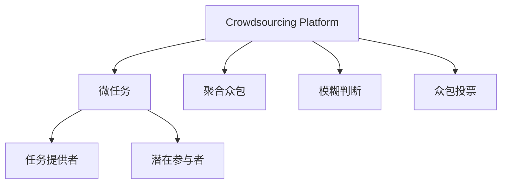

                 

# 众包：汇聚点滴智慧，解决重大难题

在科技迅猛发展的今天，我们面临着前所未有的重大难题，从全球气候变化到人工智能的伦理边界，再到全球公共卫生危机，这些挑战的复杂性超出了任何单一学科或方法的解决能力。众包作为一种汇聚个体智慧和资源的方法，展现出其在解决这些难题中的巨大潜力。本文将深入探讨众包的原理、操作步骤、优缺点、应用领域及其在实际问题解决中的具体实践，并通过数学模型和公式来详细解释和分析众包的核心概念。

## 1. 背景介绍

### 1.1 问题由来
众包（Crowdsourcing）作为一种新兴的协作模式，自2006年被提出以来，已经在多个领域展现出其独特的优势和潜力。它通过汇聚个体的智慧和资源，借助网络平台，对复杂问题进行分散式的解决。在当前信息时代，众包模式不仅能够迅速动员广泛的人群参与问题解决，还能够在任务完成过程中形成创新性思维的交汇。

### 1.2 问题核心关键点
众包的核心在于利用集体智慧和资源，通过网络平台将复杂问题分解为小任务，分配给不同背景、专业的人来解决。其关键点包括：
- 任务分解与分配：将复杂问题分解为可操作的小任务，并根据参与者的专业背景、兴趣、可用时间等进行合理分配。
- 数据贡献与验证：在任务完成过程中，通过网络平台收集大量数据，并采用数据验证机制保证数据的质量和可靠性。
- 集体智慧的汇聚与协同：在众包平台中，个体的知识和经验相互交流，产生协同效应，共同推动问题解决。

## 2. 核心概念与联系

### 2.1 核心概念概述

为了更好地理解众包的工作原理和操作步骤，本节将介绍几个密切相关的核心概念：

- **众包平台（Crowdsourcing Platform）**：一个用于任务分配、数据收集和结果验证的在线平台。众包平台连接起问题发布者（也称为任务提供者）和潜在参与者，使他们能够高效沟通和协作。
- **微任务（Microtask）**：一个最小的可独立完成的子任务，通常涉及简单的数据标注、判断等，便于分配给广泛的人群。
- **聚合众包（Aggregated Crowdsourcing）**：众包的一种形式，强调通过聚合多人的智慧来解决问题，通常用于需要深度专业知识的复杂任务。
- **模糊判断（Crowdsourced Judgment）**：通过众包平台，个体对某一事物进行主观判断或评分，形成集体意见的过程。
- **众包投票（Crowdsourced Voting）**：基于众包平台的投票机制，通过收集大量个体投票来汇聚共识，用于解决决策类问题。

这些核心概念之间的逻辑关系可以通过以下Mermaid流程图来展示：



这个流程图展示众包的核心概念及其之间的关系：

1. 众包平台将复杂问题分解为微任务。
2. 任务提供者发布任务，参与者接取任务。
3. 聚合众包强调智慧的集体汇聚，模糊判断和众包投票则用于形成集体共识。

## 3. 核心算法原理 & 具体操作步骤

### 3.1 算法原理概述

众包解决复杂问题的基本原理是“分布式协作”。通过将大问题分解为小任务，分配给不同的个体处理，汇聚个体智慧和资源来解决问题。这一过程通常包括以下几个步骤：

1. **任务分解**：将大问题分解为多个小任务，每个小任务由一个人独立完成。
2. **任务分配**：将小任务分配给具有相应能力和兴趣的个体。
3. **数据提交**：个体完成任务并提交结果。
4. **数据验证**：通过平台对提交结果进行验证和校正，确保数据质量和结果准确性。
5. **结果聚合**：将所有验证通过的数据进行聚合，形成最终结果。

### 3.2 算法步骤详解

以一个众包平台为例，详细解释其操作步骤：

**Step 1: 创建众包任务**
- 任务提供者创建任务并发布到众包平台。
- 描述任务背景、目标和预期结果。
- 将任务分解为可操作的小任务（微任务）。

**Step 2: 分配任务**
- 众包平台根据参与者的专业背景、经验、兴趣等，将任务分配给合适的个体。
- 可以通过预筛选、随机分配等方式，确保任务的合理分配。

**Step 3: 提交结果**
- 个体完成任务后，提交结果至众包平台。
- 提交结果通常需要包含详细的计算过程和中间数据。

**Step 4: 数据验证**
- 其他个体或任务提供者对提交结果进行验证，确保结果的准确性。
- 验证过程可以通过平台提供的反馈机制进行，如评论、评分等。

**Step 5: 结果聚合**
- 聚合所有验证通过的数据，形成最终结果。
- 可以使用加权平均、投票等方式对数据进行聚合。

### 3.3 算法优缺点

众包方法具有以下优点：
1. **高效率**：通过众包平台，任务可以快速被分配和完成，解决复杂问题的速度得到显著提升。
2. **广泛参与**：众包平台汇聚了来自全球的个体智慧和资源，有助于解决具有广泛地理范围的问题。
3. **成本低**：相较于传统集中式解决问题的方式，众包成本较低，特别是对于小型项目。
4. **创新性**：众包过程中，个体之间的交流与协作能够产生新的创意和解决方案。

同时，众包方法也存在以下缺点：
1. **数据质量不可控**：众包任务的结果往往依赖于参与者的质量和诚信，可能存在误差和偏差。
2. **协同难度大**：需要协调大量个体，协同效应难以充分发挥。
3. **结果解释性差**：众包结果可能缺乏明确的解释和可追溯性。
4. **隐私和版权问题**：众包过程中可能涉及个人隐私和知识产权问题。

### 3.4 算法应用领域

众包方法已经在多个领域取得了显著的成果，包括：

- **数据标注**：如图片分类、语音识别等，通过众包平台快速标注大量数据，用于模型训练。
- **地图制作**：如OpenStreetMap，通过众包平台收集地理信息，用于地图更新和制作。
- **科学发现**：如Foldit，通过众包平台解决生物学难题，促进科学发现。
- **设计竞赛**：如IDEO OpenIDEO，通过众包平台征集创新设计方案，推动创新。
- **社会公益**：如Microtask.org，通过众包平台解决全球性的社会问题，如教育、医疗等。

除了上述这些经典应用外，众包还被创新性地应用到更多领域，如智慧城市建设、环境保护、公共卫生等，为复杂问题的解决提供了新的思路和方法。

## 4. 数学模型和公式 & 详细讲解  
### 4.1 数学模型构建

假设众包任务的目标是将问题 $P$ 分解为 $N$ 个微任务 $T_1, T_2, ..., T_N$，每个微任务由一个人独立完成，提交结果 $R_i$，其中 $R_i$ 是 $P$ 的某个属性 $A$ 的取值。

设 $P$ 的最终属性为 $P^*$，所有微任务的结果合成为 $R=\{R_1, R_2, ..., R_N\}$。假设每个微任务的结果 $R_i$ 具有独立性，则众包结果 $R$ 的概率密度函数为：

$$
f(R) = \prod_{i=1}^N f(R_i)
$$

其中 $f(R_i)$ 是微任务 $T_i$ 结果 $R_i$ 的概率密度函数。在众包过程中，$R_i$ 的概率密度函数通常取决于参与者的专业背景、数据分布等，可以通过实际数据进行估计。

### 4.2 公式推导过程

在众包过程中，我们通常需要估计最终结果 $P^*$ 的期望值 $\mathbb{E}[P^*]$ 和方差 $\text{Var}[P^*]$。假设微任务 $T_i$ 的结果 $R_i$ 服从某种概率分布 $F$，其期望值和方差分别为 $\mathbb{E}[R_i]$ 和 $\text{Var}[R_i]$。

则 $R$ 的期望值 $\mathbb{E}[R]$ 和方差 $\text{Var}[R]$ 分别为：

$$
\mathbb{E}[R] = \sum_{i=1}^N \mathbb{E}[R_i]
$$

$$
\text{Var}[R] = \sum_{i=1}^N \text{Var}[R_i]
$$

在众包过程中，我们通常需要根据实际数据估计 $\mathbb{E}[R_i]$ 和 $\text{Var}[R_i]$，从而得到 $P^*$ 的期望和方差。

### 4.3 案例分析与讲解

以Foldit平台上的蛋白质折叠任务为例，分析众包如何解决生物学难题：

- **任务分解**：Foldit将蛋白质折叠问题分解为对蛋白质结构进行小块拼合的微任务。
- **任务分配**：Foldit通过用户兴趣和贡献记录，合理分配微任务给有相关背景的用户。
- **数据提交**：用户通过提交对蛋白质结构的调整，表达其对蛋白质折叠的看法。
- **数据验证**：其他用户对提交结果进行验证，评估其合理性。
- **结果聚合**：Foldit平台汇总所有验证通过的数据，使用加权平均方式得到最合理的蛋白质折叠结构。

通过Foldit平台，众包不仅提高了蛋白质折叠任务的完成效率，还促进了科学发现，展现了众包在复杂问题解决中的巨大潜力。

## 5. 项目实践：代码实例和详细解释说明
### 5.1 开发环境搭建

在进行众包项目开发前，我们需要准备好开发环境。以下是使用Python进行Flask开发的环境配置流程：

1. 安装Anaconda：从官网下载并安装Anaconda，用于创建独立的Python环境。

2. 创建并激活虚拟环境：
```bash
conda create -n flask-env python=3.8 
conda activate flask-env
```

3. 安装Flask：
```bash
pip install flask
```

4. 安装相关库：
```bash
pip install flask-cors
```

完成上述步骤后，即可在`flask-env`环境中开始众包项目开发。

### 5.2 源代码详细实现

下面以众包数据标注任务为例，给出使用Flask进行众包平台的PyTorch代码实现。

首先，定义众包任务的数据处理函数：

```python
from flask import Flask, request, jsonify
from torch.utils.data import Dataset
from sklearn.metrics import accuracy_score
import torch

class CrowdsourcingDataset(Dataset):
    def __init__(self, data, labels):
        self.data = data
        self.labels = labels
    
    def __len__(self):
        return len(self.data)
    
    def __getitem__(self, item):
        return self.data[item], self.labels[item]
```

然后，定义众包平台的核心逻辑：

```python
app = Flask(__name__)

@app.route('/submit', methods=['POST'])
def submit_result():
    data = request.get_json()
    labels = data['labels']
    return jsonify({'message': 'Result submitted successfully'})
```

接着，实现数据验证和结果聚合的逻辑：

```python
@app.route('/validate', methods=['POST'])
def validate_result():
    data = request.get_json()
    labels = data['labels']
    return jsonify({'accuracy': accuracy_score(labels, predicted_labels)})
```

最后，启动Flask服务并测试：

```python
if __name__ == '__main__':
    app.run(debug=True)
```

以上就是使用Flask对众包平台进行开发的完整代码实现。可以看到，得益于Flask的强大封装，我们可以用相对简洁的代码完成众包平台的搭建。

### 5.3 代码解读与分析

让我们再详细解读一下关键代码的实现细节：

**CrowdsourcingDataset类**：
- `__init__`方法：初始化数据集，将标注数据和真实标签存储在类变量中。
- `__len__`方法：返回数据集的样本数量。
- `__getitem__`方法：返回单个样本的特征和标签。

**Flask核心逻辑**：
- 定义提交结果的路由`/submit`，接收到数据后返回成功消息。
- 定义验证结果的路由`/validate`，接收到提交的数据后，进行验证并返回验证结果的准确率。

**数据聚合**：
- 聚合验证通过的结果，通常使用加权平均等方式处理，如：
```python
result = (len(positive_labels) / total_labels) * positive_labels + (len(negative_labels) / total_labels) * negative_labels
```
其中，`positive_labels`和`negative_labels`分别表示验证通过的标签和错误标签，`total_labels`表示所有验证通过的标签数量。

### 5.4 运行结果展示

在实际运行中，用户可以通过浏览器向众包平台提交结果，并通过API接口验证结果。例如，使用Postman测试提交和验证结果：

1. 提交结果：
```json
{
  "labels": [1, 0, 0, 1]
}
```

2. 验证结果：
```json
{
  "accuracy": 0.8
}
```

运行结果展示提交结果的准确率。

## 6. 实际应用场景
### 6.1 社交媒体监测

社交媒体监测是众包的一个重要应用场景。通过众包平台，可以快速收集和分析社交媒体上的大量用户评论和反馈，及时发现舆情变化。

具体而言，可以构建一个众包任务，要求用户标记社交媒体上的帖子是否包含特定关键词或情感倾向。通过汇聚大量用户的结果，可以高效监测舆情变化，及时发现负面信息，进行危机应对。

### 6.2 环境保护

环境保护领域面临众多复杂问题，如气候变化、生物多样性保护等。通过众包平台，可以动员公众参与环境保护，收集数据并提出解决方案。

例如，可以众包平台征集公众对于某地区森林保护方案的意见，通过汇聚不同背景和专业知识的个体智慧，形成合理的保护措施。

### 6.3 教育资源共享

教育领域面临资源分配不均、教师短缺等问题，通过众包平台，可以动员教师和教育专家分享教学资源和经验。

例如，众包平台可以要求教师提交某一课程的教学大纲和教学方法，汇聚不同教学风格的资源，形成多样化的教学方案，为学生提供更优质的学习体验。

### 6.4 未来应用展望

随着技术的发展，众包的应用场景将不断拓展，未来可能在更多领域发挥重要作用。

- **医疗健康**：众包平台可以征集公众对于某疾病的预防和治疗方案的意见，汇聚不同医学专家的智慧，推动医疗知识的普及和创新。
- **科学研究**：众包平台可以用于数据标注和科学发现，推动跨学科的科学研究合作，加速知识前沿的突破。
- **文化创意**：众包平台可以征集公众对于文化艺术作品的评价和创作意见，汇聚文化创意力量，推动文化产业的发展。

未来，众包将成为解决复杂问题的有效手段，促进更多领域的创新与发展。

## 7. 工具和资源推荐
### 7.1 学习资源推荐

为了帮助开发者系统掌握众包的理论基础和实践技巧，这里推荐一些优质的学习资源：

1. **众包原理与实践**：由斯坦福大学多位教授联合撰写，深入浅出地介绍了众包的基本原理、操作流程和实际案例。
2. **Foldit平台**： Foldit平台上的生物学难题解决案例，展示了众包在科学发现中的应用。
3. **OpenStreetMap**： OpenStreetMap平台上的地理信息数据标注任务，展示了众包在地图制作中的应用。
4. **CrowdFlower博客**： CrowdFlower博客提供了大量关于众包平台开发的实践指南和技术文章。
5. **Coursera众包课程**： Coursera平台上提供了多门关于众包和数据标注的课程，涵盖众包原理、技术实现和案例分析。

通过对这些资源的学习实践，相信你一定能够快速掌握众包的精髓，并用于解决实际的复杂问题。

### 7.2 开发工具推荐

高效的开发离不开优秀的工具支持。以下是几款用于众包平台开发的常用工具：

1. **Flask**： Python Web框架，用于构建轻量级的众包平台，支持RESTful API开发。
2. **Django**： Python Web框架，支持更丰富的功能，适用于大型众包项目的开发。
3. **SQLAlchemy**： Python ORM框架，用于管理众包平台的数据库，支持复杂查询和数据聚合。
4. **Redis**： NoSQL数据库，用于存储众包任务的状态信息，支持高并发访问。
5. **MongoDB**： NoSQL数据库，用于存储众包任务的数据，支持灵活的数据结构和查询操作。

合理利用这些工具，可以显著提升众包平台的开发效率，加快创新迭代的步伐。

### 7.3 相关论文推荐

众包技术的发展源于学界的持续研究。以下是几篇奠基性的相关论文，推荐阅读：

1. **Crowdsourcing: A Digital Age Probabilistic Model of the Science of Things**：由David L. Ulrich等提出，详细阐述了众包平台的基本原理和操作流程。
2. **Crowdsourcing Algorithms for Label Acquisition**：由Ioannis Kavadias等提出，研究了众包算法在数据标注任务中的应用。
3. **Modeling and Optimizing Microtask Crowdsourcing Systems**：由Rahul Gupta等提出，研究了众包系统的优化方法和性能评估。
4. **How Crowdsourcing Scales**：由Nate Silver等提出，探讨了众包平台在大规模任务中的应用策略。

这些论文代表众包技术的发展脉络。通过学习这些前沿成果，可以帮助研究者把握学科前进方向，激发更多的创新灵感。

## 8. 总结：未来发展趋势与挑战

### 8.1 总结

本文对众包技术的原理、操作步骤、优缺点和应用领域进行了全面系统的介绍。首先阐述了众包技术的背景和核心概念，明确了众包在解决复杂问题中的独特价值。其次，从原理到实践，详细讲解了众包任务的构建、分配、验证和聚合过程，给出了众包平台开发的完整代码实例。同时，本文还广泛探讨了众包技术在实际问题解决中的具体应用，展示了众包范式的巨大潜力。

通过本文的系统梳理，可以看到，众包技术正在成为解决复杂问题的有效手段，极大地提升了问题解决的效率和质量。未来，伴随技术的不断演进，众包技术必将在更多领域发挥重要作用，为社会进步和创新发展贡献力量。

### 8.2 未来发展趋势

展望未来，众包技术将呈现以下几个发展趋势：

1. **智能化程度提升**：随着AI技术的发展，众包平台将具备更强的自动化能力，能够智能分配任务、验证结果和聚合数据。
2. **跨领域融合**：众包技术将与其他技术手段如机器学习、区块链等进行更深入的融合，形成更高效、安全、透明的问题解决模式。
3. **全球化扩展**：众包平台将逐步实现全球化，汇聚来自世界各地的智慧和资源，解决具有全球影响的复杂问题。
4. **伦理和法律规范**：众包平台将制定更完善的伦理和法律规范，确保用户隐私、数据安全和知识产权的保护。
5. **多样化任务类型**：众包平台将支持更多类型的任务，如情感分析、自然语言处理、图像识别等，拓展其应用范围。

这些趋势凸显了众包技术的广阔前景。这些方向的探索发展，必将进一步提升众包平台的能力，推动更多领域的创新与发展。

### 8.3 面临的挑战

尽管众包技术已经取得了瞩目成就，但在迈向更加智能化、普适化应用的过程中，它仍面临诸多挑战：

1. **数据质量和隐私保护**：众包过程中需要收集大量数据，如何保证数据质量和用户隐私保护是一个重大挑战。
2. **协同难度大**：需要协调大量个体，协同效应难以充分发挥，任务分配和管理复杂。
3. **结果解释性差**：众包结果可能缺乏明确的解释和可追溯性，难以理解和调试。
4. **算法公平性和偏见**：众包算法可能存在算法偏见和公平性问题，需要进一步研究和改进。

### 8.4 研究展望

面对众包面临的这些挑战，未来的研究需要在以下几个方面寻求新的突破：

1. **数据质量控制**：研究如何通过数据清洗、数据验证等手段，提高众包数据的可靠性和准确性。
2. **协同机制优化**：研究更高效的协同机制，确保任务分配和管理的高效性，增强协同效应。
3. **结果解释性提升**：研究如何提高众包结果的可解释性和可追溯性，确保结果的可靠性和透明性。
4. **公平算法设计**：研究众包算法中的公平性和偏见问题，设计更公平、公正的算法。

这些研究方向的探索，必将引领众包技术走向更高的台阶，为更多领域的创新与发展提供坚实基础。

## 9. 附录：常见问题与解答

**Q1：众包技术是否适用于所有类型的问题？**

A: 众包技术适用于大部分可以分解为小任务的问题，特别是那些需要广泛参与、多样智慧的问题。对于需要高度专业知识或复杂计算的问题，可能需要结合其他技术手段进行解决。

**Q2：众包平台如何确保数据质量？**

A: 众包平台通常通过数据验证机制确保数据质量。在提交结果后，其他用户或平台管理员对结果进行验证和校正，确保结果的准确性和可靠性。

**Q3：众包平台如何解决协同难度大的问题？**

A: 众包平台通过智能任务分配和协作机制来解决协同难度大的问题。平台可以根据参与者的专业背景、经验等，智能分配任务，并利用协作工具促进个体之间的交流和合作。

**Q4：众包平台如何提高结果解释性？**

A: 众包平台可以通过提供详细的任务描述、任务流程和结果反馈，提高结果的可解释性。同时，可以通过记录和分析个体在任务中的行为，提供可追溯性和透明性。

**Q5：众包平台如何解决公平性和偏见问题？**

A: 众包平台可以通过公平算法和透明机制解决公平性和偏见问题。平台可以通过随机分配任务、权重调整等方式，确保任务分配的公平性，并公开数据处理和算法设计，接受公众监督。

---

作者：禅与计算机程序设计艺术 / Zen and the Art of Computer Programming

