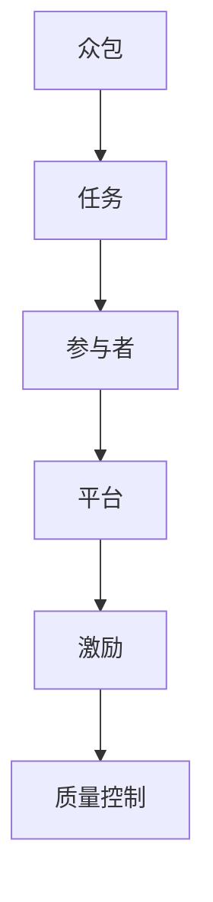
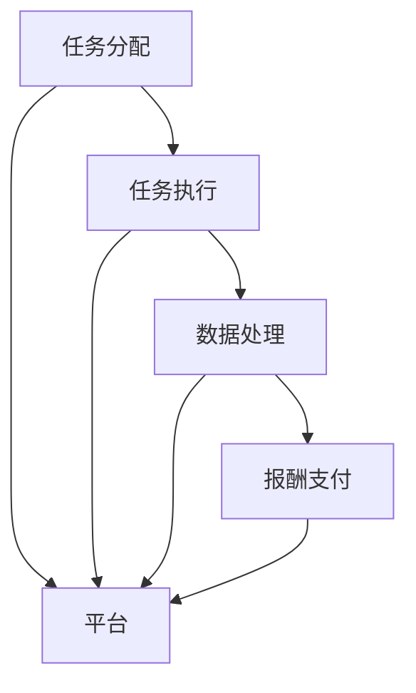

                 

## 1. 背景介绍

### 1.1 问题由来

随着科技的发展，互联网和社交媒体的普及，人类进入了一个信息爆炸的时代。全球每天产生的数据量已经超过300EB字节，包含了丰富的用户行为、消费习惯、文化背景等信息。如何有效利用这些数据，挖掘其中的价值，成为了各个领域关注的重点。

与此同时，传统的数据采集和分析方法逐渐显得力不从心。科学研究、企业决策、产品开发等领域都需要大量数据，而数据收集、标注和分析等过程，往往需要耗费大量的人力和时间。传统的数据采集方式如问卷调查、实地观察、实验室测试等方法，已经无法满足日益增长的数据需求。

面对这些挑战，一种新型的数据采集方式应运而生——众包（Crowdsourcing）。众包利用了互联网的便捷性，让广大的网民参与到数据收集和处理过程中，以低成本、高效率的方式，解决了传统数据采集方式面临的诸多问题。

### 1.2 问题核心关键点

众包的核心在于利用互联网平台将任务分配给众多用户，通过他们的智慧和努力完成数据采集和处理。这种“集体智慧”的利用，可以大幅降低数据采集的成本，提高数据采集的速度和质量，同时激发用户参与的热情，形成正向循环。

众包的主要应用场景包括：

- **科学研究**：利用众包平台收集科学实验数据，如天文学中的寻找小行星、生物学中的分类物种等。
- **企业决策**：通过众包平台收集市场调查数据、用户反馈等，为企业决策提供依据。
- **产品开发**：利用众包平台收集用户需求、产品测试结果等，指导产品的设计和改进。
- **社会调查**：通过众包平台收集民意调查数据，了解公众对某一问题的看法和需求。

众包的应用范围已经覆盖了各个领域，成为了一种重要的数据获取和处理方式。

## 2. 核心概念与联系

### 2.1 核心概念概述

为更好地理解众包方法，本节将介绍几个密切相关的核心概念：

- **众包（Crowdsourcing）**：指通过互联网平台将任务分配给众多用户，利用“集体智慧”完成数据采集和处理的方式。
- **任务（Task）**：需要完成的具体工作，如图片标注、问卷调查、数据录入等。
- **参与者（Participant）**：参与众包任务的个体或团队，通常通过互联网平台进行任务分配和报酬支付。
- **平台（Platform）**：众包任务的管理和分配平台，如Amazon Mechanical Turk、CrowdFlower等。
- **激励（Incentive）**：支付给参与者的报酬，以激励他们完成众包任务。
- **质量控制（Quality Control）**：通过设置标注标准、进行抽检等手段，保证众包任务的质量。

这些核心概念之间的逻辑关系可以通过以下Mermaid流程图来展示：



这个流程图展示了几大核心概念及其之间的关系：

1. 众包通过平台将任务分配给参与者，利用“集体智慧”完成数据采集和处理。
2. 参与者根据平台设定的任务要求，完成任务并获得报酬。
3. 平台通过设定合理的激励机制，吸引和保持参与者的持续参与。
4. 质量控制手段确保众包任务的质量，从而提高整体数据的质量。

这些概念共同构成了众包的核心框架，使众包方法能够在各个领域得到广泛应用。

### 2.2 核心概念原理和架构的 Mermaid 流程图



这个流程图展示了众包任务从分配到执行，再到数据处理和报酬支付的全过程。

## 3. 核心算法原理 & 具体操作步骤

### 3.1 算法原理概述

众包方法的原理相对简单，主要包括以下几个步骤：

1. **任务设计**：明确任务需求，设计合理的任务模板和要求。
2. **平台发布**：将任务发布到众包平台上，设置激励机制和质量控制标准。
3. **任务分配**：平台将任务分配给参与者，通常采用随机分配或优先分配的方式。
4. **任务执行**：参与者根据任务要求完成数据采集和处理，提交结果。
5. **结果审核**：平台对提交的结果进行审核和评估，确认合格任务和报酬支付。
6. **报酬支付**：平台根据任务完成情况，支付给参与者相应的报酬。

众包的核心在于将复杂的任务拆解为多个简单的子任务，通过互联网平台分配给众多用户完成。通过众包，可以充分利用互联网上的“集体智慧”，快速高效地完成数据采集和处理工作。

### 3.2 算法步骤详解

以图片标注为例，展示众包方法的具体操作步骤：

1. **任务设计**：设计标注模板，明确标注标准和要求。例如，标注图像中的物体类别、位置等信息。
2. **平台发布**：将标注模板发布到众包平台上，设置标注费用和质量要求。
3. **任务分配**：平台根据标注任务和参与者的情况，随机或优先分配任务给合适的用户。
4. **任务执行**：用户根据标注模板，对图片进行标注，提交标注结果。
5. **结果审核**：平台对标注结果进行审核，确认标注质量。例如，通过抽检、交叉验证等方式，确保标注结果的准确性和一致性。
6. **报酬支付**：根据标注质量和完成情况，平台支付给用户相应的报酬。

通过以上步骤，众包平台可以快速高效地完成大规模的图片标注任务，为科学研究、企业决策等提供支持。

### 3.3 算法优缺点

众包方法具有以下优点：

1. **成本低廉**：相比传统的数据采集方式，众包方法可以通过互联网平台快速完成数据采集任务，大幅降低人力和时间的成本。
2. **速度高效**：通过众包方式，可以同时进行多个任务的数据采集，加速数据收集速度。
3. **质量可控**：通过设置标注标准和质量控制机制，可以保证数据采集和处理的质量。
4. **用户参与**：众包方法激励用户积极参与，形成正向循环，促进更多高质量数据的产生。

同时，众包方法也存在以下缺点：

1. **质量不稳定**：众包参与者的素质参差不齐，标注质量难以保证。
2. **激励问题**：众包平台需要设定合理的激励机制，才能吸引和保持参与者的持续参与。
3. **数据隐私**：众包任务中可能会涉及用户隐私信息，数据隐私和安全问题需引起重视。
4. **平台依赖**：众包方法依赖于众包平台的技术和运营支持，平台稳定性和可靠性需保证。

尽管存在这些缺点，但就目前而言，众包方法仍是一种高效、低成本的数据采集方式，广泛应用在各个领域。

### 3.4 算法应用领域

众包方法在各个领域都有广泛的应用，以下是几个典型的应用场景：

1. **科学研究**：众包平台如Zooniverse用于天文学中的小行星搜索、生物学中的物种分类等任务，通过“集体智慧”提升科学研究的效率和精度。
2. **医学研究**：MedShadow平台用于收集医疗数据，如病人症状、治疗效果等，为医学研究提供支持。
3. **企业决策**：Amazon Mechanical Turk用于市场调查、产品测试等任务，为企业决策提供依据。
4. **社会调查**：CrowdFlower平台用于收集民意调查数据，了解公众对某一问题的看法和需求。

除了上述这些经典场景外，众包方法还在诸如物流优化、环境保护、社会治理等多个领域得到应用，为社会各行各业带来了便利和效率的提升。

## 4. 数学模型和公式 & 详细讲解

### 4.1 数学模型构建

众包方法的数学模型主要涉及任务分配、任务执行、结果审核和报酬支付等方面。以下以图片标注为例，展示众包方法的数学模型构建。

设众包平台上有$N$个参与者，每个参与者完成一个标注任务需要$t$时间。设每个标注任务的报酬为$P$，标注结果的准确率阈值为$T$。众包平台的目标是在保证标注质量的前提下，最大化标注任务的完成率。

定义标注任务完成率为$C$，其计算公式为：

$$
C = \frac{N}{\sum_{i=1}^N t_i}
$$

其中$t_i$为第$i$个参与者完成标注任务所需的时间。

众包平台的目标是最大化标注任务完成率$C$，同时保证标注结果的准确率高于阈值$T$。这可以通过以下数学模型来描述：

$$
\max \quad C \\
\text{s.t.} \quad T \leq \frac{1}{N} \sum_{i=1}^N R_i
$$

其中$R_i$为第$i$个参与者标注结果的准确率。

### 4.2 公式推导过程

为了最大化标注任务完成率$C$，需要设计合理的任务分配策略。假设每个参与者的完成时间$(t_1, t_2, ..., t_N)$服从独立且服从同一分布$F(t)$，则众包平台的目标可以描述为：

$$
\max \quad \frac{N}{\sum_{i=1}^N t_i}
$$

引入拉格朗日乘子$\lambda$，定义拉格朗日函数：

$$
\mathcal{L}(t_i, \lambda) = \frac{N}{\sum_{i=1}^N t_i} - \lambda (\sum_{i=1}^N t_i - T)
$$

对$(t_i, \lambda)$求偏导数，得到：

$$
\frac{\partial \mathcal{L}}{\partial t_i} = -\frac{N}{(\sum_{i=1}^N t_i)^2} + \lambda = 0
$$

解得：

$$
t_i = \frac{N}{\sum_{i=1}^N t_i} \cdot T
$$

即每个参与者完成标注任务的时间为总任务时间的$\frac{1}{N}$倍。

### 4.3 案例分析与讲解

以Zooniverse平台为例，展示众包方法在科学研究中的应用。

Zooniverse平台通过互联网将科学研究任务发布给全球的志愿者，让他们参与到任务中。例如，天文学家发布寻找小行星的任务，通过平台将任务分配给志愿者，让他们在图片上标注可能的小行星位置。志愿者提交标注结果后，平台对结果进行审核，确认准确率高于阈值后支付相应的报酬。

通过这种众包方式，Zooniverse平台已经成功完成了多个科学任务，如寻找外星文明、分类生物物种等。众包方法的“集体智慧”发挥了重要作用，大幅提升了科学研究的效率和精度。

## 5. 项目实践：代码实例和详细解释说明

### 5.1 开发环境搭建

在进行众包项目实践前，我们需要准备好开发环境。以下是使用Python进行开发的环境配置流程：

1. 安装Python：从官网下载并安装Python 3.x版本。
2. 安装Pandas：
```bash
pip install pandas
```

3. 安装CrowdFlower或Amazon Mechanical Turk API：
```bash
pip install crowdflower-api-py
pip install mechanicalturk
```

4. 安装其他库：
```bash
pip install requests json
```

完成上述步骤后，即可在开发环境中进行众包任务的开发。

### 5.2 源代码详细实现

下面我们以图片标注为例，给出使用CrowdFlower API进行众包任务的Python代码实现。

首先，定义图片标注的函数：

```python
import requests
import json

def image_annotate(api_key, image_url, annotate_template):
    headers = {'Authorization': f'Bearer {api_key}'}
    payload = {
        'template': annotate_template,
        'image_url': image_url
    }
    response = requests.post('https://api.crowdflower.com/v1/annotate', headers=headers, json=payload)
    return response.json()
```

然后，使用CrowdFlower API进行众包任务的调用：

```python
api_key = 'your_api_key'
image_url = 'https://example.com/image.jpg'
annotate_template = '''
{
    "template": "What object is in the image?",
    "choices": ["Car", "Bird", "Building", "Tree"]
}
'''

response = image_annotate(api_key, image_url, annotate_template)
print(response)
```

接下来，获取众包平台返回的结果：

```python
result = response['result']
print(result)
```

最后，解析并输出结果：

```python
for i in result:
    print(i['choice'])
```

这就是使用CrowdFlower API进行图片标注的完整代码实现。

### 5.3 代码解读与分析

让我们再详细解读一下关键代码的实现细节：

- `headers`：设置API请求的授权信息，包括API key和请求方法。
- `payload`：设置API请求的参数，包括标注模板和图片URL。
- `requests.post`：向API服务器发送POST请求，返回JSON格式的响应数据。
- `response.json()`：将API响应数据解析为Python字典，方便后续操作。
- `result`：获取API返回的标注结果，包含每个参与者的标注选择。

通过以上代码，我们可以使用CrowdFlower API进行图片标注的众包任务，进一步拓展众包方法的实际应用。

## 6. 实际应用场景

### 6.1 科学研究

众包方法在科学研究领域有广泛的应用，尤其是在需要大规模数据采集的任务中。例如，天文学家可以通过众包平台发布小行星搜索任务，利用全球志愿者的“集体智慧”快速收集大量数据，提升科学研究效率。

在生物学中，众包平台如Zooniverse用于物种分类和基因组分析任务，通过全球志愿者的标注，大幅提高了科学研究的精度和速度。

### 6.2 企业决策

众包方法在企业决策中也得到了广泛应用。例如，Amazon Mechanical Turk平台用于市场调查、产品测试等任务，通过众包方式收集大量用户反馈数据，为企业决策提供支持。

企业可以利用众包平台进行新产品测试、市场调研、用户体验分析等，通过广泛收集用户意见，快速获取反馈，优化产品和服务。

### 6.3 社会调查

众包方法在社会调查中也得到了广泛应用。例如，CrowdFlower平台用于收集民意调查数据，通过众包方式了解公众对某一问题的看法和需求。

社会调查机构可以利用众包平台发布调查问卷、获取民意数据，了解公众对政策、社会问题等看法，为政府决策提供支持。

### 6.4 未来应用展望

随着互联网和人工智能技术的不断发展，众包方法的应用前景更加广阔。以下是几个未来的应用方向：

1. **自动标注**：利用机器学习和人工智能技术，对众包标注结果进行自动审核和纠错，提高标注质量。
2. **数据增强**：通过众包方式收集大量标注数据，利用这些数据进行数据增强，提升模型的泛化能力。
3. **多模态数据处理**：将众包方法应用于多模态数据处理，如文本、图像、语音等数据的采集和标注。
4. **实时众包**：利用物联网和传感器技术，实时收集数据，并进行众包标注，快速响应事件。

这些方向的探索，将使众包方法在各个领域发挥更大的作用，为科学研究、企业决策、社会调查等提供更多的支持。

## 7. 工具和资源推荐

### 7.1 学习资源推荐

为了帮助开发者系统掌握众包方法的理论基础和实践技巧，这里推荐一些优质的学习资源：

1. 《Crowdsourcing: Studying Collaborative Problem Solving through Game Dynamics》：MIT Press出版的众包经典书籍，详细介绍了众包理论和方法，适合深入学习。
2. 《The Science of Crowdsourcing》：众包领域的经典著作，介绍了众包方法在科学研究、社会调查、企业决策等多个领域的应用。
3. Coursera平台上的《Data Mining》课程：由斯坦福大学开设的机器学习课程，涵盖了数据采集、标注、分析和应用等多个方面。
4. Kaggle平台：数据科学竞赛平台，通过众包方式组织各种数据标注竞赛，可以实际参与众包项目，积累经验。
5. CrowdFlower、Amazon Mechanical Turk等众包平台：通过实际操作众包平台，了解众包任务的发布、执行和报酬支付流程，掌握实际操作技巧。

通过对这些资源的学习实践，相信你一定能够快速掌握众包方法的精髓，并用于解决实际的科学和工程问题。

### 7.2 开发工具推荐

高效的开发离不开优秀的工具支持。以下是几款用于众包开发的常用工具：

1. CrowdFlower API：提供API接口，方便开发人员进行众包任务的调用。
2. Amazon Mechanical Turk API：提供API接口，方便开发人员进行众包任务的调用。
3. Python：适合进行众包任务的数据处理和分析，简单易学。
4. Pandas：数据处理和分析的常用库，提供了丰富的数据操作功能。
5. JSON：Python中常用的数据格式，方便处理众包平台返回的JSON数据。
6. Requests：Python中常用的HTTP请求库，方便与API服务器进行交互。

合理利用这些工具，可以显著提升众包任务的开发效率，加快创新迭代的步伐。

### 7.3 相关论文推荐

众包方法的研究源于学界的持续探索。以下是几篇奠基性的相关论文，推荐阅读：

1. "Crowdsourcing: A Study of Collaborative Problem Solving through Game Dynamics"：众包领域的奠基性论文，探讨了众包方法的机制和效果。
2. "A Survey of Crowdsourcing Research: Concepts, Strategies, and Applications"：对众包方法的研究现状进行了全面总结，介绍了多种众包方法和应用场景。
3. "The Science of Crowdsourcing"：众包领域的经典著作，介绍了众包方法在科学研究、社会调查、企业决策等多个领域的应用。
4. "The Crowd of Things: The Internet of Things as a Crowdsourcing Platform"：探讨了物联网和众包技术的结合，利用传感器进行实时众包数据采集。

这些论文代表了大规模众包方法的发展脉络。通过学习这些前沿成果，可以帮助研究者把握学科前进方向，激发更多的创新灵感。

## 8. 总结：未来发展趋势与挑战

### 8.1 总结

本文对众包方法进行了全面系统的介绍。首先阐述了众包方法的背景和应用场景，明确了众包在数据采集和处理中的独特优势。其次，从原理到实践，详细讲解了众包方法的数学模型和具体操作步骤，给出了众包任务开发的完整代码实例。同时，本文还广泛探讨了众包方法在科学研究、企业决策、社会调查等多个领域的应用前景，展示了众包方法的前景和潜力。

通过本文的系统梳理，可以看到，众包方法已经成为数据采集和处理的重要方式，为各个领域带来了高效、低成本的数据采集和处理能力。随着互联网和人工智能技术的不断发展，众包方法还将进一步拓展其应用范围，为科学研究、企业决策、社会调查等提供更多的支持。

### 8.2 未来发展趋势

展望未来，众包方法将呈现以下几个发展趋势：

1. **自动化**：利用机器学习和人工智能技术，对众包标注结果进行自动审核和纠错，提高标注质量。
2. **多模态**：将众包方法应用于多模态数据处理，如文本、图像、语音等数据的采集和标注。
3. **实时化**：利用物联网和传感器技术，实时收集数据，并进行众包标注，快速响应事件。
4. **去中心化**：通过区块链等技术，构建去中心化的众包平台，提高数据隐私和安全。
5. **全球化**：利用全球志愿者的智慧，进行大规模数据采集和处理，实现全球化数据共享。

这些方向的探索，将使众包方法在各个领域发挥更大的作用，为科学研究、企业决策、社会调查等提供更多的支持。

### 8.3 面临的挑战

尽管众包方法已经取得了显著的成果，但在迈向更加智能化、普适化应用的过程中，仍面临诸多挑战：

1. **数据隐私**：众包任务中涉及大量用户隐私信息，数据隐私和安全问题需引起重视。
2. **质量控制**：众包参与者的素质参差不齐，标注质量难以保证。
3. **激励机制**：众包平台需要设定合理的激励机制，才能吸引和保持参与者的持续参与。
4. **平台依赖**：众包方法依赖于众包平台的技术和运营支持，平台稳定性和可靠性需保证。

尽管存在这些挑战，但就目前而言，众包方法仍是一种高效、低成本的数据采集方式，广泛应用在各个领域。

### 8.4 研究展望

面对众包方法所面临的挑战，未来的研究需要在以下几个方面寻求新的突破：

1. **自动化和智能化**：利用机器学习和人工智能技术，提高众包任务的自动化和智能化水平，减少人工干预。
2. **多模态数据处理**：将众包方法应用于多模态数据处理，如文本、图像、语音等数据的采集和标注。
3. **去中心化平台**：通过区块链等技术，构建去中心化的众包平台，提高数据隐私和安全。
4. **全球化数据共享**：利用全球志愿者的智慧，进行大规模数据采集和处理，实现全球化数据共享。

这些方向的探索，将使众包方法在各个领域发挥更大的作用，为科学研究、企业决策、社会调查等提供更多的支持。

## 9. 附录：常见问题与解答

**Q1：众包方法是否适用于所有数据采集任务？**

A: 众包方法适用于需要大规模数据采集和处理的场景，但对于一些特定领域的任务，如医学、法律等，仅仅依靠众包方法可能难以满足数据采集的需求。此时需要在特定领域语料上进一步预训练，再进行众包，才能获得理想效果。

**Q2：众包平台如何保证标注质量？**

A: 众包平台通过设定标注标准和质量控制机制，保证标注质量。例如，设置标注准确率阈值、进行抽检和交叉验证等方式，确保标注结果的准确性和一致性。同时，众包平台会对参与者进行评分和反馈，激励他们提升标注质量。

**Q3：众包方法的激励机制如何设置？**

A: 众包平台的激励机制一般通过报酬支付实现。例如，根据任务的难度和复杂度，设置不同的报酬标准。同时，平台会对高质量的标注结果进行奖励，激励参与者提升标注质量。

**Q4：众包方法如何处理数据隐私问题？**

A: 众包平台在数据采集和处理过程中，需要确保数据隐私和安全。例如，对用户隐私数据进行脱敏处理，限制数据的存储和共享范围，确保数据隐私和安全。同时，平台需要对数据进行加密和访问控制，防止数据泄露和滥用。

**Q5：众包方法的应用前景如何？**

A: 众包方法在各个领域都有广泛的应用前景，如科学研究、企业决策、社会调查等。随着互联网和人工智能技术的不断发展，众包方法还将进一步拓展其应用范围，为科学研究、企业决策、社会调查等提供更多的支持。

总之，众包方法作为一种高效、低成本的数据采集方式，在科学研究、企业决策、社会调查等多个领域发挥了重要作用。随着技术的不断发展，众包方法还将继续拓展其应用范围，为各个领域带来更多创新和突破。

