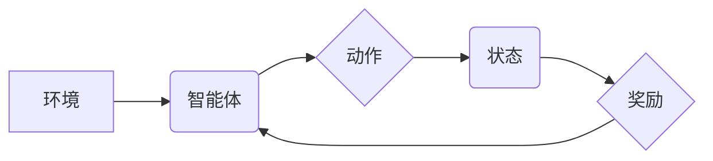

> 优势学习，强化学习，价值函数，优势函数，策略梯度，代码实例，深度学习

## 1. 背景介绍

强化学习 (Reinforcement Learning, RL) 作为机器学习领域的重要分支，旨在训练智能体在环境中通过与环境交互学习最优策略，以最大化累积奖励。传统的强化学习算法通常依赖于价值函数来评估状态或状态-动作对的价值，并通过价值函数的梯度下降来更新策略。然而，价值函数的估计往往存在偏差和方差问题，这可能会导致学习过程缓慢且不稳定。

优势学习 (Advantage Learning) 作为一种改进的强化学习方法，旨在解决价值函数估计问题。它通过引入优势函数来衡量动作在特定状态下相对于当前策略的优势，从而引导策略更新朝着更优的方向发展。

## 2. 核心概念与联系

**2.1 核心概念**

* **价值函数 (Value Function):** 评估状态或状态-动作对的期望累积奖励。
* **优势函数 (Advantage Function):** 衡量动作在特定状态下相对于当前策略的优势，即动作在该状态下获得的奖励期望与当前策略在该状态下的平均奖励期望之间的差值。
* **策略 (Policy):** 指导智能体在不同状态下选择动作的映射关系。

**2.2 核心架构**



**2.3 优势学习与价值函数的关系**

优势函数可以看作是价值函数的改进版本，它不仅考虑了状态或状态-动作对的价值，还考虑了动作在该状态下的优势。

**2.4 优势学习与策略梯度的关系**

优势学习与策略梯度方法结合起来，可以有效地更新策略，从而提高学习效率。策略梯度方法利用优势函数来指导策略更新，使其朝着更优的方向发展。

## 3. 核心算法原理 & 具体操作步骤

**3.1 算法原理概述**

优势学习的核心思想是利用优势函数来指导策略更新。优势函数可以衡量动作在特定状态下相对于当前策略的优势，从而引导策略更新朝着更优的方向发展。

**3.2 算法步骤详解**

1. **初始化策略:** 选择一个初始策略，例如随机策略。
2. **收集经验:** 使用初始策略与环境交互，收集状态、动作、奖励和下一个状态的经验数据。
3. **估计价值函数:** 使用收集到的经验数据估计价值函数，例如使用深度神经网络。
4. **计算优势函数:** 根据价值函数和当前策略计算优势函数。
5. **更新策略:** 使用优势函数来更新策略，例如使用策略梯度方法。
6. **重复步骤2-5:** 重复以上步骤，直到策略收敛或达到预设的性能指标。

**3.3 算法优缺点**

**优点:**

* 可以有效地解决价值函数估计问题。
* 学习效率更高，收敛速度更快。
* 可以应用于复杂的环境和任务。

**缺点:**

* 需要估计价值函数，这可能会增加计算复杂度。
* 需要选择合适的策略梯度方法，不同的方法可能会有不同的性能。

**3.4 算法应用领域**

优势学习算法广泛应用于各种强化学习领域，例如：

* 游戏 AI
* 机器人控制
* 自动驾驶
* 医疗保健
* 金融

## 4. 数学模型和公式 & 详细讲解 & 举例说明

**4.1 数学模型构建**

假设智能体在环境中采取动作 $a$，获得奖励 $r$，状态转移到 $s'$，则可以构建如下数学模型：

* $R(s, a) = E[r | s, a]$: 状态 $s$ 下采取动作 $a$ 的期望奖励。
* $V(s) = E[R(s, a) + \gamma V(s') | s]$: 状态 $s$ 的价值函数，其中 $\gamma$ 是折扣因子。
* $A(s, a) = Q(s, a) - V(s)$: 状态 $s$ 下采取动作 $a$ 的优势函数，其中 $Q(s, a)$ 是状态-动作对 $(s, a)$ 的 Q 值。

**4.2 公式推导过程**

优势函数的推导过程如下：

* $Q(s, a) = E[r + \gamma V(s') | s, a]$
* $V(s) = E[R(s, a) + \gamma V(s') | s]$
* $A(s, a) = Q(s, a) - V(s) = E[r + \gamma V(s') | s, a] - E[R(s, a) + \gamma V(s') | s]$

**4.3 案例分析与讲解**

假设智能体在一个简单的环境中，状态 $s$ 可以是 "红灯" 或 "绿灯"，动作 $a$ 可以是 "前进" 或 "停止"。

* 当状态为 "红灯" 时，采取动作 "前进" 的奖励为 -1，采取动作 "停止" 的奖励为 0。
* 当状态为 "绿灯" 时，采取动作 "前进" 的奖励为 1，采取动作 "停止" 的奖励为 -1。

我们可以使用优势学习算法来训练智能体在该环境中学习最优策略。

## 5. 项目实践：代码实例和详细解释说明

**5.1 开发环境搭建**

* Python 3.7+
* TensorFlow 2.0+
* OpenAI Gym

**5.2 源代码详细实现**

```python
import gym
import tensorflow as tf

# 定义优势学习算法
class AdvantageLearning:
    def __init__(self, state_size, action_size):
        self.state_size = state_size
        self.action_size = action_size
        self.gamma = 0.99  # 折扣因子
        self.epsilon = 0.1  # 探索率

        # 定义价值网络
        self.value_network = tf.keras.Sequential([
            tf.keras.layers.Dense(64, activation='relu'),
            tf.keras.layers.Dense(64, activation='relu'),
            tf.keras.layers.Dense(1)
        ])

        # 定义策略网络
        self.policy_network = tf.keras.Sequential([
            tf.keras.layers.Dense(64, activation='relu'),
            tf.keras.layers.Dense(64, activation='relu'),
            tf.keras.layers.Dense(self.action_size, activation='softmax')
        ])

    def train(self, env, num_episodes):
        for episode in range(num_episodes):
            state = env.reset()
            done = False
            total_reward = 0

            while not done:
                # 选择动作
                action = self.choose_action(state)

                # 执行动作
                next_state, reward, done, _ = env.step(action)

                # 更新价值网络和策略网络
                self.update_networks(state, action, reward, next_state, done)

                # 更新状态
                state = next_state

                # 更新总奖励
                total_reward += reward

            print(f"Episode {episode+1} total reward: {total_reward}")

    def choose_action(self, state):
        # 使用策略网络选择动作
        probs = self.policy_network(tf.expand_dims(state, axis=0))
        action = tf.random.categorical(tf.math.log(probs), num_samples=1)[0, 0].numpy()
        return action

    def update_networks(self, state, action, reward, next_state, done):
        # 计算优势函数
        advantage = self.calculate_advantage(state, action, reward, next_state, done)

        # 更新价值网络
        with tf.GradientTape() as tape:
            value = self.value_network(tf.expand_dims(state, axis=0))
            loss = tf.reduce_mean(tf.square(value - reward))
        grads = tape.gradient(loss, self.value_network.trainable_variables)
        self.value_network.optimizer.apply_gradients(zip(grads, self.value_network.trainable_variables))

        # 更新策略网络
        with tf.GradientTape() as tape:
            probs = self.policy_network(tf.expand_dims(state, axis=0))
            log_probs = tf.math.log(probs)
            loss = -tf.reduce_mean(log_probs * advantage)
        grads = tape.gradient(loss, self.policy_network.trainable_variables)
        self.policy_network.optimizer.apply_gradients(zip(grads, self.policy_network.trainable_variables))

    def calculate_advantage(self, state, action, reward, next_state, done):
        # 计算优势函数
        next_value = self.value_network(tf.expand_dims(next_state, axis=0))
        if done:
            return reward - self.value_network(tf.expand_dims(state, axis=0))
        else:
            return reward + self.gamma * next_value - self.value_network(tf.expand_dims(state, axis=0))

# 实例化环境和算法
env = gym.make('CartPole-v1')
agent = AdvantageLearning(env.observation_space.shape[0], env.action_space.n)

# 训练算法
agent.train(env, num_episodes=1000)
```

**5.3 代码解读与分析**

* **AdvantageLearning 类:** 定义了优势学习算法的结构和方法。
* **__init__ 方法:** 初始化算法参数，定义价值网络和策略网络。
* **train 方法:** 训练算法，包括收集经验、更新价值网络和策略网络。
* **choose_action 方法:** 使用策略网络选择动作。
* **update_networks 方法:** 更新价值网络和策略网络，并计算优势函数。
* **calculate_advantage 方法:** 计算优势函数。

**5.4 运行结果展示**

运行代码后，可以观察到智能体在 CartPole 环境中学习的进度，例如总奖励的增加。

## 6. 实际应用场景

优势学习算法在各种实际应用场景中都有着广泛的应用，例如：

* **游戏 AI:** 训练智能体在游戏中学习最优策略，例如 AlphaGo、AlphaStar 等。
* **机器人控制:** 训练机器人控制算法，例如自主导航、抓取等。
* **自动驾驶:** 训练自动驾驶算法，例如路径规划、决策控制等。
* **医疗保健:** 训练医疗诊断和治疗算法，例如疾病预测、个性化治疗等。
* **金融:** 训练金融交易算法，例如股票预测、风险管理等。

**6.4 未来应用展望**

随着深度学习和强化学习技术的不断发展，优势学习算法的应用场景将会更加广泛，例如：

* **个性化推荐:** 训练个性化推荐算法，例如商品推荐、内容推荐等。
* **自然语言处理:** 训练自然语言处理算法，例如机器翻译、文本摘要等。
* **科学研究:** 训练科学研究算法，例如药物发现、材料设计等。

## 7. 工具和资源推荐

**7.1 学习资源推荐**

* **书籍:**
    * Reinforcement Learning: An Introduction by Richard S. Sutton and Andrew G. Barto
    * Deep Reinforcement Learning Hands-On by Maxim Lapan
* **课程:**
    * Deep Reinforcement Learning Specialization by DeepLearning.AI
    * Reinforcement Learning by David Silver (University of DeepMind)
* **博客:**
    * OpenAI Blog
    * DeepMind Blog

**7.2 开发工具推荐**

* **TensorFlow:** 深