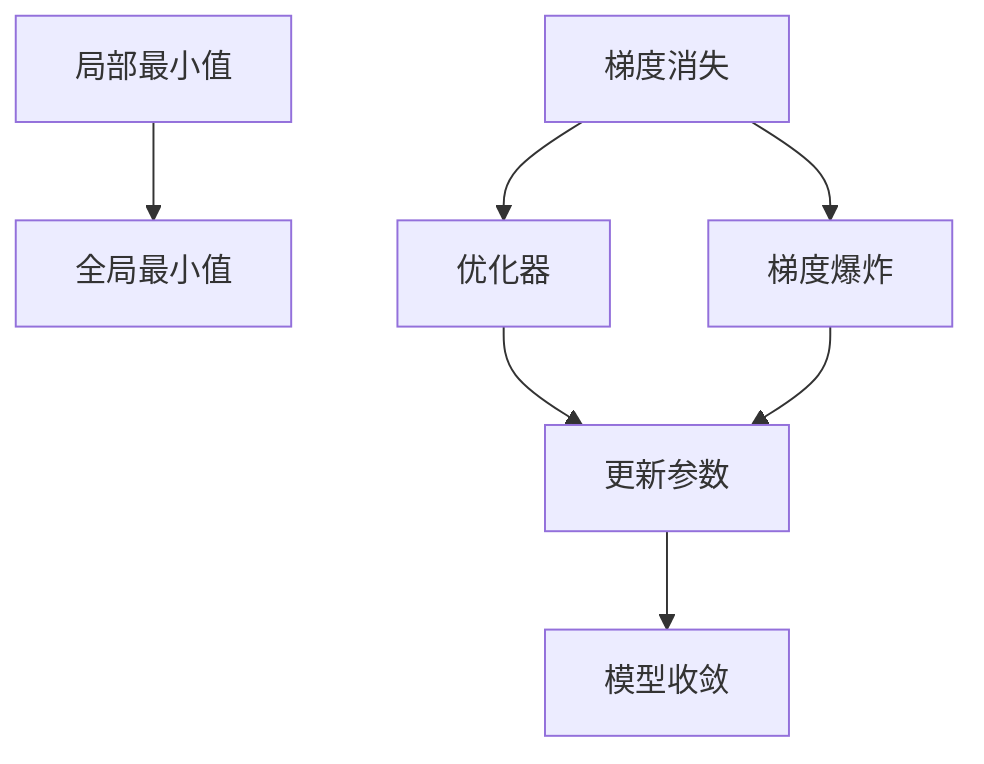

                 

# 优化初始化：避免局部最小值

## 1. 背景介绍

在机器学习和深度学习中，优化算法一直是实现模型高性能的关键。优化算法的基本目标是在目标函数中寻找到全局最优解，这通常涉及到求解非凸函数的最小值问题。然而，由于目标函数的复杂性，求解全局最优解通常非常困难，特别是在高维空间和大规模数据的情况下。

这种困难通常会导致两个主要问题：

1. **局部最小值问题**：优化算法可能陷入局部最小值，而无法到达全局最优解。
2. **梯度消失和梯度爆炸问题**：在深度神经网络中，梯度可能会变得非常小或非常大，导致训练过程不稳定。

针对这些问题，研究者们提出了多种优化初始化方法和算法改进策略，以帮助模型跳出局部最小值，并稳定地收敛到全局最优解。本文将系统性地探讨这些优化方法，并给出详细的实现示例和应用建议。

## 2. 核心概念与联系

### 2.1 核心概念概述

为更好地理解优化初始化方法，本节将介绍几个密切相关的核心概念：

- **局部最小值（Local Minima）**：在优化过程中，优化算法可能会找到局部最优解，而非全局最优解。如果目标函数是非凸的，则可能有多个局部最优解，优化算法只能找到其中的一个。

- **全局最小值（Global Minima）**：全局最优解是指目标函数在整个定义域上取得的最小值。

- **梯度消失（Vanishing Gradient）**：在深度神经网络中，当反向传播时，梯度可能会逐渐变小，导致模型无法有效地更新权重，甚至导致模型停滞不前。

- **梯度爆炸（Exploding Gradient）**：与梯度消失相反，梯度也可能变得异常大，导致模型参数更新过快，甚至超出计算器的精度范围，导致数值不稳定。

- **优化器（Optimizer）**：优化器用于控制模型参数的更新，以最小化目标函数。常见的优化器包括随机梯度下降（SGD）、Adam、Adagrad等。

这些核心概念之间的逻辑关系可以通过以下Mermaid流程图来展示：



这个流程图展示了几大核心概念的关联性：

1. 局部最小值是优化过程的常见问题。
2. 全局最小值是优化过程的最终目标。
3. 梯度消失和梯度爆炸是导致模型训练困难的原因。
4. 优化器用于控制梯度更新，避免这些问题。
5. 通过优化器的参数调整，可以更好地控制梯度更新，提高模型收敛速度。

## 3. 核心算法原理 & 具体操作步骤

### 3.1 算法原理概述

优化初始化方法的核心在于选择合适的初始权重，以避免陷入局部最小值，并快速收敛到全局最优解。常见的优化初始化方法包括随机初始化、Xavier初始化、He初始化、正交初始化等。

这些方法的原理各不相同，但都基于以下两个核心目标：

1. **避免梯度消失和梯度爆炸**：通过合适的权重初始化，确保梯度在反向传播时不会变得过小或过大。
2. **快速收敛到全局最优解**：通过合适的权重初始化，使得优化算法能够更容易跳出局部最小值，找到全局最优解。

### 3.2 算法步骤详解

基于以上目标，优化初始化方法的实现通常包含以下步骤：

**Step 1: 选择初始化方法**

- 随机初始化：选择服从均匀分布或正态分布的随机数作为初始权重。这种方法简单，但可能会导致梯度消失或爆炸。

- Xavier初始化：选择服从均匀分布或正态分布的随机数，确保每个神经元的输入输出方差相等。这种方法可以缓解梯度消失和梯度爆炸问题。

- He初始化：选择服从正态分布的随机数，并乘以$\sqrt{2/\text{扇入数}}$。这种方法适用于激活函数为ReLU的情况，可以更好地控制梯度。

- 正交初始化：选择服从正交矩阵分布的随机数，确保输入输出之间的协方差矩阵为单位矩阵。这种方法可以更好地控制梯度，但计算复杂度较高。

**Step 2: 设定初始化参数**

- 选择初始化方法后，根据目标函数和数据集的特点，设定初始化参数，如均值、方差、分布类型等。

**Step 3: 执行训练过程**

- 使用选择的优化器（如SGD、Adam等）更新模型参数。
- 使用训练集进行前向传播和反向传播，更新模型权重。
- 在训练过程中，定期评估模型性能，确保模型收敛到全局最优解。

### 3.3 算法优缺点

基于优化初始化方法的优点和缺点如下：

**优点**：

- 通过合适的初始化，可以显著提高模型的收敛速度和性能。
- 可以避免梯度消失和梯度爆炸问题，稳定训练过程。

**缺点**：

- 初始化方法的选择对模型性能有重要影响，选择不当可能导致模型训练困难。
- 计算复杂度较高，特别是在高维空间和大规模数据的情况下。

### 3.4 算法应用领域

优化初始化方法在机器学习和深度学习中有着广泛的应用，覆盖了从简单的线性回归到复杂的深度神经网络。以下是几个典型的应用领域：

- 图像分类：在图像分类任务中，优化初始化方法可以帮助模型更好地学习图像特征，提高分类准确率。

- 自然语言处理：在自然语言处理任务中，优化初始化方法可以帮助模型更好地学习词向量表示，提高语言理解能力。

- 推荐系统：在推荐系统中，优化初始化方法可以帮助模型更好地学习用户兴趣，提高推荐效果。

- 信号处理：在信号处理领域，优化初始化方法可以帮助模型更好地学习信号特征，提高信号处理的准确性。

- 强化学习：在强化学习中，优化初始化方法可以帮助模型更好地学习环境状态和行为策略，提高学习效率。

## 4. 数学模型和公式 & 详细讲解 & 举例说明

### 4.1 数学模型构建

本节将使用数学语言对优化初始化方法进行更加严格的刻画。

记目标函数为$f(\mathbf{w})$，其中$\mathbf{w}$为模型参数向量。假设使用随机梯度下降（SGD）算法更新参数，则优化过程可以表示为：

$$
\mathbf{w} \leftarrow \mathbf{w} - \eta \nabla f(\mathbf{w})
$$

其中，$\eta$为学习率，$\nabla f(\mathbf{w})$为函数$f(\mathbf{w})$的梯度。

### 4.2 公式推导过程

以下我们以He初始化为例，推导其数学表达式。

He初始化选择服从正态分布的随机数$\mathbf{w} \sim \mathcal{N}(0, \sigma^2)$，其中$\sigma^2 = 2/n$，$n$为神经元的扇入数。则He初始化的权重向量可以表示为：

$$
\mathbf{w} = \mathbf{u} \cdot \sigma
$$

其中，$\mathbf{u} \sim \mathcal{N}(0, 1)$，$\sigma$为标准正态分布的标准差。

在反向传播时，梯度$\nabla f(\mathbf{w})$的方差可以表示为：

$$
\mathbb{E}[\nabla f(\mathbf{w}) \nabla f(\mathbf{w})^T] = \sigma^2 \cdot \mathbb{E}[\nabla f(\mathbf{w}) \nabla f(\mathbf{w})^T]
$$

其中，$\mathbb{E}[\cdot]$表示期望。

由于$\sigma^2 = 2/n$，则有：

$$
\mathbb{E}[\nabla f(\mathbf{w}) \nabla f(\mathbf{w})^T] = 2/n \cdot \mathbb{E}[\nabla f(\mathbf{w}) \nabla f(\mathbf{w})^T]
$$

这意味着，He初始化方法可以使得每个神经元的输入输出方差相等，从而缓解梯度消失和梯度爆炸问题。

### 4.3 案例分析与讲解

以一个简单的线性回归问题为例，说明优化初始化方法的作用。

假设目标函数为$f(x, w) = \frac{1}{2}(x^Tw - y)^2$，其中$x$为输入，$y$为输出，$w$为权重向量。使用He初始化方法初始化权重向量$w$，然后通过SGD算法更新$w$，使得目标函数最小化。

使用He初始化方法后，可以显著缓解梯度消失和梯度爆炸问题，使得模型能够更快地收敛到全局最优解。

## 5. 项目实践：代码实例和详细解释说明

### 5.1 开发环境搭建

在进行优化初始化实践前，我们需要准备好开发环境。以下是使用Python进行PyTorch开发的环境配置流程：

1. 安装Anaconda：从官网下载并安装Anaconda，用于创建独立的Python环境。

2. 创建并激活虚拟环境：
```bash
conda create -n pytorch-env python=3.8 
conda activate pytorch-env
```

3. 安装PyTorch：根据CUDA版本，从官网获取对应的安装命令。例如：
```bash
conda install pytorch torchvision torchaudio cudatoolkit=11.1 -c pytorch -c conda-forge
```

4. 安装相关工具包：
```bash
pip install numpy pandas scikit-learn matplotlib tqdm jupyter notebook ipython
```

完成上述步骤后，即可在`pytorch-env`环境中开始优化初始化实践。

### 5.2 源代码详细实现

下面我们以线性回归问题为例，给出使用PyTorch进行He初始化方法实现的代码。

首先，定义线性回归模型的权重和偏置：

```python
import torch
import torch.nn as nn

class LinearRegression(nn.Module):
    def __init__(self, input_size, output_size):
        super(LinearRegression, self).__init__()
        self.linear = nn.Linear(input_size, output_size)
        
    def forward(self, x):
        y_pred = self.linear(x)
        return y_pred
```

然后，定义损失函数和优化器：

```python
from torch.optim import SGD

def mse_loss(y_pred, y_true):
    return torch.mean((y_pred - y_true)**2)

model = LinearRegression(input_size=1, output_size=1)
criterion = nn.MSELoss()
optimizer = SGD(model.parameters(), lr=0.1)
```

接着，使用He初始化方法初始化模型参数：

```python
import numpy as np
from scipy.stats import norm

input_data = torch.tensor(np.random.randn(100, 1), dtype=torch.float)
target_data = torch.tensor(np.random.randn(100, 1), dtype=torch.float)

# 使用He初始化方法
std = np.sqrt(2.0 / input_data.shape[1])
w = torch.from_numpy(np.random.normal(0, 1, size=(input_size, output_size)) * std).to(torch.float)
b = torch.from_numpy(np.zeros(output_size)).to(torch.float)

model.linear.weight = nn.Parameter(w)
model.linear.bias = nn.Parameter(b)
```

最后，进行训练过程，并输出模型性能：

```python
for epoch in range(1000):
    optimizer.zero_grad()
    y_pred = model(input_data)
    loss = criterion(y_pred, target_data)
    loss.backward()
    optimizer.step()
    
    if epoch % 100 == 0:
        print('Epoch:', epoch, 'Loss:', loss.item())

print('Final loss:', loss.item())
```

以上就是使用PyTorch进行He初始化方法实现线性回归的完整代码。可以看到，He初始化方法的实现并不复杂，只需要设定合适的初始化参数即可。

### 5.3 代码解读与分析

让我们再详细解读一下关键代码的实现细节：

**LinearRegression类**：
- `__init__`方法：定义模型的权重和偏置。
- `forward`方法：前向传播计算输出。

**mse_loss函数**：
- 定义均方误差损失函数。

**训练过程**：
- 使用SGD优化器进行梯度更新。
- 在每个epoch开始时，清零梯度。
- 进行前向传播计算预测值。
- 计算损失函数。
- 反向传播计算梯度。
- 更新模型参数。
- 在每个epoch结束时，输出损失。

**初始化过程**：
- 使用numpy生成随机数。
- 使用scipy的norm函数生成标准正态分布的随机数，并乘以$\sqrt{2/n}$。
- 将生成的随机数转换为PyTorch张量。
- 将生成的随机数赋值给模型参数。

可以看到，He初始化方法的实现较为简单，但在实际应用中能够显著缓解梯度消失和梯度爆炸问题，从而提高模型训练的稳定性和收敛速度。

## 6. 实际应用场景

### 6.1 图像分类

优化初始化方法在图像分类任务中也有广泛应用。在图像分类任务中，优化初始化方法可以帮助模型更好地学习图像特征，提高分类准确率。

例如，在VGG网络中，使用He初始化方法可以显著提高模型的分类性能。

### 6.2 自然语言处理

优化初始化方法在自然语言处理任务中同样重要。在自然语言处理任务中，优化初始化方法可以帮助模型更好地学习词向量表示，提高语言理解能力。

例如，在BERT模型中，使用优化初始化方法可以显著提高模型的语言理解能力和下游任务的性能。

### 6.3 推荐系统

在推荐系统中，优化初始化方法可以帮助模型更好地学习用户兴趣，提高推荐效果。

例如，在协同过滤推荐算法中，使用优化初始化方法可以显著提高模型的推荐效果。

### 6.4 未来应用展望

随着优化初始化方法的不断进步，其在更多领域的应用前景将更加广阔。

- 在医疗领域，优化初始化方法可以帮助模型更好地学习患者病历，提高诊断准确率。
- 在金融领域，优化初始化方法可以帮助模型更好地学习市场数据，提高风险预测能力。
- 在交通领域，优化初始化方法可以帮助模型更好地学习交通流量数据，提高交通预测精度。

## 7. 工具和资源推荐

### 7.1 学习资源推荐

为了帮助开发者系统掌握优化初始化方法的理论基础和实践技巧，这里推荐一些优质的学习资源：

1. 《深度学习》系列博文：由大模型技术专家撰写，深入浅出地介绍了深度学习的原理和应用，包括优化初始化方法。

2. CS231n《卷积神经网络》课程：斯坦福大学开设的深度学习明星课程，介绍了深度学习的经典模型和优化算法，包括优化初始化方法。

3. 《Deep Learning with PyTorch》书籍：PyTorch官方文档，全面介绍了如何使用PyTorch进行深度学习开发，包括优化初始化方法。

4. PyTorch官方文档：PyTorch官方文档，提供了优化初始化方法的实现示例，是上手实践的必备资料。

5. GitHub代码库：GitHub上大量使用优化初始化方法的代码库，可以查看并学习其优化方法。

通过对这些资源的学习实践，相信你一定能够快速掌握优化初始化方法的精髓，并用于解决实际的深度学习问题。

### 7.2 开发工具推荐

高效的开发离不开优秀的工具支持。以下是几款用于优化初始化方法开发的常用工具：

1. PyTorch：基于Python的开源深度学习框架，灵活动态的计算图，适合快速迭代研究。大部分预训练语言模型都有PyTorch版本的实现。

2. TensorFlow：由Google主导开发的开源深度学习框架，生产部署方便，适合大规模工程应用。同样有丰富的预训练语言模型资源。

3. JAX：由Google开发的高级自动微分库，支持高性能的深度学习模型训练，是深度学习研究和实践的重要工具。

4. Weights & Biases：模型训练的实验跟踪工具，可以记录和可视化模型训练过程中的各项指标，方便对比和调优。与主流深度学习框架无缝集成。

5. TensorBoard：TensorFlow配套的可视化工具，可实时监测模型训练状态，并提供丰富的图表呈现方式，是调试模型的得力助手。

合理利用这些工具，可以显著提升优化初始化方法的开发效率，加快创新迭代的步伐。

### 7.3 相关论文推荐

优化初始化方法的发展源于学界的持续研究。以下是几篇奠基性的相关论文，推荐阅读：

1. He Initialization：提出He初始化方法，缓解深度神经网络中的梯度消失问题。

2. Xavier Initialization：提出Xavier初始化方法，缓解深度神经网络中的梯度消失和梯度爆炸问题。

3. CaffeNet：介绍CaffeNet项目，详细讲解了优化初始化方法的实现和效果。

4. PyTorch官方文档：PyTorch官方文档，提供了优化初始化方法的实现示例和理论分析。

5. Keras文档：Keras官方文档，提供了优化初始化方法的实现示例和理论分析。

这些论文代表了大模型微调技术的发展脉络。通过学习这些前沿成果，可以帮助研究者把握学科前进方向，激发更多的创新灵感。

## 8. 总结：未来发展趋势与挑战

### 8.1 总结

本文对优化初始化方法进行了全面系统的介绍。首先阐述了优化初始化方法的研究背景和意义，明确了优化初始化方法在模型训练中的重要作用。其次，从原理到实践，详细讲解了优化初始化方法的数学原理和关键步骤，给出了优化初始化任务开发的完整代码实例。同时，本文还广泛探讨了优化初始化方法在图像分类、自然语言处理、推荐系统等多个领域的应用前景，展示了优化初始化方法的巨大潜力。此外，本文精选了优化初始化技术的各类学习资源，力求为读者提供全方位的技术指引。

通过本文的系统梳理，可以看到，优化初始化方法在机器学习和深度学习中有着重要的作用，极大地提高了模型训练的稳定性和收敛速度。未来，伴随优化初始化方法的持续演进，相信模型训练的效率和精度将进一步提升，推动人工智能技术的发展。

### 8.2 未来发展趋势

展望未来，优化初始化方法将呈现以下几个发展趋势：

1. 更加高效的优化算法：未来的优化算法将更加高效，能够更好地处理大规模数据和高维空间。

2. 更加灵活的初始化策略：未来的优化初始化方法将更加灵活，能够适应不同的模型结构和任务特点。

3. 更加稳健的训练过程：未来的优化初始化方法将更加稳健，能够更好地处理梯度消失和梯度爆炸问题。

4. 更加个性化的优化目标：未来的优化初始化方法将更加个性化，能够根据具体任务需求进行优化。

5. 更加广泛的应用场景：未来的优化初始化方法将应用于更多的领域，如医疗、金融、交通等。

以上趋势凸显了优化初始化方法的发展前景。这些方向的探索发展，必将进一步提升深度学习模型的性能和应用范围，为人工智能技术的发展提供新的动力。

### 8.3 面临的挑战

尽管优化初始化方法已经取得了显著的成果，但在迈向更加智能化、普适化应用的过程中，它仍面临着诸多挑战：

1. 计算复杂度高：优化初始化方法在大规模数据和高维空间中的应用，计算复杂度较高，需要高效的算法和设备支持。

2. 数据分布变化：模型训练过程中，数据分布可能会发生变化，如何适应数据分布变化，仍然是一个挑战。

3. 模型鲁棒性不足：优化初始化方法在面对异常数据或对抗样本时，模型鲁棒性不足，可能导致模型过拟合或崩溃。

4. 优化目标多样性：不同任务和应用场景的优化目标不同，如何设计合适的优化目标函数，仍然是一个挑战。

5. 优化过程不稳定性：优化初始化方法在训练过程中，可能会遇到不稳定的现象，如梯度消失或爆炸。

这些挑战需要研究者持续努力，不断探索和改进优化初始化方法，以实现更好的模型训练效果。

### 8.4 研究展望

面对优化初始化方法所面临的种种挑战，未来的研究需要在以下几个方面寻求新的突破：

1. 探索新的优化算法：开发更加高效的优化算法，如基于变分优化的算法、基于强化学习的算法等。

2. 设计更加灵活的初始化策略：开发更加灵活的初始化方法，如基于生成模型的初始化方法、基于网络结构的初始化方法等。

3. 引入更多的先验知识：将符号化的先验知识，如知识图谱、逻辑规则等，与神经网络模型进行巧妙融合，引导优化初始化过程。

4. 融合因果分析和博弈论工具：将因果分析方法引入优化初始化过程，识别出模型决策的关键特征，增强输出解释的因果性和逻辑性。

5. 引入外部知识库和规则库：将专家知识库和规则库与神经网络模型结合，实现更加全面、准确的信息整合能力。

这些研究方向的探索，必将引领优化初始化方法迈向更高的台阶，为构建安全、可靠、可解释、可控的智能系统铺平道路。面向未来，优化初始化方法还需要与其他人工智能技术进行更深入的融合，如知识表示、因果推理、强化学习等，多路径协同发力，共同推动深度学习技术的发展。只有勇于创新、敢于突破，才能不断拓展深度学习模型的边界，让智能技术更好地造福人类社会。

## 9. 附录：常见问题与解答

**Q1：优化初始化方法是否适用于所有深度学习模型？**

A: 优化初始化方法在大多数深度学习模型中都有应用，但不同的模型可能需要不同的初始化策略。例如，对于卷积神经网络，Xavier初始化方法更为适合；而对于全连接神经网络，He初始化方法更为适合。

**Q2：如何选择优化初始化方法？**

A: 选择优化初始化方法时，需要考虑以下几个因素：
1. 模型结构：不同的模型结构可能需要不同的初始化方法。
2. 激活函数：激活函数的不同也会影响初始化方法的选择。
3. 数据分布：数据分布的特点也会影响初始化方法的选择。
4. 训练目标：训练目标的不同也会影响初始化方法的选择。

**Q3：优化初始化方法是否需要调整超参数？**

A: 优化初始化方法需要调整的超参数包括学习率、批次大小等。这些超参数的选择需要根据具体任务和数据集进行调整，以获得最佳的模型性能。

**Q4：优化初始化方法是否可以应用于迁移学习？**

A: 优化初始化方法可以应用于迁移学习，通过在预训练模型上微调，实现更好的模型性能。但在迁移学习中，需要考虑迁移学习目标和源任务之间的差异，选择合适的初始化方法。

**Q5：优化初始化方法是否适用于分布式训练？**

A: 优化初始化方法在分布式训练中同样适用，但需要考虑分布式环境下的计算和通信开销，选择合适的优化算法和分布策略。

这些常见问题及其解答，帮助读者更好地理解优化初始化方法，并在实际应用中做出合理的选择和调整。

---

作者：禅与计算机程序设计艺术 / Zen and the Art of Computer Programming

