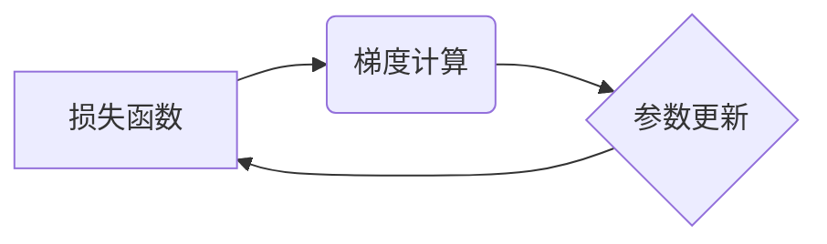

> 优化器、梯度下降、深度学习、机器学习、损失函数、参数更新、学习率、动量、自适应学习率

## 1. 背景介绍

在机器学习和深度学习领域，模型的训练过程的核心在于找到最优的参数，使得模型在给定数据集上表现最佳。而优化器正是负责实现这一目标的关键组件。优化器通过不断调整模型参数，最小化模型的损失函数，从而使模型的预测精度不断提高。

随着深度学习模型的规模和复杂度不断增加，优化器的选择和设计变得越来越重要。不同的优化器具有不同的特性和优缺点，选择合适的优化器可以显著影响模型的训练速度、收敛性以及最终的性能。

## 2. 核心概念与联系

优化器的核心概念是梯度下降法。梯度下降法是一种迭代算法，通过不断沿着损失函数的梯度方向更新模型参数，最终找到损失函数的最小值。

**Mermaid 流程图:**



**核心概念联系:**

* **损失函数:** 衡量模型预测结果与真实值的差距，目标是找到最小化损失函数的参数值。
* **梯度:** 损失函数在当前参数值处的导数，指示参数更新的方向。
* **参数更新:** 根据梯度信息，调整模型参数，朝着损失函数最小值的方向前进。

## 3. 核心算法原理 & 具体操作步骤

### 3.1  算法原理概述

梯度下降法是优化器最基本的原理，它通过迭代更新参数来最小化损失函数。具体来说，梯度下降法会计算损失函数对每个参数的梯度，然后根据梯度方向和学习率调整参数值。

### 3.2  算法步骤详解

1. **初始化参数:** 随机初始化模型参数。
2. **计算损失函数:** 使用当前参数值计算模型在给定数据集上的损失函数值。
3. **计算梯度:** 计算损失函数对每个参数的梯度。
4. **更新参数:** 根据梯度信息和学习率更新参数值。
5. **重复步骤2-4:** 直到损失函数收敛或达到最大迭代次数。

### 3.3  算法优缺点

**优点:**

* 理论基础扎实，易于理解和实现。
* 适用于各种类型的损失函数和模型。

**缺点:**

* 容易陷入局部最优解。
* 学习率的选择对收敛速度和性能有很大影响。

### 3.4  算法应用领域

梯度下降法广泛应用于机器学习和深度学习领域，例如：

* **分类:** 线性回归、逻辑回归、支持向量机等。
* **回归:** 线性回归、决策树回归等。
* **深度学习:** 神经网络、卷积神经网络、循环神经网络等。

## 4. 数学模型和公式 & 详细讲解 & 举例说明

### 4.1  数学模型构建

假设模型参数为 $\theta$, 损失函数为 $J(\theta)$, 则梯度下降法的更新规则可以表示为:

$$\theta_{t+1} = \theta_t - \eta \nabla J(\theta_t)$$

其中:

* $\theta_t$ 表示第 $t$ 次迭代的参数值。
* $\eta$ 表示学习率，控制参数更新的步长。
* $\nabla J(\theta_t)$ 表示损失函数在当前参数值处的梯度。

### 4.2  公式推导过程

梯度下降法的更新规则是基于以下原理推导出来的:

* 损失函数的最小值点对应梯度为零。
* 通过沿着梯度负方向更新参数，可以逐渐逼近损失函数的最小值点。

### 4.3  案例分析与讲解

假设我们有一个线性回归模型，损失函数为均方误差，参数为权重 $w$ 和偏置 $b$. 则梯度下降法的更新规则为:

* $w_{t+1} = w_t - \eta \frac{\partial J}{\partial w}$
* $b_{t+1} = b_t - \eta \frac{\partial J}{\partial b}$

其中 $\frac{\partial J}{\partial w}$ 和 $\frac{\partial J}{\partial b}$ 分别表示损失函数对权重 $w$ 和偏置 $b$ 的梯度。

## 5. 项目实践：代码实例和详细解释说明

### 5.1  开发环境搭建

* Python 3.x
* TensorFlow 或 PyTorch

### 5.2  源代码详细实现

```python
import tensorflow as tf

# 定义模型
model = tf.keras.models.Sequential([
    tf.keras.layers.Dense(10, activation='relu', input_shape=(10,)),
    tf.keras.layers.Dense(1)
])

# 定义损失函数和优化器
loss_fn = tf.keras.losses.MeanSquaredError()
optimizer = tf.keras.optimizers.Adam(learning_rate=0.001)

# 训练模型
for epoch in range(100):
    for batch in dataset:
        with tf.GradientTape() as tape:
            predictions = model(batch)
            loss = loss_fn(batch, predictions)
        gradients = tape.gradient(loss, model.trainable_variables)
        optimizer.apply_gradients(zip(gradients, model.trainable_variables))
    print(f'Epoch {epoch+1}, Loss: {loss.numpy()}')
```

### 5.3  代码解读与分析

* 代码首先定义了一个简单的线性回归模型。
* 然后定义了均方误差损失函数和 Adam 优化器。
* 训练循环迭代训练模型，计算损失函数值，并根据梯度更新模型参数。

### 5.4  运行结果展示

训练完成后，可以观察模型在测试数据集上的预测精度，并分析训练过程中的损失函数变化趋势。

## 6. 实际应用场景

优化器在机器学习和深度学习的各个领域都有广泛的应用，例如:

* **图像识别:** 训练卷积神经网络进行图像分类、目标检测等任务。
* **自然语言处理:** 训练循环神经网络进行文本分类、机器翻译等任务。
* **推荐系统:** 训练协同过滤模型进行用户行为预测和推荐。

### 6.4  未来应用展望

随着人工智能技术的不断发展，优化器的研究和应用将更加深入。未来，优化器可能会朝着以下方向发展:

* **自适应学习率:** 根据训练过程中的数据特征动态调整学习率，提高训练效率。
* **分布式优化:** 在分布式计算环境下进行模型训练，加速训练速度。
* **强化学习:** 应用于强化学习算法中，训练智能体进行决策和控制。

## 7. 工具和资源推荐

### 7.1  学习资源推荐

* **书籍:**
    * Deep Learning by Ian Goodfellow, Yoshua Bengio, and Aaron Courville
    * Hands-On Machine Learning with Scikit-Learn, Keras & TensorFlow by Aurélien Géron
* **在线课程:**
    * Coursera: Machine Learning by Andrew Ng
    * Udacity: Deep Learning Nanodegree

### 7.2  开发工具推荐

* **TensorFlow:** 开源深度学习框架，提供丰富的优化器和训练工具。
* **PyTorch:** 开源深度学习框架，灵活易用，支持动态计算图。
* **Keras:** 高级深度学习API，可以方便地构建和训练深度学习模型。

### 7.3  相关论文推荐

* **Adam: A Method for Stochastic Optimization** by Diederik P. Kingma and Jimmy Ba
* **Momentum** by  Paul S. R. D.

## 8. 总结：未来发展趋势与挑战

### 8.1  研究成果总结

优化器是机器学习和深度学习领域的重要研究方向，已经取得了显著的成果。

### 8.2  未来发展趋势

未来，优化器研究将朝着更加智能化、高效化和鲁棒化的方向发展。

### 8.3  面临的挑战

* 如何设计更有效的优化算法，提高训练速度和收敛性。
* 如何解决优化器在训练过程中可能遇到的问题，例如梯度消失、梯度爆炸等。
* 如何将优化器应用于更复杂和更具挑战性的机器学习任务。

### 8.4  研究展望

未来，优化器研究将继续是一个充满挑战和机遇的领域，相信会有更多新的成果和突破。

## 9. 附录：常见问题与解答

* **什么是学习率？** 学习率是控制参数更新步长的参数，过大容易导致模型震荡，过小容易导致训练缓慢。
* **如何选择合适的优化器？** 不同的优化器适用于不同的场景，需要根据具体任务和模型结构进行选择。
* **如何解决梯度消失/爆炸问题？** 可以使用梯度裁剪、残差连接等技术来解决梯度消失/爆炸问题。


作者：禅与计算机程序设计艺术 / Zen and the Art of Computer Programming 
<end_of_turn>