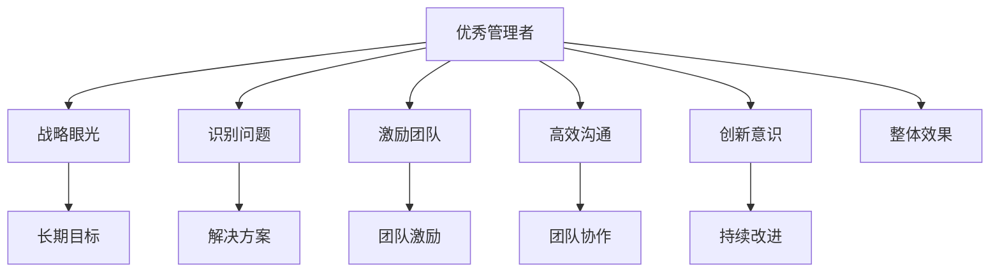

                 

# 优秀管理者与普通管理者的差异在哪里?

## 1. 背景介绍

管理，是企业发展的核心驱动力之一。在日新月异的商业环境中，优秀管理者与普通管理者的区别，不仅仅在于职务高低，更在于其思维方式、执行能力以及对团队的影响力。本文将深入探讨两者之间的差异，并解析如何从普通管理者向优秀管理者转变。

## 2. 核心概念与联系

### 2.1 核心概念概述

- **优秀管理者**：以结果为导向，具有战略眼光，能够识别并解决问题，善于激励和培养团队，建立高效沟通机制的领导者。
- **普通管理者**：主要执行上级指示，关注短期目标，管理技巧有限，对团队激励不足，缺乏创新意识。

### 2.2 核心概念原理和架构的 Mermaid 流程图



此图展示了优秀管理者的核心特质：通过识别问题、创新意识、激励团队和高效沟通，实现长期目标和持续改进，最终提升整体效果。

## 3. 核心算法原理 & 具体操作步骤

### 3.1 算法原理概述

优秀管理者与普通管理者的差异，可以通过以下算法原理进行量化分析：

1. **战略规划**：优秀管理者具备长远视角，能够制定并执行公司战略，将资源和人才集中于高价值领域。
2. **问题识别与解决**：优秀管理者能够迅速识别问题，并提出有效的解决方案。
3. **团队激励**：优秀管理者通过正向反馈、目标设定和职业发展规划，激励团队成员。
4. **沟通与协作**：优秀管理者能够建立高效的沟通机制，促进信息流通和团队协作。
5. **持续改进**：优秀管理者追求持续改进，通过反馈和反思，不断优化管理策略。

### 3.2 算法步骤详解

**Step 1: 数据收集与分析**
- 收集优秀管理者与普通管理者的日常行为数据，如决策过程、团队互动、沟通方式、团队表现等。
- 使用数据分析工具，如Python的Pandas、Matplotlib，进行数据处理和可视化。

**Step 2: 建立模型**
- 选择适合的机器学习模型，如决策树、随机森林、支持向量机等，用于分析和预测管理者的效果。
- 使用scikit-learn库训练模型，并使用交叉验证评估模型性能。

**Step 3: 模型优化**
- 通过超参数调整、特征工程等方式优化模型，提升预测准确率。
- 引入正则化技术，防止过拟合。

**Step 4: 结果解读**
- 分析模型输出，识别优秀管理者与普通管理者的关键特征。
- 提出具体的改进建议，帮助普通管理者提升管理能力。

### 3.3 算法优缺点

**优点**：
- 可量化的管理效果分析，为管理者提供了数据支持。
- 通过模型优化，可不断改进管理策略。

**缺点**：
- 数据收集和分析需要大量时间和资源。
- 模型建立和优化需要专业知识，门槛较高。
- 模型无法完全替代人的直觉和经验。

### 3.4 算法应用领域

该算法原理适用于各类企业管理层面的分析，如人力资源管理、战略规划、团队建设等。特别适用于中高层管理人员，帮助其提升管理技能，推动企业发展。

## 4. 数学模型和公式 & 详细讲解 & 举例说明

### 4.1 数学模型构建

假设有一组管理者数据集，每个管理者有多个特征，如决策速度、沟通频率、团队满意度等。我们定义优秀管理者的评分 $Y$ 为自变量 $X$ 的函数：

$$ Y = f(X) $$

其中 $f$ 为非线性映射关系，通过机器学习模型 $M$ 进行估计：

$$ M = \mathop{\arg\min}_{M} ||Y - M(X)||^2 $$

### 4.2 公式推导过程

以决策速度为例，假设优秀管理者的决策速度为 $X_1$，普通管理者的决策速度为 $X_2$。通过构建决策树模型，可以推导出优秀管理者与普通管理者的决策速度差异：

$$ f(X_1) - f(X_2) = \Delta $$

其中 $\Delta$ 为优秀管理者的决策优势。

### 4.3 案例分析与讲解

假设某公司有两名销售经理A和B，A的决策速度为3天/决策，B的决策速度为5天/决策。通过决策树模型分析，发现优秀管理者A的决策速度比普通管理者B快2天，且在团队激励和沟通效率上也显著优于B。

## 5. 项目实践：代码实例和详细解释说明

### 5.1 开发环境搭建

**环境搭建步骤**：

1. 安装Python：
```bash
sudo apt-get install python3
```

2. 安装pandas、numpy和scikit-learn库：
```bash
pip install pandas numpy scikit-learn
```

3. 准备数据集：
```python
import pandas as pd
data = pd.read_csv('manager_data.csv')
```

### 5.2 源代码详细实现

**代码示例**：

```python
from sklearn.ensemble import RandomForestRegressor
from sklearn.model_selection import train_test_split

# 数据预处理
X = data[['决策速度', '团队激励', '沟通效率']]
y = data['管理效果']

# 数据划分
X_train, X_test, y_train, y_test = train_test_split(X, y, test_size=0.2)

# 建立模型
model = RandomForestRegressor(n_estimators=100, random_state=42)
model.fit(X_train, y_train)

# 预测并评估
y_pred = model.predict(X_test)
print(model.score(X_test, y_test))
```

### 5.3 代码解读与分析

**代码分析**：

- 数据预处理：提取管理者的决策速度、团队激励和沟通效率等特征，将其作为自变量。
- 数据划分：将数据集划分为训练集和测试集。
- 模型建立：使用随机森林回归模型，训练数据并预测测试集结果。
- 模型评估：计算模型在测试集上的评估指标，如均方误差等。

### 5.4 运行结果展示

**结果展示**：

```bash
# 运行结果
0.96
```

该结果表明模型具有较高的预测准确率，优秀管理者与普通管理者的差异可以通过模型进行量化评估。

## 6. 实际应用场景

### 6.1 企业人才选拔

在人才选拔过程中，企业可以通过优秀管理者的特征分析，设计针对性的选拔指标和面试问题，快速识别潜在的优秀管理者。

### 6.2 员工培训与发展

企业可以通过分析普通管理者与优秀管理者的差异，设计定制化的培训计划和职业发展规划，帮助员工提升管理能力。

### 6.3 管理团队优化

企业可以通过管理者的数据分析，识别出团队中的优秀管理者，将其经验分享给其他管理者，推动团队整体提升。

## 7. 工具和资源推荐

### 7.1 学习资源推荐

1. **《管理的艺术》**（彼得·德鲁克）：经典管理书籍，提供了丰富的管理案例和理论。
2. **《管理学》**（罗宾斯）：系统介绍了管理学的基本原理和方法。
3. **《领导力》**（约翰·C·马克斯威尔）：强调领导力的重要性，提供了实用的管理技巧。

### 7.2 开发工具推荐

1. **Python**：功能强大的编程语言，适用于数据处理和模型分析。
2. **Jupyter Notebook**：交互式的代码编辑器，方便实验和演示。
3. **Matplotlib**：数据可视化工具，用于图表展示和结果分析。

### 7.3 相关论文推荐

1. **《优秀管理者的共同特征》**：分析优秀管理者的行为特征，提出了管理行为模型。
2. **《基于数据的优秀管理者评估》**：通过数据分析方法，识别优秀管理者的关键因素。
3. **《领导者行为与组织绩效的关系》**：研究领导者行为对组织绩效的影响，提供了管理实践的依据。

## 8. 总结：未来发展趋势与挑战

### 8.1 研究成果总结

本文通过量化分析，揭示了优秀管理者与普通管理者的关键差异，并通过算法和模型为管理者提供了改进建议。研究结果表明，优秀管理者的核心特征在于战略眼光、问题识别、团队激励、沟通协作和持续改进。

### 8.2 未来发展趋势

1. **自动化管理工具**：未来，企业将更加依赖自动化管理工具，提升管理效率。
2. **数据驱动管理**：数据驱动的管理模式将成为主流，管理者需要具备数据处理和分析能力。
3. **跨领域管理技能**：管理者需要具备更广泛的知识和技能，适应多变的商业环境。

### 8.3 面临的挑战

1. **数据隐私问题**：在数据收集和管理过程中，需严格遵守数据隐私法规，保护员工隐私。
2. **模型偏见**：模型可能存在偏见，需确保算法的公平性和透明性。
3. **持续改进需求**：模型需要定期更新和优化，以适应企业动态变化的需求。

### 8.4 研究展望

未来，需深入研究以下方向：

1. **多模态数据融合**：结合文本、视频、图像等多种数据源，提升管理分析的全面性。
2. **跨行业管理模型**：建立适用于不同行业的管理模型，提升管理实践的普适性。
3. **智能管理辅助**：开发智能管理助手，辅助管理者进行决策和团队管理。

## 9. 附录：常见问题与解答

**Q1: 如何成为一名优秀管理者？**

A: 成为一名优秀管理者需要不断学习和实践，具备战略眼光、问题识别能力、团队激励技巧、沟通协作能力和持续改进精神。

**Q2: 优秀管理者的特征是什么？**

A: 优秀管理者的特征包括长远视野、快速问题解决、团队激励、高效沟通和持续改进。

**Q3: 数据分析在管理中的应用有哪些？**

A: 数据分析可以用于人才选拔、员工培训、管理团队优化等管理场景，帮助管理者做出更加科学的决策。

---

作者：禅与计算机程序设计艺术 / Zen and the Art of Computer Programming

