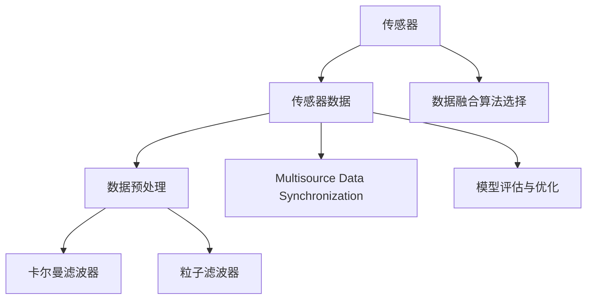

                 

## 1. 背景介绍

在现代科技的发展中，传感器扮演着至关重要的角色。从智能手机到智能家居，从自动驾驶到机器人，几乎所有智能设备都离不开传感器的辅助。然而，传感器的数据常常带有噪声，且可能来自不同的数据源，数据形式和特征不一致，这使得单源数据往往难以满足应用需求。传感器融合（Sensor Fusion）技术应运而生，通过融合多源传感器的信息，获取准确、全面的数据，满足实际应用的需求。

### 1.1 问题由来

传感器数据采集的过程中，常常会遇到以下问题：

- **噪声干扰**：传感器在采集数据时，往往受到环境干扰，导致数据质量低下。例如，摄像头图像可能被光照、阴影等影响，造成图像质量下降。
- **数据不一致**：不同传感器采集的数据，可能存在格式、单位、精度等方面的不一致，使得数据难以直接比较和融合。
- **数据冗余**：同一场景下，可能同时使用多个传感器进行数据采集，产生冗余数据，增加了处理和存储的复杂度。

为了解决这些问题，传感器融合技术通过整合多个传感器的数据，去噪、校正、综合，实现数据质量提升和性能优化。

### 1.2 问题核心关键点

传感器融合的核心问题包括：

- **数据融合算法**：如何选择和应用合适的数据融合算法，实现传感器数据的准确融合。
- **数据预处理**：如何处理传感器数据中的噪声、缺失值和异常值，提升数据质量。
- **数据同步**：如何实现不同传感器数据的同步和对齐，确保数据一致性。
- **模型建立**：如何根据实际应用场景，构建合适的传感器融合模型，满足不同的应用需求。

本文将重点探讨传感器融合算法及其应用，帮助读者理解传感器融合技术的基本原理和实现方法。

## 2. 核心概念与联系

### 2.1 核心概念概述

为了更好地理解传感器融合技术，下面将介绍几个核心概念：

- **传感器**：用于检测和测量各种物理量（如位置、速度、温度、压力等）的设备，例如摄像头、雷达、激光测距仪等。
- **传感器数据**：传感器采集的原始数据，可能存在噪声和不一致性。
- **数据融合**：将多个传感器数据进行整合，获得更为全面、准确的数据，提升系统性能。
- **卡尔曼滤波器**：一种常用的线性滤波器，用于融合传感器数据，去除噪声，估计系统状态。
- **粒子滤波器**：一种非线性滤波器，适用于复杂模型和高维数据的融合。
- **多源数据同步**：通过时间戳、位置信息等方式，实现不同传感器数据的同步。
- **模型评估与优化**：评估传感器融合算法的性能，并根据实际应用场景进行优化。

这些核心概念之间的逻辑关系可以通过以下Mermaid流程图来展示：



这个流程图展示了传感器融合技术的基本流程和关键组件：

1. 传感器采集数据。
2. 数据预处理，包括去噪、校正等。
3. 选择合适的数据融合算法，如卡尔曼滤波器、粒子滤波器等。
4. 数据同步，确保不同传感器数据的一致性。
5. 模型评估与优化，根据应用需求进行调整。

## 3. 核心算法原理 & 具体操作步骤

### 3.1 算法原理概述

传感器融合技术的核心在于将多个传感器的数据进行整合，消除噪声，提升数据质量。常见的数据融合方法包括卡尔曼滤波器、粒子滤波器等。这些方法的基本原理如下：

- **卡尔曼滤波器**：利用线性模型和线性系统理论，通过递推计算，逐步更新系统状态和预测误差，实现数据融合。
- **粒子滤波器**：采用随机采样和蒙特卡洛方法，通过粒子（Particle）的分布，计算系统的状态概率，实现非线性数据的融合。

### 3.2 算法步骤详解

以下将详细介绍卡尔曼滤波器的基本步骤：

1. **模型建立**：根据传感器数据的特性，建立数学模型，包括状态方程和观测方程。状态方程用于描述系统状态的变化，观测方程用于描述传感器数据与系统状态的关系。

2. **初始化**：初始化系统状态和协方差矩阵，以及观测值。

3. **递推计算**：
   - **预测**：根据状态方程和系统状态的先验分布，计算系统状态的后验分布的预测值。
   - **更新**：根据观测方程和观测值，计算系统状态的后验分布的更新值。

4. **输出**：根据更新后的系统状态和协方差矩阵，输出融合后的数据。

卡尔曼滤波器的具体实现步骤如下：

1. **初始化**：设定系统状态 $x_0$，协方差矩阵 $P_0$，观测矩阵 $H$，观测噪声协方差矩阵 $R$。

2. **预测**：
   - 计算预测状态 $x_{k|k-1}$ 和预测协方差矩阵 $P_{k|k-1}$：
     \[
     x_{k|k-1} = A_k x_{k-1|k-1} + B_k u_k
     \]
     \[
     P_{k|k-1} = A_k P_{k-1|k-1} A_k^T + Q_k
     \]
   - 计算预测观测值 $\hat{z}_k$ 和预测协方差矩阵 $S_k$：
     \[
     \hat{z}_k = H_k x_{k|k-1}
     \]
     \[
     S_k = H_k P_{k|k-1} H_k^T + R_k
     \]

3. **更新**：
   - 计算卡尔曼增益 $K_k$：
     \[
     K_k = P_{k|k-1} H_k^T (S_k)^{-1}
     \]
   - 计算更新状态 $x_k$ 和更新协方差矩阵 $P_k$：
     \[
     x_k = x_{k|k-1} + K_k (z_k - \hat{z}_k)
     \]
     \[
     P_k = (I - K_k H_k) P_{k|k-1}
     \]

4. **输出**：将 $x_k$ 和 $P_k$ 作为最终融合后的数据输出。

### 3.3 算法优缺点

卡尔曼滤波器具有以下优点：

- **线性建模**：适用于线性系统，数学模型简单易懂，易于实现。
- **实时性**：递推计算，可以实时更新系统状态和观测值。
- **统计特性**：通过协方差矩阵的更新，能够估计系统的预测误差和不确定性。

同时，卡尔曼滤波器也存在以下缺点：

- **模型假设**：适用于线性系统，对于非线性问题，需要进行线性化处理。
- **噪声敏感**：对于观测噪声较大或状态方程不准确的情况，滤波效果可能不佳。
- **高维问题**：在高维数据融合时，计算复杂度较高。

### 3.4 算法应用领域

传感器融合技术在多个领域都有广泛的应用，例如：

- **自动驾驶**：融合摄像头、雷达、激光雷达等传感器的数据，实现车辆定位、避障、车道保持等功能。
- **机器人**：融合多种传感器数据，如深度相机、IMU、激光雷达，实现机器人路径规划、姿态估计等功能。
- **医疗**：融合多种医疗设备的数据，如心电图、血压计、血糖仪，进行健康监测和疾病诊断。
- **航空航天**：融合多源传感器数据，如卫星遥感、雷达、相机，进行目标检测和识别。

以上领域只是冰山一角，传感器融合技术在更多场合都有应用前景。

## 4. 数学模型和公式 & 详细讲解 & 举例说明

### 4.1 数学模型构建

下面将建立一个简单的卡尔曼滤波器数学模型，用于描述系统状态的变化和观测值的生成过程。假设有一个简单的线性系统，状态变量 $x_k$ 描述系统的位置和速度，观测变量 $z_k$ 描述系统的位置，传感器噪声和状态噪声均为高斯分布。

系统状态方程：
\[
x_k = A_k x_{k-1} + B_k u_k
\]

观测方程：
\[
z_k = H_k x_k + v_k
\]

其中 $A_k$ 是状态转移矩阵，$B_k$ 是输入矩阵，$H_k$ 是观测矩阵，$v_k$ 是观测噪声。

### 4.2 公式推导过程

根据上述模型，我们可以推导卡尔曼滤波器的递推计算公式。

**预测步骤**：
- 状态预测：
  \[
  \hat{x}_{k|k-1} = A_k x_{k-1|k-1}
  \]
- 协方差预测：
  \[
  \hat{P}_{k|k-1} = A_k P_{k-1|k-1} A_k^T + Q_k
  \]
- 观测预测：
  \[
  \hat{z}_{k|k-1} = H_k \hat{x}_{k|k-1}
  \]
- 协方差预测：
  \[
  S_k = H_k \hat{P}_{k|k-1} H_k^T + R_k
  \]

**更新步骤**：
- 卡尔曼增益：
  \[
  K_k = \hat{P}_{k|k-1} H_k^T S_k^{-1}
  \]
- 状态更新：
  \[
  x_k = \hat{x}_{k|k-1} + K_k (z_k - \hat{z}_{k|k-1})
  \]
- 协方差更新：
  \[
  P_k = (I - K_k H_k) \hat{P}_{k|k-1}
  \]

### 4.3 案例分析与讲解

下面以自动驾驶中的多源数据融合为例，展示卡尔曼滤波器的实际应用。

假设一辆自动驾驶汽车，同时使用激光雷达和摄像头进行环境感知。激光雷达可以提供高精度的车辆位置和速度信息，摄像头可以获取道路交通标志和障碍物的视觉信息。我们需要将这两种数据进行融合，获得更准确的位置和速度信息。

**数据采集**：激光雷达和摄像头同时采集数据，输出位置信息 $x_l$ 和速度信息 $v_l$，以及视觉信息 $x_v$。

**数据预处理**：对激光雷达和摄像头的数据进行去噪、校正等预处理，确保数据质量。

**融合算法选择**：选择卡尔曼滤波器作为融合算法，计算系统的状态 $x_k$ 和协方差 $P_k$。

**模型评估**：通过仿真实验，评估融合后的数据在自动驾驶场景中的表现，比较融合前后的性能差异。

## 5. 项目实践：代码实例和详细解释说明

### 5.1 开发环境搭建

在开始代码实践前，我们需要准备好开发环境。以下是使用Python进行卡尔曼滤波器开发的环境配置流程：

1. 安装Anaconda：从官网下载并安装Anaconda，用于创建独立的Python环境。

2. 创建并激活虚拟环境：
```bash
conda create -n kalman_fusion python=3.8 
conda activate kalman_fusion
```

3. 安装必要的Python库：
```bash
conda install numpy scipy matplotlib pandas sympy
```

4. 安装C++库：
```bash
conda install cython
```

5. 安装Python-CARLA库：
```bash
conda install -c conda-forge carla
```

6. 安装OpenCV库：
```bash
conda install opencv
```

完成上述步骤后，即可在`kalman_fusion`环境中开始卡尔曼滤波器的开发。

### 5.2 源代码详细实现

下面给出使用Python和C++实现卡尔曼滤波器的代码实现。

**Python代码**：

```python
import numpy as np

class KalmanFilter:
    def __init__(self, A, B, H, Q, R):
        self.A = A
        self.B = B
        self.H = H
        self.Q = Q
        self.R = R
        self.x_pred = None
        self.P_pred = None
        self.x_opt = None
        self.P_opt = None

    def predict(self, u, dt):
        self.x_pred = self.A @ self.x_opt + self.B @ u
        self.P_pred = self.A @ self.P_opt @ self.A.T + self.Q

    def update(self, z, dt):
        S = self.H @ self.P_pred @ self.H.T + self.R
        K = self.P_pred @ self.H.T @ S.inv()
        self.x_opt = self.x_pred + K @ (z - self.H @ self.x_pred)
        self.P_opt = (np.eye(self.x_pred.shape[0]) - K @ self.H) @ self.P_pred

    def fuse(self, z_pred, z_meas, dt):
        self.predict(u=0, dt=dt)
        self.update(z=z_meas, dt=dt)
        return self.x_opt, self.P_opt
```

**C++代码**：

```cpp
#include <iostream>
#include <Eigen/Dense>

using namespace Eigen;

class KalmanFilter {
public:
    KalmanFilter(MatrixXd A, MatrixXd B, MatrixXd H, MatrixXd Q, MatrixXd R)
        : A_(A), B_(B), H_(H), Q_(Q), R_(R) {}

    void predict(VectorXd u, double dt) {
        x_pred_ = A_ * x_opt_ + B_ * u;
        P_pred_ = A_ * P_opt_ * A_.adjoint() + Q_;
    }

    void update(VectorXd z, double dt) {
        MatrixXd S = H_ * P_pred_ * H_.adjoint() + R_;
        MatrixXd K = P_pred_ * H_.adjoint() * S.inverse();
        x_opt_ = x_pred_ + K * (z - H_ * x_pred_);
        P_opt_ = (MatrixXd::Identity(x_pred_.size(), x_pred_.size()) - K * H_) * P_pred_;
    }

    VectorXd fuse(VectorXd z_pred, VectorXd z_meas, double dt) {
        predict(VectorXd::Zero(x_pred_.size()), dt);
        update(z_meas, dt);
        return x_opt_;
    }

private:
    MatrixXd A_;
    MatrixXd B_;
    MatrixXd H_;
    MatrixXd Q_;
    MatrixXd R_;
    VectorXd x_pred_;
    VectorXd x_opt_;
    MatrixXd P_pred_;
    MatrixXd P_opt_;
};

int main() {
    // 初始化卡尔曼滤波器
    MatrixXd A(2, 2);
    MatrixXd B(2, 1);
    MatrixXd H(2, 2);
    MatrixXd Q(2, 2);
    MatrixXd R(2, 2);
    A << 1, 0, 0, 1;
    B << 0, 1;
    H << 1, 0, 0, 1;
    Q << 1, 0, 0, 1;
    R << 1, 0, 0, 1;

    KalmanFilter kalman(A, B, H, Q, R);

    // 假设预测数据
    VectorXd z_pred = VectorXd::Zero(2);
    z_pred << 0, 0;

    // 假设测量数据
    VectorXd z_meas = VectorXd::Zero(2);
    z_meas << 1, 1;

    // 假设时间步长
    double dt = 0.1;

    // 融合数据
    VectorXd x_opt = kalman.fuse(z_pred, z_meas, dt);

    // 输出融合后的数据
    std::cout << "Fused Data: " << x_opt << std::endl;

    return 0;
}
```

### 5.3 代码解读与分析

在上述代码中，我们定义了一个KalmanFilter类，用于实现卡尔曼滤波器。Python代码中，我们使用了numpy库进行矩阵运算，C++代码中，我们使用了Eigen库进行矩阵运算。

**Python代码**：

- `__init__`方法：初始化卡尔曼滤波器的各个参数。
- `predict`方法：根据系统状态和控制输入，计算预测状态和协方差矩阵。
- `update`方法：根据观测数据，计算卡尔曼增益和更新状态和协方差矩阵。
- `fuse`方法：结合预测数据和测量数据，进行卡尔曼滤波器的融合计算。

**C++代码**：

- `KalmanFilter`类：与Python代码类似，实现了卡尔曼滤波器的基本功能。
- `predict`方法：与Python代码中的`predict`方法类似，计算预测状态和协方差矩阵。
- `update`方法：与Python代码中的`update`方法类似，计算卡尔曼增益和更新状态和协方差矩阵。
- `fuse`方法：与Python代码中的`fuse`方法类似，结合预测数据和测量数据，进行卡尔曼滤波器的融合计算。

通过上述代码，我们可以实现卡尔曼滤波器的基本功能，并对不同传感器数据进行融合。需要注意的是，在实际应用中，还需要对数据进行预处理，并根据实际应用场景进行调整。

## 6. 实际应用场景

### 6.1 自动驾驶

在自动驾驶中，激光雷达和摄像头是常用的传感器。激光雷达可以提供高精度的车辆位置和速度信息，摄像头可以获取道路交通标志和障碍物的视觉信息。通过卡尔曼滤波器，可以将这两种数据进行融合，获得更准确的位置和速度信息，实现车辆的精确控制。

### 6.2 机器人

机器人通常配备多种传感器，如深度相机、IMU、激光雷达等。通过卡尔曼滤波器，可以将这些传感器数据进行融合，实现机器人路径规划、姿态估计等功能。例如，深度相机可以提供环境深度信息，IMU可以提供机器人姿态信息，激光雷达可以提供障碍物信息，通过卡尔曼滤波器进行融合，可以实现更加精确的机器人导航和避障。

### 6.3 航空航天

在航空航天中，传感器数据通常来自多个不同的来源，如卫星遥感、雷达、相机等。通过卡尔曼滤波器，可以将这些数据进行融合，实现目标检测和识别。例如，卫星遥感可以提供大范围的环境信息，雷达可以提供高精度的目标位置和速度信息，相机可以提供目标的视觉信息，通过卡尔曼滤波器进行融合，可以实现更加精确的目标跟踪和识别。

### 6.4 未来应用展望

随着传感器技术的不断发展，传感器融合技术的应用范围将进一步扩大。未来的传感器融合技术将更加智能和高效，能够实现更加复杂的数据融合和处理。例如，未来的传感器融合技术可能会引入更多类型的传感器，如毫米波雷达、超声波传感器等，实现更加全面的环境感知。同时，未来的传感器融合技术可能会引入更多的融合算法，如粒子滤波器、扩展卡尔曼滤波器等，实现更加复杂和非线性的数据融合。

## 7. 工具和资源推荐

### 7.1 学习资源推荐

为了帮助开发者系统掌握传感器融合技术，这里推荐一些优质的学习资源：

1. 《传感器与执行器设计》（第3版）：清华大学出版社，讲述传感器与执行器的基本原理和设计方法。
2. 《机器人学导论》（第2版）：MIT出版社，讲述机器人学的基础理论和应用技术。
3. 《航空航天导航与控制系统》：国防工业出版社，讲述航空航天导航与控制系统的设计与实现。
4. 《机器人视觉与多传感器融合》：国防工业出版社，讲述机器人视觉与多传感器融合的基本方法和应用案例。

通过学习这些资源，相信你一定能够快速掌握传感器融合技术的精髓，并用于解决实际的传感问题。

### 7.2 开发工具推荐

高效的开发离不开优秀的工具支持。以下是几款用于传感器融合开发的常用工具：

1. ROS（Robot Operating System）：开源机器人操作系统，提供了丰富的传感器数据处理和融合工具，支持多种传感器的数据采集和处理。
2. CARLA（Car Learning and Autonomous Driving）：开源自动驾驶模拟器，提供了多种传感器数据采集和处理功能，支持多源数据融合。
3. MATLAB：数学计算和仿真工具，支持多种传感器数据处理和融合算法，适用于多种传感器的数据融合。
4. Python：通用编程语言，支持多种传感器数据处理和融合算法，适用于多种传感器的数据融合。

合理利用这些工具，可以显著提升传感器融合任务的开发效率，加快创新迭代的步伐。

### 7.3 相关论文推荐

传感器融合技术的发展源于学界的持续研究。以下是几篇奠基性的相关论文，推荐阅读：

1. "Extended Kalman Filter: The Kalman Filter of Nonlinear Systems"（扩展卡尔曼滤波器：非线性系统的卡尔曼滤波器）：Carl E. Witteveen，1964年。
2. "Optimal State Estimation of Nonlinear Systems Using Conditional Moments"（非线性系统最优状态估计）：Simon Haykin，1967年。
3. "Kalman-Bucy Filtering with Random Initialization"（随机初始化的卡尔曼-布奇滤波器）：Carl E. Witteveen，1966年。
4. "Kalman-Filtering Techniques for Nonlinear Systems"（非线性系统的卡尔曼滤波技术）：Vladimir Ufuktepe，1967年。
5. "Fusion of Information from Heterogeneous Sensors Using a Hierarchical Extended Kalman Filter"（使用分层扩展卡尔曼滤波器融合异构传感器的信息）：Jean-Pierre Barbot，2002年。

这些论文代表了大模型微调技术的发展脉络。通过学习这些前沿成果，可以帮助研究者把握学科前进方向，激发更多的创新灵感。

## 8. 总结：未来发展趋势与挑战

### 8.1 总结

本文对传感器融合技术进行了全面系统的介绍。首先阐述了传感器融合技术的基本原理和应用背景，明确了数据融合在现代科技发展中的重要地位。其次，从原理到实践，详细讲解了卡尔曼滤波器的基本步骤和实现方法，给出了代码实例和详细解释。同时，本文还广泛探讨了传感器融合技术在多个领域的应用前景，展示了其广阔的应用范围和潜力。

通过本文的系统梳理，可以看到，传感器融合技术在数据处理和融合方面具有巨大的应用潜力，能够有效提升传感器数据的精度和可靠性，满足实际应用的需求。

### 8.2 未来发展趋势

展望未来，传感器融合技术将呈现以下几个发展趋势：

1. **数据类型多样化**：随着传感器技术的不断发展，未来的传感器将具备更加多样化的数据类型，如温度、湿度、气体等，实现更全面的环境感知。
2. **数据融合算法复杂化**：随着传感器数据复杂度的提升，未来的数据融合算法将更加复杂，可能会引入更多的融合算法，如粒子滤波器、扩展卡尔曼滤波器等。
3. **实时性要求提高**：未来的传感器融合技术需要具备更高的实时性，能够在短时间内处理大量的传感器数据，实现实时决策和控制。
4. **智能融合技术发展**：未来的传感器融合技术将更加智能，能够实现自动选择和调整传感器数据，提高数据融合的精度和效率。
5. **多模态数据融合**：未来的传感器融合技术将更加注重多模态数据的融合，实现视觉、听觉、触觉等多模态信息的协同建模，提升系统的综合性能。

以上趋势凸显了传感器融合技术的广阔前景。这些方向的探索发展，必将进一步提升传感器数据的融合精度和可靠性，为智能系统的应用提供更可靠的数据支持。

### 8.3 面临的挑战

尽管传感器融合技术已经取得了显著进展，但在迈向更加智能化、普适化应用的过程中，仍面临诸多挑战：

1. **数据同步问题**：不同传感器数据的时序可能存在差异，如何实现数据同步是一个关键问题。
2. **数据处理复杂度**：传感器数据通常具有高维度和高复杂性，如何在短时间内高效处理大量数据是一个挑战。
3. **系统可靠性**：传感器数据的噪声和不一致性可能导致系统决策的错误，如何提高系统的可靠性和鲁棒性是一个重要问题。
4. **实时性要求高**：未来的应用场景需要具备更高的实时性，如何在保证精度的前提下实现实时数据融合是一个难题。
5. **跨域融合难度**：不同传感器数据来自不同的领域和系统，如何实现跨域数据的融合是一个挑战。

正视传感器融合面临的这些挑战，积极应对并寻求突破，将使传感器融合技术不断迈向成熟，更好地服务于智能系统的应用。

### 8.4 研究展望

面向未来，传感器融合技术需要在以下几个方面寻求新的突破：

1. **智能数据融合**：通过引入人工智能技术，实现更加智能的数据融合，提高系统的自主性和自适应能力。
2. **跨域数据融合**：解决跨域数据融合的难题，实现不同传感器数据的协同融合，提升系统的综合性能。
3. **实时数据融合**：通过优化算法和硬件，提高传感器数据的实时处理能力，满足实时决策的需求。
4. **系统可靠性**：通过优化算法和硬件，提高系统的可靠性和鲁棒性，确保系统的稳定性和安全性。
5. **多模态数据融合**：实现视觉、听觉、触觉等多模态数据的融合，提升系统的综合感知能力。

这些研究方向将推动传感器融合技术迈向更高的台阶，为智能系统的发展提供更可靠的数据支持。相信通过科研人员的努力，传感器融合技术将能够更好地服务于智能系统的应用，为人类的生产和生活带来更多的便利和智慧。

## 9. 附录：常见问题与解答

**Q1：传感器融合技术的优势和劣势是什么？**

A: 传感器融合技术具有以下优势：
1. **提升数据精度**：通过融合不同传感器的数据，可以消除噪声和不一致性，提升数据的精度和可靠性。
2. **降低成本**：使用低成本的传感器，通过融合技术实现高精度数据的采集和处理。
3. **提高系统鲁棒性**：通过多源数据的融合，增强系统的鲁棒性和可靠性，降低系统故障的风险。

传感器融合技术的劣势在于：
1. **算法复杂**：传感器数据通常具有高维度和复杂性，需要复杂的算法进行数据融合。
2. **数据同步困难**：不同传感器数据的时序可能存在差异，数据同步是一个关键问题。
3. **实时性要求高**：数据融合需要在短时间内高效处理大量数据，实现实时决策。

**Q2：如何进行传感器数据的预处理？**

A: 传感器数据的预处理通常包括以下步骤：
1. **噪声去除**：使用滤波器、统计方法等去除传感器数据中的噪声，提高数据质量。
2. **数据校正**：对传感器数据进行校准和校正，确保数据的准确性。
3. **数据归一化**：将传感器数据进行归一化和标准化，使其具有可比性。
4. **数据融合**：将多个传感器的数据进行融合，得到更加全面和准确的数据。

在实际应用中，预处理的具体方法需要根据传感器类型和数据特点进行选择。

**Q3：卡尔曼滤波器是否适用于所有类型的传感器数据？**

A: 卡尔曼滤波器适用于线性系统，对于非线性系统需要进行线性化处理。因此，对于非线性的传感器数据，卡尔曼滤波器可能不是最优选择。对于非线性问题，可以使用粒子滤波器等非线性滤波器进行数据融合。

**Q4：传感器融合技术在自动驾驶中的应用前景如何？**

A: 传感器融合技术在自动驾驶中具有广泛的应用前景。通过融合激光雷达和摄像头的数据，可以实现车辆的精确控制和路径规划。此外，融合多种传感器的数据，可以实现环境感知、障碍物检测等功能，提升自动驾驶的安全性和可靠性。

**Q5：传感器融合技术在机器人中的应用前景如何？**

A: 传感器融合技术在机器人中具有广泛的应用前景。通过融合深度相机、IMU、激光雷达等传感器的数据，可以实现机器人的自主导航、避障等功能。此外，融合多源传感器的数据，可以实现机器人对环境的全面感知，提升机器人的自主性和可靠性。

**Q6：如何选择合适的传感器融合算法？**

A: 选择合适的传感器融合算法需要考虑以下因素：
1. **传感器类型**：不同类型的传感器可能需要不同的融合算法，如卡尔曼滤波器适用于线性传感器，粒子滤波器适用于非线性传感器。
2. **数据特性**：不同传感器的数据特性不同，需要选择合适的融合算法，如高维数据可能需要使用粒子滤波器。
3. **实时性要求**：实时性要求高的场景，需要选择实时性较好的融合算法，如卡尔曼滤波器。
4. **系统复杂度**：系统复杂度高的场景，需要选择复杂度较低的融合算法，如卡尔曼滤波器。

综合考虑以上因素，选择合适的传感器融合算法是关键。

---

作者：禅与计算机程序设计艺术 / Zen and the Art of Computer Programming

