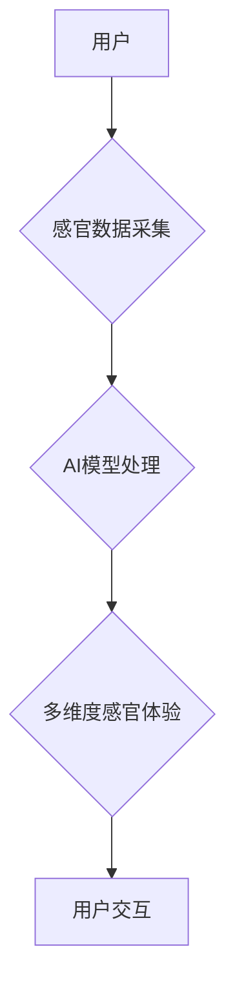

> 人工智能，感官体验，多维度构建，虚拟现实，增强现实，神经网络，深度学习，交互设计

## 1. 背景介绍

人类感知世界的方式是多维度的，通过视觉、听觉、触觉、嗅觉和味觉等感官通道，我们接收并理解周围环境的信息。然而，传统的数字世界主要依赖视觉和听觉信息，缺乏对其他感官的模拟，导致用户体验单薄且缺乏沉浸感。

近年来，随着人工智能技术的飞速发展，特别是深度学习和神经网络的突破，我们开始能够利用AI技术模拟和重建人类感官体验。这为构建更加真实、沉浸和交互式的虚拟和增强现实世界打开了大门。

## 2. 核心概念与联系

**2.1 多维度感官体验**

多维度感官体验是指利用多种感官通道，例如视觉、听觉、触觉、嗅觉和味觉，来构建更加真实和沉浸式的体验。

**2.2 AI驱动的感官模拟**

人工智能技术，特别是深度学习和神经网络，能够学习和模拟人类感官处理机制，从而实现对感官信息的生成、识别和重建。

**2.3 虚拟现实 (VR) 和增强现实 (AR)**

VR和AR技术利用计算机图形学和传感器技术，创造虚拟或增强现实环境，为用户提供沉浸式的体验。

**2.4 交互设计**

交互设计是确保用户能够自然、流畅地与虚拟或增强现实环境交互的关键。

**Mermaid 流程图**



## 3. 核心算法原理 & 具体操作步骤

**3.1 算法原理概述**

AI驱动的感官模拟主要依赖于深度学习和神经网络算法。这些算法能够学习和模拟人类大脑对感官信息的处理机制，从而实现对感官信息的生成、识别和重建。

**3.2 算法步骤详解**

1. **数据采集:** 收集大量真实感官数据，例如图像、音频、触觉、嗅觉和味觉数据。
2. **数据预处理:** 对收集到的数据进行清洗、转换和增强，使其适合深度学习模型的训练。
3. **模型训练:** 利用深度学习算法，例如卷积神经网络 (CNN)、循环神经网络 (RNN) 和生成对抗网络 (GAN)，训练模型，使其能够学习和模拟人类感官处理机制。
4. **模型评估:** 使用测试数据评估模型的性能，并根据评估结果进行模型调优。
5. **感官体验生成:** 利用训练好的模型，根据用户的输入或环境信息，生成多维度感官体验。

**3.3 算法优缺点**

**优点:**

* 能够模拟人类感官体验，提供更加真实和沉浸式的体验。
* 能够根据用户的需求和环境信息，动态生成感官体验。
* 能够不断学习和改进，提供更加逼真的体验。

**缺点:**

* 需要大量的真实感官数据进行训练。
* 训练模型需要大量的计算资源和时间。
* 目前还无法完全模拟人类所有感官体验。

**3.4 算法应用领域**

* 虚拟现实 (VR) 和增强现实 (AR)
* 游戏和娱乐
* 教育和培训
* 医疗保健
* 设计和制造

## 4. 数学模型和公式 & 详细讲解 & 举例说明

**4.1 数学模型构建**

感官体验的多维度构建可以抽象为一个数学模型，其中每个维度代表一种感官，例如视觉、听觉、触觉等。每个维度可以使用不同的数学函数来表示，例如图像处理可以使用卷积神经网络，音频处理可以使用循环神经网络。

**4.2 公式推导过程**

具体的数学公式推导过程取决于所使用的算法和感官类型。例如，对于视觉体验，可以使用卷积神经网络的激活函数来表示图像特征的提取和融合。

**4.3 案例分析与讲解**

假设我们想要构建一个虚拟环境，其中用户可以体验到视觉和听觉的感官体验。我们可以使用以下数学模型：

* 视觉体验：

$$
V(x, y) = f(I(x, y))
$$

其中：

* $V(x, y)$ 表示视觉体验在坐标 $(x, y)$ 的值。
* $I(x, y)$ 表示图像在坐标 $(x, y)$ 的像素值。
* $f$ 表示卷积神经网络的激活函数。

* 听觉体验：

$$
A(t) = g(S(t))
$$

其中：

* $A(t)$ 表示听觉体验在时间 $t$ 的值。
* $S(t)$ 表示音频信号在时间 $t$ 的值。
* $g$ 表示循环神经网络的激活函数。

## 5. 项目实践：代码实例和详细解释说明

**5.1 开发环境搭建**

* 操作系统：Windows/macOS/Linux
* 编程语言：Python
* 深度学习框架：TensorFlow/PyTorch
* 虚拟现实/增强现实框架：Unity/Unreal Engine

**5.2 源代码详细实现**

```python
# 使用TensorFlow构建卷积神经网络模型
import tensorflow as tf

# 定义模型结构
model = tf.keras.models.Sequential([
    tf.keras.layers.Conv2D(32, (3, 3), activation='relu', input_shape=(224, 224, 3)),
    tf.keras.layers.MaxPooling2D((2, 2)),
    tf.keras.layers.Conv2D(64, (3, 3), activation='relu'),
    tf.keras.layers.MaxPooling2D((2, 2)),
    tf.keras.layers.Flatten(),
    tf.keras.layers.Dense(10, activation='softmax')
])

# 编译模型
model.compile(optimizer='adam',
              loss='sparse_categorical_crossentropy',
              metrics=['accuracy'])

# 训练模型
model.fit(x_train, y_train, epochs=10)

# 使用模型预测
predictions = model.predict(x_test)
```

**5.3 代码解读与分析**

这段代码使用TensorFlow构建了一个简单的卷积神经网络模型，用于图像分类任务。

* `tf.keras.models.Sequential` 创建了一个顺序模型，其中层级依次连接。
* `tf.keras.layers.Conv2D` 定义了一个卷积层，用于提取图像特征。
* `tf.keras.layers.MaxPooling2D` 定义了一个最大池化层，用于降低特征图的尺寸。
* `tf.keras.layers.Flatten` 将多维特征图转换为一维向量。
* `tf.keras.layers.Dense` 定义了一个全连接层，用于分类。
* `model.compile` 编译模型，指定优化器、损失函数和评价指标。
* `model.fit` 训练模型，使用训练数据进行训练。
* `model.predict` 使用训练好的模型进行预测。

**5.4 运行结果展示**

训练完成后，可以使用测试数据评估模型的性能，例如准确率。

## 6. 实际应用场景

**6.1 虚拟现实 (VR) 游戏**

AI驱动的感官模拟可以为VR游戏提供更加逼真的体验，例如模拟玩家触觉、嗅觉和味觉的感受，从而增强游戏的沉浸感和互动性。

**6.2 增强现实 (AR) 应用**

AR应用可以利用AI技术模拟现实世界中不存在的感官信息，例如为用户提供虚拟物品的触觉反馈，或者模拟虚拟环境中的气味。

**6.3 教育和培训**

AI驱动的感官模拟可以为教育和培训提供更加生动的学习体验，例如模拟手术操作、飞行模拟等，帮助用户更好地理解和掌握知识。

**6.4 医疗保健**

AI驱动的感官模拟可以用于医疗诊断和治疗，例如模拟患者的疼痛感，帮助医生更好地了解患者的病情。

**6.5 未来应用展望**

随着人工智能技术的不断发展，AI驱动的感官模拟将应用于更多领域，例如：

* 个性化教育：根据用户的学习风格和需求，提供定制化的感官体验。
* 远程协作：通过虚拟现实和增强现实，实现跨越时空的协作体验。
* 艺术创作：利用AI技术生成新的艺术作品，例如音乐、绘画和雕塑。

## 7. 工具和资源推荐

**7.1 学习资源推荐**

* 深度学习课程：Coursera、edX、Udacity
* 人工智能书籍：
    * 深度学习
    * 人工智能：一种现代方法
* 在线社区：
    * Reddit (r/MachineLearning)
    * Stack Overflow

**7.2 开发工具推荐**

* 深度学习框架：TensorFlow、PyTorch
* 虚拟现实/增强现实框架：Unity、Unreal Engine
* 编程语言：Python

**7.3 相关论文推荐**

* Generative Adversarial Networks
* Deep Convolutional Neural Networks for Image Recognition
* A Survey of Deep Learning for Computer Vision

## 8. 总结：未来发展趋势与挑战

**8.1 研究成果总结**

AI驱动的感官模拟技术取得了显著进展，能够模拟多种感官体验，为用户提供更加真实和沉浸式的体验。

**8.2 未来发展趋势**

未来，AI驱动的感官模拟技术将朝着以下方向发展：

* 更逼真的感官体验：模拟更多感官类型，例如触觉、嗅觉和味觉，并提高现有感官模拟的逼真度。
* 更个性化的体验：根据用户的喜好和需求，定制化感官体验。
* 更广泛的应用场景：应用于更多领域，例如教育、医疗保健、艺术创作等。

**8.3 面临的挑战**

AI驱动的感官模拟技术还面临一些挑战：

* 数据获取和标注：需要大量的真实感官数据进行训练，数据获取和标注成本较高。
* 计算资源需求：训练大型深度学习模型需要大量的计算资源。
* 伦理问题：AI驱动的感官模拟技术可能引发一些伦理问题，例如虚假体验和信息操控。

**8.4 研究展望**

未来，我们需要继续探索新的算法和技术，提高AI驱动的感官模拟的逼真度和个性化程度。同时，也要关注技术的伦理问题，确保其安全、可靠和可持续发展。

## 9. 附录：常见问题与解答

**9.1 如何获取真实感官数据？**

真实感官数据可以通过多种方式获取，例如：

* 使用传感器采集数据，例如摄像头、麦克风、触觉传感器等。
* 从公开数据库中下载数据，例如ImageNet、AudioSet等。
* 通过人工标注数据，例如对图像进行分类、对音频进行识别等。

**9.2 如何训练AI模型？**

训练AI模型需要使用深度学习框架，例如TensorFlow或PyTorch。

**9.3 如何评估AI模型的性能？**

可以使用测试数据评估AI模型的性能，例如准确率、召回率、F1-score等。

**9.4 AI驱动的感官模拟技术有哪些伦理问题？**

AI驱动的感官模拟技术可能引发一些伦理问题，例如：

* 虚假体验：AI生成的感官体验可能与真实体验存在差异，可能会误导用户。
* 信息操控：AI可以利用感官体验来操控用户的行为和情绪。
* 隐私问题：AI模型可能需要收集用户的感官数据，需要保护用户的隐私。


作者：禅与计算机程序设计艺术 / Zen and the Art of Computer Programming 
<end_of_turn>