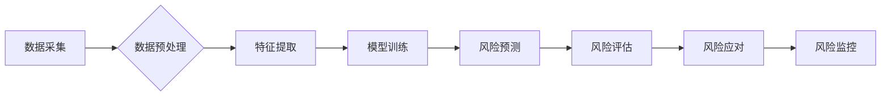

> 供应链风险管理, AI预测, 机器学习, 深度学习, 自然语言处理, 风险评估, 供应链可视化

## 1. 背景介绍

在当今全球化经济体系中，供应链的复杂性和脆弱性日益凸显。供应链风险是指任何可能对供应链正常运行造成负面影响的事件或因素。这些风险可能来自自然灾害、政治动荡、经济波动、技术故障、供应商违约等方面。一旦供应链风险爆发，可能会导致生产中断、产品短缺、成本飙升、品牌形象受损等严重后果。

传统供应链风险管理方法主要依赖于经验和专家判断，缺乏数据驱动和预测能力。随着人工智能（AI）技术的快速发展，AI在供应链风险管理领域展现出巨大的潜力。AI算法能够从海量数据中识别潜在风险模式，并提供预警和建议，帮助企业提前防范风险，降低损失。

## 2. 核心概念与联系

**2.1 供应链风险管理**

供应链风险管理是指企业识别、评估、应对和控制供应链中可能出现的风险，以确保供应链的稳定性和可持续发展。

**2.2 人工智能（AI）**

人工智能是指模拟人类智能行为的计算机系统。AI技术涵盖了机器学习、深度学习、自然语言处理等多个领域。

**2.3 AI在供应链风险管理中的应用**

AI技术可以应用于供应链风险管理的各个环节，例如：

* **风险识别:** 利用机器学习算法分析历史数据、新闻报道、社交媒体等信息，识别潜在的风险因素。
* **风险评估:** 建立数学模型，评估不同风险事件发生的概率和潜在损失。
* **风险应对:** 根据风险评估结果，制定相应的应对措施，例如调整供应商结构、优化库存管理、建立应急预案等。
* **风险监控:** 实时监控供应链运行状况，及时发现异常情况，并采取预警措施。

**2.4 核心架构**



## 3. 核心算法原理 & 具体操作步骤

### 3.1  算法原理概述

在供应链风险管理中，常用的AI算法包括：

* **机器学习算法:** 
    * **分类算法:** 用于识别风险类型，例如欺诈检测、违约预测等。常见的分类算法包括逻辑回归、支持向量机、决策树、随机森林等。
    * **回归算法:** 用于预测风险程度，例如预测供应链中断的损失金额等。常见的回归算法包括线性回归、岭回归、逻辑斯谛回归等。
    * **聚类算法:** 用于将供应链中的风险因素进行分组，例如识别高风险供应商、高风险地区等。常见的聚类算法包括K-means聚类、层次聚类等。
* **深度学习算法:** 
    * **卷积神经网络 (CNN):** 用于处理图像数据，例如识别供应链中的异常情况，例如货物损坏、运输延误等。
    * **循环神经网络 (RNN):** 用于处理序列数据，例如预测供应链中的未来趋势，例如需求变化、价格波动等。

### 3.2  算法步骤详解

以机器学习算法为例，其具体操作步骤如下：

1. **数据采集:** 收集供应链相关数据，例如供应商信息、订单数据、物流数据、市场数据等。
2. **数据预处理:** 对收集到的数据进行清洗、转换、归一化等处理，使其适合模型训练。
3. **特征提取:** 从数据中提取有价值的特征，例如供应商信用评分、运输距离、产品价格等。
4. **模型训练:** 选择合适的机器学习算法，并利用训练数据训练模型。
5. **模型评估:** 利用测试数据评估模型的性能，例如准确率、召回率、F1-score等。
6. **模型部署:** 将训练好的模型部署到生产环境中，用于预测供应链风险。

### 3.3  算法优缺点

**优点:**

* 数据驱动，能够识别潜在风险模式，提高风险预测准确率。
* 自动化程度高，能够降低人工成本和时间成本。
* 可持续改进，随着数据积累，模型性能会不断提升。

**缺点:**

* 需要大量高质量的数据进行训练。
* 模型解释性较差，难以理解模型的决策过程。
* 对数据质量要求高，数据偏差会影响模型性能。

### 3.4  算法应用领域

AI算法在供应链风险管理领域具有广泛的应用场景，例如：

* **供应商风险管理:** 识别高风险供应商，评估供应商违约风险，优化供应商选择。
* **物流风险管理:** 预测运输延误、货物损坏等风险，优化物流路线和运输方式。
* **库存风险管理:** 预测需求变化，优化库存水平，降低库存积压风险。
* **金融风险管理:** 评估供应链融资风险，优化融资方案。

## 4. 数学模型和公式 & 详细讲解 & 举例说明

### 4.1  数学模型构建

在供应链风险管理中，常用的数学模型包括：

* **贝叶斯网络:** 用于表示供应链中不同风险因素之间的依赖关系，并计算风险发生的概率。
* **风险矩阵:** 用于评估不同风险事件的严重程度和发生的可能性，并制定相应的应对措施。
* **蒙特卡罗模拟:** 用于模拟供应链中不同风险事件的影响，并评估风险的总体影响。

### 4.2  公式推导过程

以贝叶斯网络为例，其核心公式为：

$$P(A|B) = \frac{P(B|A)P(A)}{P(B)}$$

其中：

* $P(A|B)$ 表示事件A在事件B发生条件下的概率。
* $P(B|A)$ 表示事件B在事件A发生条件下的概率。
* $P(A)$ 表示事件A发生的概率。
* $P(B)$ 表示事件B发生的概率。

### 4.3  案例分析与讲解

假设我们想要预测某个供应商的违约风险。我们可以构建一个贝叶斯网络，其中节点包括供应商的信用评分、财务状况、历史违约记录等因素。通过收集相关数据，我们可以估计每个节点的概率分布，以及节点之间依赖关系的强度。然后，我们可以利用贝叶斯公式计算供应商违约风险的概率。

## 5. 项目实践：代码实例和详细解释说明

### 5.1  开发环境搭建

* 操作系统: Ubuntu 20.04
* Python 版本: 3.8
* 必要的库: pandas, numpy, scikit-learn, matplotlib

### 5.2  源代码详细实现

```python
import pandas as pd
from sklearn.model_selection import train_test_split
from sklearn.linear_model import LogisticRegression
from sklearn.metrics import accuracy_score

# 加载数据
data = pd.read_csv('supplier_data.csv')

# 划分训练集和测试集
X = data.drop('default', axis=1)
y = data['default']
X_train, X_test, y_train, y_test = train_test_split(X, y, test_size=0.2, random_state=42)

# 训练逻辑回归模型
model = LogisticRegression()
model.fit(X_train, y_train)

# 预测测试集结果
y_pred = model.predict(X_test)

# 计算模型准确率
accuracy = accuracy_score(y_test, y_pred)
print(f'模型准确率: {accuracy}')
```

### 5.3  代码解读与分析

* 首先，我们加载数据并划分训练集和测试集。
* 然后，我们训练一个逻辑回归模型，该模型用于预测供应商违约风险。
* 最后，我们使用测试集评估模型的性能，并计算模型的准确率。

### 5.4  运行结果展示

运行上述代码后，我们可以得到模型的准确率。例如，如果模型的准确率为0.85，则表示模型能够正确预测85%的供应商违约风险。

## 6. 实际应用场景

### 6.1  案例分析

一家大型零售企业利用AI技术构建了一个供应链风险管理系统，该系统能够识别潜在的供应链中断风险，并提供预警和建议。例如，系统能够识别供应商信用风险、物流运输延误风险、自然灾害风险等，并根据风险等级，制定相应的应对措施，例如调整供应商结构、优化库存管理、建立应急预案等。

### 6.2  未来应用展望

随着AI技术的不断发展，AI在供应链风险管理领域的应用将更加广泛和深入。例如：

* **更精准的风险预测:** 利用更先进的机器学习算法和深度学习算法，提高风险预测的准确率和时效性。
* **更全面的风险评估:** 将更多类型的风险因素纳入评估范围，例如社会风险、环境风险等。
* **更智能的风险应对:** 利用AI技术自动生成风险应对方案，并根据实际情况进行调整。
* **更协同的风险管理:** 建立供应链合作伙伴之间的风险共享平台，实现风险共治。

## 7. 工具和资源推荐

### 7.1  学习资源推荐

* **书籍:**
    * 《供应链风险管理》
    * 《人工智能》
    * 《机器学习》
* **在线课程:**
    * Coursera: 供应链管理、机器学习、深度学习
    * edX: 供应链风险管理、数据科学

### 7.2  开发工具推荐

* **Python:** 广泛应用于数据分析、机器学习和深度学习。
* **R:** 专注于统计分析和数据可视化。
* **TensorFlow:** 深度学习框架。
* **PyTorch:** 深度学习框架。

### 7.3  相关论文推荐

* **Supply Chain Risk Management Using Machine Learning**
* **Deep Learning for Supply Chain Risk Prediction**
* **A Bayesian Network Approach to Supply Chain Risk Assessment**

## 8. 总结：未来发展趋势与挑战

### 8.1  研究成果总结

AI技术在供应链风险管理领域取得了显著的成果，能够提高风险预测准确率、优化风险应对措施，降低供应链风险损失。

### 8.2  未来发展趋势

* **更精准的风险预测:** 利用更先进的机器学习算法和深度学习算法，提高风险预测的准确率和时效性。
* **更全面的风险评估:** 将更多类型的风险因素纳入评估范围，例如社会风险、环境风险等。
* **更智能的风险应对:** 利用AI技术自动生成风险应对方案，并根据实际情况进行调整。
* **更协同的风险管理:** 建立供应链合作伙伴之间的风险共享平台，实现风险共治。

### 8.3  面临的挑战

* **数据质量问题:** AI算法对数据质量要求高，数据偏差会影响模型性能。
* **模型解释性问题:** 许多AI算法的决策过程难以解释，难以获得用户的信任。
* **技术可行性问题:** 一些复杂的风险场景，例如供应链中断的复杂影响，仍然难以用AI技术完全解决。

### 8.4  研究展望

未来，我们需要继续加强对AI算法的研发，提高其准确性、解释性和可扩展性。同时，还需要加强与供应链管理领域的合作，将AI技术应用于更广泛的供应链场景，为企业提供更全面的风险管理解决方案。

## 9. 附录：常见问题与解答

**1. AI在供应链风险管理中有哪些应用场景？**

AI在供应链风险管理中应用广泛，例如供应商风险管理、物流风险管理、库存风险管理、金融风险管理等。

**2. 如何评估AI模型的性能？**

常用的评估指标包括准确率、召回率、F1-score等。

**3. 如何解决数据质量问题？**

需要加强数据清洗、转换、归一化等预处理工作，并建立数据质量监控机制。