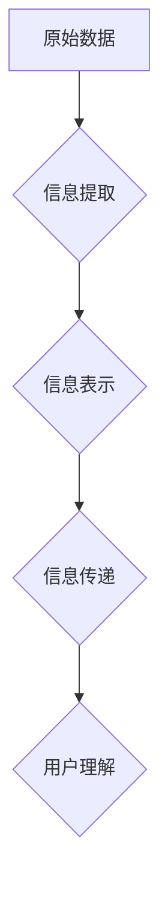

> 信息简化, 复杂性,  算法,  数学模型,  代码实现,  应用场景,  未来趋势

## 1. 背景介绍

在当今信息爆炸的时代，我们被海量的数据和信息所包围。从庞大的数据库到复杂的软件系统，从精密的科学模型到日益复杂的社会网络，无处不在的复杂性正在挑战着我们的认知能力和解决问题的能力。如何有效地简化信息，提取关键信息，并将其转化为易于理解和利用的形式，已成为一个至关重要的课题。

信息简化不仅关乎于个人效率和认知水平的提升，更关系到整个社会的发展和进步。它可以帮助我们更有效地处理信息，做出更明智的决策，并促进科学技术、经济发展和社会进步。

## 2. 核心概念与联系

信息简化是一个多学科交叉的领域，涉及到计算机科学、信息论、认知科学、心理学等多个领域。其核心概念包括：

* **信息熵:** 信息熵是衡量信息不确定性的度量，信息熵越高，信息的不确定性越大。信息简化旨在降低信息熵，提高信息的确定性和可理解性。
* **信息提取:** 从原始数据中提取关键信息，去除冗余和噪声，是信息简化的一项重要任务。
* **信息表示:** 将提取的信息以简洁、易于理解的形式进行表示，例如图表、模型、摘要等。
* **信息传递:** 将简化后的信息有效地传递给目标用户，使其能够理解和利用。

**Mermaid 流程图:**



## 3. 核心算法原理 & 具体操作步骤

### 3.1  算法原理概述

信息简化算法通常基于以下原理：

* **数据压缩:** 利用数据冗余性，将数据以更紧凑的形式存储和传输。
* **特征提取:** 从数据中提取关键特征，去除无关信息。
* **模式识别:** 利用机器学习算法识别数据中的模式和规律，并进行简化。

### 3.2  算法步骤详解

一个典型的信息简化算法流程如下：

1. **数据预处理:** 对原始数据进行清洗、转换和格式化，使其适合后续算法处理。
2. **特征选择:** 选择与目标信息相关的关键特征，并去除无关特征。
3. **数据降维:** 利用降维算法将高维数据降维到低维空间，同时保留关键信息。
4. **信息编码:** 将降维后的数据编码成简洁的表示形式，例如向量、树形结构等。
5. **信息解码:** 根据编码信息，将简化后的信息解码成原始数据或可理解的形式。

### 3.3  算法优缺点

**优点:**

* 可以有效地减少信息量，提高信息处理效率。
* 可以提取关键信息，帮助用户快速理解和决策。
* 可以降低存储和传输成本。

**缺点:**

* 信息简化可能会导致信息损失，需要权衡简化程度和信息完整性。
* 算法的性能取决于数据的质量和特征选择。
* 需要一定的技术门槛和计算资源。

### 3.4  算法应用领域

信息简化算法广泛应用于以下领域：

* **数据压缩:** JPEG、MP3等压缩算法。
* **文本摘要:** 自动生成文章摘要。
* **图像识别:** 从图像中识别物体和场景。
* **语音识别:** 将语音转换为文本。
* **推荐系统:** 根据用户行为推荐相关信息。

## 4. 数学模型和公式 & 详细讲解 & 举例说明

### 4.1  数学模型构建

信息简化可以利用信息论中的概念来构建数学模型。信息熵是衡量信息不确定性的度量，其公式如下：

$$H(X) = -\sum_{i=1}^{n} p(x_i) \log_2 p(x_i)$$

其中：

* $X$ 是随机变量。
* $p(x_i)$ 是 $x_i$ 的概率。

信息熵越低，信息越确定。信息简化算法的目标是降低信息熵，提高信息的确定性。

### 4.2  公式推导过程

信息熵的推导过程基于概率论和信息论的基本原理。

* 概率论：概率是描述随机事件发生的可能性大小的度量。
* 信息论：信息是消除不确定性的能力。

信息熵的公式体现了信息的不确定性与概率之间的关系。当一个事件的概率越高时，其信息量越低，反之亦然。

### 4.3  案例分析与讲解

例如，假设我们有一个随机变量 $X$，其取值为 {A, B, C}，对应的概率分别为 0.5, 0.3, 0.2。

$$H(X) = - (0.5 \log_2 0.5 + 0.3 \log_2 0.3 + 0.2 \log_2 0.2) \approx 1.47$$

如果我们对 $X$ 进行简化，使其取值为 {A, B}，对应的概率分别为 0.8, 0.2。

$$H(X') = - (0.8 \log_2 0.8 + 0.2 \log_2 0.2) \approx 0.72$$

可以看到，简化后的信息熵降低了，说明信息更加确定。

## 5. 项目实践：代码实例和详细解释说明

### 5.1  开发环境搭建

本项目使用 Python 语言进行开发，所需的库包括：

* NumPy: 用于数值计算。
* Scikit-learn: 用于机器学习算法。
* Matplotlib: 用于数据可视化。

### 5.2  源代码详细实现

```python
import numpy as np
from sklearn.decomposition import PCA
from sklearn.preprocessing import StandardScaler

# 数据预处理
data = np.loadtxt('data.csv', delimiter=',')
scaler = StandardScaler()
scaled_data = scaler.fit_transform(data)

# 数据降维
pca = PCA(n_components=2)
principal_components = pca.fit_transform(scaled_data)

# 数据可视化
import matplotlib.pyplot as plt
plt.scatter(principal_components[:, 0], principal_components[:, 1])
plt.xlabel('Principal Component 1')
plt.ylabel('Principal Component 2')
plt.title('Data Visualization after Dimensionality Reduction')
plt.show()
```

### 5.3  代码解读与分析

* 数据预处理：将原始数据转换为适合算法处理的格式，例如标准化。
* 数据降维：利用 PCA 算法将高维数据降维到低维空间，保留关键信息。
* 数据可视化：将降维后的数据可视化，观察数据分布和特征。

### 5.4  运行结果展示

运行代码后，将生成一个二维散点图，展示降维后的数据分布。

## 6. 实际应用场景

信息简化技术在各个领域都有广泛的应用场景：

### 6.1  医疗领域

* **病症诊断:** 利用机器学习算法分析患者的症状和病史，简化诊断过程。
* **医学影像分析:** 从医学影像中提取关键信息，辅助医生进行诊断和治疗。

### 6.2  金融领域

* **风险评估:** 简化金融数据的复杂性，提高风险评估的准确性。
* **欺诈检测:** 利用机器学习算法识别异常交易行为，降低欺诈风险。

### 6.3  教育领域

* **个性化学习:** 根据学生的学习进度和能力，提供个性化的学习内容和建议。
* **智能辅导:** 利用人工智能技术，为学生提供智能化的学习辅导。

### 6.4  未来应用展望

随着人工智能和数据科学技术的不断发展，信息简化技术将有更广泛的应用场景：

* **智能城市:** 简化城市数据，提高城市管理效率。
* **个性化推荐:** 提供更精准的商品、服务和内容推荐。
* **虚拟现实和增强现实:** 简化虚拟环境的数据，提升用户体验。

## 7. 工具和资源推荐

### 7.1  学习资源推荐

* **书籍:**
    * 《信息论基础》
    * 《机器学习》
    * 《数据挖掘》
* **在线课程:**
    * Coursera: 信息论、机器学习、数据挖掘课程
    * edX: 数据科学、人工智能课程

### 7.2  开发工具推荐

* **Python:** 广泛应用于数据科学和机器学习领域。
* **NumPy:** 用于数值计算。
* **Scikit-learn:** 用于机器学习算法。
* **Matplotlib:** 用于数据可视化。

### 7.3  相关论文推荐

* **Information Theory, Inference and Learning Algorithms** by David MacKay
* **The Elements of Statistical Learning** by Trevor Hastie, Robert Tibshirani, and Jerome Friedman
* **Pattern Recognition and Machine Learning** by Christopher Bishop

## 8. 总结：未来发展趋势与挑战

### 8.1  研究成果总结

信息简化技术取得了显著的进展，在各个领域都有广泛的应用。

### 8.2  未来发展趋势

* **更智能的信息简化算法:** 利用深度学习等先进算法，实现更智能、更精准的信息简化。
* **跨领域的信息简化:** 将信息简化技术应用于更多领域，解决更复杂的问题。
* **个性化信息简化:** 根据用户的需求和偏好，提供个性化的信息简化服务。

### 8.3  面临的挑战

* **数据质量:** 信息简化算法的性能依赖于数据的质量，如何处理不完整、不准确的数据是一个挑战。
* **信息损失:** 信息简化可能会导致信息损失，如何平衡简化程度和信息完整性是一个难题。
* **伦理问题:** 信息简化技术可能会被用于操纵信息和影响用户决策，需要关注其伦理问题。

### 8.4  研究展望

未来，信息简化技术将继续朝着更智能、更精准、更个性化的方向发展，并将在更多领域发挥重要作用。


## 9. 附录：常见问题与解答

**Q1: 信息简化和数据压缩有什么区别？**

**A1:** 信息简化和数据压缩都是减少信息量的方法，但侧重点不同。数据压缩侧重于减少数据的存储空间和传输带宽，而信息简化侧重于提取关键信息，提高信息的理解性和利用价值。

**Q2: 信息简化会丢失信息吗？**

**A2:** 信息简化可能会导致信息损失，但可以通过选择合适的算法和参数来尽量减少信息损失。

**Q3: 信息简化技术有哪些应用场景？**

**A3:** 信息简化技术广泛应用于医疗、金融、教育、智能城市等各个领域。

**Q4: 如何学习信息简化技术？**

**A4:** 可以通过阅读相关书籍、参加在线课程、学习编程等方式学习信息简化技术。

作者：禅与计算机程序设计艺术 / Zen and the Art of Computer Programming


<end_of_turn>