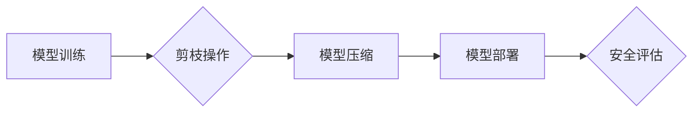

> 剪枝技术，模型安全性，过拟合，对抗攻击，数据中毒，模型可解释性

## 1. 背景介绍

深度学习模型在图像识别、自然语言处理等领域取得了显著成就，但同时也面临着一些安全挑战。其中，模型安全性是指模型在面对恶意攻击或意外输入时能够保持其预期行为和性能的能力。剪枝技术作为一种模型压缩和优化技术，在提高模型效率的同时，也可能带来一些安全隐患。

传统的剪枝技术主要关注模型的尺寸和参数量，通过移除冗余的连接或节点来减小模型大小，从而降低计算成本和存储需求。然而，剪枝操作可能会改变模型的结构和参数分布，从而影响模型的性能和安全性。

## 2. 核心概念与联系

### 2.1 剪枝技术

剪枝技术是一种模型压缩和优化技术，通过移除模型中冗余的连接或节点来减小模型大小，从而降低计算成本和存储需求。常见的剪枝方法包括：

* **结构剪枝:** 移除模型中一些连接或节点，改变模型结构。
* **权重剪枝:** 移除模型中一些权重，降低模型参数量。

### 2.2 模型安全性

模型安全性是指模型在面对恶意攻击或意外输入时能够保持其预期行为和性能的能力。常见的模型安全威胁包括：

* **对抗攻击:** 攻击者通过对输入数据进行微小的扰动，导致模型产生错误的预测结果。
* **数据中毒:** 攻击者将恶意数据注入训练数据，从而影响模型的训练过程和预测结果。
* **模型可解释性:** 难以理解模型的决策过程，导致模型的安全性难以评估和保证。

### 2.3 剪枝技术与模型安全性的联系

剪枝技术可能会影响模型的安全性，主要体现在以下几个方面：

* **过拟合:** 剪枝可能会导致模型过拟合训练数据，从而降低模型在未知数据上的泛化能力，使其更容易受到对抗攻击。
* **对抗鲁棒性:** 剪枝可能会降低模型的对抗鲁棒性，使其更容易受到对抗攻击的影响。
* **数据中毒敏感性:** 剪枝可能会提高模型的数据中毒敏感性，使其更容易受到数据中毒攻击的影响。

**Mermaid 流程图**



## 3. 核心算法原理 & 具体操作步骤

### 3.1 算法原理概述

剪枝算法的基本原理是通过移除模型中冗余的连接或节点来减小模型大小，从而降低计算成本和存储需求。常见的剪枝算法包括：

* **逐层剪枝:** 从模型的最后一层开始，依次移除连接或节点，直到达到预设的模型大小。
* **全局剪枝:** 对整个模型进行一次性剪枝，移除所有冗余的连接或节点。
* **迭代剪枝:** 采用迭代的方式进行剪枝，每次移除少量连接或节点，直到达到预设的模型大小。

### 3.2 算法步骤详解

以逐层剪枝为例，其具体操作步骤如下：

1. **初始化:** 设置剪枝目标模型大小，并对模型进行初始化。
2. **评估连接重要性:** 对每个连接进行评估，计算其对模型预测结果的影响。常用的评估方法包括：
    * **梯度下降法:** 计算连接权重的梯度，较大的梯度表示连接对模型预测结果影响较大。
    * **特征重要性分析:** 分析每个连接所连接的特征对模型预测结果的影响。
3. **移除冗余连接:** 根据连接重要性排序，移除重要性较低的连接。
4. **重复步骤2-3:** 迭代执行步骤2-3，直到达到预设的模型大小。

### 3.3 算法优缺点

**优点:**

* **模型压缩:** 可以有效减小模型大小，降低计算成本和存储需求。
* **性能提升:** 在某些情况下，剪枝可以提高模型的性能，例如减少过拟合。

**缺点:**

* **性能下降:** 在某些情况下，剪枝可能会导致模型性能下降。
* **安全隐患:** 剪枝可能会影响模型的安全性，例如降低对抗鲁棒性。

### 3.4 算法应用领域

剪枝技术广泛应用于各种深度学习领域，例如：

* **图像识别:** 压缩图像识别模型，降低计算成本和存储需求。
* **自然语言处理:** 压缩自然语言处理模型，例如文本分类和机器翻译模型。
* **语音识别:** 压缩语音识别模型，降低计算成本和存储需求。

## 4. 数学模型和公式 & 详细讲解 & 举例说明

### 4.1 数学模型构建

假设模型的预测输出为 $y$, 输入为 $x$, 权重为 $w$, 则模型预测输出可以表示为：

$$y = f(x, w)$$

其中，$f$ 为激活函数。

剪枝的目标是找到一个子模型 $f'$，其参数量更少，但预测性能接近原模型 $f$。

### 4.2 公式推导过程

剪枝算法通常采用贪婪搜索策略，每次移除一个连接或节点，并评估移除后模型的性能。

假设移除连接 $(i, j)$ 后，模型的损失函数为 $L'$, 则剪枝策略可以表示为：

$$
\text{if } L' < L \text{ then remove connection } (i, j)
$$

其中，$L$ 为移除前模型的损失函数。

### 4.3 案例分析与讲解

以图像识别模型为例，假设模型包含多个卷积层和全连接层。

通过逐层剪枝，可以先移除最后一层的冗余连接，然后依次移除其他层的冗余连接。

在移除连接时，可以采用梯度下降法评估连接的重要性，移除重要性较低的连接。

## 5. 项目实践：代码实例和详细解释说明

### 5.1 开发环境搭建

* 操作系统: Ubuntu 20.04
* Python 版本: 3.8
* 深度学习框架: TensorFlow 2.x

### 5.2 源代码详细实现

```python
import tensorflow as tf

# 定义模型
model = tf.keras.models.Sequential([
    tf.keras.layers.Conv2D(32, (3, 3), activation='relu', input_shape=(28, 28, 1)),
    tf.keras.layers.MaxPooling2D((2, 2)),
    tf.keras.layers.Conv2D(64, (3, 3), activation='relu'),
    tf.keras.layers.MaxPooling2D((2, 2)),
    tf.keras.layers.Flatten(),
    tf.keras.layers.Dense(10, activation='softmax')
])

# 定义剪枝函数
def prune_model(model, pruning_rate):
    for layer in model.layers:
        if isinstance(layer, tf.keras.layers.Conv2D) or isinstance(layer, tf.keras.layers.Dense):
            weights = layer.get_weights()[0]
            threshold = pruning_rate * tf.reduce_max(tf.abs(weights))
            weights = tf.where(tf.abs(weights) > threshold, weights, 0.0)
            layer.set_weights([weights])
    return model

# 设置剪枝率
pruning_rate = 0.5

# 剪枝模型
pruned_model = prune_model(model, pruning_rate)

# 训练剪枝模型
pruned_model.compile(optimizer='adam',
                    loss='sparse_categorical_crossentropy',
                    metrics=['accuracy'])
pruned_model.fit(x_train, y_train, epochs=10)

# 评估剪枝模型
loss, accuracy = pruned_model.evaluate(x_test, y_test)
print('Pruned Model Accuracy:', accuracy)
```

### 5.3 代码解读与分析

* 代码首先定义了一个简单的卷积神经网络模型。
* 然后定义了一个 `prune_model` 函数，用于对模型进行剪枝操作。
* `prune_model` 函数遍历模型中的卷积层和全连接层，计算每个权重的绝对值，并设置一个阈值。
* 如果权重的绝对值大于阈值，则保留该权重；否则，将其设置为 0。
* 最后，代码设置了剪枝率，对模型进行剪枝操作，并训练和评估剪枝模型。

### 5.4 运行结果展示

运行代码后，可以观察到剪枝模型的准确率与原始模型的准确率之间的差异。

## 6. 实际应用场景

### 6.1 模型压缩

剪枝技术可以有效压缩深度学习模型，降低计算成本和存储需求。例如，在移动设备上部署深度学习模型时，剪枝技术可以显著降低模型的大小，从而提高模型的运行速度和效率。

### 6.2 模型加速

剪枝技术可以加速深度学习模型的推理速度。通过移除冗余的连接或节点，可以减少模型的计算量，从而提高模型的推理速度。

### 6.3 模型可解释性

剪枝技术可以提高模型的可解释性。通过移除冗余的连接或节点，可以简化模型的结构，从而更容易理解模型的决策过程。

### 6.4 未来应用展望

未来，剪枝技术可能会在以下领域得到更广泛的应用：

* **边缘计算:** 在资源受限的边缘设备上部署深度学习模型。
* **联邦学习:** 压缩模型参数，提高联邦学习的效率。
* **自动机器学习:** 自动进行模型剪枝，优化模型性能。

## 7. 工具和资源推荐

### 7.1 学习资源推荐

* **论文:**
    * "Pruning Filters for Efficient ConvNets"
    * "Learning Efficient Convolutional Networks through Network Slimming"
* **博客:**
    * https://towardsdatascience.com/model-pruning-techniques-for-deep-learning-a-comprehensive-guide-a3999999999a
    * https://blog.paperspace.com/model-pruning-for-deep-learning/

### 7.2 开发工具推荐

* **TensorFlow:** https://www.tensorflow.org/
* **PyTorch:** https://pytorch.org/

### 7.3 相关论文推荐

* "Pruning Filters for Efficient ConvNets"
* "Learning Efficient Convolutional Networks through Network Slimming"
* "Lottery Ticket Hypothesis: Finding Sparse, Trainable Neural Networks"

## 8. 总结：未来发展趋势与挑战

### 8.1 研究成果总结

剪枝技术在模型压缩、加速和可解释性方面取得了显著成果，为深度学习模型的部署和应用提供了新的思路。

### 8.2 未来发展趋势

未来，剪枝技术的发展趋势包括：

* **自动化剪枝:** 自动化剪枝算法，无需人工干预，可以自动找到最佳的剪枝策略。
* **可解释性剪枝:** 提高剪枝算法的可解释性，使得模型的剪枝过程更加透明和可理解。
* **对抗鲁棒性剪枝:** 针对对抗攻击，设计剪枝算法，提高模型的对抗鲁棒性。

### 8.3 面临的挑战

剪枝技术还面临一些挑战，例如：

* **剪枝策略:** 如何找到最优的剪枝策略，仍然是一个开放问题。
* **性能损失:** 剪枝可能会导致模型性能损失，如何平衡模型压缩和性能之间的 trade-off 也是一个挑战。
* **安全评估:** 如何评估剪枝后模型的安全性和鲁棒性，需要进一步的研究。

### 8.4 研究展望

未来，剪枝技术的研究将继续深入，探索更有效的剪枝算法，提高模型的压缩率、加速率和安全性，为深度学习的广泛应用提供更强大的技术支持。

## 9. 附录：常见问题与解答

### 9.1 什么是剪枝技术？

剪枝技术是一种模型压缩和优化技术，通过移除模型中冗余的连接或节点来减小模型大小，从而降低计算成本和