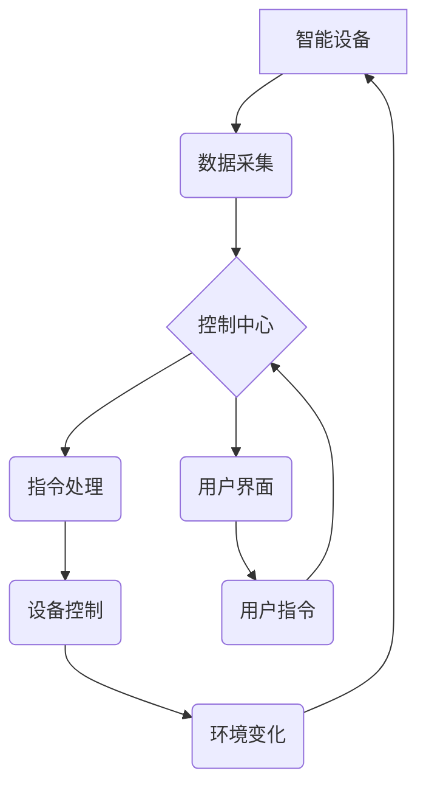

> 智能家居, Java, 可靠性, 安全性, 性能, 物联网, 嵌入式系统

## 1. 背景介绍

智能家居已成为现代生活的重要组成部分，它通过网络连接各种智能设备，实现对家居环境的自动化控制和智能化管理。随着智能家居技术的不断发展，对系统可靠性、安全性、性能等方面的要求也越来越高。Java作为一种成熟、稳定、高性能的编程语言，在智能家居系统开发中具有独特的优势。

### 1.1 智能家居发展现状

智能家居市场近年来呈现出爆发式增长，各种智能设备如智能灯泡、智能门锁、智能空调等层出不穷。这些设备通过网络连接，实现相互协作，为用户提供更加便捷、舒适的生活体验。

### 1.2 Java在智能家居中的应用

Java语言在智能家居领域具有广泛的应用场景：

* **设备驱动程序开发:** Java可以开发高效、稳定的设备驱动程序，实现与各种智能设备的良好交互。
* **应用程序开发:** Java可以开发各种智能家居应用程序，例如远程控制、场景设定、数据分析等。
* **平台开发:** Java可以构建智能家居平台，提供设备管理、数据存储、安全认证等功能。

### 1.3 Java优势

Java语言在智能家居系统开发中具有以下优势：

* **平台独立性:** Java代码可以在各种平台上运行，无需进行代码修改，降低了开发成本和维护难度。
* **安全性:** Java语言内置了强大的安全机制，可以有效防止恶意攻击和数据泄露。
* **可靠性:** Java语言具有良好的内存管理机制和异常处理机制，可以提高系统的稳定性和可靠性。
* **性能:** Java语言经过多年的优化，性能表现优异，可以满足智能家居系统对实时性和响应速度的要求。

## 2. 核心概念与联系

智能家居系统通常由以下核心组件组成：

* **智能设备:** 包括各种传感器、执行器、网络设备等，负责感知环境、执行指令和数据传输。
* **控制中心:** 负责接收设备数据、处理指令、协调设备工作，通常由服务器或嵌入式系统构成。
* **用户界面:** 提供用户与系统交互的界面，例如手机APP、平板电脑、语音助手等。

**Mermaid 流程图:**



## 3. 核心算法原理 & 具体操作步骤

### 3.1  算法原理概述

智能家居系统中，各种算法共同作用，实现系统的智能化控制和自动化管理。常见的算法包括：

* **数据处理算法:** 用于处理来自智能设备的数据，例如传感器数据、用户行为数据等，提取有价值的信息。
* **决策算法:** 根据数据分析结果，做出控制指令，例如调节温度、控制灯光等。
* **预测算法:** 基于历史数据，预测未来需求，例如预测用户回家时间，提前开启空调等。

### 3.2  算法步骤详解

以温度控制为例，说明智能家居系统中的算法步骤：

1. **数据采集:** 温度传感器采集室内温度数据。
2. **数据处理:** 将温度数据转换为数字信号，并进行滤波、平滑等处理，去除噪声和干扰。
3. **决策:** 根据设定温度和当前温度，决策是否需要调节空调。
4. **指令发送:** 将控制指令发送到空调设备。
5. **执行:** 空调设备根据指令调节温度。
6. **反馈:** 空调设备反馈温度变化信息，系统进行实时监控和调整。

### 3.3  算法优缺点

不同的算法具有不同的优缺点，需要根据具体应用场景选择合适的算法。例如，决策树算法易于理解和实现，但对于复杂问题可能效果不佳；神经网络算法可以学习复杂模式，但训练过程复杂，需要大量数据。

### 3.4  算法应用领域

智能家居系统中的算法广泛应用于各个领域，例如：

* **环境控制:** 温度控制、湿度控制、灯光控制等。
* **安全监控:** 人脸识别、入侵检测、视频监控等。
* **家居服务:** 智能语音助手、远程控制、预约服务等。

## 4. 数学模型和公式 & 详细讲解 & 举例说明

### 4.1  数学模型构建

智能家居系统中，可以使用数学模型来描述系统行为和控制逻辑。例如，可以建立温度控制模型，描述室内温度随时间变化的关系。

### 4.2  公式推导过程

假设室内温度为 $T(t)$，空调功率为 $P$，室内热损失率为 $Q$，则温度变化率可以表示为：

$$
\frac{dT(t)}{dt} = \frac{P}{C} - \frac{Q}{C}
$$

其中，$C$ 为室内热容量。

### 4.3  案例分析与讲解

通过上述公式，可以计算出不同空调功率和热损失率下，室内温度随时间的变化趋势。例如，如果设定温度为 $25^\circ C$，当前温度为 $22^\circ C$，空调功率为 $1kW$，热损失率为 $500W$，则可以计算出需要多少时间才能达到设定温度。

## 5. 项目实践：代码实例和详细解释说明

### 5.1  开发环境搭建

* **操作系统:** Windows、Linux、macOS
* **JDK:** Java Development Kit 11 或更高版本
* **IDE:** Eclipse、IntelliJ IDEA 等

### 5.2  源代码详细实现

以下代码示例演示了如何使用 Java 开发一个简单的温度控制程序：

```java
public class TemperatureController {

    private double targetTemperature;
    private double currentTemperature;
    private double heatingPower;

    public TemperatureController(double targetTemperature, double heatingPower) {
        this.targetTemperature = targetTemperature;
        this.heatingPower = heatingPower;
    }

    public void updateTemperature(double currentTemperature) {
        this.currentTemperature = currentTemperature;
        if (currentTemperature < targetTemperature) {
            System.out.println("Heating...");
            // 控制加热设备
        } else {
            System.out.println("Cooling...");
            // 控制冷却设备
        }
    }

    public static void main(String[] args) {
        TemperatureController controller = new TemperatureController(25, 1000);
        controller.updateTemperature(22);
    }
}
```

### 5.3  代码解读与分析

* `targetTemperature`: 设置的目标温度。
* `currentTemperature`: 当前的温度。
* `heatingPower`: 加热功率。
* `updateTemperature()`: 更新温度并控制加热或冷却设备。

### 5.4  运行结果展示

运行上述代码，将输出以下信息：

```
Heating...
```

## 6. 实际应用场景

### 6.1 智能家居场景

* **温度控制:** 根据用户设定，自动调节室内温度，实现舒适的居住环境。
* **灯光控制:** 根据时间、光线强度或用户指令，自动控制灯光亮度和开关状态。
* **安全监控:** 通过摄像头、传感器等设备，实现对家居环境的实时监控，并报警提醒。

### 6.2 其他应用场景

* **智慧办公:** 自动调节办公环境温度、灯光、空气质量等，提高工作效率。
* **智慧医疗:** 通过远程监控设备，实现对患者的健康状况监测和管理。
* **智慧农业:** 通过传感器和自动化控制系统，实现对作物生长环境的精准管理。

### 6.4  未来应用展望

随着物联网、人工智能等技术的不断发展，智能家居系统将更加智能化、个性化和安全可靠。未来，智能家居系统将更加深入地融入人们的生活，为人们提供更加便捷、舒适、安全的居住体验。

## 7. 工具和资源推荐

### 7.1  学习资源推荐

* **Java官方网站:** https://www.oracle.com/java/technologies/javase-downloads.html
* **Java编程书籍:** 《Head First Java》、《Effective Java》等
* **在线学习平台:** Coursera、Udemy、edX等

### 7.2  开发工具推荐

* **Eclipse:** https://www.eclipse.org/
* **IntelliJ IDEA:** https://www.jetbrains.com/idea/
* **NetBeans:** https://netbeans.apache.org/

### 7.3  相关论文推荐

* **Smart Home Systems: A Survey**
* **A Survey on Security and Privacy Issues in Smart Homes**
* **Energy-Efficient Control Strategies for Smart Homes**

## 8. 总结：未来发展趋势与挑战

### 8.1  研究成果总结

本文介绍了基于Java开发智能家居系统的优势、核心概念、算法原理、代码实现以及实际应用场景。Java语言的平台独立性、安全性、可靠性和性能，使其成为智能家居系统开发的理想选择。

### 8.2  未来发展趋势

* **人工智能:** 将人工智能技术融入智能家居系统，实现更加智能化的控制和服务。
* **物联网:** 与物联网技术结合，实现智能家居与其他设备的互联互通。
* **云计算:** 利用云计算平台，实现智能家居数据的存储、分析和共享。

### 8.3  面临的挑战

* **安全性:** 智能家居系统面临着数据泄露、恶意攻击等安全风险。
* **隐私保护:** 智能家居系统收集大量用户数据，需要有效保护用户隐私。
* **标准化:** 智能家居系统缺乏统一的标准，导致设备互联互通性差。

### 8.4  研究展望

未来，需要进一步研究智能家居系统的安全性、隐私保护、标准化等问题，推动智能家居技术的健康发展。

## 9. 附录：常见问题与解答

### 9.1  常见问题

* **如何选择合适的Java开发工具？**
* **如何实现智能家居设备与Java系统的互联互通？**
* **如何保障智能家居系统的安全性？**

### 9.2  解答

* 选择Java开发工具时，可以根据个人需求和项目规模选择合适的工具。
* 实现智能家居设备与Java系统的互联互通，需要使用相应的通信协议和驱动程序。
* 保障智能家居系统的安全性，需要采用多重安全措施，例如数据加密、身份认证、入侵检测等。


作者：禅与计算机程序设计艺术 / Zen and the Art of Computer Programming 
<end_of_turn>