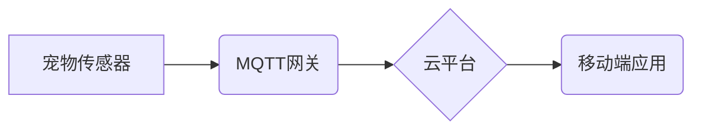

> MQTT, RESTful API, 智能家居, 宠物护理, 物联网, 数据传输, 安全

## 1. 背景介绍

随着物联网技术的快速发展，智能家居已成为现代生活的重要组成部分。人们越来越希望通过智能设备来简化生活，提高生活品质。宠物作为家庭成员之一，也逐渐成为智能家居解决方案的关注对象。宠物护理智能家居解决方案旨在通过传感器、 actuators 和云平台，实现对宠物的实时监控、健康管理和行为分析，为宠物主人提供更便捷、更安全的宠物护理体验。

传统的宠物护理方式往往依赖于人工观察和干预，存在着诸多局限性，例如：

* **实时性差:** 人工观察无法做到全天候实时监控，容易错过宠物的异常行为。
* **效率低下:**  人工记录宠物的饮食、运动、排泄等信息繁琐，难以形成有效的管理体系。
* **安全性不足:**  宠物可能在主人不在家时发生意外，缺乏有效的安全保障。

基于MQTT协议和RESTful API的宠物护理智能家居解决方案能够有效解决上述问题，为宠物主人提供更智能、更便捷的宠物护理体验。

## 2. 核心概念与联系

### 2.1 MQTT协议

MQTT（Message Queuing Telemetry Transport）是一种轻量级的消息传输协议，专门设计用于物联网应用场景。它具有以下特点：

* **轻量级:** MQTT协议本身非常小巧，占用资源少，适合资源受限的设备。
* **低功耗:** MQTT协议采用发布/订阅模式，减少数据传输量，降低设备功耗。
* **可靠性高:** MQTT协议支持消息确认机制，确保消息可靠传输。
* **跨平台:** MQTT协议支持多种平台和编程语言，易于集成。

### 2.2 RESTful API

RESTful API（Representational State Transfer Application Programming Interface）是一种基于互联网协议的软件架构风格，用于构建Web服务。它具有以下特点：

* **基于资源:** RESTful API将数据视为资源，每个资源都有唯一的标识符。
* **状态转移:** RESTful API通过HTTP方法（GET、POST、PUT、DELETE等）来操作资源状态。
* **无状态:** 每个请求都是独立的，服务器不需要记住之前的请求状态。
* **缓存:** RESTful API支持缓存机制，提高响应速度。

### 2.3 核心架构

基于MQTT协议和RESTful API的宠物护理智能家居解决方案的架构主要包括以下几个部分：

* **宠物传感器:** 用于采集宠物的各种数据，例如温度、湿度、运动、声音等。
* **MQTT网关:** 连接宠物传感器和云平台，负责数据转发和消息处理。
* **云平台:** 提供数据存储、分析和展示功能，并通过RESTful API对外提供数据接口。
* **移动端应用:** 用户可以通过移动端应用查看宠物数据、控制智能设备和接收提醒。

**Mermaid 流程图:**



## 3. 核心算法原理 & 具体操作步骤

### 3.1  算法原理概述

宠物护理智能家居解决方案的核心算法主要包括：

* **数据采集和处理:**  利用传感器采集宠物数据，并进行预处理、过滤和分析。
* **异常行为检测:**  基于机器学习算法，识别宠物的异常行为，例如长时间不活动、异常叫声等。
* **健康状态评估:**  根据宠物的生理数据，评估宠物的健康状态，并提供相应的建议。
* **行为分析和预测:**  分析宠物的行为模式，预测宠物的未来行为，例如何时需要进食、何时需要散步等。

### 3.2  算法步骤详解

**数据采集和处理:**

1. 宠物传感器采集宠物数据，例如温度、湿度、运动、声音等。
2. 将原始数据进行预处理，例如去除噪声、填充缺失值等。
3. 对数据进行过滤和聚合，例如计算平均值、最大值、最小值等。

**异常行为检测:**

1. 利用机器学习算法，例如支持向量机、决策树等，训练一个异常行为检测模型。
2. 将采集到的宠物数据输入模型，预测宠物是否表现出异常行为。
3. 当模型预测出异常行为时，向用户发送提醒。

**健康状态评估:**

1. 根据宠物的生理数据，例如体温、心率、呼吸频率等，计算健康指标。
2. 将健康指标与正常范围进行比较，评估宠物的健康状态。
3. 根据评估结果，向用户提供相应的建议，例如调整饮食、增加运动等。

**行为分析和预测:**

1. 利用时间序列分析方法，分析宠物的行为模式，例如进食时间、睡眠时间、活动时间等。
2. 基于历史数据，预测宠物的未来行为，例如何时需要进食、何时需要散步等。
3. 向用户提供预警和提醒，帮助用户更好地管理宠物。

### 3.3  算法优缺点

**优点:**

* **准确性高:**  基于机器学习算法的异常行为检测和健康状态评估具有较高的准确性。
* **实时性强:**  数据采集和处理过程实时进行，能够及时发现宠物的异常行为。
* **可扩展性强:**  系统架构灵活，可以根据需要添加新的传感器和功能。

**缺点:**

* **数据依赖性强:**  算法的准确性依赖于数据的质量和数量。
* **模型训练成本高:**  训练机器学习模型需要大量的计算资源和时间。
* **隐私安全问题:**  宠物数据需要妥善保护，防止泄露和滥用。

### 3.4  算法应用领域

基于MQTT协议和RESTful API的宠物护理智能家居解决方案的算法可以应用于以下领域:

* **宠物健康管理:**  监测宠物的健康状况，及时发现异常，并提供相应的建议。
* **宠物行为分析:**  分析宠物的行为模式，了解宠物的喜好和需求。
* **宠物安全保障:**  通过传感器和智能设备，保障宠物的安全，防止意外发生。
* **宠物远程监控:**  即使不在家，也可以通过移动端应用远程监控宠物的状况。

## 4. 数学模型和公式 & 详细讲解 & 举例说明

### 4.1  数学模型构建

宠物健康状态评估模型可以采用基于多因素的线性回归模型，将宠物的生理数据作为输入变量，健康状态作为输出变量。

**模型公式:**

$$
H = \beta_0 + \beta_1 * T + \beta_2 * HR + \beta_3 * RR + \epsilon
$$

其中:

* $H$：宠物健康状态评分
* $T$：宠物体温
* $HR$：宠物心率
* $RR$：宠物呼吸频率
* $\beta_0$：截距项
* $\beta_1$, $\beta_2$, $\beta_3$：各输入变量的权重系数
* $\epsilon$：随机误差项

### 4.2  公式推导过程

模型参数的估计可以通过最小二乘法进行。最小二乘法旨在找到一组参数，使得模型预测值与实际值之间的误差平方和最小。

### 4.3  案例分析与讲解

假设我们收集了100只宠物的生理数据和健康状态评分，并使用最小二乘法训练了线性回归模型。模型训练完成后，我们可以得到以下参数：

* $\beta_0 = 80$
* $\beta_1 = -0.5$
* $\beta_2 = 0.2$
* $\beta_3 = -0.1$

这意味着，当宠物体温增加1度时，健康状态评分会降低0.5分；当宠物心率增加1次/分钟时，健康状态评分会增加0.2分；当宠物呼吸频率增加1次/分钟时，健康状态评分会降低0.1分。

## 5. 项目实践：代码实例和详细解释说明

### 5.1  开发环境搭建

* 操作系统：Ubuntu 20.04
* 编程语言：Python 3.8
* 软件工具：
    * MQTT Broker：Mosquitto
    * RESTful API框架：Flask
    * 数据可视化工具：Matplotlib

### 5.2  源代码详细实现

**MQTT网关代码示例 (python):**

```python
import paho.mqtt.client as mqtt

# MQTT Broker配置
broker_address = "mqtt.example.com"
broker_port = 1883

# MQTT客户端实例
client = mqtt.Client()

# 连接MQTT Broker
client.connect(broker_address, broker_port)

# 订阅宠物传感器主题
client.subscribe("pet/sensor")

# 处理接收到的消息
def on_message(client, userdata, message):
    # 解析消息内容
    data = message.payload.decode("utf-8")
    # 将数据发送到RESTful API
    # ...

# 设置消息接收回调函数
client.on_message = on_message

# 启动MQTT客户端
client.loop_forever()
```

**RESTful API代码示例 (python):**

```python
from flask import Flask, request, jsonify

app = Flask(__name__)

# 数据存储
pet_data = {}

# 处理宠物数据请求
@app.route("/pet/data", methods=["POST"])
def update_pet_data():
    # 获取请求数据
    data = request.get_json()
    # 更新数据存储
    pet_data[data["pet_id"]] = data
    # 返回成功响应
    return jsonify({"status": "success"})

# 启动RESTful API
if __name__ == "__main__":
    app.run(debug=True)
```

### 5.3  代码解读与分析

* MQTT网关代码负责连接MQTT Broker，订阅宠物传感器主题，并处理接收到的消息。
* RESTful API代码负责接收来自MQTT网关的数据，存储数据，并提供数据查询接口。

### 5.4  运行结果展示

* 运行MQTT网关代码，连接MQTT Broker并订阅宠物传感器主题。
* 运行RESTful API代码，启动API服务。
* 使用宠物传感器采集宠物数据，并将数据发布到MQTT Broker。
* RESTful API接收数据，存储数据，并通过API接口提供数据查询功能。

## 6. 实际应用场景

### 6.1  宠物健康监测

* 通过监测宠物的体温、心率、呼吸频率等数据，及时发现宠物的健康异常，例如发烧、心律不齐、呼吸困难等。
* 根据宠物的健康数据，提供个性化的健康建议，例如调整饮食、增加运动等。

### 6.2  宠物行为分析

* 通过分析宠物的活动时间、睡眠时间、进食时间等数据，了解宠物的日常行为模式。
* 根据宠物的行为模式，预测宠物的未来行为，例如何时需要进食、何时需要散步等。

### 6.3  宠物安全保障

* 使用传感器监测宠物的位置和活动状态，防止宠物迷路或发生意外。
* 设置安全区域，当宠物离开安全区域时，向主人发送提醒。

### 6.4  未来应用展望

* **智能喂食器和饮水器:**  根据宠物的饮食习惯和健康状况，自动调节喂食和饮水量。
* **智能玩具:**  根据宠物的喜好和活动水平，提供个性化的娱乐体验。
* **远程医疗:**  通过远程监控宠物的健康状况，为宠物提供远程医疗服务。

## 7. 工具和资源推荐

### 7.1  学习资源推荐

* **MQTT协议:**  https://mqtt.org/
* **RESTful API:**  https://restfulapi.net/
* **机器学习:**  https://www.tensorflow.org/

### 7.2  开发工具推荐

* **MQTT Broker:**  Mosquitto, HiveMQ
* **RESTful API框架:**  Flask, Django
* **数据可视化工具:**  Matplotlib, Seaborn

### 7.3  相关论文推荐

* **基于MQTT协议的物联网宠物