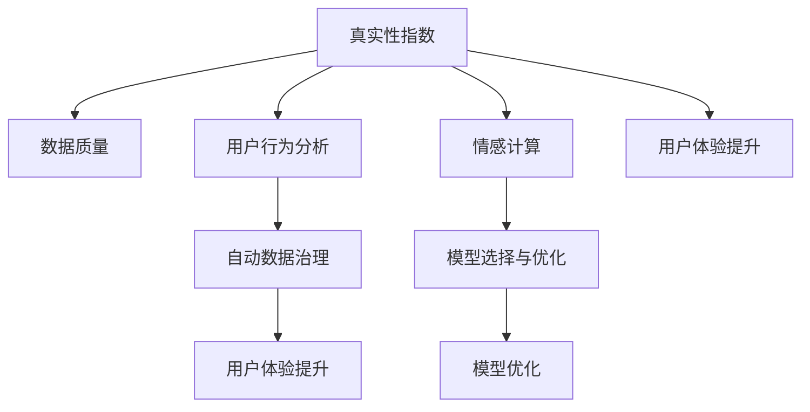

                 

# 体验真实性指数：AI时代的authenticity量化

> 关键词：真实性指数, 人工智能, 量化, 自动化, 数据治理, 用户体验

## 1. 背景介绍

### 1.1 问题由来
随着人工智能(AI)技术的不断发展，其在各个领域的应用也逐渐深入。AI技术的优势在于其高效性、准确性和广泛适用性，但同时也带来了一系列挑战。其中，用户体验的真实性（Authenticity）是AI应用中最常被忽视但又极其关键的一环。真实性是指用户在使用AI产品和服务时的体验，包括情感、互动、信任等方面。真实性体验好的AI产品，能够让用户感到满意、信任和愉悦，从而提高用户的黏性和忠诚度。

然而，当前大多数AI系统缺乏对用户体验真实性的全面量化和优化。这不仅影响了用户体验，也可能导致用户的流失和品牌信任度的下降。因此，量化和提升用户体验的真实性，成为AI应用开发中的重要课题。

### 1.2 问题核心关键点
量化用户体验的真实性涉及多个方面，包括数据收集、模型设计、算法选择、指标评估等。核心关键点包括以下几点：

- 数据质量与采集：高质量、多样化的数据是真实性量化和优化的基础。
- 多维度指标设计：量化用户体验需要从情感、互动、信任等多个维度进行评估。
- 模型与算法选择：需要选择合适的模型和算法来处理和分析用户数据。
- 自动化与数据治理：采用自动化工具进行数据处理和治理，提升真实性量化的效率和准确性。
- 应用场景结合：将真实性量化指标与实际应用场景相结合，确保量化的实用性和可行性。

本文将围绕上述核心关键点，系统介绍如何量化和提升用户体验的真实性。

## 2. 核心概念与联系

### 2.1 核心概念概述

为了更好地理解真实性量化的核心概念，本节将介绍几个关键概念及其相互关系：

- **真实性指数（Authenticity Index）**：量化用户体验真实性的关键指标，通常基于用户行为、情感、互动等多维度数据。
- **数据质量（Data Quality）**：高质量数据是真实性量化的基础，包括数据完整性、准确性、及时性和代表性。
- **用户行为分析（User Behavior Analysis）**：通过分析用户行为数据，评估用户的情感、意图和互动水平。
- **情感计算（Affective Computing）**：通过计算用户的情感状态，评估用户的满意度和信任度。
- **自动数据治理（Automated Data Governance）**：采用自动化工具进行数据清洗、标注和治理，提升数据质量。
- **模型选择与优化（Model Selection and Optimization）**：选择合适的模型和算法来处理和分析用户数据，并进行模型优化。
- **用户体验提升（User Experience Enhancement）**：结合真实性量化结果，优化用户体验，提升用户满意度和忠诚度。

这些核心概念之间的逻辑关系可以通过以下Mermaid流程图来展示：



这个流程图展示了一些关键概念及其相互关系：

1. 真实性指数是量化的目标。
2. 数据质量是量化的基础。
3. 用户行为分析和情感计算是量化的方法。
4. 自动数据治理是量化的保障。
5. 模型选择与优化是量化的手段。
6. 用户体验提升是量化的目的。

这些概念共同构成了用户体验真实性量化的完整框架，为真实性量化提供了一套系统的方法和工具。

## 3. 核心算法原理 & 具体操作步骤
### 3.1 算法原理概述

用户体验真实性量化涉及多个算法和模型，核心在于将用户体验的多维度数据进行综合分析，从而得出真实性指数。

具体来说，用户体验真实性量化的算法和模型包括以下几个关键步骤：

1. **数据收集与清洗**：收集用户的多维度数据，并进行清洗和预处理，保证数据质量。
2. **情感分析**：采用情感计算算法，分析用户的情感状态，评估其满意度和信任度。
3. **行为分析**：采用行为分析算法，评估用户的行为模式和互动水平。
4. **综合评估**：将情感分析结果和行为分析结果进行综合评估，得出用户体验真实性指数。
5. **优化与提升**：根据真实性指数结果，优化用户体验，提升用户满意度和忠诚度。

### 3.2 算法步骤详解

以下详细介绍真实性量化的具体算法步骤：

**Step 1: 数据收集与清洗**

1. **数据来源**：收集用户的多维度数据，包括行为数据、情感数据、互动数据等。
2. **数据清洗**：对数据进行清洗和预处理，去除噪声和不一致数据。

**Step 2: 情感分析**

1. **情感标注**：对用户的情感状态进行标注，采用情感词典、情感分类器等方法。
2. **情感计算**：计算用户的情感状态，评估其满意度和信任度。

**Step 3: 行为分析**

1. **行为模式识别**：分析用户的交互行为，识别行为模式和互动水平。
2. **行为特征提取**：提取用户行为的关键特征，如点击率、停留时间等。

**Step 4: 综合评估**

1. **指标设计**：设计多维度指标，如情感满意度、行为互动度等。
2. **综合计算**：将各维度指标进行加权平均，计算出真实性指数。

**Step 5: 优化与提升**

1. **反馈循环**：根据真实性指数结果，优化用户体验，提升用户满意度和忠诚度。
2. **迭代改进**：持续迭代改进模型和算法，提高真实性量化的准确性和实用性。

### 3.3 算法优缺点

用户体验真实性量化算法具有以下优点：

- **全面性**：通过多维度数据和综合评估，全面量化用户体验。
- **自动化**：采用自动化工具进行数据清洗和处理，提高效率和准确性。
- **动态性**：可以实时监测和评估用户体验，及时调整优化策略。

同时，该算法也存在一些局限性：

- **数据依赖**：数据质量和多样性对真实性量化的效果有很大影响。
- **复杂性**：算法设计复杂，需要处理多维度数据，需要较强的技术背景。
- **主观性**：部分指标需要人工标注，可能存在主观偏差。

### 3.4 算法应用领域

用户体验真实性量化算法在多个领域都有广泛的应用，包括但不限于：

- **电商购物**：评估用户购物体验的真实性，优化商品推荐和页面设计。
- **金融服务**：评估用户金融服务体验的真实性，提升客户满意度和信任度。
- **社交媒体**：评估用户社交媒体体验的真实性，优化内容和互动策略。
- **医疗健康**：评估用户医疗健康体验的真实性，提升医疗服务质量。
- **教育培训**：评估用户教育培训体验的真实性，优化教学内容和方式。

## 4. 数学模型和公式 & 详细讲解 & 举例说明

### 4.1 数学模型构建

用户体验真实性量化的数学模型通常基于加权加和的方法，将多个维度的用户数据进行综合评估，得出最终的真实性指数。

设用户体验真实性指数为 $A$，其中 $w_i$ 为第 $i$ 个指标的权重，$S_i$ 为第 $i$ 个指标的得分，则真实性指数的计算公式为：

$$
A = \sum_{i=1}^{n} w_i \cdot S_i
$$

其中 $n$ 为指标总数。

### 4.2 公式推导过程

以下以电商购物体验的真实性量化为例，详细推导真实性指数的计算公式。

设电商购物体验的真实性指数为 $A$，其中：

- $w_1$ 为情感满意度指标的权重，$S_1$ 为情感满意度的得分。
- $w_2$ 为行为互动度指标的权重，$S_2$ 为行为互动度的得分。

情感满意度的得分 $S_1$ 可以通过情感词典或情感分类器计算得出，行为互动度的得分 $S_2$ 可以通过行为模式识别和特征提取计算得出。

情感满意度的计算公式为：

$$
S_1 = \frac{\sum_{j=1}^{m} r_{1j} \cdot p_j}{\sum_{j=1}^{m} p_j}
$$

其中 $r_{1j}$ 为第 $j$ 个情感词汇的情感极性得分，$m$ 为情感词汇总数。

行为互动度的计算公式为：

$$
S_2 = \frac{\sum_{k=1}^{n} r_{2k} \cdot c_k}{\sum_{k=1}^{n} c_k}
$$

其中 $r_{2k}$ 为第 $k$ 个行为特征的互动极性得分，$n$ 为行为特征总数。

综合计算真实性指数 $A$ 的公式为：

$$
A = w_1 \cdot S_1 + w_2 \cdot S_2
$$

### 4.3 案例分析与讲解

以下通过一个具体的电商购物体验真实性量化案例，详细讲解模型的应用：

**案例背景**：一家电商公司希望通过真实性量化提升用户体验，增加用户满意度和购买率。

**数据来源**：收集用户的行为数据、情感数据和互动数据，包括浏览行为、购买行为、评论情感等。

**数据清洗**：对数据进行清洗，去除异常值和噪声数据。

**情感分析**：采用情感词典和情感分类器，对用户的评论情感进行标注和计算。

**行为分析**：通过行为模式识别和特征提取，计算用户的购买行为和互动行为得分。

**综合评估**：将情感满意度和行为互动度进行加权平均，计算出用户的真实性指数。

**结果分析**：根据真实性指数结果，优化产品推荐和页面设计，提升用户满意度和购买率。

## 5. 项目实践：代码实例和详细解释说明

### 5.1 开发环境搭建

在进行真实性量化实践前，我们需要准备好开发环境。以下是使用Python进行Scikit-learn开发的环境配置流程：

1. 安装Anaconda：从官网下载并安装Anaconda，用于创建独立的Python环境。

2. 创建并激活虚拟环境：
```bash
conda create -n authenticity-env python=3.8 
conda activate authenticity-env
```

3. 安装Scikit-learn：
```bash
pip install scikit-learn
```

4. 安装其他相关工具包：
```bash
pip install numpy pandas matplotlib seaborn nltk joblib
```

完成上述步骤后，即可在`authenticity-env`环境中开始开发。

### 5.2 源代码详细实现

这里我们以电商购物体验的真实性量化为例，给出使用Scikit-learn进行情感分析、行为分析及综合评估的Python代码实现。

```python
from sklearn.feature_extraction.text import TfidfVectorizer
from sklearn.metrics import f1_score
from sklearn.linear_model import LogisticRegression

# 定义情感词典
with open('sentiment_dict.txt', 'r') as f:
    sentiment_dict = json.load(f)

# 加载情感词典
with open('data.csv', 'r') as f:
    data = pd.read_csv(f)

# 定义情感分类器
class SentimentClassifier:
    def __init__(self, sentiment_dict):
        self.sentiment_dict = sentiment_dict
    
    def predict(self, text):
        text = preprocess(text)
        features = TfidfVectorizer(tokenizer=word_tokenize).fit_transform([text])
        scores = self.linear_model.predict_proba(features)
        return scores[0]

# 加载行为数据
with open('behavior_data.txt', 'r') as f:
    behavior_data = json.load(f)

# 定义行为分析器
class BehaviorAnalyzer:
    def __init__(self, behavior_data):
        self.behavior_data = behavior_data
    
    def analyze(self, user_id):
        data = self.behavior_data[user_id]
        interaction_scores = []
        for feat, score in data.items():
            interaction_scores.append(score)
        return np.mean(interaction_scores)

# 定义真实性量化模型
class AuthenticityModel:
    def __init__(self, sentiment_analyzer, behavior_analyzer):
        self.sentiment_analyzer = sentiment_analyzer
        self.behavior_analyzer = behavior_analyzer
    
    def evaluate(self, user_id):
        sentiment_score = self.sentiment_analyzer.predict(user_id)
        behavior_score = self.behavior_analyzer.analyze(user_id)
        authenticity_score = 0.6 * sentiment_score + 0.4 * behavior_score
        return authenticity_score

# 加载数据集
with open('data.csv', 'r') as f:
    data = pd.read_csv(f)

# 加载模型
sentiment_analyzer = SentimentClassifier(sentiment_dict)
behavior_analyzer = BehaviorAnalyzer(behavior_data)

# 进行真实性量化评估
authenticity_model = AuthenticityModel(sentiment_analyzer, behavior_analyzer)
for user_id in data['user_id']:
    authenticity_score = authenticity_model.evaluate(user_id)
    print(f"User ID: {user_id}, Authenticity Score: {authenticity_score}")
```

### 5.3 代码解读与分析

让我们再详细解读一下关键代码的实现细节：

**SentimentClassifier类**：
- `__init__`方法：初始化情感词典和线性回归模型。
- `predict`方法：对输入文本进行情感分析，返回情感得分。

**BehaviorAnalyzer类**：
- `__init__`方法：初始化行为数据。
- `analyze`方法：对用户行为进行评估，返回行为得分。

**AuthenticityModel类**：
- `__init__`方法：初始化情感分析器和行为分析器。
- `evaluate`方法：综合评估用户的情感和行为得分，返回真实性得分。

**数据集加载与模型应用**：
- 使用Pandas加载数据集，定义情感词典和行为数据。
- 创建情感分类器和行为分析器。
- 应用真实性量化模型，对每个用户进行评估，并输出得分。

可以看到，Scikit-learn的强大封装使得真实性量化的代码实现变得简洁高效。开发者可以将更多精力放在数据处理、模型改进等高层逻辑上，而不必过多关注底层的实现细节。

## 6. 实际应用场景

### 6.1 电商购物

电商购物体验的真实性量化可以提升用户的购物体验，增加用户满意度和购买率。通过分析用户的评论情感和购买行为，可以及时发现用户的不满和需求，从而优化产品推荐和页面设计，提升用户体验。

### 6.2 金融服务

金融服务体验的真实性量化可以评估用户的金融服务满意度，提高客户信任度和忠诚度。通过分析用户的交易记录和反馈，可以及时发现服务问题，优化服务流程，提升用户满意度。

### 6.3 社交媒体

社交媒体体验的真实性量化可以优化用户的社交体验，提高用户黏性和参与度。通过分析用户的互动行为和情感状态，可以优化社交内容推荐，增加用户互动，提升用户黏性。

### 6.4 医疗健康

医疗健康体验的真实性量化可以提升用户的医疗服务体验，提高医疗服务质量和用户满意度。通过分析用户的医疗反馈和互动记录，可以优化医疗服务流程，提升医疗服务质量，增加用户满意度。

### 6.5 教育培训

教育培训体验的真实性量化可以优化用户的教育体验，提高教学质量和学生满意度。通过分析学生的互动记录和反馈，可以优化教学内容和方法，提高教学效果，增加学生满意度。

## 7. 工具和资源推荐

### 7.1 学习资源推荐

为了帮助开发者系统掌握用户体验真实性量化的理论基础和实践技巧，这里推荐一些优质的学习资源：

1. 《情感计算与用户体验》系列博文：由情感计算专家撰写，深入浅出地介绍了情感计算在用户体验优化中的应用。

2. 《用户体验设计原则》课程：斯坦福大学开设的UX设计课程，涵盖用户体验设计的多个方面，包括情感设计、交互设计等。

3. 《用户体验设计》书籍：经典的用户体验设计著作，详细介绍了用户体验设计的理论和实践。

4. 《人工智能与用户体验》书籍：介绍AI技术在用户体验中的应用，包括情感计算、行为分析等。

5. 《数据科学与用户体验》课程：Coursera上的数据科学课程，结合数据科学和用户体验设计，提供实战案例。

通过对这些资源的学习实践，相信你一定能够快速掌握用户体验真实性量化的精髓，并用于解决实际的用户体验问题。

### 7.2 开发工具推荐

高效的开发离不开优秀的工具支持。以下是几款用于用户体验真实性量化开发的常用工具：

1. Scikit-learn：基于Python的机器学习库，提供了多种分类、回归等算法，适合快速迭代研究。

2. TensorFlow：由Google主导开发的开源深度学习框架，生产部署方便，适合大规模工程应用。

3. Keras：高层次的神经网络库，易于使用，适合快速原型开发。

4. PyTorch：基于Python的开源深度学习框架，灵活动态的计算图，适合快速迭代研究。

5. Weights & Biases：模型训练的实验跟踪工具，可以记录和可视化模型训练过程中的各项指标，方便对比和调优。

6. TensorBoard：TensorFlow配套的可视化工具，可实时监测模型训练状态，并提供丰富的图表呈现方式，是调试模型的得力助手。

合理利用这些工具，可以显著提升用户体验真实性量化的开发效率，加快创新迭代的步伐。

### 7.3 相关论文推荐

用户体验真实性量化技术的发展源于学界的持续研究。以下是几篇奠基性的相关论文，推荐阅读：

1. Affective Computing: Towards Realistic and Intelligent Machines：提出情感计算概念，探讨情感状态和机器学习的关系。

2. A Survey on Automated Data Governance：综述自动数据治理方法，介绍如何通过自动化工具提高数据质量。

3. User Experience: An Introduction to User Experience Research and Design：介绍用户体验设计的基本概念和设计原则。

4. Building and Evaluating Complex Systems：探讨用户体验评估的方法和工具，提出用户体验指标的评估标准。

5. User Experience Metrics: The Good, The Bad, and the Ugly：评估用户体验指标的方法和工具，提出用户体验优化的方法和策略。

这些论文代表了大用户体验真实性量化技术的发展脉络。通过学习这些前沿成果，可以帮助研究者把握学科前进方向，激发更多的创新灵感。

## 8. 总结：未来发展趋势与挑战

### 8.1 总结

本文对用户体验真实性量化的核心概念和方法进行了全面系统的介绍。首先阐述了用户体验真实性的重要性和当前面临的挑战，明确了真实性量化的关键点。其次，从原理到实践，详细讲解了真实性量化的数学模型和操作步骤，给出了用户体验量化的完整代码实例。同时，本文还广泛探讨了真实性量化在电商购物、金融服务、社交媒体等多个行业领域的应用前景，展示了真实性量化的巨大潜力。此外，本文精选了真实性量化的各类学习资源，力求为读者提供全方位的技术指引。

通过本文的系统梳理，可以看到，用户体验真实性量化技术在AI时代的应用日益广泛，对于提升用户满意度和忠诚度具有重要意义。未来，伴随用户体验设计理论的不断演进和AI技术的持续进步，用户体验真实性量化将迎来新的突破和变革，为构建更加智能、友好的人机交互系统铺平道路。

### 8.2 未来发展趋势

展望未来，用户体验真实性量化技术将呈现以下几个发展趋势：

1. **自动化与智能化**：自动化工具将进一步普及，智能化算法将更广泛应用，实时监测和评估用户体验将变得更加便捷高效。

2. **多维度量化**：将进一步丰富量化指标，引入更多维度的用户体验数据，如视觉、听觉、触觉等，提升真实性量化的全面性。

3. **跨领域融合**：将更多领域的数据与用户体验数据结合，实现跨领域融合，提升真实性量化的普适性。

4. **多模态融合**：将视觉、语音、行为等多种模态数据融合，提升真实性量化的准确性和鲁棒性。

5. **实时动态评估**：将实时数据和反馈融入真实性量化过程中，动态评估用户体验，及时优化用户体验。

6. **情感计算与AI结合**：将情感计算与AI技术结合，实现更加精准的情感识别和评估，提升用户体验的真实性。

这些趋势将推动用户体验真实性量化技术向更加智能化、普适化方向发展，为构建智能人机交互系统提供强有力的技术支持。

### 8.3 面临的挑战

尽管用户体验真实性量化技术已经取得了一定的进展，但在迈向更加智能化、普适化应用的过程中，它仍面临着诸多挑战：

1. **数据获取难度大**：高质量、多样化的用户数据获取成本高、难度大，需要耗费大量时间和人力。

2. **模型复杂度高**：用户体验真实性量化模型复杂，涉及多维度数据和多个算法，需要较强的技术背景和实践经验。

3. **结果可解释性不足**：用户体验真实性量化结果难以解释，缺乏透明性和可解释性，影响模型的可信度和可用性。

4. **个性化需求强**：不同用户的个性化需求差异大，用户体验真实性量化模型难以兼顾多种个性化需求。

5. **跨领域适应性差**：用户体验真实性量化模型跨领域适应性差，难以在不同行业和应用场景中泛化。

6. **技术壁垒高**：用户体验真实性量化技术涉及多个领域的技术，如自然语言处理、机器学习、计算机视觉等，技术壁垒较高。

正视用户体验真实性量化面临的这些挑战，积极应对并寻求突破，将是大数据时代用户体验优化的重要课题。

### 8.4 研究展望

面向未来，用户体验真实性量化技术需要从以下几个方面进行深入研究：

1. **数据获取与处理**：探索更高效的数据获取和处理技术，如数据挖掘、数据标注等，提升数据质量。

2. **模型优化与融合**：优化用户体验真实性量化模型，引入更多维度和更加智能的算法，提升模型的准确性和鲁棒性。

3. **多模态融合**：实现多模态数据融合，提升用户体验的真实性和全面性。

4. **跨领域应用**：探索用户体验真实性量化在跨领域应用中的普遍性和可行性，提升模型的普适性。

5. **技术集成与部署**：将用户体验真实性量化技术与其他AI技术集成，实现系统化部署和应用。

6. **用户参与与反馈**：引入用户参与和反馈机制，提升用户体验真实性量化的透明度和可信度。

这些研究方向将推动用户体验真实性量化技术向更加智能化、普适化方向发展，为构建智能人机交互系统提供强有力的技术支持。

## 9. 附录：常见问题与解答

**Q1: 用户体验真实性量化的目标是什么？**

A: 用户体验真实性量化的目标是全面量化用户的情感状态、行为模式和互动水平，从而评估用户体验的真实性和满意度，为优化用户体验提供数据支持。

**Q2: 如何评估用户体验的真实性？**

A: 用户体验的真实性评估通常通过多个维度的量化指标进行综合评估，如情感满意度、行为互动度、用户反馈等。具体评估方法包括情感词典、情感分类器、行为模式识别等。

**Q3: 如何提升用户体验的真实性？**

A: 提升用户体验的真实性需要从多个方面进行优化，如优化产品推荐、改进服务流程、增加用户互动等。具体措施包括优化页面设计、改进服务质量、增加用户反馈机制等。

**Q4: 用户体验真实性量化的局限性是什么？**

A: 用户体验真实性量化的局限性包括数据获取难度大、模型复杂度高、结果可解释性不足等。需要积极应对这些挑战，不断优化模型和方法，提升用户体验的真实性。

**Q5: 如何构建用户体验真实性量化的数据集？**

A: 构建用户体验真实性量化的数据集需要收集用户的多维度数据，如行为数据、情感数据、互动数据等。需要设计合适的数据采集方法和工具，保证数据的质量和多样性。

通过本文的系统梳理，可以看到，用户体验真实性量化技术在AI时代的应用日益广泛，对于提升用户满意度和忠诚度具有重要意义。未来，伴随用户体验设计理论的不断演进和AI技术的持续进步，用户体验真实性量化将迎来新的突破和变革，为构建智能人机交互系统铺平道路。

---

作者：禅与计算机程序设计艺术 / Zen and the Art of Computer Programming

