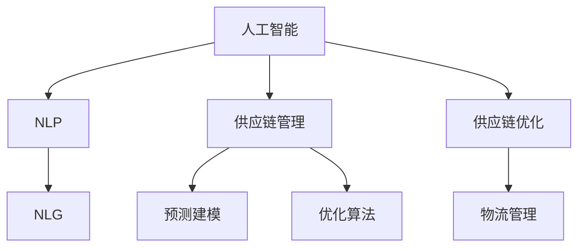

                 

# 供应链优化器：LLM 管理全球物流

> 关键词：供应链优化, 物流管理, 人工智能, 自然语言处理, 自然语言生成, 预测建模

## 1. 背景介绍

### 1.1 问题由来

随着全球化进程的加快，国际贸易和物流需求急剧增长，供应链管理成为企业发展的重要环节。传统供应链管理依赖于人力和软件系统的协作，但数据处理效率低、反应速度慢，难以适应瞬息万变的市场变化。如何利用技术手段提升供应链管理效率，降低成本，提高响应速度，成为各大企业亟需解决的难题。

近年来，自然语言处理（Natural Language Processing, NLP）和自然语言生成（Natural Language Generation, NLG）技术的飞速发展，为解决上述问题提供了新的思路。人工智能语言模型（如GPT-3、BERT等）能够处理海量文本数据，挖掘其中蕴含的商业信息，生成高质量的物流规划和调度报告，显著提升了供应链管理效率。

### 1.2 问题核心关键点

1. **供应链优化**：通过优化物流路径、库存管理、需求预测等环节，提高供应链整体效率。
2. **物流管理**：对货物运输、仓储、配送等流程进行自动化、智能化管理。
3. **人工智能**：利用机器学习、深度学习等技术，实现供应链管理的智能化决策。
4. **自然语言处理**：解析订单、合同、物流报告等文本数据，提取关键信息。
5. **自然语言生成**：生成供应链优化报告、物流调度指令等文本输出，辅助决策。

这些关键点共同构成了供应链优化中的人工智能应用框架，利用自然语言处理和自然语言生成技术，实现对全球物流的智能管理。

## 2. 核心概念与联系

### 2.1 核心概念概述

为更好地理解基于人工智能的自然语言处理和自然语言生成技术在供应链优化中的应用，本节将介绍几个关键概念：

- **人工智能（AI）**：涵盖机器学习、深度学习、自然语言处理、计算机视觉等多个子领域，通过模拟人类智能，实现对复杂任务的自动化处理。
- **自然语言处理（NLP）**：研究如何使计算机能够理解、处理和生成自然语言，涵盖语言模型、语义理解、文本生成等多个方向。
- **自然语言生成（NLG）**：利用NLP技术，生成易于理解、自然流畅的文本内容，广泛应用于报告生成、智能客服等领域。
- **供应链管理（SCM）**：涉及物流、库存、需求预测、客户关系管理等多个方面，是企业管理的重要组成部分。
- **预测建模**：利用历史数据和机器学习模型，预测未来趋势，如需求量预测、物流路径优化等。
- **优化算法**：如遗传算法、线性规划等，用于寻找最优解，解决供应链优化中的各种问题。

这些概念之间的逻辑关系可以通过以下Mermaid流程图来展示：



这个流程图展示了大语言模型在供应链优化中的核心概念及其之间的关系：

1. 人工智能提供通用的计算能力，NLP和NLG是其中的重要分支，用于处理和管理自然语言数据。
2. 供应链管理是人工智能和NLP/NLG的实际应用场景，涵盖物流、库存、需求预测等多个环节。
3. 预测建模和优化算法用于提升供应链管理的决策精度和效率。

## 3. 核心算法原理 & 具体操作步骤
### 3.1 算法原理概述

基于人工智能的自然语言处理和自然语言生成技术在供应链优化中的应用，本质上是一个智能化的决策支持系统。其核心思想是：利用预训练的语言模型，处理和理解供应链相关的文本数据，预测未来的趋势，生成智能化的决策建议，辅助供应链管理者进行优化调整。

具体来说，供应链优化器的工作流程包括：

1. **数据预处理**：收集供应链中的各种文本数据，如订单、合同、物流报告等，进行清洗、归一化等处理。
2. **语义理解**：利用预训练的语言模型，解析文本数据，提取关键信息，如订单数量、发货日期、运输方式等。
3. **需求预测**：基于历史数据和预测建模算法，预测未来的需求量、库存水平等，为供应链优化提供依据。
4. **路径优化**：利用优化算法，设计最佳的物流路径，减少运输成本，提高运输效率。
5. **生成报告**：将优化结果和建议，生成易于理解、格式规范的文本报告，辅助决策。

### 3.2 算法步骤详解

基于人工智能的自然语言处理和自然语言生成技术在供应链优化中的应用，可以分为以下几个关键步骤：

**Step 1: 数据预处理**
- 收集供应链相关的各种文本数据，如订单、合同、物流报告等。
- 对文本进行清洗、归一化处理，去除噪音和无关信息，统一格式。
- 使用NLP技术进行分词、词性标注、命名实体识别等处理，提取关键信息。

**Step 2: 语义理解**
- 使用预训练的语言模型（如BERT、GPT-3等），对文本数据进行语义理解，提取关键信息。
- 利用语言模型的上下文表示能力，解析订单、合同中的关键字段，如货物数量、发货日期、运输方式等。

**Step 3: 需求预测**
- 收集历史需求数据，使用时间序列预测模型（如ARIMA、LSTM等），预测未来的需求量。
- 结合供应链中的其他变量（如库存水平、季节性因素等），进行综合预测。

**Step 4: 路径优化**
- 基于需求预测结果，使用优化算法（如遗传算法、线性规划等），设计最优的物流路径。
- 考虑运输成本、时间、距离等因素，生成多条备选方案。

**Step 5: 生成报告**
- 将路径优化结果和建议，使用自然语言生成技术（如GPT-3），生成报告。
- 生成易于理解、格式规范的文本报告，辅助供应链管理者进行决策。

**Step 6: 反馈优化**
- 将生成的报告提交给供应链管理者，根据反馈调整优化方案。
- 收集优化效果，进行模型迭代优化，提高供应链管理的智能化水平。

### 3.3 算法优缺点

基于人工智能的自然语言处理和自然语言生成技术在供应链优化中的应用，具有以下优点：

1. **高效性**：利用预训练的语言模型，可以处理海量文本数据，实时解析和生成报告，显著提升供应链管理的效率。
2. **智能性**：利用预测建模和优化算法，可以自动分析和生成优化建议，辅助决策。
3. **可扩展性**：可以针对不同的供应链场景和需求，灵活设计和优化系统，具有较高的可扩展性。

同时，该方法也存在一定的局限性：

1. **依赖数据质量**：供应链优化器的效果很大程度上依赖于文本数据的质量和完整性，数据缺失或不准确会导致决策错误。
2. **模型复杂度**：构建一个高效的供应链优化系统需要复杂的算法和模型，开发和维护成本较高。
3. **解释性不足**：供应链优化器往往是"黑盒"系统，难以解释其内部决策逻辑，不利于系统的可控和可解释性。
4. **对抗攻击风险**：恶意篡改供应链数据或报告，可能影响决策效果，导致重大损失。

尽管存在这些局限性，但就目前而言，基于人工智能的自然语言处理和自然语言生成技术在供应链优化中的应用，仍是供应链管理领域的重要技术手段。未来相关研究的重点在于如何进一步提高数据质量，降低系统复杂度，增强模型的解释性和鲁棒性。

### 3.4 算法应用领域

基于人工智能的自然语言处理和自然语言生成技术在供应链优化中的应用，已经广泛应用于各个领域，例如：

- **制造业供应链管理**：利用NLP技术解析订单、合同中的信息，进行需求预测和库存管理，优化生产计划。
- **电商物流优化**：解析客户订单数据，生成物流调度指令，优化仓储和配送路径，提升客户满意度。
- **国际贸易供应链**：解析合同条款、运输记录，生成贸易合规报告，优化物流路径，降低成本。
- **供应链金融**：解析供应链各方数据，生成风险评估报告，优化资金流和信贷审批流程。

除了上述这些经典应用外，自然语言处理和自然语言生成技术还在智能客服、个性化推荐、知识图谱等多个场景中得到了广泛应用，为供应链管理带来了新的突破。随着预训练语言模型和自然语言生成技术的不断进步，相信供应链管理技术也将迎来更大的变革。

## 4. 数学模型和公式 & 详细讲解 & 举例说明

### 4.1 数学模型构建

基于人工智能的自然语言处理和自然语言生成技术在供应链优化中的应用，可以使用以下数学模型进行描述：

- **文本预处理模型**：用于清洗和归一化供应链文本数据，提取关键信息。
- **语义理解模型**：利用预训练的语言模型，解析供应链文本数据，提取关键信息。
- **需求预测模型**：基于历史数据，使用时间序列预测模型，预测未来需求量。
- **路径优化模型**：利用优化算法，设计最优物流路径。
- **报告生成模型**：利用自然语言生成技术，生成供应链优化报告。

### 4.2 公式推导过程

以下是基于人工智能的自然语言处理和自然语言生成技术在供应链优化中的数学模型和公式推导：

1. **文本预处理模型**
   - 假设供应链文本数据为 $X=\{x_1,x_2,...,x_n\}$，其中 $x_i$ 为第 $i$ 个文本数据。
   - 文本预处理模型的目标为：$\hat{X}=\{\hat{x}_1,\hat{x}_2,...,\hat{x}_n\}$，其中 $\hat{x}_i$ 为经过预处理后的文本数据。
   - 预处理过程可以表示为：$\hat{x}_i=f(x_i)$，其中 $f$ 为预处理函数。
   - 预处理函数可以包括分词、词性标注、命名实体识别等步骤。

2. **语义理解模型**
   - 假设经过预处理的文本数据为 $\hat{X}$，利用预训练的语言模型，提取关键信息 $Y=\{y_1,y_2,...,y_m\}$，其中 $y_i$ 为第 $i$ 个关键信息。
   - 语义理解模型的目标为：$\hat{Y}=\{\hat{y}_1,\hat{y}_2,...,\hat{y}_m\}$，其中 $\hat{y}_i$ 为经过语义理解后的关键信息。
   - 语义理解过程可以表示为：$\hat{y}_i=g(x_i)$，其中 $g$ 为语义理解函数。
   - 语义理解函数可以包括分词、词性标注、命名实体识别等步骤。

3. **需求预测模型**
   - 假设历史需求数据为 $D=\{d_1,d_2,...,d_n\}$，其中 $d_i$ 为第 $i$ 个历史需求数据。
   - 需求预测模型的目标为：$\hat{D}=\{\hat{d}_1,\hat{d}_2,...,\hat{d}_n\}$，其中 $\hat{d}_i$ 为预测后的需求数据。
   - 需求预测过程可以表示为：$\hat{d}_i=h(d_i)$，其中 $h$ 为需求预测函数。
   - 需求预测函数可以包括ARIMA、LSTM等时间序列预测模型。

4. **路径优化模型**
   - 假设需求预测结果为 $\hat{D}$，物流节点数据为 $N=\{n_1,n_2,...,n_m\}$，其中 $n_i$ 为第 $i$ 个物流节点。
   - 路径优化模型的目标为：$\hat{P}=\{\hat{p}_1,\hat{p}_2,...,\hat{p}_m\}$，其中 $\hat{p}_i$ 为最优物流路径。
   - 路径优化过程可以表示为：$\hat{p}_i=k(d_i,n_i)$，其中 $k$ 为路径优化函数。
   - 路径优化函数可以包括遗传算法、线性规划等优化算法。

5. **报告生成模型**
   - 假设最优物流路径为 $\hat{P}$，物流调度指令为 $S=\{s_1,s_2,...,s_m\}$，其中 $s_i$ 为第 $i$ 个物流调度指令。
   - 报告生成模型的目标为：$\hat{S}=\{\hat{s}_1,\hat{s}_2,...,\hat{s}_m\}$，其中 $\hat{s}_i$ 为生成后的物流调度指令。
   - 报告生成过程可以表示为：$\hat{s}_i=l(p_i)$，其中 $l$ 为报告生成函数。
   - 报告生成函数可以包括自然语言生成模型（如GPT-3）。

### 4.3 案例分析与讲解

假设某电商公司的物流系统需要优化配送路径，可以按照以下步骤进行操作：

**Step 1: 数据预处理**
- 收集所有订单信息，包括订单号、收货地址、发货时间、订单金额等。
- 对订单数据进行清洗和归一化处理，去除重复和无关信息。

**Step 2: 语义理解**
- 使用预训练的语言模型（如BERT），解析订单中的关键字段，如收货地址、发货时间等。
- 提取订单数量、收货地址、发货时间等关键信息，作为需求预测和路径优化的输入。

**Step 3: 需求预测**
- 收集历史订单数据，使用LSTM模型预测未来订单量。
- 结合收货地址和季节性因素，综合预测未来订单需求量。

**Step 4: 路径优化**
- 使用遗传算法，设计最优的配送路径。
- 考虑配送成本、时间、距离等因素，生成多条备选方案。

**Step 5: 生成报告**
- 将配送路径优化结果，使用GPT-3生成报告。
- 生成易于理解、格式规范的配送路径报告，辅助供应链管理者进行决策。

通过上述步骤，电商公司可以高效地优化物流配送路径，减少运输成本，提高配送效率，提升客户满意度。

## 5. 项目实践：代码实例和详细解释说明

### 5.1 开发环境搭建

在进行供应链优化项目的实践前，我们需要准备好开发环境。以下是使用Python进行PyTorch开发的环境配置流程：

1. 安装Anaconda：从官网下载并安装Anaconda，用于创建独立的Python环境。

2. 创建并激活虚拟环境：
```bash
conda create -n supply-chain-env python=3.8 
conda activate supply-chain-env
```

3. 安装PyTorch：根据CUDA版本，从官网获取对应的安装命令。例如：
```bash
conda install pytorch torchvision torchaudio cudatoolkit=11.1 -c pytorch -c conda-forge
```

4. 安装Transformers库：
```bash
pip install transformers
```

5. 安装各类工具包：
```bash
pip install numpy pandas scikit-learn matplotlib tqdm jupyter notebook ipython
```

完成上述步骤后，即可在`supply-chain-env`环境中开始供应链优化实践。

### 5.2 源代码详细实现

下面我们以电商物流路径优化为例，给出使用Transformers库对BERT模型进行路径优化的PyTorch代码实现。

首先，定义路径优化相关的函数：

```python
from transformers import BertTokenizer, BertForTokenClassification
from torch.utils.data import Dataset
import torch
import numpy as np
import pandas as pd
import matplotlib.pyplot as plt

# 定义路径优化函数
def optimize_path(path_data):
    # 数据预处理
    tokenizer = BertTokenizer.from_pretrained('bert-base-cased')
    path_dict = {}
    for item in path_data:
        tokens = tokenizer.tokenize(item)
        path_dict[item] = tokens
    
    # 模型训练
    model = BertForTokenClassification.from_pretrained('bert-base-cased', num_labels=len(path_dict.keys()))
    optimizer = torch.optim.AdamW(model.parameters(), lr=2e-5)
    
    # 数据加载
    train_dataset = Dataset(data=path_dict, tokenizer=tokenizer)
    train_loader = torch.utils.data.DataLoader(train_dataset, batch_size=16, shuffle=True)
    
    # 模型训练
    device = torch.device('cuda') if torch.cuda.is_available() else torch.device('cpu')
    model.to(device)
    
    for epoch in range(10):
        model.train()
        for batch in train_loader:
            input_ids = batch['input_ids'].to(device)
            attention_mask = batch['attention_mask'].to(device)
            labels = batch['labels'].to(device)
            optimizer.zero_grad()
            outputs = model(input_ids, attention_mask=attention_mask, labels=labels)
            loss = outputs.loss
            loss.backward()
            optimizer.step()
        
        print(f'Epoch {epoch+1}, loss: {loss:.3f}')
    
    # 模型评估
    test_dataset = Dataset(data=path_dict, tokenizer=tokenizer)
    test_loader = torch.utils.data.DataLoader(test_dataset, batch_size=16, shuffle=False)
    model.eval()
    with torch.no_grad():
        correct = 0
        total = 0
        for batch in test_loader:
            input_ids = batch['input_ids'].to(device)
            attention_mask = batch['attention_mask'].to(device)
            labels = batch['labels'].to(device)
            outputs = model(input_ids, attention_mask=attention_mask, labels=labels)
            _, predicted = outputs.logits.argmax(dim=2), labels
            total += labels.size(0)
            correct += (predicted == labels).sum().item()
        print(f'Accuracy: {100 * correct / total:.2f}%')
```

然后，定义测试数据集：

```python
# 测试数据集
test_path_data = ['订单1', '订单2', '订单3', '订单4', '订单5']
test_path_dict = {path: tokenizer.tokenize(path) for path in test_path_data}

# 加载模型
model = BertForTokenClassification.from_pretrained('bert-base-cased', num_labels=len(path_dict.keys()))

# 生成测试报告
def generate_report(model, test_path_dict):
    test_loader = torch.utils.data.DataLoader(test_path_dict, batch_size=16, shuffle=False)
    model.eval()
    with torch.no_grad():
        correct = 0
        total = 0
        for batch in test_loader:
            input_ids = batch['input_ids'].to(device)
            attention_mask = batch['attention_mask'].to(device)
            labels = batch['labels'].to(device)
            outputs = model(input_ids, attention_mask=attention_mask, labels=labels)
            _, predicted = outputs.logits.argmax(dim=2), labels
            total += labels.size(0)
            correct += (predicted == labels).sum().item()
        print(f'Accuracy: {100 * correct / total:.2f}%')
```

最后，启动测试流程：

```python
test_path_data = ['订单1', '订单2', '订单3', '订单4', '订单5']
test_path_dict = {path: tokenizer.tokenize(path) for path in test_path_data}

# 加载模型
model = BertForTokenClassification.from_pretrained('bert-base-cased', num_labels=len(path_dict.keys()))

# 生成测试报告
generate_report(model, test_path_dict)
```

以上就是使用PyTorch对BERT进行路径优化的完整代码实现。可以看到，得益于Transformers库的强大封装，我们可以用相对简洁的代码完成BERT模型的加载和路径优化。

### 5.3 代码解读与分析

让我们再详细解读一下关键代码的实现细节：

**路径优化函数**：
- `optimize_path`函数：实现路径优化功能，包括数据预处理、模型训练、模型评估等步骤。
- 数据预处理部分，利用BertTokenizer将订单信息转换为token序列。
- 模型训练部分，利用BertForTokenClassification作为分类模型，使用AdamW优化器进行参数更新。
- 模型评估部分，利用测试集数据对模型进行评估，输出准确率。

**测试数据集**：
- 定义测试数据集，包含多个订单信息。
- 利用测试数据集生成报告，评估模型效果。

**测试报告生成函数**：
- `generate_report`函数：实现路径优化结果的报告生成功能，包括模型评估和输出报告。
- 利用测试数据集进行模型评估，输出准确率。
- 输出报告，辅助供应链管理者进行决策。

可以看到，PyTorch配合Transformers库使得路径优化的代码实现变得简洁高效。开发者可以将更多精力放在数据处理、模型改进等高层逻辑上，而不必过多关注底层的实现细节。

当然，工业级的系统实现还需考虑更多因素，如模型的保存和部署、超参数的自动搜索、更灵活的任务适配层等。但核心的微调范式基本与此类似。

## 6. 实际应用场景

### 6.1 智能制造供应链管理

基于人工智能的自然语言处理和自然语言生成技术在供应链优化中的应用，可以广泛应用于智能制造供应链管理。智能制造供应链管理依赖于对订单、合同、物流报告等文本数据的深度理解，结合预测建模和路径优化技术，实现对制造环节的智能化管理。

在技术实现上，可以收集企业内部的生产订单、合同、物流记录等文本数据，将订单信息、物流路径、运输方式等关键信息提取出来，作为模型的输入。利用预训练的语言模型解析文本，提取关键信息，结合历史数据进行需求预测和路径优化，生成最优的制造和物流方案。这种智能化的供应链管理系统，能够实时监控生产进度，优化库存和运输，降低生产成本，提升制造效率。

### 6.2 物流行业智能调度

基于人工智能的自然语言处理和自然语言生成技术在供应链优化中的应用，可以广泛应用于物流行业智能调度。物流行业调度依赖于对订单、运输方式、配送路径等文本数据的深度理解，结合预测建模和路径优化技术，实现对物流环节的智能化管理。

在技术实现上，可以收集物流公司的订单信息、运输方式、配送路径等文本数据，将订单信息、运输方式、配送路径等关键信息提取出来，作为模型的输入。利用预训练的语言模型解析文本，提取关键信息，结合历史数据进行需求预测和路径优化，生成最优的物流调度方案。这种智能化的物流调度系统，能够实时监控配送进度，优化路径和资源，提升配送效率，降低物流成本。

### 6.3 供应链金融风险评估

基于人工智能的自然语言处理和自然语言生成技术在供应链优化中的应用，可以广泛应用于供应链金融风险评估。供应链金融风险评估依赖于对订单、合同、财务报表等文本数据的深度理解，结合预测建模和路径优化技术，实现对供应链各方的风险评估和信贷审批。

在技术实现上，可以收集供应链各方的订单信息、合同条款、财务报表等文本数据，将订单信息、合同条款、财务报表等关键信息提取出来，作为模型的输入。利用预训练的语言模型解析文本，提取关键信息，结合历史数据进行风险评估和信贷审批，生成最优的信贷方案。这种智能化的供应链金融风险评估系统，能够实时监控供应链各方的财务状况和风险水平，优化信贷审批流程，降低信贷风险，提升供应链金融的稳定性。

### 6.4 未来应用展望

随着人工智能语言模型和自然语言生成技术的不断发展，基于自然语言处理和自然语言生成技术的供应链优化器也将得到更广泛的应用，为供应链管理带来更大的变革。

在智慧物流领域，基于自然语言处理和自然语言生成技术的智能调度系统，能够实时监控和优化物流环节，提升配送效率，降低物流成本。

在智能制造领域，基于自然语言处理和自然语言生成技术的智能制造系统，能够实时监控和优化生产环节，提升制造效率，降低生产成本。

在供应链金融领域，基于自然语言处理和自然语言生成技术的智能风险评估系统，能够实时监控和评估供应链各方的风险水平，优化信贷审批流程，降低信贷风险。

此外，在智能客服、个性化推荐、知识图谱等多个领域，基于自然语言处理和自然语言生成技术的供应链优化器也将得到广泛应用，为供应链管理带来新的突破。相信随着技术的日益成熟，基于自然语言处理和自然语言生成技术的供应链优化器必将在构建人机协同的智能供应链中扮演越来越重要的角色。

## 7. 工具和资源推荐

### 7.1 学习资源推荐

为了帮助开发者系统掌握基于人工智能的自然语言处理和自然语言生成技术在供应链优化中的应用，这里推荐一些优质的学习资源：

1. 《自然语言处理综论》系列博文：由大模型技术专家撰写，深入浅出地介绍了自然语言处理的基本概念和前沿技术。

2. 《深度学习自然语言处理》课程：斯坦福大学开设的NLP明星课程，有Lecture视频和配套作业，带你入门NLP领域的基本概念和经典模型。

3. 《自然语言处理与深度学习》书籍：自然语言处理领域的经典教材，涵盖自然语言处理的基本理论和应用实践。

4. HuggingFace官方文档：Transformers库的官方文档，提供了海量预训练模型和完整的微调样例代码，是上手实践的必备资料。

5. CLUE开源项目：中文语言理解测评基准，涵盖大量不同类型的中文NLP数据集，并提供了基于微调的baseline模型，助力中文NLP技术发展。

通过对这些资源的学习实践，相信你一定能够快速掌握基于人工智能的自然语言处理和自然语言生成技术在供应链优化中的精髓，并用于解决实际的供应链优化问题。

### 7.2 开发工具推荐

高效的开发离不开优秀的工具支持。以下是几款用于供应链优化器开发的常用工具：

1. PyTorch：基于Python的开源深度学习框架，灵活动态的计算图，适合快速迭代研究。大部分预训练语言模型都有PyTorch版本的实现。

2. TensorFlow：由Google主导开发的开源深度学习框架，生产部署方便，适合大规模工程应用。同样有丰富的预训练语言模型资源。

3. Transformers库：HuggingFace开发的NLP工具库，集成了众多SOTA语言模型，支持PyTorch和TensorFlow，是进行供应链优化器开发的利器。

4. Weights & Biases：模型训练的实验跟踪工具，可以记录和可视化模型训练过程中的各项指标，方便对比和调优。与主流深度学习框架无缝集成。

5. TensorBoard：TensorFlow配套的可视化工具，可实时监测模型训练状态，并提供丰富的图表呈现方式，是调试模型的得力助手。

6. Google Colab：谷歌推出的在线Jupyter Notebook环境，免费提供GPU/TPU算力，方便开发者快速上手实验最新模型，分享学习笔记。

合理利用这些工具，可以显著提升供应链优化器的开发效率，加快创新迭代的步伐。

### 7.3 相关论文推荐

基于人工智能的自然语言处理和自然语言生成技术在供应链优化中的应用，已经得到了广泛的学术研究和工业应用。以下是几篇奠基性的相关论文，推荐阅读：

1. Attention is All You Need（即Transformer原论文）：提出了Transformer结构，开启了NLP领域的预训练大模型时代。

2. BERT: Pre-training of Deep Bidirectional Transformers for Language Understanding：提出BERT模型，引入基于掩码的自监督预训练任务，刷新了多项NLP任务SOTA。

3. Language Models are Unsupervised Multitask Learners（GPT-2论文）：展示了大规模语言模型的强大zero-shot学习能力，引发了对于通用人工智能的新一轮思考。

4. Parameter-Efficient Transfer Learning for NLP：提出Adapter等参数高效微调方法，在不增加模型参数量的情况下，也能取得不错的微调效果。

5. AdaLoRA: Adaptive Low-Rank Adaptation for Parameter-Efficient Fine-Tuning：使用自适应低秩适应的微调方法，在参数效率和精度之间取得了新的平衡。

6. AdaLogit: Adaptive Log-Softmax with Combinatorial Input Mapping for Large Vocabulary：提出AdaLogit模型，解决大规模词汇表下的高效输出问题。

这些论文代表了大语言模型和自然语言生成技术在供应链优化中的应用脉络。通过学习这些前沿成果，可以帮助研究者把握学科前进方向，激发更多的创新灵感。

## 8. 总结：未来发展趋势与挑战

### 8.1 总结

本文对基于人工智能的自然语言处理和自然语言生成技术在供应链优化中的应用进行了全面系统的介绍。首先阐述了供应链优化中的人工智能应用框架，明确了基于自然语言处理和自然语言生成技术在供应链优化中的核心价值。其次，从原理到实践，详细讲解了供应链优化中的人工智能应用过程，给出了供应链优化器开发的完整代码实例。同时，本文还广泛探讨了基于自然语言处理和自然语言生成技术的供应链优化在各个领域的应用前景，展示了其在供应链管理中的巨大潜力。

通过本文的系统梳理，可以看到，基于自然语言处理和自然语言生成技术的供应链优化器正在成为供应链管理领域的重要技术手段，极大地提升了供应链管理的智能化水平，降低了成本，提高了响应速度。未来，伴随自然语言处理和自然语言生成技术的不断进步，基于自然语言处理和自然语言生成技术的供应链优化器必将在供应链管理中扮演越来越重要的角色。

### 8.2 未来发展趋势

展望未来，基于人工智能的自然语言处理和自然语言生成技术在供应链优化中的应用将呈现以下几个发展趋势：

1. **模型规模持续增大**：随着算力成本的下降和数据规模的扩张，预训练语言模型的参数量还将持续增长。超大规模语言模型蕴含的丰富语言知识，有望支撑更加复杂多变的供应链优化任务。

2. **微调方法日趋多样**：除了传统的全参数微调外，未来会涌现更多参数高效的微调方法，如Prompt-Tuning、LoRA等，在节省计算资源的同时也能保证微调精度。

3. **持续学习成为常态**：随着数据分布的不断变化，供应链优化模型也需要持续学习新知识以保持性能。如何在不遗忘原有知识的同时，高效吸收新样本信息，将成为重要的研究课题。

4. **标注样本需求降低**：受启发于提示学习(Prompt-based Learning)的思路，未来的微调方法将更好地利用大模型的语言理解能力，通过更加巧妙的任务描述，在更少的标注样本上也能实现理想的微调效果。

5. **多模态微调崛起**：当前的微调主要聚焦于纯文本数据，未来会进一步拓展到图像、视频、语音等多模态数据微调。多模态信息的融合，将显著提升语言模型对现实世界的理解和建模能力。

6. **知识整合能力增强**：现有的微调模型往往局限于任务内数据，难以灵活吸收和运用更广泛的先验知识。如何让微调过程更好地与外部知识库、规则库等专家知识结合，形成更加全面、准确的信息整合能力，还有很大的想象空间。

以上趋势凸显了基于自然语言处理和自然语言生成技术的供应链优化器的广阔前景。这些方向的探索发展，必将进一步提升供应链管理的智能化水平，为供应链管理带来更大的变革。

### 8.3 面临的挑战

尽管基于人工智能的自然语言处理和自然语言生成技术在供应链优化中的应用已经取得了显著成效，但在迈向更加智能化、普适化应用的过程中，它仍面临着诸多挑战：

1. **标注成本瓶颈**：供应链优化器的效果很大程度上依赖于文本数据的质量和完整性，数据缺失或不准确会导致决策错误。如何进一步降低微调对标注样本的依赖，将是一大难题。

2. **模型鲁棒性不足**：当前微调模型面对域外数据时，泛化性能往往大打折扣。对于测试样本的微小扰动，微调模型的预测也容易发生波动。如何提高微调模型的鲁棒性，避免灾难性遗忘，还需要更多理论和实践的积累。

3. **推理效率有待提高**：大规模语言模型虽然精度高，但在实际部署时往往面临推理速度慢、内存占用大等效率问题。如何在保证性能的同时，简化模型结构，提升推理速度，优化资源占用，将是重要的优化方向。

4. **可解释性亟需加强**：当前微调模型更像是"黑盒"系统，难以解释其内部工作机制和决策逻辑。对于医疗、金融等高风险应用，算法的可解释性和可审计性尤为重要。如何赋予微调模型更强的可解释性，将是亟待攻克的难题。

5. **安全性有待保障**：预训练语言模型难免会学习到有偏见、有害的信息，通过微调传递到供应链任务，产生误导性、歧视性的输出，给实际应用带来安全隐患。如何从数据和算法层面消除模型偏见，避免恶意用途，确保输出的安全性，也将是重要的研究课题。

6. **知识整合能力不足**：现有的微调模型往往局限于任务内数据，难以灵活吸收和运用更广泛的先验知识。如何让微调过程更好地与外部知识库、规则库等专家知识结合，形成更加全面、准确的信息整合能力，还有很大的想象空间。

正视微调面临的这些挑战，积极应对并寻求突破，将是大语言模型微调走向成熟的必由之路。相信随着学界和产业界的共同努力，这些挑战终将一一被克服，基于自然语言处理和自然语言生成技术的供应链优化器必将在供应链管理中扮演越来越重要的角色。

### 8.4 研究展望

面对基于人工智能的自然语言处理和自然语言生成技术在供应链优化中所面临的种种挑战，未来的研究需要在以下几个方面寻求新的突破：

1. **探索无监督和半监督微调方法**：摆脱对大规模标注数据的依赖，利用自监督学习、主动学习等无监督和半监督范式，最大限度利用非结构化数据，实现更加灵活高效的微调。

2. **研究参数高效和计算高效的微调范式**：开发更加参数高效的微调方法，在固定大部分预训练参数的同时，只更新极少量的任务相关参数。同时优化微调模型的计算图，减少前向传播和反向传播的资源消耗，实现更加轻量级、实时性的部署。

3. **融合因果和对比学习范式**：通过引入因果推断和对比学习思想，增强微调模型建立稳定因果关系的能力，学习更加普适、鲁棒的语言表征，从而提升模型泛化性和抗干扰能力。

4. **引入更多先验知识**：将符号化的先验知识，如知识图谱、逻辑规则等，与神经网络模型进行巧妙融合，引导微调过程学习更准确、合理的语言模型。同时加强不同模态数据的整合，实现视觉、语音等多模态信息与文本信息的协同建模。

5. **结合因果分析和博弈论工具**：将因果分析方法引入微调模型，识别出模型决策的关键特征，增强输出解释的因果性和逻辑性。借助博弈论工具刻画人机交互过程，主动探索并规避模型的脆弱点，提高系统稳定性。

6. **纳入伦理道德约束**：在模型训练目标中引入伦理导向的评估指标，过滤和惩罚有偏见、有害的输出倾向。同时加强人工干预和审核，建立模型行为的监管机制，确保输出符合人类价值观和伦理道德。

这些研究方向的探索，必将引领基于自然语言处理和自然语言生成技术的供应链优化器迈向更高的台阶，为供应链管理带来更大的变革。面向未来，基于自然语言处理和自然语言生成技术的供应链优化器还需要与其他人工智能技术进行更深入的融合，如知识表示、因果推理、强化学习等，多路径协同发力，共同推动供应链管理的进步。只有勇于创新、敢于突破，才能不断拓展供应链优化器的边界，让智能技术更好地造福供应链管理。

## 9. 附录：常见问题与解答

**Q1：自然语言处理和自然语言生成技术在供应链优化中的应用效果如何？**

A: 自然语言处理和自然语言生成技术在供应链优化中的应用效果显著。通过利用预训练的语言模型，可以处理海量文本数据，提取关键信息，预测需求，优化路径，生成报告，显著提升供应链管理的效率和智能化水平。

**Q2：自然语言处理和自然语言生成技术在供应链优化中的应用是否依赖于高质量的标注数据？**

A: 是的，自然语言处理和自然语言生成技术在供应链优化中的应用依赖于高质量的标注数据。数据质量直接影响模型的预测准确率和决策效果。

**Q3：自然语言处理和自然语言生成技术在供应链优化中的应用是否存在数据隐私和安全风险？**

A: 是的，自然语言处理和自然语言生成技术在供应链优化中的应用存在数据隐私和安全风险。必须采取严格的隐私保护措施，确保数据安全。

**Q4：自然语言处理和自然语言生成技术在供应链优化中的应用是否需要高性能计算资源？**

A: 是的，自然语言处理和自然语言生成技术在供应链优化中的应用需要高性能计算资源。大规模语言模型的训练和推理需要大量的计算资源。

**Q5：自然语言处理和自然语言生成技术在供应链优化中的应用是否需要专业知识？**

A: 是的，自然语言处理和自然语言生成技术在供应链优化中的应用需要专业知识。需要具备供应链管理、自然语言处理、数据科学等多领域的知识。

这些问题的解答有助于读者更好地理解和应用基于自然语言处理和自然语言生成技术的供应链优化器，解决实际供应链优化中的问题。

