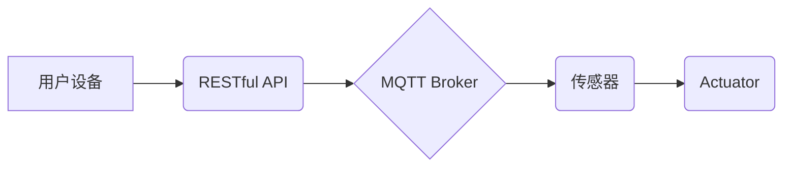

> MQTT, RESTful API, 家庭环境, 自动控制, 物联网, 智能家居, 远程控制, 数据传输

## 1. 背景介绍

随着物联网技术的快速发展，智能家居已成为现代生活的重要组成部分。人们越来越希望通过智能设备来控制家庭环境，实现更加便捷、舒适的生活体验。家庭环境自动控制系统作为智能家居的核心应用之一，旨在通过传感器、 actuators 和控制软件，实现对家庭环境的智能化调节，例如温度、湿度、灯光、窗帘等。

传统的家庭环境控制系统通常采用局域网或无线网络进行通信，控制范围有限，且缺乏远程控制功能。随着物联网技术的兴起，基于MQTT协议和RESTful API的家庭环境自动控制系统应运而生，它具有以下优势：

* **轻量级、低功耗:** MQTT协议是一种轻量级的消息传输协议，适合资源受限的设备，能够有效降低系统功耗。
* **可靠性高:** MQTT协议支持消息确认机制，确保消息可靠传输，即使网络不稳定也能保证控制指令的执行。
* **可扩展性强:** MQTT协议支持多主题订阅和发布，能够轻松扩展系统规模，支持更多设备的连接。
* **远程控制:** RESTful API可以实现远程访问和控制，用户可以通过手机、平板电脑等设备远程控制家庭环境。

## 2. 核心概念与联系

### 2.1 MQTT协议

MQTT（Message Queuing Telemetry Transport）是一种轻量级的、基于发布/订阅的消息传输协议，广泛应用于物联网领域。它采用客户端/服务器架构，消息通过主题进行发布和订阅。

* **发布者:** 发送消息到特定主题的设备或应用程序。
* **订阅者:** 订阅特定主题，接收相关消息的设备或应用程序。
* **消息 Broker:** 管理消息的发布和订阅，并将消息转发给相应的订阅者。

### 2.2 RESTful API

RESTful API（Representational State Transfer Application Programming Interface）是一种基于 HTTP 协议的软件架构风格，用于构建 Web 服务。它遵循一系列约定，例如使用 HTTP 动词（GET、POST、PUT、DELETE）进行资源操作，使用 JSON 或 XML 格式进行数据传输等。

### 2.3 系统架构

基于MQTT协议和RESTful API的家庭环境自动控制系统通常采用以下架构：



* **用户设备:** 用户可以通过手机、平板电脑等设备访问 RESTful API，远程控制家庭环境。
* **RESTful API:** 提供用户设备与 MQTT Broker 之间的接口，处理用户请求并转发到相应的主题。
* **MQTT Broker:** 管理消息的发布和订阅，将用户请求转发给相应的传感器和 actuators。
* **传感器:** 收集家庭环境数据，例如温度、湿度、光照等，并将数据发布到 MQTT Broker。
* **Actuator:** 根据 MQTT Broker 收到的控制指令，执行相应的动作，例如调节温度、打开窗帘等。

## 3. 核心算法原理 & 具体操作步骤

### 3.1  算法原理概述

家庭环境自动控制系统通常采用基于规则的控制算法或机器学习算法进行控制。

* **规则控制:** 根据预先定义的规则，判断环境状态并执行相应的控制指令。例如，当温度低于设定值时，打开暖气；当温度高于设定值时，打开空调。
* **机器学习:** 利用历史数据训练机器学习模型，预测环境变化趋势并自动调节控制参数。例如，根据用户的行为习惯，预测用户的温度偏好，自动调节空调温度。

### 3.2  算法步骤详解

**规则控制算法步骤:**

1. **环境状态监测:** 通过传感器收集家庭环境数据，例如温度、湿度、光照等。
2. **规则匹配:** 将收集到的环境数据与预先定义的规则进行匹配。
3. **控制指令生成:** 根据匹配的规则，生成相应的控制指令，例如打开暖气、关闭窗帘等。
4. **执行控制指令:** 通过 actuators 执行控制指令，调节家庭环境。

**机器学习算法步骤:**

1. **数据收集:** 收集历史环境数据和用户行为数据。
2. **数据预处理:** 对收集到的数据进行清洗、转换和特征提取。
3. **模型训练:** 利用训练数据训练机器学习模型，例如回归模型、分类模型等。
4. **模型评估:** 使用测试数据评估模型的性能，并进行模型调优。
5. **预测和控制:** 将模型应用于实时环境数据，预测环境变化趋势并生成控制指令。

### 3.3  算法优缺点

**规则控制算法:**

* **优点:** 简单易实现，易于理解和维护。
* **缺点:** 规则难以覆盖所有场景，难以适应环境变化。

**机器学习算法:**

* **优点:** 可以学习复杂的关系，适应环境变化，实现更智能的控制。
* **缺点:** 需要大量数据进行训练，模型训练复杂，难以解释模型决策。

### 3.4  算法应用领域

* **智能家居:** 控制温度、湿度、灯光、窗帘等家庭环境。
* **农业智能化:** 控制温湿度、灌溉、施肥等农业生产环节。
* **工业自动化:** 控制生产设备、环境参数等工业生产环节。

## 4. 数学模型和公式 & 详细讲解 & 举例说明

### 4.1  数学模型构建

家庭环境自动控制系统通常采用数学模型来描述环境变化和控制过程。例如，温度控制系统可以使用热传导方程来描述温度变化，湿度控制系统可以使用湿球温度差来描述湿度变化。

### 4.2  公式推导过程

例如，温度控制系统可以使用以下热传导方程来描述温度变化：

$$
\frac{\partial T}{\partial t} = \alpha \nabla^2 T + Q
$$

其中：

* $T$ 是温度
* $t$ 是时间
* $\alpha$ 是热扩散系数
* $\nabla^2$ 是拉普拉斯算符
* $Q$ 是热源强度

### 4.3  案例分析与讲解

假设一个房间的体积为 100 立方米，初始温度为 20°C，热扩散系数为 0.001 m²/s，热源强度为 100 W。可以使用上述热传导方程和数值方法求解房间温度随时间的变化。

## 5. 项目实践：代码实例和详细解释说明

### 5.1  开发环境搭建

* **操作系统:** Linux 或 Windows
* **编程语言:** Python
* **MQTT Broker:** Mosquitto
* **RESTful API框架:** Flask

### 5.2  源代码详细实现

```python
# 导入必要的库
import paho.mqtt.client as mqtt
from flask import Flask, request, jsonify

# 初始化 MQTT 客户端
client = mqtt.Client()
client.connect("mqtt_broker_ip", 1883)

# 初始化 Flask 应用程序
app = Flask(__name__)

# 定义 RESTful API 路由
@app.route('/control', methods=['POST'])
def control():
    data = request.get_json()
    device_id = data['device_id']
    command = data['command']

    # 发布 MQTT 消息
    client.publish(f"home/devices/{device_id}", command)

    return jsonify({'status': 'success'})

# 启动 Flask 应用程序
if __name__ == '__main__':
    app.run(debug=True)
```

### 5.3  代码解读与分析

* **MQTT 客户端:** 使用 paho.mqtt.client 库创建 MQTT 客户端，连接到 MQTT Broker。
* **RESTful API:** 使用 Flask 框架创建 RESTful API，定义 `/control` 路由，接收用户请求并发布 MQTT 消息。
* **消息发布:** 使用 `client.publish()` 方法发布 MQTT 消息，主题格式为 `home/devices/{device_id}`，消息内容为控制指令。

### 5.4  运行结果展示

当用户通过手机或平板电脑发送控制指令到 RESTful API 时，系统会将指令发布到 MQTT Broker，相应的设备会收到消息并执行控制指令。例如，用户发送指令 "turn_on" 到 `/control` 路由，系统会发布消息到主题 `home/devices/light1`，控制名为 "light1" 的灯打开。

## 6. 实际应用场景

### 6.1  智能家居场景

* **远程控制:** 用户可以通过手机或平板电脑远程控制家庭环境，例如调节温度、灯光、窗帘等。
* **场景联动:** 用户可以设置场景联动，例如 "睡觉" 场景，可以自动关闭灯光、调节温度、关闭窗帘等。
* **语音控制:** 用户可以使用语音助手控制家庭环境，例如 "打开客厅灯"、"调低温度" 等。

### 6.2  其他应用场景

* **农业智能化:** 控制温湿度、灌溉、施肥等农业生产环节，提高农业生产效率。
* **工业自动化:** 控制生产设备、环境参数等工业生产环节，提高生产效率和安全性。
* **医疗保健:** 控制医疗设备、环境参数等，提高医疗服务质量。

### 6.4  未来应用展望

随着物联网技术的不断发展，基于MQTT协议和RESTful API的家庭环境自动控制系统将更加智能化、个性化和安全。未来，系统将能够：

* **更精准的控制:** 利用机器学习算法，根据用户的行为习惯和环境变化，更精准地控制家庭环境。
* **更丰富的功能:** 支持更多类型的设备和功能，例如智能音箱、智能摄像头、智能门锁等。
* **更安全的防护:** 利用区块链技术和人工智能技术，提高系统的安全性，防止数据泄露和恶意攻击。

## 7. 工具和资源推荐

### 7.1  学习资源推荐

* **MQTT 协议:** https://mqtt.org/
* **RESTful API:** https://restfulapi.net/
* **Python 编程:** https://www.python.org/

### 7.2  开发工具推荐

* **MQTT Broker:** Mosquitto, HiveMQ
* **RESTful API 框架:** Flask, Django
* **代码编辑器:** VS Code, Atom

### 7.3  相关论文推荐

* **MQTT协议在物联网中的应用研究**
* **基于RESTful API的智能家居控制系统设计**
* **机器学习在家庭环境自动控制中的应用**

## 8. 总结：未来发展趋势与挑战

### 8.1  研究成果总结

基于MQTT协议和RESTful API的家庭环境自动控制系统具有轻量级、可靠、可扩展等特点，能够实现对家庭环境的智能化控制，并具有广泛的应用前景。

### 8.2  未来发展趋势

未来，该系统将朝着更加智能化、个性化和安全的方向发展，例如：

* **更精准的控制:** 利用机器学习算法，根据用户的行为习惯和环境变化，更精准地控制家庭环境。
* **更丰富的功能:** 支持更多类型的设备和功能，例如智能音箱、智能摄像头、智能门锁等。
* **更安全的防护:** 利用区块链技术和人工智能技术，提高系统的安全性，防止数据泄露和恶意攻击。

### 8.3  面临的挑战

* **数据安全:** 家庭环境数据涉及用户的隐私信息，需要采取有效的措施保障数据安全。
* **系统可靠性:** 系统需要能够稳定运行，即使在网络不稳定或设备故障的情况下也能保证控制指令的执行。
* **用户体验:** 系统需要提供友好的用户界面和操作体验，方便用户使用和管理。

### 8.4  研究展望

未来，我们将继续研究基于MQTT协议和RESTful API的家庭环境自动控制系统，探索更智能、更安全、更便捷的控制方式，为用户提供更加舒适、便捷的生活体验。

## 9. 附录：常见问题与解答

* **Q: 如何连接 MQTT Broker?**

A: 使用 MQTT 客户端连接 MQTT Broker，需要知道 Broker 的 IP 地址和端口号。

* **Q: 如何发布 MQTT 消息?**

