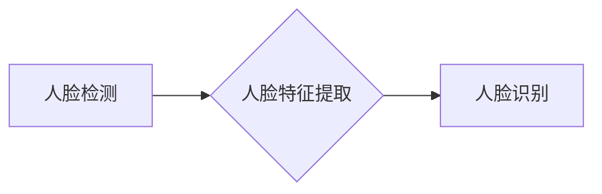

> 人脸识别，深度学习，卷积神经网络，迁移学习，人脸检测，特征提取，应用场景

## 1. 背景介绍

人脸识别技术作为计算机视觉领域的重要分支，近年来取得了长足的进步，并广泛应用于各个领域，例如：身份验证、安全监控、人脸搜索、医疗诊断等。传统的基于特征工程的人脸识别方法依赖于人工设计的特征，难以应对复杂的光照、姿态、表情等变化。而深度学习技术的出现，为人脸识别带来了革命性的变革。

深度学习算法能够自动学习图像特征，并提取更抽象、更鲁棒的人脸特征，从而显著提高了人脸识别的准确率和泛化能力。本文将深入探讨基于深度学习的人脸识别技术，包括核心概念、算法原理、数学模型、项目实践以及实际应用场景等方面。

## 2. 核心概念与联系

### 2.1 人脸检测

人脸检测是人脸识别系统的前提，其目的是在图像或视频中定位人脸区域。常用的人脸检测算法包括：

* **传统方法：** 基于Haar特征、LBP特征等手工设计的特征进行人脸检测。
* **深度学习方法：** 使用卷积神经网络（CNN）进行人脸检测，例如：SSD、YOLO、FaceNet等。

### 2.2 人脸特征提取

人脸特征提取是指从人脸图像中提取关键特征，用于人脸识别。深度学习方法通常使用CNN网络进行人脸特征提取，其结构通常包括：

* **卷积层：** 学习图像局部特征。
* **池化层：** 降低特征维度，提高特征鲁棒性。
* **全连接层：** 将提取的特征映射到特征向量空间。

### 2.3 人脸识别

人脸识别是指根据提取的人脸特征，将人脸图像与数据库中的人脸特征进行匹配，从而识别出该人脸的身份。常用的人脸识别算法包括：

* **基于距离的算法：** 使用欧氏距离、余弦相似度等度量人脸特征之间的相似度。
* **基于支持向量机的算法：** 将人脸特征映射到高维空间，使用支持向量机进行分类。
* **基于深度学习的算法：** 使用深度神经网络进行人脸识别，例如：FaceNet、ArcFace、SphereFace等。

**核心概念与联系流程图:**



## 3. 核心算法原理 & 具体操作步骤

### 3.1 算法原理概述

基于深度学习的人脸识别算法主要基于卷积神经网络（CNN）进行人脸特征提取和识别。CNN网络具有以下特点：

* **局部连接：** 每个神经元只连接到局部区域的输入特征。
* **权值共享：** 每个卷积核共享相同的权值，可以有效降低模型参数量。
* **池化操作：** 可以降低特征维度，提高特征鲁棒性。

### 3.2 算法步骤详解

1. **数据预处理：** 对人脸图像进行预处理，例如：裁剪、缩放、归一化等。
2. **人脸检测：** 使用人脸检测算法定位人脸区域。
3. **人脸特征提取：** 使用预训练的CNN网络提取人脸特征。
4. **特征匹配：** 使用距离度量或分类算法将提取的特征与数据库中的特征进行匹配。
5. **识别结果输出：** 输出识别结果，例如：人脸身份、置信度等。

### 3.3 算法优缺点

**优点：**

* **高准确率：** 深度学习算法能够自动学习更抽象、更鲁棒的人脸特征，从而提高人脸识别的准确率。
* **泛化能力强：** 深度学习模型能够适应不同的光照、姿态、表情等变化，具有较强的泛化能力。
* **自动化程度高：** 深度学习算法可以自动学习特征，无需人工设计特征，降低了开发成本。

**缺点：**

* **训练数据量大：** 深度学习算法需要大量的训练数据才能达到较高的准确率。
* **计算资源消耗大：** 深度学习模型训练和推理需要大量的计算资源。
* **可解释性差：** 深度学习模型的决策过程较为复杂，难以解释其识别结果。

### 3.4 算法应用领域

基于深度学习的人脸识别技术广泛应用于以下领域：

* **身份验证：** 手机解锁、银行卡验证、门禁系统等。
* **安全监控：** 人脸抓拍、嫌疑人识别、人群管理等。
* **人脸搜索：** 照片识别、社交媒体人脸搜索等。
* **医疗诊断：** 病人身份识别、疾病诊断辅助等。
* **零售业：** 个性化推荐、会员服务等。

## 4. 数学模型和公式 & 详细讲解 & 举例说明

### 4.1 数学模型构建

人脸识别算法通常使用距离度量或分类算法进行人脸识别。

**距离度量：**

常用的距离度量包括欧氏距离、余弦相似度等。

* **欧氏距离：** 计算两个特征向量之间的直线距离。

$$
d(x, y) = \sqrt{\sum_{i=1}^{n}(x_i - y_i)^2}
$$

* **余弦相似度：** 计算两个特征向量之间的夹角余弦值。

$$
sim(x, y) = \frac{x \cdot y}{||x|| ||y||}
$$

**分类算法：**

常用的分类算法包括支持向量机（SVM）、深度神经网络（DNN）等。

### 4.2 公式推导过程

**支持向量机（SVM）：**

SVM的目标是找到一个超平面，将不同类别的样本分开，并使分类间隔最大化。

**深度神经网络（DNN）：**

DNN使用多层神经网络进行特征提取和分类。每个神经元接收来自上一层的输入，并通过激活函数进行处理，输出到下一层。

### 4.3 案例分析与讲解

**案例：**

使用FaceNet算法进行人脸识别。

**分析：**

FaceNet使用深度神经网络提取人脸特征，并将特征映射到一个嵌入空间中。在嵌入空间中，相似的脸部特征会聚在一起，不同的脸部特征会分散开来。

**讲解：**

使用距离度量计算两个人脸特征之间的距离，距离越小，相似度越高。如果距离小于设定阈值，则认为是同一个人。

## 5. 项目实践：代码实例和详细解释说明

### 5.1 开发环境搭建

* **操作系统：** Ubuntu 18.04
* **编程语言：** Python 3.6
* **深度学习框架：** TensorFlow 2.0
* **其他依赖库：** OpenCV、NumPy、Scikit-learn等

### 5.2 源代码详细实现

```python
import tensorflow as tf
from tensorflow.keras.models import Sequential
from tensorflow.keras.layers import Conv2D, MaxPooling2D, Flatten, Dense

# 定义人脸识别模型
model = Sequential()
model.add(Conv2D(32, (3, 3), activation='relu', input_shape=(128, 128, 3)))
model.add(MaxPooling2D((2, 2)))
model.add(Conv2D(64, (3, 3), activation='relu'))
model.add(MaxPooling2D((2, 2)))
model.add(Flatten())
model.add(Dense(128, activation='relu'))
model.add(Dense(10, activation='softmax'))

# 编译模型
model.compile(optimizer='adam', loss='categorical_crossentropy', metrics=['accuracy'])

# 训练模型
model.fit(x_train, y_train, epochs=10, batch_size=32)

# 评估模型
loss, accuracy = model.evaluate(x_test, y_test)
print('Loss:', loss)
print('Accuracy:', accuracy)

# 人脸识别
predictions = model.predict(x_new)
predicted_class = tf.argmax(predictions, axis=1)
print('Predicted class:', predicted_class)
```

### 5.3 代码解读与分析

* **模型定义：** 使用Sequential模型定义一个卷积神经网络，包含卷积层、池化层、全连接层和输出层。
* **模型编译：** 使用Adam优化器、交叉熵损失函数和准确率指标编译模型。
* **模型训练：** 使用训练数据训练模型，设置训练轮数和批处理大小。
* **模型评估：** 使用测试数据评估模型的性能，输出损失值和准确率。
* **人脸识别：** 使用训练好的模型对新的图像进行预测，并输出预测结果。

### 5.4 运行结果展示

运行代码后，会输出模型的训练损失、准确率以及对新图像的预测结果。

## 6. 实际应用场景

### 6.1 身份验证

* **手机解锁：** 使用人脸识别技术解锁手机，提高安全性。
* **银行卡验证：** 使用人脸识别技术验证银行卡用户身份，防止欺诈行为。
* **门禁系统：** 使用人脸识别技术控制门禁系统，实现人脸识别授权。

### 6.2 安全监控

* **人脸抓拍：** 在公共场所使用人脸识别技术抓拍嫌疑人，辅助警方侦破案件。
* **嫌疑人识别：** 在监控视频中识别嫌疑人，提高安全监控效率。
* **人群管理：** 在大型活动中使用人脸识别技术管理人群流动，保障安全秩序。

### 6.3 人脸搜索

* **照片识别：** 使用人脸识别技术识别照片中的人物，方便查找和管理照片。
* **社交媒体人脸搜索：** 在社交媒体平台上使用人脸识别技术搜索特定人物，方便查找和互动。

### 6.4 未来应用展望

* **虚拟现实/增强现实：** 人脸识别技术可以用于虚拟现实和增强现实场景中，实现更逼真的交互体验。
* **医疗诊断：** 人脸识别技术可以用于辅助医生诊断疾病，例如：识别面部特征变化，判断患者情绪状态。
* **个性化服务：** 人脸识别技术可以用于提供个性化服务，例如：根据用户的喜好推荐商品或服务。

## 7. 工具和资源推荐

### 7.1 学习资源推荐

* **书籍：**
    * 《深度学习》 - Ian Goodfellow
    * 《动手学深度学习》 - Aurélien Géron
* **在线课程：**
    * Coursera - Deep Learning Specialization
    * Udacity - Deep Learning Nanodegree
* **博客和网站：**
    * TensorFlow Blog
    * PyTorch Blog
    * Towards Data Science

### 7.2 开发工具推荐

* **深度学习框架：** TensorFlow, PyTorch, Keras
* **图像处理库：** OpenCV
* **数据可视化工具：** Matplotlib, Seaborn

### 7.3 相关论文推荐

* **FaceNet: A Unified Embedding for Face Recognition and Clustering**
* **SphereFace: Deep Hypersphere Face Recognition**
* **ArcFace: Additive Angular Margin Loss for Deep Face Recognition**

## 8. 总结：未来发展趋势与挑战

### 8.1 研究成果总结

基于深度学习的人脸识别技术取得了显著进展，准确率大幅提升，应用场景不断扩展。

### 8.2 未来发展趋势

* **更鲁棒的算法：** 研究更鲁棒的人脸识别算法，能够应对更复杂的光照、姿态、表情等变化。
* **隐私保护：** 研究隐私保护的人脸识别技术，保障用户隐私安全。
* **跨模态识别：** 研究跨模态的人脸识别技术，例如：将人脸识别与语音识别、文本识别等技术结合。

### 8.3 面临的挑战

* **数据标注：** 人脸识别算法需要大量的标注数据，数据标注成本高昂。
* **公平性与偏见：** 人脸识别算法可能存在公平性