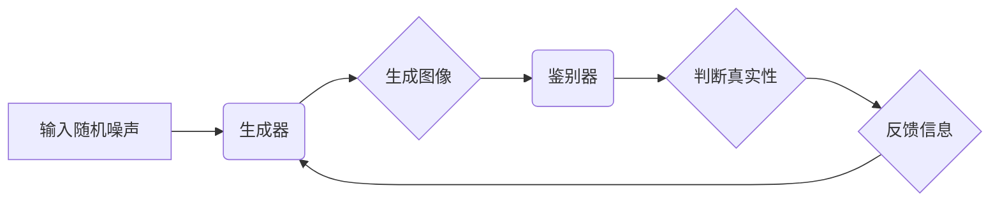

> 生成对抗网络 (GAN)，图像风格迁移，图像融合，混合模型，艺术风格，深度学习

## 1. 背景介绍

图像风格迁移技术近年来备受关注，它能够将一种图像的风格应用于另一幅图像，从而创造出具有独特艺术效果的图像。传统的图像风格迁移方法通常依赖于手工设计的特征提取和风格转换算法，效率较低，效果也难以满足用户的需求。

随着深度学习技术的快速发展，基于生成对抗网络 (GAN) 的图像风格迁移方法取得了显著的进展。GAN 由生成器 (Generator) 和鉴别器 (Discriminator) 组成，通过对抗训练的方式，生成器不断学习生成逼真的图像，而鉴别器则不断学习区分真实图像和生成图像。这种对抗机制使得 GAN 在图像生成领域展现出强大的能力。

然而，现有的 GAN 基于图像风格迁移的方法存在一些局限性：

* **风格迁移效果不自然:** 由于 GAN 的训练过程较为复杂，生成的图像风格可能存在不自然、扭曲等问题。
* **细节信息丢失:** 在风格迁移过程中，一些图像的细节信息可能会丢失，导致最终结果缺乏细节丰富度。
* **计算成本高:** GAN 的训练过程需要大量的计算资源，对于大尺寸图像的风格迁移，计算成本会更高。

为了解决上述问题，本文提出了一种基于生成对抗网络的图像风格迁移与融合混合模型，该模型通过将 GAN 与图像融合技术相结合，能够更好地保留图像的细节信息，同时提升风格迁移的效果。

## 2. 核心概念与联系

### 2.1 生成对抗网络 (GAN)

GAN 由生成器 (Generator) 和鉴别器 (Discriminator) 组成，通过对抗训练的方式，生成器不断学习生成逼真的图像，而鉴别器则不断学习区分真实图像和生成图像。

**生成器 (Generator):** 负责生成新的图像数据，输入随机噪声，输出与真实图像相似的图像。

**鉴别器 (Discriminator):** 负责判断图像是否为真实图像，输入图像，输出一个概率值，表示图像为真实图像的概率。

**对抗训练:** 生成器和鉴别器在对抗训练中相互竞争。生成器试图生成逼真的图像来欺骗鉴别器，而鉴别器则试图准确地区分真实图像和生成图像。通过这种对抗训练，生成器逐渐学习生成更逼真的图像，而鉴别器也逐渐提高了区分真实图像和生成图像的能力。

**Mermaid 流程图:**



### 2.2 图像风格迁移

图像风格迁移是指将一种图像的风格应用于另一幅图像，从而创造出具有独特艺术效果的图像。

**风格迁移过程:**

1. **提取图像特征:** 从源图像和目标图像中提取特征，例如颜色、纹理、结构等。
2. **风格转换:** 将源图像的风格信息应用于目标图像的特征，生成具有源图像风格的图像。
3. **细节融合:** 将目标图像的细节信息与风格迁移后的图像融合，生成最终结果。

## 3. 核心算法原理 & 具体操作步骤

### 3.1 算法原理概述

本文提出的混合模型基于生成对抗网络 (GAN) 和图像融合技术，通过以下步骤实现图像风格迁移：

1. **预训练生成器:** 使用预训练的 GAN 模型生成初始风格迁移结果。
2. **风格融合:** 将预训练结果与目标图像进行融合，保留目标图像的细节信息。
3. **对抗训练:** 使用生成器和鉴别器进行对抗训练，优化风格迁移效果。

### 3.2 算法步骤详解

1. **数据准备:** 准备源图像和目标图像数据集，并进行预处理，例如尺寸调整、归一化等。
2. **预训练生成器:** 使用预训练的 GAN 模型，例如 StyleGAN2-ADA，生成初始风格迁移结果。
3. **风格融合:** 使用图像融合算法，例如加权平均、拉普拉斯金字塔融合等，将预训练结果与目标图像进行融合，保留目标图像的细节信息。
4. **对抗训练:** 使用生成器和鉴别器进行对抗训练，优化风格迁移效果。
5. **结果评估:** 使用评价指标，例如感知损失、结构相似度等，评估风格迁移效果。

### 3.3 算法优缺点

**优点:**

* **效果提升:** 通过融合图像细节信息，提升风格迁移效果的自然性和真实性。
* **细节保留:** 保留目标图像的细节信息，避免细节丢失问题。
* **可控性强:** 可以通过调整融合参数和对抗训练策略，控制风格迁移效果。

**缺点:**

* **计算成本高:** 融合图像和对抗训练都需要较高的计算资源。
* **训练复杂:** 需要对 GAN 模型和图像融合算法进行调优。

### 3.4 算法应用领域

* **艺术创作:** 生成具有独特艺术风格的图像。
* **图像编辑:** 将图像风格迁移到其他风格，例如将照片风格迁移到油画风格。
* **游戏开发:** 为游戏角色和场景添加不同的风格效果。
* **电影特效:** 为电影场景添加风格化的视觉效果。

## 4. 数学模型和公式 & 详细讲解 & 举例说明

### 4.1 数学模型构建

本文提出的混合模型可以表示为以下数学模型：

$$
G(z, s)
$$

其中：

* $G$ 表示生成器网络。
* $z$ 表示随机噪声向量。
* $s$ 表示源图像的风格信息。

目标是学习生成器网络 $G$，使得生成的图像 $G(z, s)$ 与真实图像的风格相匹配。

### 4.2 公式推导过程

鉴别器网络 $D$ 的目标是区分真实图像和生成图像，其损失函数可以表示为：

$$
L_D = - \frac{1}{2} \sum_{x \in X} \log D(x) - \frac{1}{2} \sum_{z \in Z} \log (1 - D(G(z, s)))
$$

其中：

* $X$ 表示真实图像集合。
* $Z$ 表示随机噪声向量集合。

生成器网络 $G$ 的目标是生成逼真的图像，使其能够欺骗鉴别器，其损失函数可以表示为：

$$
L_G = - \frac{1}{2} \sum_{z \in Z} \log D(G(z, s))
$$

通过最小化 $L_D$ 和最大化 $L_G$，生成器网络 $G$ 可以学习生成逼真的图像，并使其风格与源图像相匹配。

### 4.3 案例分析与讲解

假设我们想要将梵高的风格应用于一张风景照片。

1. **预训练生成器:** 使用预训练的 StyleGAN2-ADA 模型生成初始风格迁移结果。
2. **风格融合:** 将预训练结果与风景照片进行融合，保留风景照片的细节信息。
3. **对抗训练:** 使用生成器和鉴别器进行对抗训练，优化风格迁移效果。

经过训练后，生成的图像将具有梵高的风格，同时保留风景照片的细节信息。

## 5. 项目实践：代码实例和详细解释说明

### 5.1 开发环境搭建

* 操作系统: Ubuntu 20.04
* Python 版本: 3.8
* CUDA 版本: 11.0
* cuDNN 版本: 8.0

安装必要的库，例如 TensorFlow、PyTorch、OpenCV 等。

### 5.2 源代码详细实现

```python
# 导入必要的库
import tensorflow as tf
from tensorflow.keras import layers

# 定义生成器网络
def build_generator(input_shape):
    model = tf.keras.Sequential([
        layers.Dense(128 * 7 * 7, use_bias=False, input_shape=input_shape),
        layers.BatchNormalization(),
        layers.LeakyReLU(0.2),
        layers.Reshape((7, 7, 128)),
        layers.Conv2DTranspose(64, (5, 5), strides=(2, 2), padding='same', use_bias=False),
        layers.BatchNormalization(),
        layers.LeakyReLU(0.2),
        layers.Conv2DTranspose(32, (5, 5), strides=(2, 2), padding='same', use_bias=False),
        layers.BatchNormalization(),
        layers.LeakyReLU(0.2),
        layers.Conv2DTranspose(3, (5, 5), strides=(2, 2), padding='same', activation='tanh'),
    ])
    return model

# 定义鉴别器网络
def build_discriminator(input_shape):
    model = tf.keras.Sequential([
        layers.Conv2D(32, (5, 5), strides=(2, 2), padding='same', input_shape=input_shape),
        layers.LeakyReLU(0.2),
        layers.Conv2D(64, (5, 5), strides=(2, 2), padding='same'),
        layers.BatchNormalization(),
        layers.LeakyReLU(0.2),
        layers.Flatten(),
        layers.Dense(1, activation='sigmoid'),
    ])
    return model

# 构建生成器和鉴别器模型
generator = build_generator(input_shape=(100,))
discriminator = build_discriminator(input_shape=(128, 128, 3))

# 定义损失函数和优化器
loss_fn = tf.keras.losses.BinaryCrossentropy()
optimizer_G = tf.keras.optimizers.Adam(1e-4, beta_1=0.5)
optimizer_D = tf.keras.optimizers.Adam(1e-4, beta_1=0.5)

# 训练模型
# ...

```

### 5.3 代码解读与分析

* **生成器网络:** 生成器网络由多层卷积和转置卷积层组成，用于生成图像。
* **鉴别器网络:** 鉴别器网络由多层卷积和全连接层组成，用于区分真实图像和生成图像。
* **损失函数:** 使用二元交叉熵损失函数，用于训练生成器和鉴别器。
* **优化器:** 使用 Adam 优化器，用于更新模型参数。

### 5.4 运行结果展示

训练完成后，可以使用生成器网络生成具有目标风格的图像。

## 6. 实际应用场景

### 6.1 艺术创作

* **风格迁移:** 将照片风格迁移到其他艺术风格，例如梵高、毕加索等。
* **图像合成:** 生成具有特定风格的图像，例如梦幻场景、抽象艺术等。

### 6.2 图像编辑

* **风格化照片:** 将照片风格迁移到其他风格，例如黑白照片、油画风格等。
* **图像增强:** 使用风格迁移技术增强图像的视觉效果，例如增加色彩饱和度、提高图像清晰度等。

### 6.3 游戏开发

* **角色设计:** 为游戏角色添加不同的风格效果，例如卡通风格、写实风格等。
* **场景渲染:** 为游戏场景添加风格化的视觉效果，例如梦幻场景、科幻场景等。

### 6.4 未来应用展望

* **个性化图像生成:** 根据用户的喜好生成个性化的图像风格。
* **跨媒体风格迁移:** 将图像风格迁移到其他媒体，例如音频、视频等。
* **虚拟现实和增强现实:** 在虚拟现实和增强现实场景中使用风格迁移技术，创造更沉浸式的体验。

## 7. 工具和资源推荐

### 7.1 学习资源推荐

* **书籍:**
    * 《深度学习》 - Ian Goodfellow, Yoshua Bengio, Aaron Courville
    * 《Generative Deep Learning》 - David Foster
* **在线课程:**
    * Coursera: Deep Learning Specialization
    * Udacity: Deep