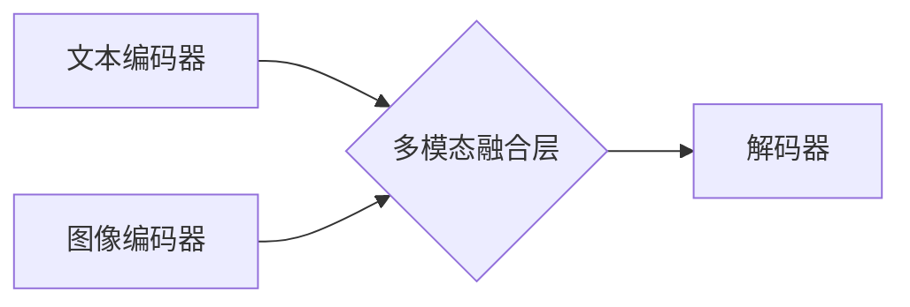

> 多模态大模型、Transformer、BERT、GPT、DALL-E、视觉语言模型、自然语言处理、计算机视觉、深度学习、人工智能

## 1. 背景介绍

近年来，人工智能（AI）领域取得了令人瞩目的进展，其中多模态大模型（Multimodal Large Models，MLMs）作为一种新兴技术，展现出巨大的潜力。与传统的单模态模型（如文本或图像）不同，MLMs能够处理多种模态数据，例如文本、图像、音频、视频等，并从中学习更丰富的知识和表示。

OpenAI的ChatGPT和DALL-E系列模型的成功，标志着多模态大模型进入公众视野，也引发了人们对该技术的广泛关注和研究。然而，MLMs的开发和应用并非一帆风顺，面临着诸多技术挑战和伦理问题。

## 2. 核心概念与联系

多模态大模型的核心概念是融合不同模态数据，学习跨模态的表示和理解能力。

**2.1  核心概念**

* **模态（Modality）：** 指数据呈现的形式，例如文本、图像、音频、视频等。
* **多模态（Multimodal）：** 指处理多种模态数据。
* **大模型（Large Model）：** 指拥有大量参数的深度学习模型，通常具有强大的泛化能力和学习能力。

**2.2  联系**

MLMs通过学习不同模态之间的关系，实现跨模态的理解和生成。例如，一个MLM可以学习图像和文本之间的关联，从而实现图像描述、图像问答等任务。

**2.3  架构图**



## 3. 核心算法原理 & 具体操作步骤

**3.1  算法原理概述**

MLMs通常基于Transformer架构，并结合了自注意力机制和跨模态融合技术。

* **Transformer:**  一种强大的序列建模架构，能够有效捕捉长距离依赖关系。
* **自注意力机制:**  允许模型关注输入序列中的不同部分，学习它们之间的关系。
* **跨模态融合技术:**  将不同模态的特征融合在一起，形成统一的表示。

**3.2  算法步骤详解**

1. **数据预处理:** 将文本、图像等数据预处理成模型可接受的格式。
2. **模态编码:** 使用不同的编码器对文本、图像等数据进行编码，得到相应的特征表示。
3. **跨模态融合:** 将不同模态的特征融合在一起，形成统一的表示。
4. **解码:** 使用解码器生成最终的输出，例如文本描述、图像生成等。

**3.3  算法优缺点**

* **优点:** 能够处理多种模态数据，学习更丰富的知识和表示，具有强大的泛化能力。
* **缺点:** 训练成本高，数据需求大，模型复杂度高。

**3.4  算法应用领域**

* **图像描述:**  根据图像生成文本描述。
* **图像问答:**  根据图像回答问题。
* **视频理解:**  理解视频内容，例如动作识别、事件检测等。
* **文本生成:**  根据文本提示生成图像、视频等。

## 4. 数学模型和公式 & 详细讲解 & 举例说明

**4.1  数学模型构建**

MLMs通常使用Transformer架构，其核心是自注意力机制和多头注意力机制。

**4.2  公式推导过程**

* **自注意力机制:**

$$
Attention(Q, K, V) = \frac{exp(Q \cdot K^T / \sqrt{d_k})}{exp(Q \cdot K^T / \sqrt{d_k})} \cdot V
$$

其中，Q、K、V分别为查询矩阵、键矩阵和值矩阵，$d_k$为键向量的维度。

* **多头注意力机制:**

$$
MultiHead(Q, K, V) = Concat(head_1, head_2, ..., head_h) \cdot W_o
$$

其中，$head_i$为第i个注意力头的输出，$h$为注意力头的数量，$W_o$为最终线性变换矩阵。

**4.3  案例分析与讲解**

例如，在图像描述任务中，MLM会首先将图像编码成特征向量，然后将文本编码器与图像编码器连接起来，通过跨模态融合层融合特征，最终使用解码器生成文本描述。

## 5. 项目实践：代码实例和详细解释说明

**5.1  开发环境搭建**

* Python 3.7+
* PyTorch 1.7+
* CUDA 10.2+

**5.2  源代码详细实现**

```python
# 导入必要的库
import torch
import torch.nn as nn

# 定义文本编码器
class TextEncoder(nn.Module):
    def __init__(self, vocab_size, embedding_dim, hidden_dim):
        super(TextEncoder, self).__init__()
        self.embedding = nn.Embedding(vocab_size, embedding_dim)
        self.transformer = nn.Transformer(d_model=embedding_dim, nhead=8)

    def forward(self, text):
        embedded = self.embedding(text)
        output = self.transformer(embedded)
        return output

# 定义图像编码器
class ImageEncoder(nn.Module):
    def __init__(self, image_dim, embedding_dim):
        super(ImageEncoder, self).__init__()
        self.conv = nn.Conv2d(3, 64, kernel_size=3, padding=1)
        self.pool = nn.MaxPool2d(kernel_size=2, stride=2)
        self.fc = nn.Linear(image_dim, embedding_dim)

    def forward(self, image):
        x = self.conv(image)
        x = self.pool(x)
        x = x.view(x.size(0), -1)
        output = self.fc(x)
        return output

# 定义跨模态融合层
class CrossModalFusion(nn.Module):
    def __init__(self, embedding_dim):
        super(CrossModalFusion, self).__init__()
        self.fc = nn.Linear(2 * embedding_dim, embedding_dim)

    def forward(self, text_embedding, image_embedding):
        fused_embedding = torch.cat((text_embedding, image_embedding), dim=1)
        output = self.fc(fused_embedding)
        return output

# 定义解码器
class Decoder(nn.Module):
    def __init__(self, embedding_dim, vocab_size):
        super(Decoder, self).__init__()
        self.transformer = nn.Transformer(d_model=embedding_dim, nhead=8)
        self.linear = nn.Linear(embedding_dim, vocab_size)

    def forward(self, fused_embedding, text_tokens):
        output = self.transformer(fused_embedding, text_tokens)
        output = self.linear(output)
        return output

# 定义多模态大模型
class MultiModalModel(nn.Module):
    def __init__(self, vocab_size, embedding_dim, hidden_dim, image_dim):
        super(MultiModalModel, self).__init__()
        self.text_encoder = TextEncoder(vocab_size, embedding_dim, hidden_dim)
        self.image_encoder = ImageEncoder(image_dim, embedding_dim)
        self.cross_modal_fusion = CrossModalFusion(embedding_dim)
        self.decoder = Decoder(embedding_dim, vocab_size)

    def forward(self, text, image):
        text_embedding = self.text_encoder(text)
        image_embedding = self.image_encoder(image)
        fused_embedding = self.cross_modal_fusion(text_embedding, image_embedding)
        output = self.decoder(fused_embedding, text)
        return output

```

**5.3  代码解读与分析**

* 代码定义了文本编码器、图像编码器、跨模态融合层和解码器，分别负责处理文本、图像、融合特征和生成输出。
* Transformer架构用于文本和图像编码，多头注意力机制用于捕捉长距离依赖关系。
* 跨模态融合层将文本和图像特征融合在一起，形成统一的表示。
* 解码器生成最终的输出，例如文本描述。

**5.4  运行结果展示**

运行代码后，可以根据输入的文本和图像，生成相应的描述。

## 6. 实际应用场景

**6.1  图像描述**

MLMs可以根据图像生成文本描述，例如为盲人描述图像内容。

**6.2  图像问答**

MLMs可以根据图像回答问题，例如识别图像中的物体或事件。

**6.3  视频理解**

MLMs可以理解视频内容，例如识别视频中的动作、事件和人物。

**6.4  未来应用展望**

MLMs在未来将应用于更广泛的领域，例如：

* **医疗诊断:**  辅助医生诊断疾病。
* **教育:**  提供个性化的学习体验。
* **娱乐:**  生成更逼真的游戏和虚拟现实体验。

## 7. 工具和资源推荐

**7.1  学习资源推荐**

* **论文:**  "BERT: Pre-training of Deep Bidirectional Transformers for Language Understanding"
* **博客:**  https://towardsdatascience.com/
* **课程:**  https://www.coursera.org/

**7.2  开发工具推荐**

* **PyTorch:**  https://pytorch.org/
* **TensorFlow:**  https://www.tensorflow.org/

**7.3  相关论文推荐**

* "DALL-E 2: Hierarchical Text-Conditional Image Generation with CLIP Latents"
* "Vision Transformer (ViT)"

## 8. 总结：未来发展趋势与挑战

**8.1  研究成果总结**

近年来，MLMs取得了显著进展，在图像描述、图像问答、视频理解等任务上取得了优异的性能。

**8.2  未来发展趋势**

* **模型规模:**  模型规模将继续扩大，以提高性能和泛化能力。
* **数据多样性:**  训练数据将更加多样化，以涵盖更多模态和场景。
* **高效训练:**  研究更高效的训练方法，降低训练成本。

**8.3  面临的挑战**

* **数据标注:**  多模态数据的标注成本高，难以获取高质量标注数据。
* **模型解释性:**  MLMs的决策过程难以解释，缺乏透明度。
* **伦理问题:**  MLMs可能被用于生成虚假信息或进行恶意攻击，需要关注伦理问题。

**8.4  研究展望**

未来，MLMs的研究将继续深入，探索更强大的模型架构、更有效的训练方法和更广泛的应用场景。


## 9. 附录：常见问题与解答

**9.1  Q: 如何选择合适的MLM模型？**

**A:** 选择合适的MLM模型需要考虑任务类型、数据规模、计算资源等因素。

**9.2  Q: 如何训练MLM模型？**

**A:** 训练MLM模型需要准备高质量的多模态数据，并使用合适的训练方法，例如自监督学习或半监督学习。

**9.3  Q: 如何评估MLM模型的性能？**

**A:** 可以使用多种指标评估MLM模型的性能，例如准确率、召回率、F1-score等。

**9.4  Q: 如何解决MLM模型的解释性问题？**

**A:** 可以使用可解释机器学习方法，例如注意力机制可视化，来解释MLM模型的决策过程。


作者：禅与计算机程序设计艺术 / Zen and the Art