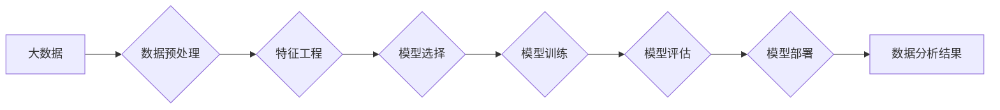

> 大数据分析, 数据挖掘, 机器学习, 算法原理, 代码实例,  Python, Spark, Hadoop

## 1. 背景介绍

在信息爆炸的时代，海量数据无处不在，从社交媒体、电商平台到科学研究，数据已成为重要的生产要素。如何有效地挖掘数据中的价值，从中发现隐藏的规律和趋势，成为了当今社会面临的重大挑战。大数据分析应运而生，它利用先进的算法和技术，对海量数据进行处理、分析和挖掘，从而帮助我们更好地理解世界，做出更明智的决策。

大数据分析的应用领域非常广泛，例如：

* **商业领域:** 
    * 预测客户行为，精准营销
    * 优化运营流程，提高效率
    * 发现市场趋势，抢占先机
* **金融领域:** 
    * 风险评估和控制
    * 欺诈检测
    * 投资决策支持
* **医疗领域:** 
    * 疾病诊断和预测
    * 药物研发
    * 个性化医疗
* **科学研究:** 
    * 数据挖掘和分析
    * 模型构建和验证
    * 知识发现

## 2. 核心概念与联系

大数据分析的核心概念包括：

* **大数据:** 指规模庞大、结构复杂、更新速度快的数据集合。
* **数据挖掘:** 从大数据中发现隐藏的模式、规律和知识的过程。
* **机器学习:** 利用算法和统计方法，使计算机能够从数据中学习，并做出预测或决策。

这些概念相互关联，共同构成了大数据分析的框架。

**Mermaid 流程图:**



## 3. 核心算法原理 & 具体操作步骤

### 3.1  算法原理概述

数据挖掘算法是数据分析的核心，它可以帮助我们从数据中发现隐藏的模式和规律。常见的算法包括：

* **分类算法:** 用于将数据点分类到不同的类别，例如决策树、支持向量机、神经网络。
* **回归算法:** 用于预测连续数值，例如线性回归、逻辑回归、支持向量回归。
* **聚类算法:** 用于将数据点分组到不同的簇，例如K-means聚类、层次聚类。
* **关联规则挖掘算法:** 用于发现数据点之间的关联关系，例如Apriori算法、FP-Growth算法。

### 3.2  算法步骤详解

以决策树算法为例，其步骤如下：

1. 选择一个最优特征作为根节点，该特征能够最大程度地将数据点分割到不同的类别。
2. 根据选择的特征，将数据点分成不同的子集。
3. 对每个子集重复步骤1和步骤2，直到满足停止条件，例如达到最大深度或每个子集包含的样本数量小于阈值。
4. 生成决策树，决策树的每个节点代表一个特征，每个分支代表一个特征的值，叶子节点代表一个类别。

### 3.3  算法优缺点

每个算法都有其自身的优缺点，需要根据实际情况选择合适的算法。

* **决策树算法:** 优点是易于理解和解释，缺点是容易过拟合。
* **支持向量机算法:** 优点是能够处理高维数据，缺点是训练时间较长。
* **神经网络算法:** 优点是能够学习复杂的非线性关系，缺点是训练时间较长，参数较多，容易过拟合。

### 3.4  算法应用领域

不同的算法适用于不同的应用场景。例如，决策树算法常用于分类问题，支持向量机算法常用于文本分类和图像识别，神经网络算法常用于语音识别和机器翻译。

## 4. 数学模型和公式 & 详细讲解 & 举例说明

### 4.1  数学模型构建

数学模型是描述数据分析过程的抽象表示，它可以帮助我们理解算法的原理和行为。例如，线性回归模型可以表示为：

$$y = \beta_0 + \beta_1x_1 + \beta_2x_2 + ... + \beta_nx_n + \epsilon$$

其中：

* $y$ 是预测变量
* $x_1, x_2, ..., x_n$ 是自变量
* $\beta_0, \beta_1, ..., \beta_n$ 是模型参数
* $\epsilon$ 是误差项

### 4.2  公式推导过程

模型参数的估计可以通过最小二乘法来实现。最小二乘法的目标是找到一组参数，使得模型预测值与实际值之间的误差平方和最小。

### 4.3  案例分析与讲解

例如，假设我们想要预测房价，自变量包括房屋面积、房间数量、地理位置等。我们可以使用线性回归模型来建立房价预测模型。通过收集房价和相关特征的数据，我们可以使用最小二乘法估计模型参数，从而得到一个预测房价的公式。

## 5. 项目实践：代码实例和详细解释说明

### 5.1  开发环境搭建

为了进行大数据分析项目实践，我们需要搭建一个开发环境。常用的开发环境包括：

* **Hadoop:** 一个分布式存储和处理框架，用于处理海量数据。
* **Spark:** 一个基于内存的分布式计算框架，用于高速处理数据。
* **Python:** 一个常用的编程语言，拥有丰富的机器学习库，例如Scikit-learn、TensorFlow、PyTorch。

### 5.2  源代码详细实现

以下是一个使用Python和Scikit-learn库进行线性回归模型训练的代码示例：

```python
from sklearn.linear_model import LinearRegression
from sklearn.model_selection import train_test_split
from sklearn.metrics import mean_squared_error

# 加载数据
data = ...

# 将数据分为特征和目标变量
X = data[['面积', '房间数量']]
y = data['房价']

# 将数据分为训练集和测试集
X_train, X_test, y_train, y_test = train_test_split(X, y, test_size=0.2)

# 创建线性回归模型
model = LinearRegression()

# 训练模型
model.fit(X_train, y_train)

# 预测测试集数据
y_pred = model.predict(X_test)

# 计算模型性能
mse = mean_squared_error(y_test, y_pred)
print(f'模型性能: MSE = {mse}')
```

### 5.3  代码解读与分析

这段代码首先加载数据，然后将数据分为特征和目标变量。接着，将数据分为训练集和测试集，用于训练和评估模型。

然后，创建线性回归模型，并使用训练集数据训练模型。最后，使用测试集数据预测房价，并计算模型性能。

### 5.4  运行结果展示

运行代码后，会输出模型性能指标，例如均方误差（MSE）。MSE越小，模型性能越好。

## 6. 实际应用场景

### 6.1  电商推荐系统

大数据分析可以用于构建电商推荐系统，根据用户的购买历史、浏览记录等数据，推荐用户可能感兴趣的商品。

### 6.2  精准营销

大数据分析可以用于精准营销，根据用户的年龄、性别、兴趣爱好等数据，精准推送广告，提高广告转化率。

### 6.3  风险控制

金融机构可以使用大数据分析来识别和控制风险，例如欺诈检测、信用评估等。

### 6.4  未来应用展望

随着大数据的不断增长和分析技术的不断发展，大数据分析将在更多领域得到应用，例如：

* **个性化医疗:** 根据患者的基因信息、病史等数据，提供个性化的医疗方案。
* **智能交通:** 利用交通数据，优化交通流量，提高道路安全。
* **智慧城市:** 利用城市数据，提高城市管理效率，改善城市生活质量。

## 7. 工具和资源推荐

### 7.1  学习资源推荐

* **书籍:**
    * 《大数据分析》
    * 《数据挖掘：概念与技术》
    * 《机器学习》
* **在线课程:**
    * Coursera
    * edX
    * Udacity

### 7.2  开发工具推荐

* **Hadoop:** https://hadoop.apache.org/
* **Spark:** https://spark.apache.org/
* **Python:** https://www.python.org/

### 7.3  相关论文推荐

* **《机器学习》**
* **《数据挖掘》**
* **《大数据分析》**

## 8. 总结：未来发展趋势与挑战

### 8.1  研究成果总结

大数据分析已经取得了显著的成果，在各个领域都得到了广泛应用。

### 8.2  未来发展趋势

未来，大数据分析将朝着以下方向发展：

* **更智能化:** 利用人工智能技术，使大数据分析更加智能化，能够自动发现隐藏的模式和规律。
* **更实时化:** 利用流式数据处理技术，实现对实时数据的分析和处理。
* **更可解释性:** 提高大数据分析模型的可解释性，使结果更容易被理解和信任。

### 8.3  面临的挑战

大数据分析也面临着一些挑战，例如：

* **数据质量问题:** 大数据往往存在脏数据、缺失数据等问题，需要进行数据清洗和预处理。
* **计算资源限制:** 处理海量数据需要强大的计算资源，成本较高。
* **隐私保护问题:** 大数据分析涉及到大量个人信息，需要做好隐私保护工作。

### 8.4  研究展望

未来，我们需要继续加强对大数据分析技术的研发，解决上述挑战，推动大数据分析技术更好地服务于社会发展。

## 9. 附录：常见问题与解答

### 9.1  常见问题

* **什么是大数据？**
* **大数据分析有哪些应用场景？**
* **常用的数据挖掘算法有哪些？**
* **如何搭建大数据分析开发环境？**

### 9.2  解答

...

作者：禅与计算机程序设计艺术 / Zen and the Art of Computer Programming


<end_of_turn>