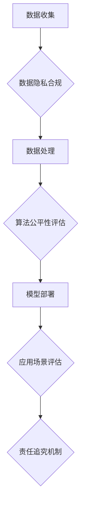

> 大模型、国际化、合规、数据隐私、人工智能伦理、法律法规、跨境数据传输、监管政策

## 1. 背景介绍

近年来，大模型技术蓬勃发展，其强大的泛化能力和应用潜力引发了全球范围内的关注和热议。从自然语言处理到图像生成，从代码编写到药物研发，大模型正在深刻地改变着各行各业。然而，大模型的快速发展也带来了新的挑战，其中国际化合规问题尤为突出。

大模型的训练和应用往往涉及海量数据，这些数据可能跨越国界，涉及不同国家和地区的公民信息。因此，大模型企业需要遵守不同国家和地区的法律法规，确保数据隐私保护、算法公平性、责任追究等方面的合规性。

## 2. 核心概念与联系

**2.1 数据隐私**

数据隐私是指个人信息在收集、使用、存储和处理过程中受到保护的权利。不同国家和地区对数据隐私的定义和保护措施有所不同，例如欧盟的通用数据保护条例（GDPR）和美国的加州消费者隐私法（CCPA）等。

**2.2 算法公平性**

算法公平性是指算法在处理不同群体数据时，不产生歧视或偏见的结果。大模型的训练数据可能存在偏差，导致算法输出结果不公平。

**2.3 责任追究**

大模型的应用可能带来不可预知的风险和后果，例如算法错误导致的决策失误、虚假信息传播等。因此，需要明确大模型开发、部署和应用过程中各方的责任和义务。

**2.4 国际化合规框架**

为了应对大模型带来的挑战，国际社会正在积极探索建立国际化合规框架。例如，联合国正在制定人工智能伦理原则，OECD正在制定人工智能治理指南等。

**Mermaid 流程图**



## 3. 核心算法原理 & 具体操作步骤

### 3.1  算法原理概述

大模型通常基于深度学习算法，例如Transformer模型。这些算法通过多层神经网络结构，学习数据中的复杂模式和关系。

### 3.2  算法步骤详解

1. **数据预处理:** 将原始数据清洗、格式化、编码等。
2. **模型构建:** 根据任务需求选择合适的深度学习模型架构。
3. **模型训练:** 使用训练数据训练模型，调整模型参数，使其能够准确地完成任务。
4. **模型评估:** 使用测试数据评估模型的性能，例如准确率、召回率等。
5. **模型部署:** 将训练好的模型部署到实际应用场景中。

### 3.3  算法优缺点

**优点:**

* 强大的泛化能力，能够处理复杂的任务。
* 学习能力强，能够从海量数据中提取有价值的信息。

**缺点:**

* 训练成本高，需要大量的计算资源和数据。
* 容易受到训练数据偏差的影响，导致算法输出结果不公平。
* 缺乏可解释性，难以理解模型的决策过程。

### 3.4  算法应用领域

* 自然语言处理：机器翻译、文本摘要、对话系统等。
* 图像识别：物体检测、图像分类、图像生成等。
* 代码生成：自动代码编写、代码修复等。
* 药物研发：药物发现、药物设计等。

## 4. 数学模型和公式 & 详细讲解 & 举例说明

### 4.1  数学模型构建

大模型的训练过程可以看作是一个优化问题，目标是找到模型参数，使得模型在训练数据上的损失函数最小。

损失函数通常是模型预测结果与真实结果之间的差异度量。常见的损失函数包括均方误差（MSE）、交叉熵损失（Cross-Entropy Loss）等。

### 4.2  公式推导过程

假设模型的预测结果为 $y_i$，真实结果为 $t_i$，损失函数为 MSE，则损失函数的表达式为：

$$
L = \frac{1}{N} \sum_{i=1}^{N} (y_i - t_i)^2
$$

其中，N为样本数量。

### 4.3  案例分析与讲解

例如，在机器翻译任务中，模型的预测结果为翻译后的文本，真实结果为参考翻译的文本。可以使用交叉熵损失函数来衡量模型预测结果与真实结果之间的差异。

## 5. 项目实践：代码实例和详细解释说明

### 5.1  开发环境搭建

大模型开发通常需要强大的计算资源和软件环境。常见的开发环境包括：

* **云计算平台:** AWS、Google Cloud、Azure等。
* **深度学习框架:** TensorFlow、PyTorch等。

### 5.2  源代码详细实现

由于篇幅限制，这里只提供一个简单的代码示例，展示如何使用 TensorFlow 训练一个简单的文本分类模型。

```python
import tensorflow as tf

# 定义模型结构
model = tf.keras.models.Sequential([
    tf.keras.layers.Embedding(input_dim=10000, output_dim=128),
    tf.keras.layers.LSTM(128),
    tf.keras.layers.Dense(1, activation='sigmoid')
])

# 编译模型
model.compile(optimizer='adam',
              loss='binary_crossentropy',
              metrics=['accuracy'])

# 训练模型
model.fit(x_train, y_train, epochs=10)

# 评估模型
loss, accuracy = model.evaluate(x_test, y_test)
print('Loss:', loss)
print('Accuracy:', accuracy)
```

### 5.3  代码解读与分析

这段代码定义了一个简单的文本分类模型，使用 Embedding 层将单词表示为向量，LSTM 层提取文本序列的特征，Dense 层输出分类结果。

### 5.4  运行结果展示

训练完成后，可以评估模型的性能，例如准确率等。

## 6. 实际应用场景

大模型在各个领域都有广泛的应用场景，例如：

* **医疗保健:** 辅助诊断、药物研发、个性化医疗等。
* **金融服务:** 风险评估、欺诈检测、客户服务等。
* **教育:** 个性化学习、智能辅导、自动批改等。

### 6.4  未来应用展望

随着大模型技术的不断发展，其应用场景将更加广泛，例如：

* **科学研究:** 加速科学发现、模拟复杂系统等。
* **艺术创作:** 生成音乐、绘画、文学作品等。
* **人机交互:** 创建更加自然、智能的人机交互体验。

## 7. 工具和资源推荐

### 7.1  学习资源推荐

* **书籍:**
    * 《深度学习》
    * 《自然语言处理》
* **在线课程:**
    * Coursera
    * edX
* **开源项目:**
    * TensorFlow
    * PyTorch

### 7.2  开发工具推荐

* **云计算平台:** AWS、Google Cloud、Azure
* **深度学习框架:** TensorFlow、PyTorch
* **数据处理工具:** Pandas、NumPy

### 7.3  相关论文推荐

* **《Attention Is All You Need》**
* **《BERT: Pre-training of Deep Bidirectional Transformers for Language Understanding》**

## 8. 总结：未来发展趋势与挑战

### 8.1  研究成果总结

大模型技术取得了显著的进展，在各个领域展现出巨大的应用潜力。

### 8.2  未来发展趋势

* **模型规模和能力的提升:** 训练更大规模、更强大的大模型。
* **模型效率和可解释性的提升:** 降低模型训练和推理成本，提高模型的可解释性。
* **跨模态大模型的开发:** 将文本、图像、音频等多种模态数据融合到一起，构建更强大的大模型。

### 8.3  面临的挑战

* **数据隐私和安全:** 保护用户数据隐私，防止数据泄露和滥用。
* **算法公平性和可解释性:** 确保算法公平公正，并提高模型的可解释性。
* **伦理和社会影响:** 评估大模型的伦理和社会影响，制定相应的规范和政策。

### 8.4  研究展望

未来，大模型研究将继续朝着更安全、更可靠、更可解释的方向发展，并为人类社会带来更多福祉。

## 9. 附录：常见问题与解答

**常见问题:**

* 大模型的训练成本很高，如何降低成本？
* 如何确保大模型的公平性和可解释性？
* 如何应对大模型带来的伦理和社会挑战？

**解答:**

* 可以使用模型压缩、知识蒸馏等技术降低训练成本。
* 可以使用公平性评估工具，并进行模型解释分析。
* 需要制定相应的规范和政策，并加强公众教育和监督。


作者：禅与计算机程序设计艺术 / Zen and the Art of Computer Programming 
<end_of_turn>