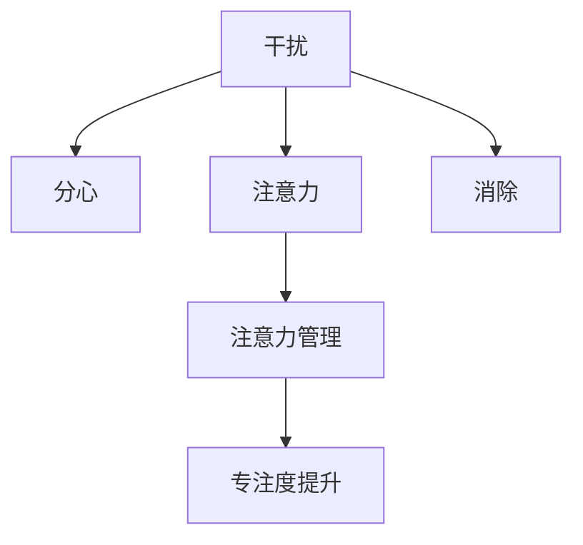

                 

## 1. 背景介绍

在信息爆炸的时代，注意力成为稀缺资源，如何有效管理注意力，保持头脑清晰，已成为提升工作效能、增强学习效果的关键。在职场、学习、娱乐等场景中，干扰和分心成为人们亟待解决的问题。本文将深入探讨注意力管理的实践技巧，旨在帮助读者掌握在各种干扰和分心中保持高效和专注的策略。

### 1.1 问题由来

随着数字技术的发展，智能手机、平板电脑、电脑等设备已成为我们日常生活的重要组成部分。然而，这些设备带来的便利也带来了干扰和分心的问题。社交媒体、新闻推送、电子邮件等通知频繁打断我们的工作和学习，导致注意力分散、效率下降。因此，有效管理注意力，提升专注力，成为现代人必须掌握的技能。

### 1.2 问题核心关键点

注意力管理的关键在于识别干扰源、评估注意力分配和制定有效的应对策略。核心问题包括：

- 如何识别日常生活中的主要干扰源？
- 如何评估自己的注意力分配情况？
- 如何制定并执行有效的注意力管理策略？

本文将从这三个方面深入探讨注意力管理的实践技巧。

## 2. 核心概念与联系

### 2.1 核心概念概述

在注意力管理的讨论中，涉及以下几个核心概念：

- **注意力**：指心理过程的集中性，即个人在特定任务上所投入的心理资源。
- **干扰**：指中断注意力，使个体难以专注于当前任务的外部或内部因素。
- **分心**：指注意力转移到与当前任务无关的事物上，影响任务完成效果的心理状态。
- **注意力管理**：指通过一系列策略和方法，提高个体在特定任务上的专注度，减少干扰和分心的过程。

这些概念之间的联系可以通过以下Mermaid流程图展示：



此流程图展示了干扰、分心与注意力之间的关系，以及注意力管理如何帮助提升专注度。

## 3. 核心算法原理 & 具体操作步骤

### 3.1 算法原理概述

注意力管理的核心原理是基于认知负荷理论，即个体在处理信息时，认知资源是有限的。通过减少认知负荷，个体可以更有效地集中注意力，提升任务完成效率。具体来说，注意力管理包含以下几个步骤：

1. 识别干扰源。
2. 评估注意力分配。
3. 制定注意力管理策略。
4. 实施并调整策略。

### 3.2 算法步骤详解

#### 3.2.1 识别干扰源

识别干扰源是注意力管理的第一步。通常，干扰源可以分为外部干扰和内部干扰两大类。

- **外部干扰**：如社交媒体通知、电话、同事打扰等。
- **内部干扰**：如焦虑、压力、拖延症等心理因素。

为了有效识别干扰源，可以使用以下方法：

- **日志记录法**：记录一天内各种干扰源的出现频率和持续时间，分析其对工作和学习的影响。
- **环境分析法**：评估工作或学习环境的布局和设备使用情况，识别可能干扰注意力的因素。

#### 3.2.2 评估注意力分配

评估注意力分配是了解自己当前注意力状态的有效手段。可以使用以下方法：

- **时间日志法**：记录一天内各个任务的时间分配，评估在每个任务上花费的注意力。
- **注意力追踪工具**：使用一些应用程序（如RescueTime、Focus@Will等）自动追踪注意力状态，提供详细的报告和分析。

#### 3.2.3 制定注意力管理策略

制定注意力管理策略是注意力管理的关键步骤。有效的策略应考虑以下几个方面：

- **设定明确目标**：明确当前任务的目标和预期成果，减少不必要的心理负担。
- **时间管理**：使用番茄工作法、时间块法等时间管理技巧，合理安排任务时间。
- **环境优化**：调整工作或学习环境的布局，减少干扰源的影响。

#### 3.2.4 实施并调整策略

实施并调整策略是确保注意力管理效果的关键。以下步骤可以帮助实施和调整策略：

- **定期评估**：定期评估注意力管理策略的效果，及时调整策略。
- **反馈调整**：根据评估结果，调整策略，确保策略的有效性。
- **持续改进**：在实践中不断总结经验，改进策略，提升专注力。

### 3.3 算法优缺点

注意力管理的优点包括：

- **提高效率**：减少干扰和分心，提升专注度，从而提高任务完成效率。
- **改善健康**：减少压力和焦虑，提升心理健康水平。

缺点包括：

- **需要持续努力**：注意力管理需要长期坚持，才能看到效果。
- **需要时间和精力**：评估和调整注意力管理策略需要时间和精力投入。

### 3.4 算法应用领域

注意力管理的应用领域广泛，包括但不限于以下领域：

- **职场**：提高工作效率，减少同事打扰，提升工作满意度。
- **学习**：提高学习效果，减少分心，增强记忆力和理解力。
- **娱乐**：提高娱乐体验，减少干扰，提升享受感。
- **家庭生活**：提高家庭互动质量，减少家庭干扰，提升生活品质。

## 4. 数学模型和公式 & 详细讲解 & 举例说明

### 4.1 数学模型构建

注意力管理的数学模型可以从认知负荷理论出发，设定认知资源总量为C，当前任务认知负荷为T。注意力管理的目标是最大化当前任务完成概率P，即：

$$ P = \frac{C - T}{C} $$

其中，C是认知资源总量，T是当前任务认知负荷。

### 4.2 公式推导过程

在注意力管理中，认知负荷T由多个因素决定，如任务难度、工作环境、干扰源等。可以使用以下公式计算当前任务的认知负荷：

$$ T = T_{任务难度} + T_{工作环境} + T_{干扰源} $$

其中：

- $T_{任务难度}$：任务复杂度和任务目标实现难度的函数。
- $T_{工作环境}$：工作或学习环境的干扰因素，如噪音、温度等。
- $T_{干扰源}$：外部干扰和内部干扰的总和。

### 4.3 案例分析与讲解

假设在一个典型的办公室环境中，一个员工的任务是编写一份报告。根据认知负荷理论，该任务的目标认知负荷可以表示为：

$$ T_{报告} = f_{复杂度}(C_{报告}) + f_{干扰}(C_{干扰}) $$

其中，$C_{报告}$和$C_{干扰}$分别是完成任务和干扰所需认知资源的函数。通过优化$T_{报告}$，可以减少干扰，提高报告完成概率。

## 5. 项目实践：代码实例和详细解释说明

### 5.1 开发环境搭建

为了实现注意力管理，需要使用一些应用程序和工具，以下是开发环境搭建的步骤：

1. **安装RescueTime**：用于自动追踪注意力状态。
2. **安装Focus@Will**：提供专注音乐，提升注意力。
3. **安装番茄时钟**：使用番茄工作法，合理安排任务时间。
4. **安装噪音消除工具**：如NoiseCanceller Pro，优化工作环境。

### 5.2 源代码详细实现

以下是一个简单的Python脚本，用于记录和分析一天内的注意力状态：

```python
import time
import random

# 定义任务列表和任务时间
tasks = ["编写报告", "回复邮件", "分析数据", "阅读文献"]
task_time = [120, 30, 45, 60]

# 初始化注意力记录
attention = 0

# 开始记录注意力状态
while attention < 24 * 60:
    current_time = time.time()
    task_index = random.randint(0, len(tasks) - 1)
    task_name = tasks[task_index]
    task_duration = task_time[task_index]
    print(f"当前任务：{task_name}，剩余时间：{task_duration}分钟")
    time.sleep(task_duration * 60)
    attention += task_duration
```

### 5.3 代码解读与分析

这个脚本模拟了使用番茄工作法记录一天内各个任务的时间。使用`time`和`random`模块实现了随机选择任务和任务持续时间，确保任务多样性和时间管理。

### 5.4 运行结果展示

运行结果将显示一天内各个任务的时间记录，帮助分析注意力分配情况，评估任务完成效果。

## 6. 实际应用场景

### 6.1 智能办公系统

在智能办公系统中，可以集成注意力管理工具，如RescueTime、Focus@Will等，帮助员工识别和减少干扰，提升工作效率。系统可以自动分析员工的工作习惯，提供个性化的时间管理和注意力管理建议。

### 6.2 在线学习平台

在线学习平台可以结合注意力管理技术，帮助学生减少分心，提升学习效果。通过记录学习时间和注意力状态，平台可以提供个性化学习计划和注意力管理建议。

### 6.3 游戏娱乐应用

游戏娱乐应用可以使用注意力管理技术，提升玩家的游戏体验。例如，通过追踪玩家注意力状态，游戏可以自动调整游戏难度和节奏，减少分心，提升游戏专注度。

### 6.4 未来应用展望

随着注意力管理技术的不断发展，未来的应用场景将更加丰富，包括但不限于：

- **虚拟现实(VR)和增强现实(AR)**：通过虚拟环境优化，减少现实环境中的干扰，提升专注度。
- **个性化健康管理**：结合注意力管理技术，优化健康管理方案，提升整体健康水平。
- **智能家居**：通过智能家居设备，优化家庭环境，减少干扰，提升生活质量。

## 7. 工具和资源推荐

### 7.1 学习资源推荐

为了掌握注意力管理的实践技巧，以下是一些优质的学习资源：

1. **《深度工作》**：Cal Newport所著，深入探讨了注意力管理的核心方法和技巧。
2. **《注意力管理艺术》**：Jodi Huber所著，介绍了各种注意力管理工具和技巧。
3. **《番茄工作法》**：Francesco Cirillo所著，介绍了番茄工作法的时间管理技巧。
4. **Coursera《注意力管理与生产力提升》课程**：由University of California, Irvine教授主讲，提供系统的注意力管理知识。

### 7.2 开发工具推荐

在实现注意力管理时，以下工具可以帮助提升开发效率：

1. **RescueTime**：自动追踪和分析注意力状态，提供详细的报告和建议。
2. **Focus@Will**：提供专注音乐，提升注意力集中度。
3. **番茄时钟**：使用番茄工作法，合理安排任务时间。
4. **NoiseCanceller Pro**：优化工作环境，减少噪音干扰。

### 7.3 相关论文推荐

以下是几篇关于注意力管理的经典论文，推荐阅读：

1. **《深度工作：一项对人脑、注意力和生产力的探索》**：Cal Newport所著，深入探讨了深度工作的重要性。
2. **《认知负荷理论在注意力管理中的应用》**：Gabriel W. Christen等所著，介绍了认知负荷理论在注意力管理中的应用。
3. **《番茄工作法的心理学基础》**：Francesco Cirillo所著，介绍了番茄工作法的时间管理心理学基础。

## 8. 总结：未来发展趋势与挑战

### 8.1 研究成果总结

本文从认知负荷理论出发，探讨了注意力管理的实践技巧。主要研究成果包括：

- 识别干扰源的方法
- 评估注意力分配的方法
- 制定注意力管理策略的方法

### 8.2 未来发展趋势

未来，注意力管理技术将呈现以下几个发展趋势：

1. **人工智能辅助**：利用AI技术自动分析注意力状态，提供个性化建议。
2. **多模态注意力管理**：结合视觉、听觉等多种模态信息，提升注意力管理效果。
3. **跨平台整合**：实现跨设备、跨应用环境的无缝整合，提升用户体验。

### 8.3 面临的挑战

尽管注意力管理技术不断发展，但仍面临以下挑战：

1. **用户习惯改变**：用户需要改变原有的工作和生活习惯，接受新技术。
2. **技术整合难度**：不同设备和平台之间的技术整合存在挑战。
3. **数据隐私保护**：注意力管理涉及大量个人数据，数据隐私保护需要特别关注。

### 8.4 研究展望

未来的研究需要关注以下几个方向：

1. **个性化注意力管理**：开发更个性化的注意力管理工具，适应不同用户的需求。
2. **跨文化适应性**：研究不同文化背景下的注意力管理方法，实现跨文化适应。
3. **用户体验优化**：提升用户体验，使注意力管理技术更易于接受和使用。

## 9. 附录：常见问题与解答

**Q1：注意力管理是否适用于所有人群？**

A: 注意力管理技术适用于大多数人，但效果因个体差异而异。需要根据个人特点和需求，选择合适的注意力管理工具和方法。

**Q2：如何避免注意力管理技术带来的副作用？**

A: 过度依赖注意力管理工具可能带来副作用，如心理压力增大。需要在应用时保持适度，结合个人实际情况，灵活使用。

**Q3：注意力管理是否需要长期坚持？**

A: 是的，注意力管理需要长期坚持，才能看到显著效果。同时，需要不断总结经验和调整策略，持续改进。

**Q4：注意力管理是否可以应用于学术研究？**

A: 是的，注意力管理技术可以应用于学术研究，帮助研究人员减少干扰，提高研究效率和质量。

作者：禅与计算机程序设计艺术 / Zen and the Art of Computer Programming

