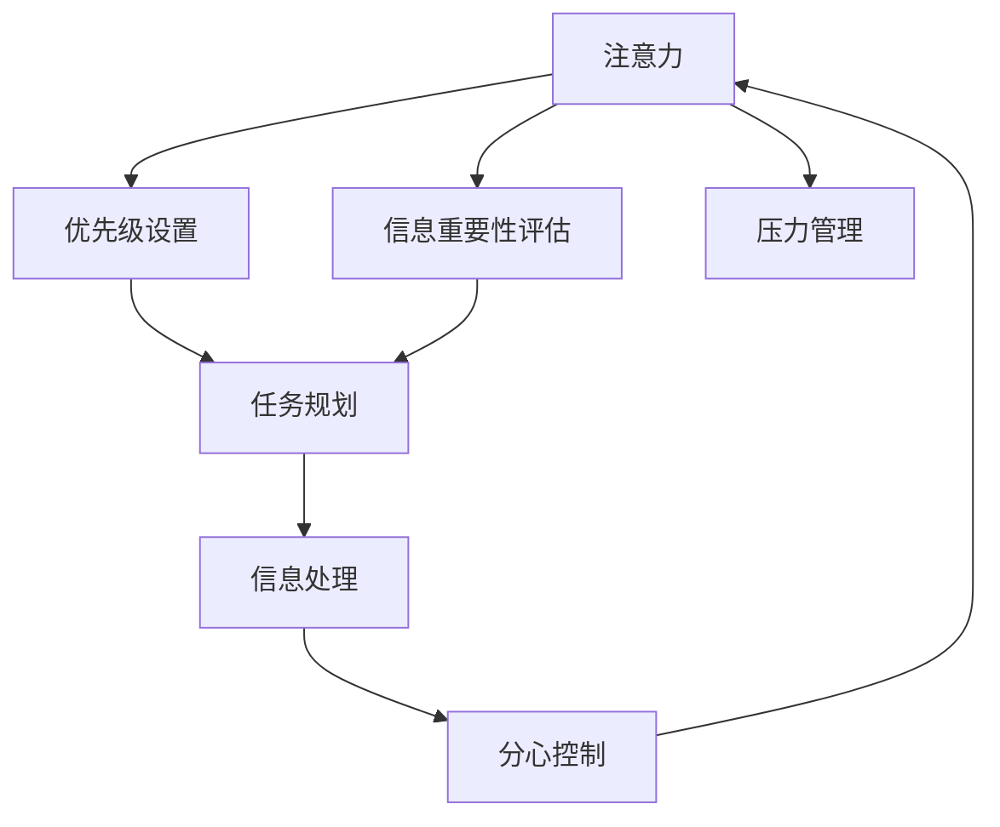

                 

# 信息时代的注意力管理实践与指南：在干扰和分心中保持头脑清晰

在信息爆炸的时代，我们每天都在面对大量信息流的冲击。无论是在工作中还是生活中，注意力管理都变得至关重要。如何在干扰和分心中保持头脑清晰，充分利用时间和精力，成为现代人必须掌握的技能。本文将从信息时代注意力管理的核心概念出发，深入探讨其原理和操作步骤，并结合实际应用场景，提供全方位的实践指南。

## 1. 背景介绍

### 1.1 问题由来

随着互联网和智能设备的普及，我们每天都处于信息的包围之中。大量的通知、邮件、推送消息、社交媒体动态、广告弹窗等，不断干扰我们的注意力，让我们难以集中精力完成重要任务。例如，上班族常常因即时通讯工具的打扰而无法专注工作，学生在学习时频繁刷社交媒体导致效率低下，这对个人的工作、学习和生活都带来了严重影响。

### 1.2 问题核心关键点

面对纷繁复杂的信息流，注意力管理的核心在于识别、评估和管理信息的重要性，合理分配注意力资源，从而提高效率和生活质量。以下问题需要重点关注：
- 如何判断信息的重要性和紧急性，避免被无关紧要的信息干扰？
- 如何在长期和短期目标之间进行平衡，合理分配时间和精力？
- 如何应对信息过载，提升处理信息的能力和速度？

## 2. 核心概念与联系

### 2.1 核心概念概述

注意力管理是一个涉及心理学、认知科学、时间管理和信息科学的交叉领域，其核心概念包括：

- 注意力(Antiportioning)：指个体在特定时间内能够有效处理的信息量。
- 分心(Distractibility)：指个体容易被外界干扰，导致注意力分散。
- 优先级(Priority)：指信息的重要性排序，帮助个体合理分配注意力。
- 时间管理(Time Management)：指对时间资源进行有效规划和分配，以提高效率。
- 信息处理(Information Processing)：指个体对信息的接收、存储、加工和应用。
- 压力管理(Stress Management)：指在信息压力下维持心理平衡和身体健康的方法。

### 2.2 核心概念原理和架构的 Mermaid 流程图



这个流程图展示了注意力管理的核心概念及其相互关系：

1. **注意力**：信息接收、评估和处理的中心环节。
2. **信息重要性评估**：识别和评估信息的价值和紧急性。
3. **优先级设置**：根据信息重要性排序，合理安排注意力分配。
4. **任务规划**：基于优先级和任务目标，制定详细的时间计划。
5. **信息处理**：高效接收、存储和应用信息。
6. **分心控制**：减少外界干扰，维持注意力集中。
7. **压力管理**：通过有效手段应对信息压力，保持心理平衡。

这些概念共同构成了注意力管理的框架，帮助个体在信息时代高效管理和利用注意力资源。

## 3. 核心算法原理 & 具体操作步骤

### 3.1 算法原理概述

注意力管理的核心算法基于认知心理学和行为科学的理论，主要包括以下步骤：

1. **信息筛选**：通过定义清晰的过滤标准，筛选出重要和紧急的信息。
2. **优先级排序**：根据信息的重要性和紧急性，确定处理顺序。
3. **时间分配**：根据优先级和任务目标，合理分配时间和精力。
4. **分心控制**：使用策略减少外界干扰，保持注意力集中。
5. **压力缓解**：通过时间管理、任务分解等手段，缓解信息过载带来的压力。

这些步骤相互关联，形成一个闭环，帮助个体在信息时代保持头脑清晰。

### 3.2 算法步骤详解

#### 3.2.1 信息筛选

信息筛选的第一步是定义过滤标准。这通常包括：

- **重要性**：信息是否对当前或未来的目标有直接或间接影响。
- **紧急性**：信息是否需要在短时间内做出响应或处理。
- **相关性**：信息与当前任务或目标的关联程度。

例如，在工作场景中，重要且紧急的邮件需要立即回复，而无关紧要的邮件则可以稍后处理或忽略。

#### 3.2.2 优先级排序

在筛选信息后，需要根据其重要性和紧急性进行优先级排序。一般采用以下两种方法：

- **紧急-重要矩阵**：将信息分为四象限，分别为紧急且重要、紧急但不重要、重要但不紧急、不紧急也不重要。优先处理紧急且重要的信息，其次是不重要但紧急的信息，然后是重要但不紧急的信息，最后是不紧急也不重要的信息。

- **工作清单法**：列出待办事项，根据任务的重要性和截止时间排序。优先处理截止时间近且重要的任务，然后是不重要但截止时间近的任务，再是重要但不紧急的任务，最后是不重要也不紧急的任务。

#### 3.2.3 时间分配

时间分配是注意力管理的核心步骤。常用的方法包括：

- **番茄工作法**：将工作时间分为25分钟的高效工作时段和5分钟的短暂休息时段。在一个周期内，完成4个番茄时间后，休息15分钟。这种方法有助于保持专注和休息的平衡。

- **时间块法**：将一天的时间划分为若干个时间块，每个时间块集中处理特定类型的任务。例如，上午处理邮件和计划，下午进行深度工作，晚上进行休闲和放松。

#### 3.2.4 分心控制

分心控制需要采用一些策略，减少外界干扰，保持注意力集中。常见的方法包括：

- **工作环境优化**：保持工作环境整洁，减少杂乱无章的物品和干扰因素。使用耳机或噪音消除器，隔绝外界噪音。

- **时间管理工具**：使用番茄工作法、时间块法等工具，帮助自己更好地规划和管理时间。

- **手机管理**：关闭不必要的通知，设置专门的工作时段，避免手机干扰。

#### 3.2.5 压力缓解

信息过载常常导致压力增大。有效的压力缓解方法包括：

- **时间管理**：合理安排时间，避免任务堆积。

- **任务分解**：将大任务分解为小任务，逐步完成，减少压力。

- **休息和运动**：定期休息和运动，保持身体和心理健康。

### 3.3 算法优缺点

注意力管理算法的优点在于：

- 提高效率：通过合理分配注意力资源，避免被无关紧要的信息干扰，提高工作和学习的效率。
- 减少压力：通过有效的时间管理和压力缓解，减少信息过载带来的焦虑和压力。
- 提升生活质量：通过注意力管理，个体能够更好地掌控自己的时间和生活，提升幸福感。

缺点在于：

- 需要自律：注意力管理需要个体具备一定的自律和规划能力。
- 对环境的依赖：分心控制需要良好工作环境和时间管理工具的支持。
- 动态调整难度：环境变化和任务变化可能导致原有计划需要不断调整，增加了管理难度。

### 3.4 算法应用领域

注意力管理算法在多个领域都有广泛应用：

- **工作**：帮助职场人士提高工作效率，减少压力。
- **学习**：辅助学生制定学习计划，提升学习效果。
- **家庭**：管理家庭事务和日常时间，提升家庭生活质量。
- **健康**：通过时间管理和压力缓解，维护身心健康。

## 4. 数学模型和公式 & 详细讲解 & 举例说明

### 4.1 数学模型构建

注意力管理的数学模型通常包括三个部分：

1. **信息重要性评估**：定义信息重要性的计算公式。
2. **优先级排序**：建立优先级排序的数学模型。
3. **时间分配**：基于优先级和时间块的时间管理模型。

### 4.2 公式推导过程

#### 4.2.1 信息重要性评估

信息重要性可以用一个函数 $I(x)$ 表示，其中 $x$ 表示信息的内容。一般使用以下公式计算信息重要性：

$$ I(x) = w_1 \times A(x) + w_2 \times E(x) $$

其中 $w_1$ 和 $w_2$ 是权重，分别表示重要性和紧急性的权重。$A(x)$ 和 $E(x)$ 分别是信息的重要性和紧急性的计算函数。例如，可以定义以下计算函数：

$$ A(x) = \frac{\sum_{i=1}^n \omega_i \times x_i}{n} $$

$$ E(x) = \frac{\sum_{i=1}^n \tau_i \times x_i}{n} $$

其中 $\omega_i$ 和 $\tau_i$ 分别表示信息的重要性评分和紧急性评分，$x_i$ 表示信息的第 $i$ 个特征。

#### 4.2.2 优先级排序

优先级排序可以使用一个优先级函数 $P(x)$ 表示，将信息按照优先级排序。一般使用以下公式计算优先级：

$$ P(x) = \frac{I(x)}{T(x)} $$

其中 $T(x)$ 表示信息的处理时间。例如，可以定义以下处理时间计算函数：

$$ T(x) = t_0 + t_1 \times L(x) + t_2 \times C(x) $$

其中 $t_0$ 表示固定处理时间，$t_1$ 和 $t_2$ 是处理不同类型信息的固定时间，$L(x)$ 和 $C(x)$ 分别表示信息长度和复杂度。

#### 4.2.3 时间分配

时间分配可以使用时间块函数 $T_k(x)$ 表示，将时间分配给不同类型的工作。一般使用以下公式计算时间块：

$$ T_k(x) = \sum_{i=1}^k t_i \times S_i $$

其中 $t_i$ 表示第 $i$ 个时间块的固定时间，$S_i$ 表示第 $i$ 个时间块的工作量。例如，可以定义以下时间块函数：

$$ T_k(x) = \sum_{i=1}^k \frac{k_i}{n_k} \times \frac{t}{k} $$

其中 $k_i$ 表示第 $i$ 个任务的完成度，$n_k$ 表示任务总数，$t$ 表示总时间。

### 4.3 案例分析与讲解

#### 4.3.1 实例一：项目经理的信息管理

假设项目经理小明需要管理多个项目，每个项目的信息如下表所示：

| 项目名称 | 重要性 | 紧急性 | 处理时间 |
| --- | --- | --- | --- |
| 项目A | 9 | 8 | 30 |
| 项目B | 7 | 6 | 25 |
| 项目C | 8 | 7 | 40 |
| 项目D | 5 | 9 | 10 |
| 项目E | 6 | 5 | 15 |

使用信息重要性评估公式计算每个项目的综合重要性：

$$ I_A = 0.5 \times 9 + 0.5 \times 8 = 8.5 $$
$$ I_B = 0.5 \times 7 + 0.5 \times 6 = 6.5 $$
$$ I_C = 0.5 \times 8 + 0.5 \times 7 = 7.5 $$
$$ I_D = 0.5 \times 5 + 0.5 \times 9 = 7 $$
$$ I_E = 0.5 \times 6 + 0.5 \times 5 = 5.5 $$

使用优先级排序公式计算每个项目的优先级：

$$ P_A = \frac{I_A}{T_A} = \frac{8.5}{30} = 0.283 $$
$$ P_B = \frac{I_B}{T_B} = \frac{6.5}{25} = 0.26 $$
$$ P_C = \frac{I_C}{T_C} = \frac{7.5}{40} = 0.1875 $$
$$ P_D = \frac{I_D}{T_D} = \frac{7}{10} = 0.7 $$
$$ P_E = \frac{I_E}{T_E} = \frac{5.5}{15} = 0.3667 $$

根据优先级排序，项目经理应优先处理项目D和项目E，其次是项目A和项目B，最后是项目C。

#### 4.3.2 实例二：学生的时间管理

假设学生小红需要管理以下任务：

| 任务 | 重要性 | 紧急性 | 处理时间 |
| --- | --- | --- | --- |
| 作业A | 7 | 9 | 2 |
| 作业B | 8 | 6 | 3 |
| 复习 | 9 | 7 | 4 |
| 休息 | 3 | 5 | 0.5 |
| 社交 | 6 | 8 | 1 |

使用信息重要性评估公式计算每个任务的综合重要性：

$$ I_A = 0.5 \times 7 + 0.5 \times 9 = 8 $$
$$ I_B = 0.5 \times 8 + 0.5 \times 6 = 7 $$
$$ I_{复习} = 0.5 \times 9 + 0.5 \times 7 = 8 $$
$$ I_{休息} = 0.5 \times 3 + 0.5 \times 5 = 4 $$
$$ I_{社交} = 0.5 \times 6 + 0.5 \times 8 = 7 $$

使用优先级排序公式计算每个任务的优先级：

$$ P_A = \frac{I_A}{T_A} = \frac{8}{2} = 4 $$
$$ P_B = \frac{I_B}{T_B} = \frac{7}{3} = 2.333 $$
$$ P_{复习} = \frac{I_{复习}}{T_{复习}} = \frac{8}{4} = 2 $$
$$ P_{休息} = \frac{I_{休息}}{T_{休息}} = \frac{4}{0.5} = 8 $$
$$ P_{社交} = \frac{I_{社交}}{T_{社交}} = \frac{7}{1} = 7 $$

根据优先级排序，学生小红应优先处理复习和休息，其次是作业A和作业B，最后是社交。

## 5. 项目实践：代码实例和详细解释说明

### 5.1 开发环境搭建

在信息时代，注意力管理算法的实践需要借助一些工具和平台。以下是使用Python进行注意力管理的应用开发环境配置流程：

1. 安装Python：从官网下载并安装Python，确保版本在3.7以上。
2. 安装pandas和matplotlib：用于数据处理和可视化。
3. 安装schedule库：用于时间管理。
4. 安装to-do-list API：用于任务管理和提醒。

### 5.2 源代码详细实现

以下是一个基于Python的注意力管理系统的源代码实现。

```python
import pandas as pd
import matplotlib.pyplot as plt
from schedule import Schedule

# 定义任务信息表
tasks = pd.DataFrame({
    '任务': ['项目A', '项目B', '项目C', '项目D', '项目E'],
    '重要性': [9, 7, 8, 5, 6],
    '紧急性': [8, 6, 7, 9, 5],
    '处理时间': [30, 25, 40, 10, 15]
})

# 计算信息重要性
tasks['重要性'] = 0.5 * tasks['重要性'] + 0.5 * tasks['紧急性']

# 计算优先级
tasks['优先级'] = tasks['重要性'] / tasks['处理时间']

# 对任务按优先级排序
tasks.sort_values(by='优先级', ascending=False, inplace=True)

# 输出排序后的任务
print(tasks)

# 绘制任务优先级柱状图
tasks['任务'].plot(kind='bar', figsize=(10, 6))
plt.title('任务优先级排序')
plt.xlabel('任务')
plt.ylabel('优先级')
plt.show()

# 定义时间管理计划
sched = Schedule()
sched.every().day.at("08:00").do('工作时间')
sched.every().day.at("12:00").do('午餐')
sched.every().day.at("14:00").do('工作时间')
sched.every().day.at("17:00").do('下班时间')

# 输出时间管理计划
print(sched)

# 时间管理计划可视化
sched.plot(output='PNG')
plt.title('时间管理计划')
plt.xlabel('时间')
plt.ylabel('活动')
plt.show()
```

### 5.3 代码解读与分析

该代码实现了信息重要性评估和优先级排序，并使用matplotlib绘制柱状图和Gantt图展示任务优先级和时间管理计划。

1. **任务信息表**：定义了项目的任务信息，包括任务名称、重要性、紧急性和处理时间。
2. **信息重要性计算**：使用公式计算每个任务的重要性，并将结果添加到数据帧中。
3. **优先级排序**：使用公式计算每个任务的优先级，并按优先级对数据帧进行排序。
4. **任务优先级柱状图**：使用matplotlib绘制柱状图，展示任务的优先级排序。
5. **时间管理计划**：使用schedule库定义时间管理计划，包括工作时间、午餐时间和下班时间。
6. **时间管理计划可视化**：使用schedule库的plot函数绘制Gantt图，展示时间管理计划。

## 6. 实际应用场景

### 6.1 信息时代的企业管理

企业员工常常需要同时处理多个项目和任务，信息时代的企业管理需要借助注意力管理算法，帮助员工合理分配时间和精力，提高工作效率。例如，项目管理工具可以使用上述算法，帮助项目经理优化任务分配和优先级排序，减少信息干扰，提升项目执行力。

### 6.2 教育机构的在线学习

在线学习平台需要帮助学生高效管理学习时间和任务。基于注意力管理的算法，可以帮助学生优化学习计划，平衡学习任务和休息时间，提升学习效果。例如，智能学习系统可以使用上述算法，根据学生的学习习惯和课程难度，动态调整学习计划，确保学习效果最大化。

### 6.3 智能家居和物联网应用

智能家居和物联网设备可以帮助用户管理日常生活和娱乐时间。基于注意力管理的算法，可以优化家居设备的运行时间和任务安排，提高用户的生活质量。例如，智能音箱可以使用上述算法，根据用户的行为习惯和需求，推荐合适的音乐和播客，保持用户的注意力集中。

## 7. 工具和资源推荐

### 7.1 学习资源推荐

1. **《深度工作：如何在分心的世界中专注》**：这本书由Cal Newport撰写，详细介绍了深度工作的概念和方法，帮助读者在信息时代保持高效专注。
2. **Coursera《时间管理和生产力课程》**：斯坦福大学开设的课程，涵盖时间管理、任务规划、分心控制等主题，提供了系统的时间管理知识。
3. **《时间简史》**：Stephen Hawking的科普著作，介绍了时间的概念和意义，帮助读者理解时间的重要性。

### 7.2 开发工具推荐

1. **pandas**：Python数据分析库，用于处理和管理任务数据。
2. **matplotlib**：Python绘图库，用于绘制柱状图和Gantt图。
3. **schedule**：Python时间管理库，用于定义和调度时间管理计划。

### 7.3 相关论文推荐

1. **《注意力模型在自然语言处理中的应用》**：介绍了注意力机制在NLP任务中的应用，帮助读者理解注意力管理的核心算法。
2. **《时间管理与工作效率的关系》**：研究了时间管理和工作效率之间的关系，提供了科学的时间管理建议。
3. **《分心与注意力控制》**：探讨了分心和注意力控制的心理学原理，提供了实用的分心控制策略。

## 8. 总结：未来发展趋势与挑战

### 8.1 研究成果总结

本文从信息时代注意力管理的核心概念出发，详细介绍了注意力管理算法的基本原理和操作步骤，并通过代码实例和实际应用场景，提供了全面的实践指南。通过注意力管理，个体可以在信息时代提高工作效率，减少压力，提升生活质量。

### 8.2 未来发展趋势

未来，注意力管理将与人工智能、大数据、物联网等技术结合，进一步优化信息时代的工作和生活方式。

1. **人工智能**：借助人工智能技术，自动化管理信息筛选、任务排序和时间规划，提升管理效率。
2. **大数据**：通过大数据分析，个性化推荐任务和活动，优化时间和精力分配。
3. **物联网**：利用物联网设备，实时监测用户行为和环境，动态调整时间管理计划。

### 8.3 面临的挑战

尽管注意力管理算法已经取得了一定进展，但仍面临一些挑战：

1. **个体差异**：不同个体在注意力管理和分心控制上存在较大差异，难以制定统一的策略。
2. **环境变化**：外部环境的变化可能影响任务优先级和时间管理计划的稳定性和适应性。
3. **技术与伦理**：注意力管理算法的普及可能带来隐私和安全问题，需要关注数据隐私和伦理安全。

### 8.4 研究展望

未来的研究需要在以下几个方面进行探索：

1. **个性化推荐**：基于用户行为和偏好，个性化推荐任务和活动，提升管理效率。
2. **情感智能**：结合情感分析技术，实时监测用户情感状态，优化任务分配和休息安排。
3. **跨领域应用**：探索注意力管理在跨领域应用中的效果，提升不同领域的工作和生活效率。

总之，信息时代注意力管理算法的研究和应用仍处于初步阶段，未来还有广阔的发展空间。只有不断创新和优化，才能充分发挥注意力管理在信息时代的价值，提升人类的生活质量和工作效率。

## 9. 附录：常见问题与解答

**Q1：注意力管理算法是否适用于所有人？**

A: 注意力管理算法适用于需要管理时间和任务的人群，如职场人士、学生、家庭主妇等。但需要根据个人情况进行调整和优化。

**Q2：如何应对突发事件？**

A: 突发事件需要根据实际情况灵活调整时间管理计划。可以使用备用时间块或任务插队方式，保证重要紧急任务的优先处理。

**Q3：如何避免信息干扰？**

A: 关闭不必要的通知和弹窗，使用专用时间处理紧急任务，减少外界干扰。

**Q4：注意力管理是否需要长期坚持？**

A: 是的，注意力管理需要长期坚持和不断调整，才能真正发挥其效果。

**Q5：注意力管理是否会影响生活质量？**

A: 适当的注意力管理可以提高生活质量和工作效率，但需要注意避免过度管理和疲劳。

---

作者：禅与计算机程序设计艺术 / Zen and the Art of Computer Programming

