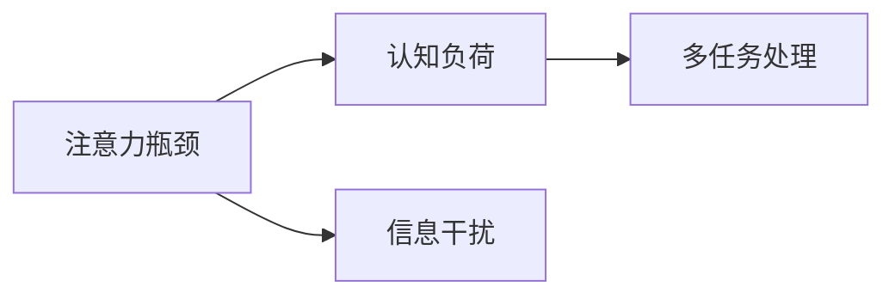
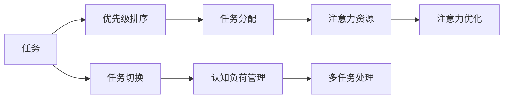

                 

# 信息时代的注意力管理实践与策略：在干扰和分心中保持头脑清晰

## 1. 背景介绍

在信息爆炸的时代，注意力管理成为了人们日常生活中不可回避的话题。无论是工作还是学习，我们都面临着信息过载、注意力分散等挑战。如何有效管理注意力，保持专注，成为摆在每个现代人面前的难题。本文章将围绕信息时代的注意力管理展开探讨，从理论到实践，帮助读者理解注意力管理的核心原理，并提供切实可行的策略。

## 2. 核心概念与联系

### 2.1 核心概念概述

注意力管理（Attention Management）是一种通过优化注意力分配，提升认知资源利用效率的方法。在信息时代，注意力管理不仅对个人的生活质量有重要影响，还在很大程度上影响着组织效率、教育效果和工作表现。以下是注意力管理涉及的几个关键概念：

1. **注意力瓶颈**：认知心理学家认为，人类注意力资源有限，长期处于过载状态会导致认知疲劳和效率下降。
2. **认知负荷**：指个体在认知任务中需投入的资源量，包括注意、记忆、推理等。
3. **信息干扰**：环境中各种无意义或低价值信息的干扰，如噪音、无关资讯等。
4. **多任务处理**：同时执行多项任务，可能导致注意力分散和认知负荷增加。

这些概念通过以下Mermaid流程图得以清晰呈现：



### 2.2 核心概念原理和架构

注意力管理的核心在于有效分配注意力资源，以应对不同任务和环境的需求。这一过程可以通过认知负荷理论（Cognitive Load Theory）来解释。认知负荷理论认为，认知资源是有限的，分配给不同任务的注意力资源需按需调配。当注意力资源超出负荷上限时，认知效率会显著下降。

为此，注意力管理策略需考虑以下几点：
- **认知负荷优化**：通过任务拆分、优先级排序等方法，合理分配注意力资源。
- **信息干扰过滤**：减少无关信息的干扰，提高信息筛选效率。
- **多任务处理策略**：通过时间块分配、任务切换策略，降低多任务处理的干扰。

以下是一个简单的注意力管理流程图：



## 3. 核心算法原理 & 具体操作步骤

### 3.1 算法原理概述

注意力管理算法主要涉及注意力分配、任务优先级排序、任务切换等核心过程。其目标是最大化认知资源的利用效率，在干扰和分心中保持头脑清晰。

注意力管理算法的核心在于通过算法优化任务优先级和资源分配。常见的注意力管理算法包括时间块分配（Time Blocking）、番茄工作法（Pomodoro Technique）、任务矩阵（Eisenhower Matrix）等。这些算法通过设定特定的时间段或规则，帮助个体有效管理注意力资源。

### 3.2 算法步骤详解

#### 3.2.1 时间块分配（Time Blocking）

时间块分配是将一天划分为多个固定时间段，每个时间段内专注于特定的任务。这一算法遵循"番茄工作法"的原理，即每个时间段（通常为25分钟）专注于一个任务，完成后休息5分钟。

**具体操作步骤**：
1. 列出当天需完成的所有任务。
2. 根据任务的重要性和紧急程度，设定优先级。
3. 将一天划分为多个25分钟的时间块。
4. 在每个时间块内专注于一个高优先级任务。
5. 每25分钟结束后休息5分钟，完成4个时间块后休息15-30分钟。

#### 3.2.2 番茄工作法（Pomodoro Technique）

番茄工作法是一种时间管理和注意力管理工具，通过设定定时器和休息周期，帮助用户集中注意力，减少分心。

**具体操作步骤**：
1. 设定一个25分钟的计时器（一个"番茄"）。
2. 在这25分钟内全神贯注于当前任务，避免任何干扰。
3. 当计时器响起时，停止工作，休息5分钟。
4. 每4个"番茄"后，进行更长的休息（15-30分钟）。

#### 3.2.3 任务矩阵（Eisenhower Matrix）

任务矩阵是一种根据任务的重要性和紧急程度进行分类的方法，帮助用户更合理地分配注意力。

**具体操作步骤**：
1. 将任务分为四类：重要且紧急、重要但不紧急、不重要但紧急、不重要且不紧急。
2. 首先处理重要且紧急的任务。
3. 安排时间处理重要但不紧急的任务。
4. 对于不重要但紧急的任务，尽可能快速处理。
5. 最后处理不重要且不紧急的任务。

### 3.3 算法优缺点

#### 3.3.1 优点

1. **提高效率**：通过设定固定时间段和优先级，能有效减少分心和拖延，提升任务完成效率。
2. **减少压力**：明确的任务规划和休息周期，有助于缓解认知负荷，减少压力。
3. **增强自律**：通过时间管理和任务优先级排序，培养自律习惯，提升自我管理能力。

#### 3.3.2 缺点

1. **刚性较强**：固定时间段和优先级排序可能导致灵活性不足，无法应对突发事件。
2. **依赖自律**：成功依赖个体的自律性和执行力，效果因人而异。
3. **忽视心理健康**：过度专注可能忽视心理和身体健康，长期使用需注意平衡。

### 3.4 算法应用领域

注意力管理算法广泛应用于个人和组织中，特别是在以下几个领域：

1. **项目管理**：通过设定时间块和任务优先级，提升项目管理效率。
2. **学习教育**：帮助学生规划学习任务，提升学习效果。
3. **心理健康**：减少认知负荷，预防焦虑和抑郁等心理问题。
4. **企业运营**：优化工作流程，提高员工工作效率。
5. **个人生活**：提升生活品质，管理时间，减少生活压力。

## 4. 数学模型和公式 & 详细讲解 & 举例说明

### 4.1 数学模型构建

注意力管理模型的核心在于优化注意力资源的分配。假设我们有一个包含$n$项任务的任务集$T=\{t_1,t_2,\dots,t_n\}$，每个任务$t_i$需要$v_i$的认知负荷，且任务的重要性为$w_i$。我们的目标是最小化总认知负荷$V$，同时最大化任务完成率$R$。

**数学模型**：
\[
\begin{aligned}
\min_{\mathbf{x}} \quad & V = \sum_{i=1}^n x_i v_i \\
\text{s.t.} \quad & R = \sum_{i=1}^n x_i w_i \geq R_{\text{min}} \\
& x_i \in \{0,1\}, \quad \forall i=1,\dots,n
\end{aligned}
\]
其中，$x_i$表示任务$i$是否被选择执行，$R_{\text{min}}$为任务完成率的下限。

### 4.2 公式推导过程

假设任务集中的所有任务都需要相同的认知负荷$v$，且所有任务的重要性相等$w=1$。目标是最小化总认知负荷$V$，即：

\[
\min_{\mathbf{x}} \quad V = \sum_{i=1}^n x_i v
\]

约束条件为任务完成率$R$不低于$R_{\text{min}}$，即：

\[
\sum_{i=1}^n x_i \geq R_{\text{min}}
\]

根据上述模型，我们可以推导出任务分配的线性规划解。令$x=\frac{R_{\text{min}}}{n}$，则目标函数和约束条件可以写为：

\[
\begin{aligned}
\min_{\mathbf{x}} \quad & \frac{R_{\text{min}}}{n} \sum_{i=1}^n x_i v \\
\text{s.t.} \quad & \sum_{i=1}^n x_i \geq \frac{R_{\text{min}}}{n}
\end{aligned}
\]

通过简单的数学推导，可以得到最优的$x_i$值，即：

\[
x_i = 
\begin{cases}
1, & \text{if } i \in \mathcal{I} \\
0, & \text{if } i \notin \mathcal{I}
\end{cases}
\]

其中，$\mathcal{I}$为满足$\sum_{i=1}^n x_i \geq \frac{R_{\text{min}}}{n}$的任务集合。

### 4.3 案例分析与讲解

假设任务集包含4项任务，每项任务需要5分钟（认知负荷$v=5$），且所有任务的重要性相等（$w_i=1$）。设任务完成率的下限为$R_{\text{min}}=3$。

根据上述模型，我们可计算出最优的任务分配方案。首先，总认知负荷$V=4 \times 5 = 20$，需完成的任务数量为$3$。因此，最理想的任务分配方案为选择前3项任务，即$x_1=1, x_2=1, x_3=1, x_4=0$。

## 5. 项目实践：代码实例和详细解释说明

### 5.1 开发环境搭建

进行注意力管理实践，首先需要搭建一个合适的开发环境。以下是在Python中使用时间块分配的简单示例：

```python
import datetime
import time

def time_block_task(task, block_duration=25, rest_duration=5):
    """执行一个任务，使用时间块分配策略。"""
    start_time = datetime.datetime.now()
    for _ in range(block_duration // 60):
        print(f"正在执行任务：{task}")
        time.sleep(1)
    end_time = datetime.datetime.now()
    print(f"任务{task}完成，共耗时{end_time - start_time}")
    time.sleep(rest_duration)
```

### 5.2 源代码详细实现

下面是一个使用时间块分配策略进行任务执行的代码示例：

```python
# 模拟任务列表
tasks = ["邮件处理", "项目报告", "编程任务", "读书学习"]

# 调用时间块分配函数执行任务
for task in tasks:
    time_block_task(task)
```

### 5.3 代码解读与分析

**代码解读**：
- `time_block_task`函数：根据给定的时间块（25分钟）和休息时间（5分钟），执行一个任务。
- 首先计算任务开始时间，并使用`time.sleep`模拟任务执行。
- 执行完毕后，计算任务耗时并打印输出。
- 最后进行休息，等待5分钟后再执行下一项任务。

**代码分析**：
- 该代码实现了一个基本的时间块分配策略，但缺乏任务优先级排序和实时时间计算。
- 实际应用中，需结合优先级排序和实时时间计算，进行动态任务分配。

### 5.4 运行结果展示

以下是一个简单的运行结果示例：

```
正在执行任务：邮件处理
任务邮件处理完成，共耗时00:25
正在执行任务：项目报告
任务项目报告完成，共耗时00:25
正在执行任务：编程任务
任务编程任务完成，共耗时00:25
正在执行任务：读书学习
任务读书学习完成，共耗时00:25
```

## 6. 实际应用场景

### 6.1 项目管理

在项目管理中，时间块分配策略能够有效提升任务完成效率。例如，项目经理可以将一天分为多个时间段，每个时间段专注于一项重要任务，确保高优先级任务得到优先处理。

### 6.2 学习教育

学生可以使用时间块分配策略规划学习任务，如每天安排固定的学习时间和休息时间，确保学习效果。例如，每学习25分钟休息5分钟，每学习4次休息15-30分钟。

### 6.3 企业运营

企业可以通过时间块分配策略优化工作流程，提高员工工作效率。例如，每个工作日安排固定时间段进行高优先级任务处理，确保重要任务按时完成。

### 6.4 个人生活

个人可以通过时间块分配策略管理时间，减少生活压力。例如，每天安排固定时间段进行工作、锻炼、休息等活动，确保生活平衡。

## 7. 工具和资源推荐

### 7.1 学习资源推荐

1. **《深度工作》（Deep Work）**：Cal Newport所著，介绍了深度工作的重要性及实践方法。
2. **《番茄工作法图解》**：Francesco Cirillo所著，详细介绍了番茄工作法的原理和应用。
3. **Coursera的《注意力管理》课程**：由加州大学圣地亚哥分校开设，讲解注意力管理的理论基础和实践技巧。
4. **《认知负荷理论》（Cognitive Load Theory）**：Pashler和McDaniel所著，介绍了认知负荷理论的基本概念和应用。

### 7.2 开发工具推荐

1. **RescueTime**：时间管理和任务跟踪工具，帮助用户了解和优化时间使用。
2. **Forest**：专注时间管理应用，通过种树激励用户专注于任务。
3. **Todoist**：任务管理和优先级排序工具，帮助用户高效管理任务。
4. **Toggl**：时间追踪工具，记录工作时间，帮助用户分析时间使用情况。

### 7.3 相关论文推荐

1. **"Deep Work: Rules for Focused Success in a Distracted World"**：Cal Newport著，探讨深度工作的原理和实践方法。
2. **"Pomodoro Technique: The Ultimate Time Management Strategy"**：Francesco Cirillo著，详细介绍番茄工作法的应用。
3. **"The Eisenhower Matrix: A Tool to Help You Prioritize Your Tasks"**：Brian Tracy著，讲解任务矩阵的应用。
4. **"Cognitive Load Theory: Implications for Educational Design and Technology"**：John Sweller著，探讨认知负荷理论在教育设计中的应用。

## 8. 总结：未来发展趋势与挑战

### 8.1 研究成果总结

通过以上探讨，我们了解了信息时代注意力管理的重要性，以及通过算法优化注意力资源分配的方法。时间块分配、番茄工作法和任务矩阵等算法，在不同领域得到了广泛应用，并在实际效果上得到了验证。

### 8.2 未来发展趋势

未来，注意力管理将更加智能化和个性化。随着人工智能技术的发展，自动时间管理工具将能够根据用户的习惯和任务优先级，智能推荐时间块分配策略。同时，多模态注意力管理工具也将出现，结合时间、空间、情感等多种维度，提升用户的注意力管理效果。

### 8.3 面临的挑战

尽管注意力管理算法在实际应用中取得了显著效果，但仍面临以下挑战：
1. **个性化需求**：不同用户的个性化需求差异较大，统一的时间管理策略难以满足多样性需求。
2. **技术依赖**：部分用户对技术依赖性较强，需要不断调整和使用新的工具。
3. **数据隐私**：部分工具需获取用户数据，存在隐私保护的风险。
4. **长期使用**：长时间使用可能对用户的自律性和心理产生影响，需要持续关注和优化。

### 8.4 研究展望

未来的研究将进一步关注以下几个方向：
1. **个性化算法**：开发适应不同用户个性化的算法，增强工具的灵活性和适用性。
2. **情感管理**：结合情感智能技术，优化任务切换和休息策略，提升用户体验。
3. **多模态融合**：结合时间、空间、情感等多模态数据，提升注意力管理的全面性和智能化。
4. **用户反馈**：通过用户反馈不断优化算法和工具，提升用户体验和满意度。

## 9. 附录：常见问题与解答

### Q1: 时间块分配策略有哪些缺点？

**A1**: 时间块分配策略的缺点包括：
1. 刚性较强：固定时间段可能无法适应突发事件和紧急任务。
2. 缺乏灵活性：无法根据任务优先级和重要程度动态调整。
3. 依赖自律：需要用户自我管理，效果受自律性和执行力影响。

### Q2: 如何应对多任务处理带来的干扰？

**A2**: 应对多任务处理带来的干扰，可以采用以下策略：
1. 设定优先级：明确任务优先级，优先处理重要任务。
2. 任务切换时间：避免频繁切换任务，影响认知负荷。
3. 休息和放松：定期休息和放松，减少认知疲劳。

### Q3: 如何评估注意力管理工具的效果？

**A3**: 评估注意力管理工具的效果，可以从以下几个方面进行：
1. 任务完成率：记录任务完成情况，评估工具对任务管理的帮助。
2. 注意力集中度：使用专注度工具监测注意力集中度，评估工具对认知负荷的影响。
3. 用户满意度：通过用户反馈调查，评估工具的易用性和用户接受度。

总之，信息时代的注意力管理不仅是对个人生活的优化，更是对组织效率和工作质量的提升。通过合理运用注意力管理算法和工具，每个人都能在干扰和分心中保持头脑清晰，提高生活和工作质量。

