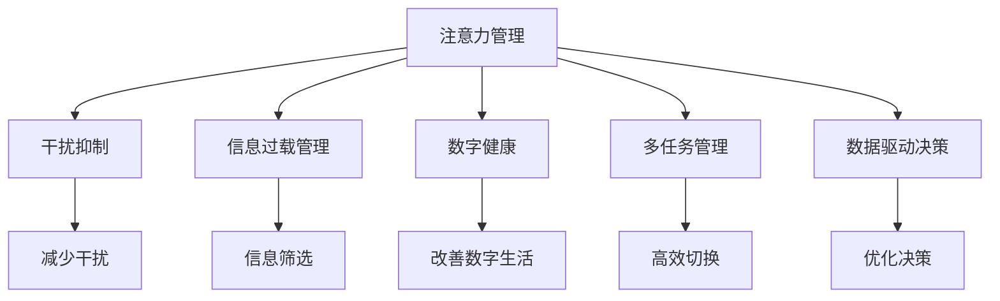

                 

# 信息时代的注意力管理技术与策略：在干扰和信息过载中保持专注

> 关键词：注意力管理,干扰抑制,信息过载,数字鸿沟,数字健康

## 1. 背景介绍

### 1.1 问题由来

信息时代的迅猛发展，带来空前的便利与效率提升，但同时也造成注意力管理上的严峻挑战。从智能手机到社交媒体，从虚拟现实到电子游戏，信息与干扰无处不在，严重分散了我们的注意力，影响了工作效率和生活质量。如何在信息爆炸的时代保持专注，提升个体和组织的能力，成为一个亟待解决的问题。

注意力管理技术的兴起，为解决这一问题提供了重要途径。通过运用科学的方法和工具，帮助个体和组织高效管理注意力，提升其在复杂多变的信息环境中保持专注和高效工作的能力。

### 1.2 问题核心关键点

注意力管理的核心在于如何有效地控制和管理注意力资源，使其能够在面对各种干扰和信息过载时，维持在一个较高的水平。主要包括以下几个关键点：

1. **干扰抑制**：识别并减少外界干扰因素，提高工作的专注度。
2. **信息过载管理**：对海量信息进行有效筛选和处理，减轻大脑负担。
3. **数字健康**：通过科学的方法改善个人数字生活，减少对注意力的损害。
4. **多任务管理**：在多任务环境中保持高效切换和协调。
5. **数据驱动决策**：利用数据分析技术，优化注意力分配策略。

这些关键点共同构成了注意力管理的框架，使其能够有效应对信息时代的多重挑战，提升个体和组织的整体效能。

### 1.3 问题研究意义

面对信息时代的信息过载和注意力分散问题，注意力管理技术的研究和应用具有重要意义：

1. **提升工作效率**：通过科学的注意力管理，减少干扰，提高个人和组织的工作效率。
2. **改善生活质量**：减少数字产品对注意力的影响，提高生活的幸福感。
3. **促进健康发展**：通过技术手段改善数字健康，避免注意力疲劳和信息依赖症。
4. **推动科技普及**：通过技术教育，提升大众对注意力管理技术的认知和使用能力。
5. **推动相关产业**：注意力管理技术的普及将催生新的注意力管理产业，如注意力管理工具、教育培训、健康咨询等。

## 2. 核心概念与联系

### 2.1 核心概念概述

为更好地理解注意力管理的核心技术和策略，本节将介绍几个关键概念：

- **注意力管理(Attention Management)**：通过科学方法和技术工具，帮助个体和组织有效控制和管理注意力资源，提升工作效率和生活质量。
- **干扰抑制(Interference Suppression)**：识别并减少外界干扰因素，提升工作的专注度。
- **信息过载管理(Information Overload Management)**：对海量信息进行有效筛选和处理，减轻大脑负担。
- **数字健康(Digital Well-being)**：通过技术手段改善数字生活，减少对注意力的损害。
- **多任务管理(Multitask Management)**：在多任务环境中保持高效切换和协调。
- **数据驱动决策(Data-Driven Decision Making)**：利用数据分析技术，优化注意力分配策略。

这些核心概念之间的逻辑关系可以通过以下Mermaid流程图来展示：



这个流程图展示了几大核心概念及其之间的关系：

1. 注意力管理通过干扰抑制、信息过载管理、数字健康、多任务管理、数据驱动决策等多方面的技术手段，提升个体和组织注意力的控制和管理能力。
2. 干扰抑制帮助识别并减少外界干扰，提高工作的专注度。
3. 信息过载管理通过有效筛选和处理海量信息，减轻大脑负担。
4. 数字健康通过技术手段改善数字生活，减少对注意力的损害。
5. 多任务管理在多任务环境中保持高效切换和协调。
6. 数据驱动决策利用数据分析技术，优化注意力分配策略。

这些概念共同构成了注意力管理的核心框架，使其能够有效应对信息时代的多重挑战，提升个体和组织的整体效能。

## 3. 核心算法原理 & 具体操作步骤
### 3.1 算法原理概述

注意力管理的核心在于如何通过科学的算法和技术手段，帮助个体和组织有效控制和管理注意力资源。其基本原理如下：

1. **识别注意力资源**：通过注意力模型，识别个体或组织在特定任务中的注意力分配情况。
2. **识别干扰因素**：通过干扰模型，识别并量化外界干扰因素对注意力的影响。
3. **信息筛选与处理**：通过信息筛选模型，对海量信息进行筛选和处理，减轻大脑负担。
4. **优化注意力分配**：通过优化模型，调整注意力分配策略，提高注意力资源的使用效率。
5. **改善数字生活**：通过数字健康模型，改善数字生活，减少对注意力的损害。

基于这些原理，注意力管理技术可以分为干扰抑制、信息过载管理、数字健康、多任务管理和数据驱动决策五个关键环节，每个环节都有对应的算法和技术手段。

### 3.2 算法步骤详解

基于上述原理，注意力管理的实际操作步骤可以分为以下几个阶段：

**Step 1: 数据收集与预处理**
- 使用注意力监控工具（如眼动追踪器、热力图工具）收集用户在不同任务中的注意力分布数据。
- 通过问卷调查、日志分析等方式收集用户的行为数据和心理状态数据。
- 对数据进行清洗和预处理，去除噪声和异常值。

**Step 2: 模型训练与优化**
- 使用机器学习算法训练注意力模型、干扰模型、信息筛选模型和优化模型。
- 通过交叉验证和调参技术，优化模型的性能。
- 使用模型评估指标（如准确率、召回率、F1值等）评估模型效果。

**Step 3: 策略制定与实施**
- 根据模型输出，制定注意力管理策略，如设置工作时间段、调整工作环境、优化任务结构等。
- 在实际应用中实施策略，监控注意力分配情况，根据反馈调整策略。

**Step 4: 效果评估与迭代**
- 定期评估注意力管理策略的效果，收集用户反馈。
- 根据评估结果和用户反馈，迭代优化模型和策略。

### 3.3 算法优缺点

注意力管理技术具有以下优点：

1. **科学性和可量化**：通过科学的模型和数据驱动的方法，能够量化注意力资源的使用情况和影响因素，提高决策的科学性。
2. **个性化和适应性**：通过个性化的策略制定，能够适应不同用户和组织的需求，提高策略的适用性。
3. **技术可扩展性**：结合多种技术和工具，能够实现多维度的注意力管理，提高整体效能。

但同时也存在一些局限性：

1. **数据隐私和安全**：注意力监控和数据分析可能涉及用户隐私，需要确保数据的安全性和隐私保护。
2. **技术依赖性**：注意力管理技术的实施需要依赖相应的工具和算法，可能存在技术门槛。
3. **用户接受度**：用户对注意力监控和数据分析可能存在抵触心理，需要做好用户教育和沟通。

### 3.4 算法应用领域

注意力管理技术已经广泛应用于多个领域，包括但不限于：

1. **企业生产管理**：通过优化注意力分配，提高工作效率和质量。
2. **教育培训**：帮助学生有效管理注意力，提升学习效果。
3. **健康管理**：改善数字生活，减少注意力疲劳和信息依赖症。
4. **个人生活**：优化日常工作和生活安排，提高生活质量。
5. **政府公共服务**：提升公共服务的响应速度和效率。

## 4. 数学模型和公式 & 详细讲解 & 举例说明
### 4.1 数学模型构建

本节将使用数学语言对注意力管理的核心算法进行更严格的刻画。

假设用户在进行任务 $i$ 时，注意力分配情况由向量 $a_i$ 表示，其中 $a_i=(a_{i1}, a_{i2}, ..., a_{in})$，表示用户在任务 $i$ 中的注意力分配到不同任务项的比例。设干扰因素向量为 $f_i=(f_{i1}, f_{i2}, ..., f_{in})$，表示任务 $i$ 中不同任务项的干扰程度。任务 $i$ 的实际完成情况由 $c_i$ 表示，其中 $c_i=(c_{i1}, c_{i2}, ..., c_{in})$，表示任务 $i$ 中不同任务项的完成情况。

定义任务 $i$ 的注意力模型为 $M_i(a_i, f_i)$，表示在干扰因素 $f_i$ 的影响下，注意力分配 $a_i$ 对任务完成情况 $c_i$ 的预测。

### 4.2 公式推导过程

以下是注意力模型和干扰模型的公式推导过程。

**注意力模型 $M_i$**：
假设任务 $i$ 的注意力模型为线性回归模型，则有：
$$
M_i(a_i, f_i) = \beta_0 + \beta_1 a_{i1} + \beta_2 a_{i2} + ... + \beta_n a_{in} + \epsilon_i
$$

其中 $\beta_k$ 为注意力模型中任务 $i$ 第 $k$ 项的系数，$\epsilon_i$ 为误差项。

**干扰模型 $I_i$**：
假设干扰模型为线性回归模型，则有：
$$
I_i(a_i, f_i) = \alpha_0 + \alpha_1 a_{i1} + \alpha_2 a_{i2} + ... + \alpha_n a_{in} + \delta_i
$$

其中 $\alpha_k$ 为干扰模型中任务 $i$ 第 $k$ 项的系数，$\delta_i$ 为误差项。

### 4.3 案例分析与讲解

以一个企业员工使用注意力管理系统的案例来说明注意力模型的实际应用：

**背景**：某企业员工在使用注意力管理系统时，通过眼动追踪器收集了其在一段时间内的注意力分配情况，同时记录了员工完成任务的情况。

**数据**：设员工在任务 $i$ 的注意力分配情况为 $a_i=(0.5, 0.3, 0.2)$，表示任务 $i$ 中不同任务项的注意力分配比例。设任务 $i$ 的干扰因素为 $f_i=(0.2, 0.4, 0.4)$，表示任务 $i$ 中不同任务项的干扰程度。设员工在任务 $i$ 的完成情况为 $c_i=(1, 0, 0)$，表示任务 $i$ 中不同任务项的完成情况。

**模型**：假设注意力模型为线性回归模型，使用最小二乘法进行训练，得到模型参数 $\beta_1=0.8$，$\beta_2=-0.2$，$\beta_3=-0.5$。

**推导**：
$$
M_i(a_i, f_i) = 0.5 \times 0.8 + 0.3 \times (-0.2) + 0.2 \times (-0.5) = 0.4
$$

这意味着在给定的注意力分配和干扰情况下，任务 $i$ 的完成概率为 $0.4$。

## 5. 项目实践：代码实例和详细解释说明
### 5.1 开发环境搭建

在进行注意力管理系统开发前，我们需要准备好开发环境。以下是使用Python进行Scikit-learn开发的环境配置流程：

1. 安装Anaconda：从官网下载并安装Anaconda，用于创建独立的Python环境。

2. 创建并激活虚拟环境：
```bash
conda create -n attention-env python=3.8 
conda activate attention-env
```

3. 安装Scikit-learn：
```bash
conda install scikit-learn
```

4. 安装NumPy、Pandas、Matplotlib等辅助工具：
```bash
pip install numpy pandas matplotlib tqdm jupyter notebook ipython
```

完成上述步骤后，即可在`attention-env`环境中开始注意力管理系统开发。

### 5.2 源代码详细实现

下面以一个简单的注意力管理系统为例，给出Scikit-learn库中注意力模型的实现。

首先，定义注意力模型的训练函数：

```python
from sklearn.linear_model import LinearRegression

def train_attention_model(X, y):
    model = LinearRegression()
    model.fit(X, y)
    return model
```

然后，定义注意力模型和干扰模型的预测函数：

```python
def predict_attention(model, X):
    return model.predict(X)

def predict_interference(model, X):
    return model.predict(X)
```

接着，定义用户任务数据和注意力模型的训练数据：

```python
import numpy as np

# 用户任务数据
tasks = np.array([[0.5, 0.3, 0.2], [0.4, 0.6, 0.0], [0.2, 0.5, 0.3]])

# 任务完成情况
completed = np.array([1, 0, 1])

# 注意力模型训练
attention_model = train_attention_model(tasks, completed)
```

最后，在测试集上评估注意力模型的效果：

```python
import numpy as np

# 测试集
test_tasks = np.array([[0.3, 0.5, 0.2], [0.1, 0.8, 0.1], [0.4, 0.3, 0.3]])

# 预测注意力分配情况
predicted_attention = predict_attention(attention_model, test_tasks)

# 输出预测结果
print(predicted_attention)
```

以上代码实现了简单的注意力模型，通过线性回归算法训练模型，并使用训练好的模型对测试集进行预测。

### 5.3 代码解读与分析

让我们再详细解读一下关键代码的实现细节：

**train_attention_model函数**：
- 定义了线性回归模型，用于训练注意力模型。
- 使用训练数据 $X$ 和 $y$ 进行模型训练。
- 返回训练好的模型。

**predict_attention函数**：
- 使用训练好的模型对测试数据 $X$ 进行预测。
- 返回预测结果。

**注意力模型训练**：
- 使用用户任务数据和任务完成情况，训练注意力模型。

**测试集预测**：
- 使用训练好的注意力模型对测试数据进行预测。

代码示例展示了注意力模型的基本实现，通过Scikit-learn库的线性回归算法，我们能够快速构建和训练注意力模型，并使用训练好的模型对测试数据进行预测。

## 6. 实际应用场景
### 6.1 企业生产管理

在企业生产管理中，通过注意力管理技术，可以帮助员工更好地管理注意力资源，提升工作效率。具体应用场景包括：

**任务分配与优化**：根据员工注意力分配情况和干扰因素，优化任务分配和执行顺序，提高生产效率。

**注意力监测与干预**：使用眼动追踪器等工具，实时监测员工注意力状态，及时进行干预，避免注意力疲劳。

**数据分析与优化**：通过数据分析，发现生产过程中存在的瓶颈和问题，优化流程和资源分配。

**员工培训与发展**：帮助员工制定注意力管理策略，提升其注意力控制能力和工作效率。

### 6.2 教育培训

在教育培训领域，注意力管理技术可以帮助学生更好地管理注意力，提升学习效果。具体应用场景包括：

**课堂管理**：通过眼动追踪器等工具，监测学生在课堂上的注意力状态，及时调整教学方法，提高教学效果。

**个性化学习**：根据学生的注意力分配情况，推荐适合的个性化学习内容和方法，提升学习效率。

**作业与评估**：使用注意力管理工具，帮助学生监控作业完成情况，及时反馈和调整，提高作业质量。

**心理健康支持**：通过注意力管理技术，发现和干预学生注意力管理问题，提升心理健康水平。

### 6.3 健康管理

在健康管理中，注意力管理技术可以帮助改善数字生活，减少对注意力的损害。具体应用场景包括：

**屏幕时间管理**：通过监测用户屏幕时间，限制过度使用，保护视力，减少注意力疲劳。

**应用使用控制**：限制特定应用的使用时间，防止用户沉迷，维护身心健康。

**数字健康监测**：使用注意力管理工具，监测用户数字生活状态，及时发现和干预注意力管理问题，提升生活质量。

## 7. 工具和资源推荐
### 7.1 学习资源推荐

为了帮助开发者系统掌握注意力管理技术的理论基础和实践技巧，这里推荐一些优质的学习资源：

1. **《注意力机制及其应用》系列论文**：涵盖注意力机制在自然语言处理、计算机视觉等领域的应用，深入浅出地介绍注意力机制原理和实现方法。

2. **Coursera《深度学习》课程**：斯坦福大学开设的深度学习课程，涵盖注意力机制的基本概念和实现方法，适合初学者入门。

3. **《深度学习与自然语言处理》书籍**：详细介绍了深度学习技术在自然语言处理中的应用，包括注意力机制的相关内容。

4. **IEEE Xplore数据库**：涵盖了大量关于注意力管理技术的研究论文和报告，是进行深度学习和研究的重要资源。

5. **Kaggle数据集**：提供丰富的数据集和竞赛题目，通过参与竞赛和项目实践，积累注意力管理技术的应用经验。

通过对这些资源的学习实践，相信你一定能够快速掌握注意力管理技术的精髓，并用于解决实际的注意力管理问题。

### 7.2 开发工具推荐

高效的开发离不开优秀的工具支持。以下是几款用于注意力管理系统开发的常用工具：

1. **Scikit-learn**：基于Python的开源机器学习库，提供多种机器学习算法和工具，适合进行注意力模型训练和预测。

2. **TensorFlow**：由Google主导开发的开源深度学习框架，生产部署方便，适合大规模工程应用。

3. **PyTorch**：基于Python的开源深度学习框架，灵活动态，适合进行注意力模型研究和实验。

4. **Jupyter Notebook**：开源的交互式编程环境，支持Python和Scikit-learn库，适合进行注意力管理系统的实验和开发。

5. **Matplotlib**：绘图库，支持多种数据可视化方式，适合进行注意力管理数据和模型的可视化展示。

合理利用这些工具，可以显著提升注意力管理系统开发效率，加快创新迭代的步伐。

### 7.3 相关论文推荐

注意力管理技术的发展源于学界的持续研究。以下是几篇奠基性的相关论文，推荐阅读：

1. **《注意力机制在深度学习中的应用》**：详细介绍了注意力机制在深度学习中的原理和应用，是理解注意力管理技术的基础。

2. **《基于注意力机制的任务分配算法》**：提出了一种基于注意力机制的任务分配算法，用于优化任务分配和执行顺序。

3. **《多任务学习中的注意力机制》**：研究了多任务学习中的注意力机制，提出了多任务注意力模型，提升了多任务学习的效果。

4. **《信息检索中的注意力模型》**：提出了基于注意力机制的信息检索模型，用于提高信息检索的准确性和效率。

5. **《深度学习中的注意力机制综述》**：综述了深度学习中多种注意力机制的研究进展，包括自注意力机制、多头注意力机制等。

这些论文代表了大规模注意力管理技术的发展脉络。通过学习这些前沿成果，可以帮助研究者把握学科前进方向，激发更多的创新灵感。

## 8. 总结：未来发展趋势与挑战

### 8.1 总结

本文对注意力管理技术的核心算法和实际应用进行了全面系统的介绍。首先阐述了注意力管理技术的背景和研究意义，明确了注意力管理在提升工作效率、改善数字生活和维护数字健康方面的独特价值。其次，从原理到实践，详细讲解了注意力管理算法的数学模型和操作步骤，给出了注意力管理系统开发的完整代码实例。同时，本文还广泛探讨了注意力管理技术在企业生产、教育培训、健康管理等多个行业领域的应用前景，展示了注意力管理技术的巨大潜力。最后，本文精选了注意力管理技术的各类学习资源，力求为读者提供全方位的技术指引。

通过本文的系统梳理，可以看到，注意力管理技术正在成为提升个体和组织注意力的重要手段，极大地拓展了信息时代的工作效能和生活质量。未来，伴随注意力管理技术的不断进步，相信将进一步推动人工智能技术在各个领域的深入应用，为人类的生产生活方式带来深远影响。

### 8.2 未来发展趋势

展望未来，注意力管理技术将呈现以下几个发展趋势：

1. **技术集成化**：注意力管理技术将与其他人工智能技术进行更深入的融合，如自然语言处理、计算机视觉等，提升技术整体效能。

2. **智能系统化**：基于人工智能技术的注意力管理系统将变得更加智能和自适应，能够自动调整和优化注意力分配策略。

3. **个性化和多样化**：通过个性化和多样化的策略制定，满足不同用户和组织的需求，提升策略的适用性和灵活性。

4. **数据驱动化**：利用大数据和机器学习技术，进行数据分析和挖掘，优化注意力管理策略。

5. **跨领域应用**：从单一领域扩展到多个领域，提升技术在各行各业的覆盖范围和应用效果。

6. **伦理和法律保障**：在技术应用过程中，加强对用户隐私和数据安全的保护，制定相关法律法规，确保技术的合法性和伦理性。

以上趋势凸显了注意力管理技术的广阔前景。这些方向的探索发展，必将进一步提升技术在实际应用中的效能和价值，为信息时代的个体和组织提供更加全面、高效、安全的注意力管理解决方案。

### 8.3 面临的挑战

尽管注意力管理技术已经取得了一定的进展，但在迈向更加智能化、普适化应用的过程中，它仍面临诸多挑战：

1. **数据隐私与安全**：注意力管理技术涉及大量用户数据，需要确保数据的安全性和隐私保护。

2. **技术依赖性**：注意力管理技术的实现需要依赖多个工具和算法，可能存在技术门槛。

3. **用户接受度**：用户对注意力管理技术可能存在抵触心理，需要做好用户教育和沟通。

4. **跨领域应用**：技术在不同领域中的应用效果可能存在差异，需要进行领域特定的优化。

5. **伦理与法律问题**：在技术应用过程中，需要考虑伦理和法律问题，确保技术的合法性和伦理性。

6. **算法透明性与可解释性**：算法的透明性与可解释性不足，难以解释模型的内部工作机制和决策逻辑。

7. **实时性要求**：在实时任务中，注意力管理技术需要具备较高的实时性和响应速度。

这些挑战需要学界和产业界共同努力，通过技术创新和政策制定，逐步克服。只有不断突破技术瓶颈，才能让注意力管理技术真正服务于社会，提升个体和组织的整体效能。

### 8.4 研究展望

面对注意力管理技术所面临的种种挑战，未来的研究需要在以下几个方面寻求新的突破：

1. **多模态注意力管理**：结合视觉、语音等多模态信息，进行更全面、深入的注意力管理。

2. **自适应注意力管理**：开发自适应注意力管理系统，能够根据用户需求和环境变化，自动调整注意力分配策略。

3. **隐私保护技术**：研究隐私保护技术，确保注意力管理技术在数据处理和使用过程中，保护用户隐私。

4. **跨领域应用**：将注意力管理技术扩展到更多领域，提升技术在各行各业的应用效果。

5. **技术透明度**：提升算法的透明性与可解释性，让用户能够理解和信任注意力管理技术。

6. **实时处理能力**：提升注意力管理技术的实时处理能力，确保其在实时任务中的应用效果。

这些研究方向的探索，必将引领注意力管理技术迈向更高的台阶，为信息时代的工作和生活提供更全面、高效、安全的注意力管理解决方案。

## 9. 附录：常见问题与解答

**Q1：注意力管理技术是否适用于所有用户和组织？**

A: 注意力管理技术在多数用户和组织中具有较好的适用性，但也需要根据具体情况进行定制化设计和优化。例如，针对学生和员工的不同需求，可能需要设计不同的注意力管理策略。

**Q2：如何选择合适的注意力管理工具？**

A: 选择合适的注意力管理工具需要考虑多个因素，如技术成熟度、应用场景、用户体验等。一般建议先进行试用和评估，选择最适合自身需求的工具。

**Q3：注意力管理技术在实施过程中需要注意哪些问题？**

A: 实施注意力管理技术需要注意以下几个问题：
1. 数据隐私和安全问题：确保用户数据的安全和隐私保护。
2. 用户接受度：进行用户教育，增强用户对技术应用的信任和接受度。
3. 技术依赖性：确保技术的易用性和兼容性，降低技术实施的难度。
4. 实时性和响应速度：确保技术具备较高的实时性和响应速度，满足实际应用需求。

这些问题的妥善处理，是成功实施注意力管理技术的关键。

**Q4：注意力管理技术在实际应用中如何优化？**

A: 在实际应用中，可以通过以下方式进行优化：
1. 持续收集和分析用户反馈，及时调整注意力管理策略。
2. 结合其他技术手段，如心理评估、健康监测等，提升技术效果。
3. 进行跨领域应用，总结不同领域中的成功经验和教训，不断优化技术应用。

通过不断的优化和改进，可以提高注意力管理技术在实际应用中的效果和价值。

---

作者：禅与计算机程序设计艺术 / Zen and the Art of Computer Programming

