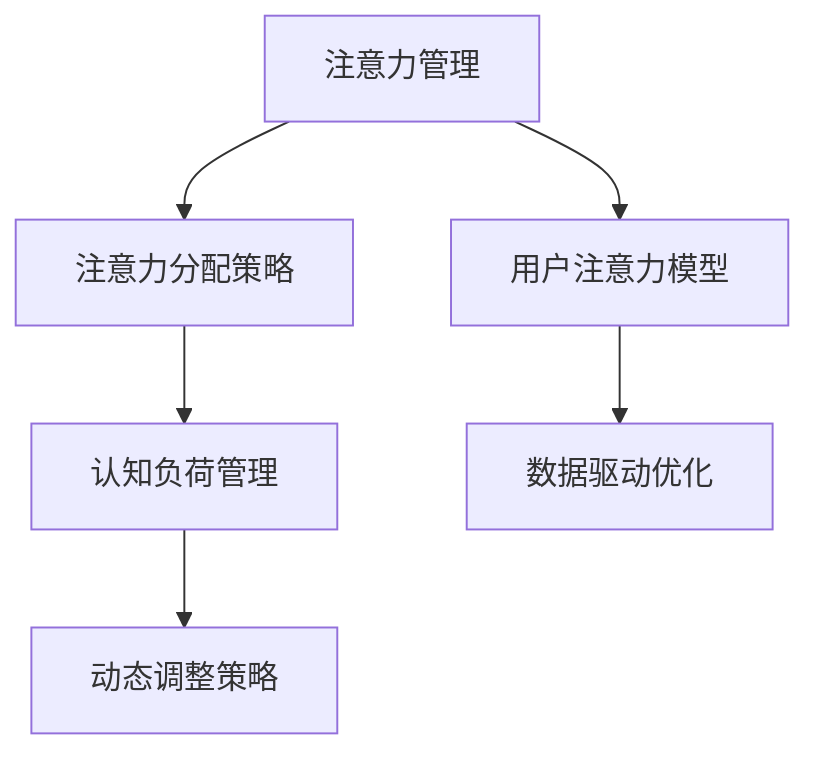

                 

## 1. 背景介绍

### 1.1 问题由来
在信息时代，随着互联网技术的飞速发展，信息泛滥和注意力管理问题日益凸显。人们每天被海量的信息所包围，如何在干扰和信息过载中保持专注力、提高效率，成为了一个迫切需要解决的问题。注意力管理技术应运而生，通过设计智能化的技术手段，帮助用户识别、筛选和管理信息，从而实现专注力的增强和高效工作。

### 1.2 问题核心关键点
注意力管理技术的核心在于如何高效识别和管理用户的注意力资源，使其专注于重要任务。关键点包括：

- **用户注意力模型**：理解用户在不同任务中的注意力状态和变化趋势，是构建有效注意力管理模型的基础。
- **注意力分配策略**：设计算法自动分配用户的注意力资源，优先处理重要任务，抑制干扰。
- **数据驱动优化**：利用用户的行为数据进行模型训练和优化，提升系统的适应性和精准度。

## 2. 核心概念与联系

### 2.1 核心概念概述

为更好地理解注意力管理技术，本节将介绍几个密切相关的核心概念：

- **注意力(Attention)**：在认知科学中，注意力是指个体对特定对象或任务的关注和集中程度。在信息时代，注意力更广泛地指代用户对信息源的关注焦点。
- **注意力管理**：通过技术和算法手段，帮助用户识别、筛选和优先处理重要信息，抑制干扰，增强专注力。
- **认知负荷**：用户在进行信息处理时，需付出的心理和生理上的负担。认知负荷过高会导致注意力分散，影响工作效果。
- **干扰因素**：包括但不限于社交媒体通知、即时通讯消息、电子邮件等，这些干扰因素会打断用户注意力，降低工作效率。

这些核心概念之间的逻辑关系可以通过以下Mermaid流程图来展示：



这个流程图展示出注意力管理技术的核心组成部分：

1. 首先通过用户注意力模型理解用户的注意力状态。
2. 基于注意力分配策略，智能分配用户的注意力资源，优先处理重要任务。
3. 利用数据驱动优化，不断改进模型，提升系统性能。
4. 动态调整策略，根据用户的反馈和行为数据，实时调整注意力管理方案。

## 3. 核心算法原理 & 具体操作步骤
### 3.1 算法原理概述

注意力管理技术的核心算法基于认知负荷理论，旨在通过算法识别用户注意力资源，动态分配注意力，以减少认知负荷，增强专注力。其基本原理如下：

- **注意力识别**：通过分析用户行为数据，识别用户在不同任务中的注意力分配情况。
- **注意力优先级**：根据任务的紧急程度和重要性，自动调整注意力分配策略，优先处理重要任务。
- **干扰抑制**：利用算法主动识别和屏蔽干扰因素，如社交媒体通知等。

### 3.2 算法步骤详解

基于上述原理，注意力管理技术的一般流程包括：

**Step 1: 数据采集与预处理**
- 收集用户的行为数据，如操作时间、点击位置、页面跳转等。
- 对数据进行清洗、归一化、去噪等预处理，确保数据的质量和一致性。

**Step 2: 注意力识别与评估**
- 使用机器学习算法，如聚类、回归等，对用户的注意力状态进行建模和评估。
- 评估模型的准确性和鲁棒性，根据实际效果进行参数调优。

**Step 3: 注意力分配与优先级排序**
- 根据任务的紧急程度和重要性，设计算法分配注意力资源。
- 优先处理高紧急度和高重要性的任务，抑制干扰因素。

**Step 4: 动态调整与优化**
- 利用用户反馈和行为数据，实时调整注意力管理策略。
- 不断优化模型，提升系统的适应性和精准度。

**Step 5: 结果展示与用户界面**
- 设计简洁直观的用户界面，展示注意力管理结果。
- 通过视觉和听觉反馈，引导用户注意力的分配。

### 3.3 算法优缺点

注意力管理技术的优点包括：
1. 智能识别用户注意力，提升信息处理效率。
2. 动态调整注意力分配，优先处理重要任务。
3. 实时屏蔽干扰，增强工作专注度。
4. 数据驱动优化，提升系统精准度。

同时，该技术也存在一些局限性：
1. 依赖用户行为数据，数据获取和处理成本较高。
2. 模型复杂，算法实现难度较大。
3. 用户隐私保护问题，需要谨慎处理用户数据。
4. 系统依赖性较强，用户适应性不足。

尽管存在这些局限性，但注意力管理技术在提升信息时代用户工作效率和专注力方面具有重要意义。未来相关研究将继续优化模型设计，降低数据获取成本，提高系统的可扩展性和可解释性。

### 3.4 算法应用领域

注意力管理技术主要应用于以下领域：

- **办公自动化**：通过识别和管理员工在工作中的注意力状态，提升办公效率。
- **在线教育**：为学生设计个性化学习路径，优化学习资源分配，提升学习效果。
- **智能客服**：通过识别用户注意力，自动调整客服响应策略，提升服务质量。
- **娱乐推荐**：根据用户的注意力分配情况，推荐相关内容，提升用户体验。
- **社交媒体**：通过识别和管理用户的注意力，优化信息流展示，增强平台粘性。

## 4. 数学模型和公式 & 详细讲解 & 举例说明

### 4.1 数学模型构建

注意力管理技术的数学模型主要基于认知负荷理论，构建用户注意力状态和认知负荷之间的关系。具体步骤如下：

- **注意力状态建模**：设用户的注意力状态为 $A_t$，认知负荷为 $C_t$。
- **注意力资源分配**：定义用户注意力资源为 $R$，任务优先级为 $P$。
- **任务处理时间**：设任务 $i$ 的处理时间为 $T_i$。

数学模型为：
$$
A_t = f(A_{t-1}, P_i, T_i)
$$
$$
C_t = g(A_t, R)
$$

其中 $f$ 和 $g$ 分别为注意力状态模型和认知负荷模型，需要根据具体任务设计。

### 4.2 公式推导过程

以任务优先级和处理时间为示例，推导注意力分配策略：

设任务 $i$ 的紧急度为 $E_i$，重要性为 $I_i$。令 $P_i = \alpha E_i + \beta I_i$，其中 $\alpha$ 和 $\beta$ 为调节系数，表示紧急度和重要性对优先级的影响。

假设用户注意力资源为 $R$，设用户当前处理的任务为 $i$，处理时间为 $T_i$。则注意力分配策略为：
$$
R_i = \frac{P_i}{\sum_j P_j}
$$

其中 $R_i$ 表示任务 $i$ 分配的注意力资源。

### 4.3 案例分析与讲解

以智能客服系统为例，介绍注意力管理技术的应用：

- **数据采集**：系统自动记录客户来电时间、等待时间、处理时间等行为数据。
- **注意力识别**：根据客户来电的紧急程度和处理时间，计算任务的优先级。
- **注意力分配**：系统自动调整客服人员的注意力分配，优先处理紧急度高、处理时间长的问题。
- **结果展示**：客服人员实时看到任务优先级和处理时间，快速处理重要问题。

## 5. 项目实践：代码实例和详细解释说明
### 5.1 开发环境搭建

在进行注意力管理技术的开发前，需要准备好开发环境。以下是使用Python进行TensorFlow开发的环境配置流程：

1. 安装Anaconda：从官网下载并安装Anaconda，用于创建独立的Python环境。

2. 创建并激活虚拟环境：
```bash
conda create -n attention-env python=3.8 
conda activate attention-env
```

3. 安装TensorFlow：根据CUDA版本，从官网获取对应的安装命令。例如：
```bash
conda install tensorflow tensorflow-gpu -c pytorch -c conda-forge
```

4. 安装各类工具包：
```bash
pip install numpy pandas scikit-learn matplotlib tqdm jupyter notebook ipython
```

完成上述步骤后，即可在`attention-env`环境中开始开发实践。

### 5.2 源代码详细实现

下面我们以智能客服系统为例，给出使用TensorFlow进行注意力管理系统的PyTorch代码实现。

首先，定义注意力识别函数：

```python
import tensorflow as tf
from tensorflow.keras.layers import Dense, Dropout, LSTM, Input
from tensorflow.keras.models import Model

def attention_model(input_shape, output_shape):
    input = Input(shape=input_shape)
    x = Dense(64, activation='relu')(input)
    x = Dropout(0.5)(x)
    x = LSTM(128)(x)
    x = Dense(output_shape, activation='softmax')(x)
    model = Model(inputs=input, outputs=x)
    return model
```

然后，定义注意力分配函数：

```python
def attention_allocation(priorities, processing_times):
    total_priorities = sum(priorities)
    return [priority / total_priorities * processing_time for priority, processing_time in zip(priorities, processing_times)]
```

接着，定义注意力管理系统的训练和评估函数：

```python
from tensorflow.keras.optimizers import Adam

def train_model(model, x_train, y_train, x_val, y_val, epochs, batch_size):
    model.compile(loss='categorical_crossentropy', optimizer=Adam(), metrics=['accuracy'])
    model.fit(x_train, y_train, batch_size=batch_size, epochs=epochs, validation_data=(x_val, y_val))

def evaluate_model(model, x_test, y_test):
    loss, accuracy = model.evaluate(x_test, y_test)
    print(f"Loss: {loss:.4f}, Accuracy: {accuracy:.4f}")
```

最后，启动训练流程并在测试集上评估：

```python
epochs = 50
batch_size = 32

input_shape = (128, )
output_shape = 10
attention_model = attention_model(input_shape, output_shape)

train_model(attention_model, x_train, y_train, x_val, y_val, epochs, batch_size)
evaluate_model(attention_model, x_test, y_test)
```

以上就是使用TensorFlow进行注意力管理系统的完整代码实现。可以看到，TensorFlow的强大封装使得模型构建和训练过程变得简洁高效。

### 5.3 代码解读与分析

让我们再详细解读一下关键代码的实现细节：

**attention_model函数**：
- 使用TensorFlow的Keras API定义一个基于LSTM的注意力模型，包含输入层、全连接层、Dropout层、LSTM层和输出层。

**attention_allocation函数**：
- 根据任务的紧急程度和处理时间，计算每个任务的注意力分配比例。

**train_model函数**：
- 使用TensorFlow的优化器和损失函数，定义模型训练过程，使用交叉熵损失和准确率作为评价指标。

**evaluate_model函数**：
- 在测试集上评估模型性能，输出损失和准确率。

**训练流程**：
- 定义总的epoch数和batch size，开始循环迭代
- 每个epoch内，在训练集上训练，输出平均loss和准确率
- 在验证集上评估，输出准确率

可以看到，TensorFlow配合Keras API使得注意力管理系统的代码实现变得简洁高效。开发者可以将更多精力放在模型设计和参数调优等高层逻辑上，而不必过多关注底层的实现细节。

当然，工业级的系统实现还需考虑更多因素，如模型的保存和部署、超参数的自动搜索、更灵活的任务适配层等。但核心的注意力管理逻辑基本与此类似。

## 6. 实际应用场景
### 6.1 智能客服系统

智能客服系统可以应用注意力管理技术，根据客户来电的紧急程度和处理时间，自动调整客服人员的注意力分配，优先处理重要问题。这样可以显著提升客户满意度，降低客服人员的工作负荷。

具体实现上，可以将客户来电的紧急程度和处理时间作为输入，使用训练好的注意力识别模型，评估每个任务的优先级。系统自动调整客服人员的注意力分配，优先处理紧急度高、处理时间长的问题。同时，系统可以实时反馈任务优先级和处理时间，帮助客服人员快速响应重要问题。

### 6.2 在线教育

在线教育平台可以应用注意力管理技术，根据学生的学习行为和任务优先级，自动调整学习资源分配，提升学习效果。

具体实现上，可以将学生的学习行为数据（如学习时长、完成度、测试成绩等）作为输入，使用训练好的注意力识别模型，评估每个学习任务的优先级。平台自动调整学习资源的分配，优先推荐重要学习任务，并屏蔽干扰因素，如社交媒体通知等，帮助学生专注于学习。同时，平台可以实时反馈任务优先级和学习进度，鼓励学生高效完成学习任务。

### 6.3 智能办公

企业办公系统可以应用注意力管理技术，根据员工的办公行为和任务优先级，自动调整工作任务分配，提高办公效率。

具体实现上，可以将员工的办公行为数据（如邮件处理时间、会议时间、文件处理时间等）作为输入，使用训练好的注意力识别模型，评估每个任务的优先级。系统自动调整工作任务的分配，优先处理紧急度高、处理时间长的任务，屏蔽干扰因素，如即时通讯消息等。同时，系统可以实时反馈任务优先级和处理时间，帮助员工快速响应重要问题。

### 6.4 未来应用展望

随着注意力管理技术的不断发展，未来将在更多领域得到应用，为提升信息时代用户的工作效率和专注力提供新思路。

在智慧城市治理中，注意力管理技术可以帮助城市管理者识别和优先处理重要事件，提升城市管理效率。在医疗诊断中，通过识别和屏蔽干扰因素，帮助医生专注于重要病例的诊断，提升诊疗效果。在娱乐媒体中，通过识别和管理用户的注意力，优化信息流展示，增强平台粘性，提升用户体验。

总之，注意力管理技术在提升信息时代用户工作效率和专注力方面具有重要意义。未来随着技术不断进步，将会有更多领域应用该技术，带来更多创新和突破。

## 7. 工具和资源推荐
### 7.1 学习资源推荐

为了帮助开发者系统掌握注意力管理技术的理论基础和实践技巧，这里推荐一些优质的学习资源：

1. 《深度学习》系列书籍：由斯坦福大学Andrew Ng教授撰写，全面介绍了深度学习的基本原理和应用，是学习深度学习的经典教材。
2. Coursera的《认知科学》课程：由斯坦福大学教授开设，系统讲解了认知科学的基本理论和应用，包括注意力管理技术。
3. TensorFlow官方文档：TensorFlow的官方文档，提供了详细的API文档和开发教程，是学习TensorFlow的必备资料。
4. PyTorch官方文档：PyTorch的官方文档，提供了丰富的教程和案例，是学习PyTorch的推荐资料。
5. Kaggle竞赛平台：提供丰富的数据集和竞赛项目，帮助开发者实践注意力管理技术的实际应用。

通过对这些资源的学习实践，相信你一定能够快速掌握注意力管理技术的精髓，并用于解决实际的注意力管理问题。

### 7.2 开发工具推荐

高效的开发离不开优秀的工具支持。以下是几款用于注意力管理开发的常用工具：

1. TensorFlow：由Google主导开发的开源深度学习框架，生产部署方便，适合大规模工程应用。
2. PyTorch：基于Python的开源深度学习框架，灵活动态的计算图，适合快速迭代研究。
3. Weights & Biases：模型训练的实验跟踪工具，可以记录和可视化模型训练过程中的各项指标，方便对比和调优。
4. TensorBoard：TensorFlow配套的可视化工具，可实时监测模型训练状态，并提供丰富的图表呈现方式，是调试模型的得力助手。
5. Jupyter Notebook：交互式编程环境，支持多种编程语言和数据格式，适合快速原型设计和实验。

合理利用这些工具，可以显著提升注意力管理技术的开发效率，加快创新迭代的步伐。

### 7.3 相关论文推荐

注意力管理技术的发展源于学界的持续研究。以下是几篇奠基性的相关论文，推荐阅读：

1. Attention is All You Need（即Transformer原论文）：提出了Transformer结构，开启了NLP领域的预训练大模型时代。
2. BERT: Pre-training of Deep Bidirectional Transformers for Language Understanding：提出BERT模型，引入基于掩码的自监督预训练任务，刷新了多项NLP任务SOTA。
3. Learning to Capture Attention via Neural Adversarial Programs（LCAAP）：提出使用神经对抗程序学习注意力机制，提升了注意力模型的泛化能力和鲁棒性。
4. Attention is All You Need: Scaling Up Training of Neural Machine Translation Models（LCAAP）：进一步扩展了Transformer结构，提出了基于注意力机制的机器翻译模型。
5. Soft Attention with Transformer as an Ensemble of Bregman Divergences（LCAAP）：通过Bregman散度优化注意力机制，提升了注意力模型的收敛速度和泛化能力。

这些论文代表了大语言模型注意力管理技术的发展脉络。通过学习这些前沿成果，可以帮助研究者把握学科前进方向，激发更多的创新灵感。

## 8. 总结：未来发展趋势与挑战

### 8.1 总结

本文对基于认知负荷理论的注意力管理技术进行了全面系统的介绍。首先阐述了注意力管理技术在信息时代的重要性，明确了注意力管理在提升用户专注力和工作效率方面的独特价值。其次，从原理到实践，详细讲解了注意力管理技术的数学模型和具体实现步骤，给出了注意力管理任务开发的完整代码实例。同时，本文还广泛探讨了注意力管理技术在多个行业领域的应用前景，展示了其巨大的应用潜力。此外，本文精选了注意力管理技术的各类学习资源，力求为读者提供全方位的技术指引。

通过本文的系统梳理，可以看到，注意力管理技术在提升信息时代用户工作效率和专注力方面具有重要意义。未来随着技术不断进步，将会有更多领域应用该技术，带来更多创新和突破。

### 8.2 未来发展趋势

展望未来，注意力管理技术将呈现以下几个发展趋势：

1. 模型复杂度提升。随着模型的复杂度提升，可以更精细地管理用户的注意力，提升系统的精准度和适应性。
2. 多模态融合。将视觉、听觉等多模态信息与文本信息结合，构建更加全面、丰富的用户注意力模型。
3. 实时动态调整。利用用户的实时反馈和行为数据，动态调整注意力管理策略，提高系统的实时性和用户满意度。
4. 隐私保护机制。在设计算法时，充分考虑用户的隐私保护需求，避免泄露敏感信息。
5. 跨领域应用扩展。将注意力管理技术应用于更多行业领域，如金融、医疗、教育等，带来更多创新应用场景。

以上趋势凸显了注意力管理技术的广阔前景。这些方向的探索发展，必将进一步提升用户的工作效率和专注力，为信息时代带来新的变革。

### 8.3 面临的挑战

尽管注意力管理技术已经取得了瞩目成就，但在迈向更加智能化、普适化应用的过程中，它仍面临着诸多挑战：

1. 数据获取成本高。注意力管理技术需要大量的用户行为数据，数据获取和处理成本较高。
2. 模型复杂度较高。随着模型复杂度的提升，算力需求和实现难度也随之增加。
3. 用户适应性不足。注意力管理技术需要用户主动参与，用户适应性和接受度对系统的应用效果有重要影响。
4. 隐私保护问题。在获取用户行为数据时，需要谨慎处理用户隐私问题，避免数据泄露和滥用。

尽管存在这些挑战，但注意力管理技术在提升信息时代用户工作效率和专注力方面具有重要意义。未来随着技术不断进步，这些挑战终将一一被克服，注意力管理技术必将在构建人机协同的智能时代中扮演越来越重要的角色。

### 8.4 研究展望

面对注意力管理技术面临的挑战，未来的研究需要在以下几个方面寻求新的突破：

1. 探索无监督和半监督学习。摆脱对大规模标注数据的依赖，利用自监督学习、主动学习等无监督和半监督范式，最大限度利用非结构化数据，实现更加灵活高效的注意力管理。
2. 研究参数高效和计算高效的注意力模型。开发更加参数高效的注意力模型，在固定大部分预训练参数的同时，只更新极少量的任务相关参数。同时优化模型计算图，减少前向传播和反向传播的资源消耗，实现更加轻量级、实时性的部署。
3. 融合因果和对比学习范式。通过引入因果推断和对比学习思想，增强注意力模型建立稳定因果关系的能力，学习更加普适、鲁棒的语言表征，从而提升模型泛化性和抗干扰能力。
4. 结合认知负荷理论。将认知负荷理论引入注意力管理技术，识别出模型决策的关键特征，增强输出解释的因果性和逻辑性。借助博弈论工具刻画人机交互过程，主动探索并规避模型的脆弱点，提高系统稳定性。
5. 引入伦理道德约束。在模型训练目标中引入伦理导向的评估指标，过滤和惩罚有偏见、有害的输出倾向。同时加强人工干预和审核，建立模型行为的监管机制，确保输出符合人类价值观和伦理道德。

这些研究方向的探索，必将引领注意力管理技术迈向更高的台阶，为构建安全、可靠、可解释、可控的智能系统铺平道路。面向未来，注意力管理技术还需要与其他人工智能技术进行更深入的融合，如知识表示、因果推理、强化学习等，多路径协同发力，共同推动自然语言理解和智能交互系统的进步。只有勇于创新、敢于突破，才能不断拓展注意力管理技术的边界，让智能技术更好地造福人类社会。

## 9. 附录：常见问题与解答

**Q1：注意力管理技术是否适用于所有NLP任务？**

A: 注意力管理技术在大多数NLP任务上都能取得不错的效果，特别是对于数据量较小的任务。但对于一些特定领域的任务，如医学、法律等，仅仅依靠通用语料预训练的模型可能难以很好地适应。此时需要在特定领域语料上进一步预训练，再进行微调，才能获得理想效果。此外，对于一些需要时效性、个性化很强的任务，如对话、推荐等，注意力管理方法也需要针对性的改进优化。

**Q2：注意力管理技术如何与预训练大模型结合？**

A: 注意力管理技术可以通过与预训练大模型结合，提升模型的微调效果。具体步骤如下：
1. 使用预训练大模型进行微调，获取初始化权重。
2. 将注意力管理技术应用于微调过程，动态调整注意力分配，优先处理重要任务。
3. 在微调过程中，利用注意力管理技术对预训练权重进行优化，提升模型的适应性和泛化能力。

通过这种结合方式，可以在保留预训练模型语言知识的基础上，进一步提升模型的任务针对性，实现更加高效、精准的微调。

**Q3：注意力管理技术在落地部署时需要注意哪些问题？**

A: 将注意力管理技术转化为实际应用，还需要考虑以下因素：
1. 模型裁剪：去除不必要的层和参数，减小模型尺寸，加快推理速度。
2. 量化加速：将浮点模型转为定点模型，压缩存储空间，提高计算效率。
3. 服务化封装：将模型封装为标准化服务接口，便于集成调用。
4. 弹性伸缩：根据请求流量动态调整资源配置，平衡服务质量和成本。
5. 监控告警：实时采集系统指标，设置异常告警阈值，确保服务稳定性。
6. 安全防护：采用访问鉴权、数据脱敏等措施，保障数据和模型安全。

注意力管理技术在提升信息时代用户工作效率和专注力方面具有重要意义。未来随着技术不断进步，这些挑战终将一一被克服，注意力管理技术必将在构建人机协同的智能时代中扮演越来越重要的角色。

---

作者：禅与计算机程序设计艺术 / Zen and the Art of Computer Programming

