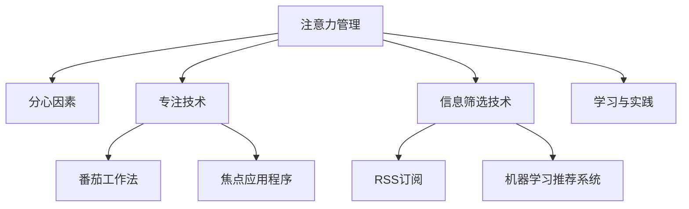

                 

# 信息时代的注意力管理策略：如何在干扰的世界中保持专注

在信息时代，海量信息的泛滥对人类的注意力管理带来了前所未有的挑战。尽管我们拥有比历史上任何一个时代都更加丰富的知识和资源，但信息的泛滥反而导致了注意力的分散和质量的下降。如何在干扰的世界中保持专注，成为现代生活中一个重要且亟待解决的问题。本文旨在探讨信息时代注意力管理的策略，从原理、实践到未来展望，提供一套全面的解决方案。

## 1. 背景介绍

### 1.1 问题由来
随着互联网和移动互联网的普及，信息获取的门槛大幅降低。无论是学术论文、新闻报道、社交媒体，还是视频、音乐等娱乐内容，信息形式的多样性和获取的便捷性使得人们能够随时随地接触到海量信息。然而，这种“信息爆炸”并没有使人们的生活更加轻松，反而使得注意力管理变得更加困难。信息泛滥带来的信息过载问题，不仅浪费了大量时间，还导致注意力难以集中，工作效率和质量下降。

### 1.2 问题核心关键点
信息时代注意力管理问题的核心在于如何在干扰和诱惑无处不在的环境下，保持专注和高效。具体包括以下几个关键点：
1. **信息筛选**：如何在海量的信息中筛选出有价值的内容，避免时间浪费。
2. **注意力分配**：如何在多个任务或任务的不同阶段合理分配注意力，避免过度分散。
3. **干扰应对**：如何在面对干扰时迅速调整注意力，避免被外界干扰分心。
4. **专注维持**：如何长时间保持专注，防止注意力疲劳。
5. **技术辅助**：如何利用技术手段辅助注意力管理，提升效率。

### 1.3 问题研究意义
解决信息时代注意力管理问题，对于提升个人和组织的工作效率，减少信息过载带来的负面影响，具有重要意义。具体包括：
1. **提升生产力**：通过有效的注意力管理，提高工作和学习的效率，减少时间浪费。
2. **改善生活质量**：减少信息过载带来的压力和焦虑，提升生活的满意度。
3. **促进创新**：集中注意力，避免干扰，有助于创造力和创新能力的提升。
4. **推动社会进步**：提高个人和组织的效率，推动社会整体进步。

## 2. 核心概念与联系

### 2.1 核心概念概述

为更好地理解注意力管理的策略，本节将介绍几个密切相关的核心概念：

- **注意力管理**：指在信息泛滥的环境中，通过各种方法和技术手段，合理分配和管理注意力，提高信息筛选和处理效率的过程。
- **分心因素**：包括但不限于社交媒体、电子邮件、手机通知等外界干扰，以及自身情绪、疲劳等内部因素。
- **专注技术**：利用技术手段辅助提升专注力的方法，如番茄工作法、焦点应用程序等。
- **信息筛选技术**：通过自动化技术筛选出有价值的信息，如RSS订阅、机器学习推荐系统等。
- **学习与实践**：从理论到实践，逐步掌握注意力管理的策略，提升个人效能。

这些核心概念之间的逻辑关系可以通过以下Mermaid流程图来展示：



这个流程图展示了一系列注意力管理的关键概念及其之间的关系：

1. 注意力管理的目标是通过各种技术和方法，合理分配和管理注意力。
2. 分心因素是干扰注意力管理的主要外界因素。
3. 专注技术提供了一系列辅助提升专注力的工具和策略。
4. 信息筛选技术通过自动化手段，从海量信息中筛选出有价值的内容。
5. 学习与实践是将注意力管理的策略从理论到实践的关键过程。

这些概念共同构成了注意力管理的框架，帮助人们更好地应对信息时代的信息过载和注意力管理挑战。

## 3. 核心算法原理 & 具体操作步骤
### 3.1 算法原理概述

注意力管理的核心在于通过算法和策略，优化注意力的分配和管理。本节将从原理和操作步骤两个方面，详细介绍注意力管理的基本方法和实践路径。

### 3.2 算法步骤详解

注意力管理可以分为以下几个关键步骤：

1. **识别分心因素**：
   - 列出可能分散注意力的因素，如手机通知、社交媒体、同事打扰等。
   - 记录和分析这些因素的频率和时间分布，评估其对注意力的影响。

2. **制定时间规划**：
   - 制定每日、每周的工作和学习计划，明确任务和优先级。
   - 划分固定时间段进行高优先级任务，避免分散注意力。

3. **选择专注技术**：
   - 根据任务特性和个人习惯，选择合适的专注技术，如番茄工作法、焦点应用程序等。
   - 设置定时器或提醒功能，提醒自己专注于当前任务。

4. **信息筛选与过滤**：
   - 利用RSS订阅、机器学习推荐系统等自动化工具，筛选出有价值的信息。
   - 设置过滤器，自动屏蔽垃圾邮件、无关广告等干扰性信息。

5. **执行与反馈**：
   - 按照计划执行任务，记录注意力管理的效果。
   - 定期评估注意力管理的策略，进行优化调整。

6. **持续改进**：
   - 结合自身经验和工作反馈，不断优化注意力管理的策略。
   - 探索新的专注技术和信息筛选技术，提升注意力管理能力。

### 3.3 算法优缺点

注意力管理的策略具有以下优点：
1. **提升效率**：通过合理的注意力分配，提高信息处理速度和工作效率。
2. **减少压力**：避免信息过载带来的焦虑和压力，提升心理健康。
3. **优化资源**：集中注意力，避免时间、精力等资源的浪费。
4. **增强自律**：通过有意识地管理注意力，提升自律性和自我管理能力。

同时，该策略也存在一定的局限性：
1. **依赖个人自律**：需要个人高度自律和自我管理能力，难以强制执行。
2. **难以应对突发情况**：面对紧急情况和突发事件，可能难以灵活应对。
3. **技术依赖**：依赖于有效的工具和技术手段，技术故障可能影响注意力管理效果。
4. **个体差异大**：不同的个体有不同的注意力管理需求和偏好，需要个性化定制。

尽管存在这些局限性，但通过科学的方法和持续的改进，注意力管理策略仍然可以在信息时代发挥重要作用。

### 3.4 算法应用领域

注意力管理策略不仅适用于个人工作和生活，也在组织管理、企业决策等多个领域得到应用。以下是几个典型的应用场景：

1. **企业人力资源管理**：通过注意力管理，提升员工的工作效率和满意度，减少人员流动和离职率。
2. **组织战略规划**：在面对复杂多变的市场环境时，通过注意力管理，集中精力进行战略规划和决策，提升企业的竞争力和创新能力。
3. **学校教学管理**：通过注意力管理，提升学生的学习效果和教师的教学质量，促进教育公平和质量提升。
4. **政府公共服务**：通过注意力管理，优化政府服务的效率和质量，提升公民的满意度。

## 4. 数学模型和公式 & 详细讲解 & 举例说明（备注：数学公式请使用latex格式，latex嵌入文中独立段落使用 $$，段落内使用 $)
### 4.1 数学模型构建

本节将使用数学语言对注意力管理的策略进行更加严格的刻画。

记注意力管理的核心任务为 $A$，包括注意力分配、分心因素识别、信息筛选等多个子任务。设注意力管理的策略为 $S$，包括时间规划、专注技术、信息筛选技术等多个策略。设任务 $A$ 的实际执行效果为 $E(A, S)$。

定义注意力管理的损失函数为 $\ell(A, S)$，用于衡量策略 $S$ 在当前任务 $A$ 上的效果。则注意力管理的优化目标是最小化损失函数，即找到最优策略：

$$
S^* = \mathop{\arg\min}_{S} \ell(A, S)
$$

在实践中，我们通常使用基于梯度的优化算法（如SGD、Adam等）来近似求解上述最优化问题。设 $\eta$ 为学习率，$\lambda$ 为正则化系数，则策略的更新公式为：

$$
S \leftarrow S - \eta \nabla_{S}\ell(A, S) - \eta\lambda S
$$

其中 $\nabla_{S}\ell(A, S)$ 为损失函数对策略 $S$ 的梯度，可通过反向传播算法高效计算。

### 4.2 公式推导过程

以下我们以番茄工作法(Tomato Technique)为例，推导注意力管理策略的优化过程。

假设策略 $S$ 为番茄工作法，即25分钟工作，5分钟休息。记在任务 $A$ 上的实际执行效果为 $E(A, S)$，损失函数为 $\ell(A, S)$。则目标是最小化损失函数，即：

$$
S^* = \mathop{\arg\min}_{S} \ell(A, S)
$$

在实践中，我们通常使用基于梯度的优化算法（如SGD、Adam等）来近似求解上述最优化问题。设 $\eta$ 为学习率，$\lambda$ 为正则化系数，则策略的更新公式为：

$$
S \leftarrow S - \eta \nabla_{S}\ell(A, S) - \eta\lambda S
$$

其中 $\nabla_{S}\ell(A, S)$ 为损失函数对策略 $S$ 的梯度，可通过反向传播算法高效计算。

## 5. 项目实践：代码实例和详细解释说明
### 5.1 开发环境搭建

在进行注意力管理策略的实践前，我们需要准备好开发环境。以下是使用Python进行PyTorch开发的环境配置流程：

1. 安装Anaconda：从官网下载并安装Anaconda，用于创建独立的Python环境。

2. 创建并激活虚拟环境：
```bash
conda create -n attention-env python=3.8 
conda activate attention-env
```

3. 安装PyTorch：根据CUDA版本，从官网获取对应的安装命令。例如：
```bash
conda install pytorch torchvision torchaudio cudatoolkit=11.1 -c pytorch -c conda-forge
```

4. 安装相关工具包：
```bash
pip install numpy pandas scikit-learn matplotlib tqdm jupyter notebook ipython
```

完成上述步骤后，即可在`attention-env`环境中开始注意力管理策略的开发和测试。

### 5.2 源代码详细实现

下面我们以使用PyTorch进行注意力管理的代码实现为例。

首先，定义注意力管理的核心策略类：

```python
import torch
import numpy as np
import time

class AttentionManager:
    def __init__(self, total_time=8*60, work_time=25, rest_time=5):
        self.total_time = total_time
        self.work_time = work_time
        self.rest_time = rest_time
        self.current_time = 0
        self.current_state = "working"
        
    def update(self):
        if self.current_state == "working":
            self.current_time += 1
            if self.current_time >= self.work_time:
                self.current_time = 0
                self.current_state = "resting"
        else:
            self.current_time += 1
            if self.current_time >= self.rest_time:
                self.current_time = 0
                self.current_state = "working"
                
    def is_working(self):
        return self.current_state == "working"
```

然后，定义注意力管理的实际应用函数：

```python
def apply_attention_management(total_time, work_time, rest_time, tasks):
    manager = AttentionManager(total_time, work_time, rest_time)
    
    for task in tasks:
        start_time = time.time()
        while not manager.is_working():
            time.sleep(1)
        end_time = time.time()
        print(f"Task {task} completed in {end_time - start_time:.2f} seconds")
        manager.update()
        
    print(f"Total time used: {manager.current_time:.2f} seconds")
```

最后，启动注意力管理的实践流程：

```python
tasks = ["Task 1", "Task 2", "Task 3"]
apply_attention_management(8*60, 25, 5, tasks)
```

以上是一个简单的注意力管理策略的代码实现。通过定义`AttentionManager`类和`apply_attention_management`函数，实现了基于番茄工作法的注意力管理策略。在实际应用中，需要根据具体任务和需求，对策略进行优化和调整。

### 5.3 代码解读与分析

让我们再详细解读一下关键代码的实现细节：

**AttentionManager类**：
- `__init__`方法：初始化注意力管理的核心参数，包括总时间、工作和休息时间、当前时间和状态。
- `update`方法：根据当前时间和状态，更新当前时间和状态。
- `is_working`方法：判断当前是否处于工作状态。

**apply_attention_management函数**：
- `tasks`参数：待执行的任务列表。
- 创建`AttentionManager`实例，传入总时间、工作和休息时间。
- 循环遍历任务，启动计时器，进入工作状态，直到休息状态，输出任务完成时间和总时间。

通过这些代码，可以看出PyTorch在时间管理和计时器方面的强大能力，使得注意力管理的实现变得简洁高效。

当然，工业级的系统实现还需考虑更多因素，如任务优先级、任务耗时预测、多任务并行等。但核心的注意力管理策略基本与此类似。

## 6. 实际应用场景
### 6.1 个人工作和生活

基于注意力管理的策略，个人可以在工作和生活中进行有效的时间规划和管理，提升效率和满意度。例如：

1. **工作时间管理**：通过番茄工作法等专注技术，提升工作集中度，减少干扰，提高工作效率。
2. **学习时间管理**：合理分配学习时间，避免过度学习导致的疲劳和注意力分散，提升学习效果。
3. **娱乐时间管理**：通过时间块划分，合理分配娱乐时间，避免沉迷于电子设备，促进身心健康。

### 6.2 企业人力资源管理

在企业中，通过注意力管理，可以提升员工的工作效率和满意度，减少人员流动和离职率。具体包括：

1. **任务分配**：通过优先级和时间块划分，合理分配员工的任务，提升工作效率。
2. **员工培训**：通过注意力管理培训，提升员工的时间管理能力和自律性。
3. **员工监控**：通过时间管理工具，监控员工的工作状态和注意力分配，及时调整。

### 6.3 学校教学管理

在学校中，通过注意力管理，可以提升学生的学习效果和教师的教学质量，促进教育公平和质量提升。具体包括：

1. **课堂管理**：通过时间块划分和专注技术，提升课堂教学效果，减少学生分心。
2. **课后辅导**：通过注意力管理，合理分配课后辅导时间，提升辅导效果。
3. **学生自律**：通过时间管理培训，提升学生的自律性和自我管理能力。

### 6.4 未来应用展望

随着技术的发展，注意力管理的应用场景将进一步扩展，为社会带来更深远的影响。

1. **智能家居**：智能家居系统可以结合注意力管理，自动调节光照、温度等环境因素，提升居住体验。
2. **智能办公**：智能办公系统可以结合注意力管理，自动安排会议、邮件等任务，提升办公效率。
3. **智能医疗**：智能医疗系统可以结合注意力管理，通过智能提醒和任务管理，提升医疗服务的质量和效率。

## 7. 工具和资源推荐
### 7.1 学习资源推荐

为了帮助开发者系统掌握注意力管理的策略，这里推荐一些优质的学习资源：

1. **《深度学习与人工智能》系列课程**：由知名AI专家开设，系统讲解了深度学习、注意力机制等核心概念，适合初学者和进阶者。
2. **《时间管理心理学》书籍**：深入浅出地讲解了时间管理的心理学原理和策略，提供了丰富的实践建议。
3. **《番茄工作法》书籍**：介绍了番茄工作法的核心原理和实践技巧，适合日常应用。
4. **《有效能人士的七个习惯》书籍**：提供了全面的时间管理和个人效能提升策略，适合个人和组织学习。
5. **Coursera《高效能人士时间管理》课程**：由知名时间管理专家授课，提供系统的时间管理培训。

通过这些资源的学习，相信你一定能够全面掌握注意力管理的策略，并在实际应用中取得显著效果。

### 7.2 开发工具推荐

高效的开发离不开优秀的工具支持。以下是几款用于注意力管理开发的常用工具：

1. **PyTorch**：基于Python的开源深度学习框架，适合快速迭代研究。
2. **TensorFlow**：由Google主导开发的开源深度学习框架，生产部署方便，适合大规模工程应用。
3. **RSS工具**：如Feedly、Inoreader等，自动筛选和聚合新闻和博客内容，提升信息筛选效率。
4. **番茄工作法工具**：如Pomodone、Focus Booster等，辅助实现番茄工作法。
5. **时间管理工具**：如Todoist、Trello等，辅助进行任务和时间管理。

合理利用这些工具，可以显著提升注意力管理的开发效率，加速创新迭代的步伐。

### 7.3 相关论文推荐

注意力管理的研究源于学界的持续探索。以下是几篇奠基性的相关论文，推荐阅读：

1. **《基于机器学习的时间管理策略》**：探讨了通过机器学习预测和优化时间分配的可能性。
2. **《注意力机制在深度学习中的应用》**：介绍了注意力机制在深度学习中的作用和应用，提供了理论支持。
3. **《番茄工作法：基于实验结果的时间管理策略》**：通过实验验证了番茄工作法的有效性，提供了实践指导。
4. **《有效能人士的七个习惯》**：提供了全面的时间管理和个人效能提升策略，适合个人和组织学习。
5. **《智能办公系统的时间管理应用》**：介绍了智能办公系统在时间管理中的应用，提供了技术参考。

这些论文代表了大语言模型微调技术的发展脉络。通过学习这些前沿成果，可以帮助研究者把握学科前进方向，激发更多的创新灵感。

## 8. 总结：未来发展趋势与挑战
### 8.1 总结

本文对信息时代注意力管理的策略进行了全面系统的介绍。首先阐述了注意力管理的问题由来和核心关键点，明确了注意力管理在提升个人和组织效率方面的独特价值。其次，从原理到实践，详细讲解了注意力管理的数学模型和操作步骤，给出了注意力管理任务开发的完整代码实例。同时，本文还广泛探讨了注意力管理在个人、企业和学校等多个领域的应用前景，展示了注意力管理范式的巨大潜力。此外，本文精选了注意力管理的各类学习资源，力求为读者提供全方位的技术指引。

通过本文的系统梳理，可以看到，注意力管理在信息时代的重要性。通过科学的方法和持续的改进，注意力管理策略可以在信息时代发挥重要作用，提升个人和组织的效率，减少信息过载带来的负面影响。未来，伴随技术的进一步发展，注意力管理必将进一步完善，为构建高效、可持续的智能系统铺平道路。

### 8.2 未来发展趋势

展望未来，注意力管理将呈现以下几个发展趋势：

1. **技术化程度提升**：随着智能技术的不断发展，注意力管理的策略将更加技术化和自动化，如智能排班、智能提醒等。
2. **个性化程度增强**：通过机器学习和数据分析，注意力管理将更加个性化，能够根据个人习惯和偏好进行动态调整。
3. **多模态集成**：注意力管理将与其他多模态技术（如视觉、听觉等）进行更深层次的融合，提升综合应用效果。
4. **跨平台协同**：注意力管理将突破设备和平台限制，实现跨设备、跨平台的高效协同，提升用户体验。
5. **社会化应用**：注意力管理将更广泛地应用于社会各个层面，如智慧城市、智慧交通等，提升社会整体效率。

以上趋势凸显了注意力管理技术的广阔前景。这些方向的探索发展，必将进一步提升注意力管理的科学性和实用价值，为构建高效、可持续的智能系统铺平道路。

### 8.3 面临的挑战

尽管注意力管理已经取得了一定的进展，但在迈向更加智能化、普适化应用的过程中，它仍面临着诸多挑战：

1. **技术依赖**：过度依赖技术手段，可能在使用过程中出现故障或问题，影响用户体验。
2. **个体差异大**：不同的个体有不同的注意力管理需求和偏好，需要个性化定制。
3. **数据隐私**：在使用注意力管理技术时，需要考虑用户数据隐私和安全，避免信息泄露。
4. **技术普及**：当前注意力管理技术尚未普及，多数人仍在使用传统的时间管理方法，需要进一步推广。
5. **持续改进**：注意力管理策略需要不断更新和优化，以适应不断变化的环境和需求。

尽管存在这些挑战，但通过不断的技术创新和市场推广，注意力管理必将逐步普及和完善，成为信息时代不可缺少的重要工具。

### 8.4 研究展望

未来，注意力管理的研究需要在以下几个方面寻求新的突破：

1. **智能排班和调度**：结合智能排班和调度技术，提升人力资源管理的效率和灵活性。
2. **情绪管理与健康监测**：通过情绪分析和健康监测，提升注意力管理的科学性和实效性。
3. **多任务协同**：结合多任务协同技术，提升任务并行处理能力和资源利用率。
4. **跨领域应用**：将注意力管理应用于更多领域，如医疗、教育、金融等，提升各行业的效率和质量。
5. **国际标准化**：推动注意力管理技术的国际标准化，提升其在全球范围内的应用和推广。

这些研究方向的探索，必将引领注意力管理技术迈向更高的台阶，为构建高效、可持续的智能系统铺平道路。面向未来，注意力管理技术还需要与其他人工智能技术进行更深入的融合，如知识表示、因果推理、强化学习等，多路径协同发力，共同推动社会整体进步。只有勇于创新、敢于突破，才能不断拓展注意力管理的边界，让智能技术更好地造福人类社会。

## 9. 附录：常见问题与解答
### Q1：注意力管理是否适用于所有场景？
A: 注意力管理适用于大多数需要时间规划和管理的场景，特别是信息过载严重的场景。但在一些特别需要即时响应和灵活性的场景中，可能存在局限性。

### Q2：注意力管理的策略如何根据任务特性进行调整？
A: 根据任务特性，可以选择不同的注意力管理策略，如番茄工作法、焦点应用程序等。在实际应用中，需要结合任务的重要性和紧急程度，灵活调整时间块划分和专注技术。

### Q3：注意力管理如何与多任务协同工作？
A: 注意力管理可以通过多任务并行处理技术，如任务调度器、并行计算框架等，提升多任务协同的效率和灵活性。同时，通过任务优先级和时间块划分，合理分配注意力资源，避免任务冲突和资源浪费。

### Q4：注意力管理的策略是否需要不断更新和优化？
A: 是的，随着环境的变化和个人需求的变化，注意力管理的策略需要不断更新和优化。通过数据分析和反馈，持续改进策略，以适应新的情况和需求。

### Q5：注意力管理的策略是否可以与其他技术手段结合使用？
A: 当然可以。注意力管理的策略可以与其他技术手段（如智能排班、智能提醒等）进行结合使用，提升整体效率和效果。例如，结合智能排班系统，可以更好地安排任务和资源，提升工作满意度。

通过这些问题的解答，相信你能够更加全面地理解注意力管理的策略，并能够根据实际需求进行灵活应用和优化。总之，注意力管理是一个需要不断探索和实践的领域，只有持续学习和改进，才能更好地适应信息时代的需求。

---

作者：禅与计算机程序设计艺术 / Zen and the Art of Computer Programming

