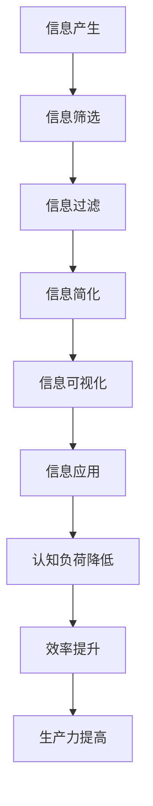

                 

# 信息简化的好处与实践：简化生活和工作以提高效率和生产力

> 关键词：信息简化, 生活工作优化, 效率提升, 生产力提高, 应用实践

## 1. 背景介绍

在信息爆炸的时代，无论是个人生活还是企业工作，都面临着海量信息的冲击。过度复杂的信息不仅会消耗大量时间和精力，还会带来认知负荷，导致效率低下和生产力下降。因此，信息简化（Information Simplification）成为了提高效率和生产力的重要途径。本文将系统地探讨信息简化的原理、方法和实际应用，帮助读者掌握简化信息的能力，从而在个人生活和企业管理中实现效率和生产力的提升。

## 2. 核心概念与联系

### 2.1 核心概念概述

- **信息简化（Information Simplification）**：指通过去除冗余和不必要的信息，保留关键内容和核心信息，提高信息的可用性和可理解性，从而提升处理效率和生产力。
- **认知负荷（Cognitive Load）**：指个体在处理信息时所需的心理资源，过多的信息会增加认知负荷，影响决策和思考的效率。
- **知识管理（Knowledge Management）**：通过组织、共享和利用信息，帮助组织和个人更好地理解和应用知识，提高决策和执行的效率和效果。
- **信息过滤（Information Filtering）**：利用算法和工具自动筛选出重要和有用的信息，减少不必要的信息干扰，提高信息获取和处理的效率。
- **信息可视化（Information Visualization）**：将复杂的信息通过图形、图表等形式呈现，降低信息处理难度，提升信息理解和利用的效率。

### 2.2 核心概念原理和架构的 Mermaid 流程图

这个流程图展示了信息简化从产生到应用的整个过程：

1. **信息产生**：通过各种途径产生信息。
2. **信息筛选**：通过人工或算法筛选出有价值的信息。
3. **信息过滤**：利用算法自动过滤出最相关的信息。
4. **信息简化**：将复杂信息转化为简洁、易于理解的形式。
5. **信息可视化**：通过图形、图表等形式呈现信息。
6. **信息应用**：将简化后的信息用于决策和执行。
7. **认知负荷降低**：信息简化和可视化减少了处理复杂信息的负担。
8. **效率提升**：简化信息提高了处理速度和决策准确性。
9. **生产力提高**：提升效率和准确性最终带来生产力的提升。

## 3. 核心算法原理 & 具体操作步骤

### 3.1 算法原理概述

信息简化的方法和技术多种多样，但基本原理是通过去除冗余和不必要的信息，保留关键内容，使信息更加简洁、易于理解和应用。核心算法原理包括信息筛选、信息过滤、信息简化和信息可视化。

### 3.2 算法步骤详解

#### 3.2.1 信息筛选

信息筛选是信息简化的第一步，目的是从大量信息中筛选出有价值的信息。信息筛选可以分为人工筛选和算法筛选。

- **人工筛选**：通过专家或用户的直观判断，选择与目标任务相关的信息。
- **算法筛选**：利用机器学习、自然语言处理等技术，自动分析信息的重要性和相关性。

#### 3.2.2 信息过滤

信息过滤是在信息筛选的基础上，进一步去除噪声和不相关的信息。常用的信息过滤技术包括：

- **基于关键词的过滤**：通过匹配关键词，过滤掉不相关的信息。
- **基于内容的过滤**：利用文本分类、情感分析等技术，识别和过滤掉不相关或有害的内容。
- **基于来源的过滤**：根据信息来源的信誉和可靠性，过滤掉不可信的信息。

#### 3.2.3 信息简化

信息简化是通过技术和手段将复杂信息转化为简洁、易于理解的形式。常用的信息简化方法包括：

- **自然语言处理**：利用NLP技术，提取和简化信息的关键点和核心内容。
- **数据压缩**：通过算法将大量数据压缩为简洁的摘要或概览。
- **信息图示化**：将复杂的信息通过图形、图表等形式呈现，降低理解难度。

#### 3.2.4 信息可视化

信息可视化是将复杂信息通过图形、图表等形式呈现，降低信息处理难度，提升信息理解和利用的效率。常用的信息可视化技术包括：

- **数据图表**：通过柱状图、饼图、折线图等形式呈现信息。
- **交互式可视化**：利用交互式界面，用户可以动态调整和探索信息。
- **3D可视化**：通过三维图形展示复杂数据。

### 3.3 算法优缺点

信息简化具有以下优点：

- **提高效率**：简化信息减少了处理复杂信息的负担，提高了信息处理速度。
- **提升准确性**：减少了噪声和冗余信息，提高了信息处理的准确性。
- **增强理解**：简洁的信息更容易理解和应用。

但同时也存在一些缺点：

- **信息丢失**：简化信息可能会导致重要信息丢失，需要谨慎处理。
- **复杂性增加**：简化信息需要算法和技术支持，可能会增加复杂性。

### 3.4 算法应用领域

信息简化技术在多个领域得到了广泛应用，包括：

- **医疗领域**：通过简化和可视化医疗数据，帮助医生做出更准确的诊断和治疗决策。
- **金融领域**：利用信息筛选和可视化技术，帮助分析师快速理解和分析大量财务数据。
- **教育领域**：简化和可视化教育材料，帮助学生更好地理解和掌握知识。
- **企业管理**：通过简化和可视化企业数据，帮助管理者做出更明智的决策。

## 4. 数学模型和公式 & 详细讲解 & 举例说明

### 4.1 数学模型构建

信息简化涉及到大量信息的处理和转换，需要构建数学模型来描述这一过程。常用的数学模型包括信息熵、信息增益、信息过滤算法等。

#### 4.1.1 信息熵（Information Entropy）

信息熵是衡量信息复杂度和不确定性的指标，信息熵越小，信息的复杂度和不确定性越小。信息熵的计算公式为：

$$
H(X) = -\sum_{i} p_i \log p_i
$$

其中 $X$ 为信息，$p_i$ 为信息出现概率。

#### 4.1.2 信息增益（Information Gain）

信息增益是衡量特征对信息分类能力的指标，信息增益越大，特征对分类的贡献越大。信息增益的计算公式为：

$$
IG(S, A) = H(S) - H(S|A)
$$

其中 $S$ 为原始数据集，$A$ 为特征，$H(S)$ 为原始数据集的信息熵，$H(S|A)$ 为特征 $A$ 给定条件下数据集的信息熵。

#### 4.1.3 信息过滤算法

常用的信息过滤算法包括基于规则的过滤、基于模型的过滤和基于学习的过滤。

- **基于规则的过滤**：通过预定义的规则筛选信息。
- **基于模型的过滤**：利用机器学习模型预测信息的相关性。
- **基于学习的过滤**：通过训练数据和算法学习过滤规则。

### 4.2 公式推导过程

#### 4.2.1 信息熵的推导

信息熵的推导基于信息论中的不确定性原理，公式如下：

$$
H(X) = -\sum_{i} p_i \log p_i
$$

其中 $p_i$ 为信息出现概率，$log$ 为自然对数。

#### 4.2.2 信息增益的推导

信息增益的推导基于条件熵的概念，公式如下：

$$
IG(S, A) = H(S) - H(S|A)
$$

其中 $H(S)$ 为原始数据集的信息熵，$H(S|A)$ 为特征 $A$ 给定条件下数据集的信息熵。

### 4.3 案例分析与讲解

#### 4.3.1 医疗数据简化

在医疗领域，医生每天需要处理大量病历和影像数据，信息量巨大且复杂。简化医疗信息的方法包括：

- **信息筛选**：通过病历摘要生成工具，提取病历的关键点和摘要。
- **信息过滤**：利用自然语言处理技术，自动识别和过滤掉不相关和有害信息。
- **信息简化**：通过数据可视化工具，将复杂的影像数据转化为简单易懂的图表。

#### 4.3.2 金融数据简化

金融分析师需要处理大量的财务报表和市场数据，信息量巨大且复杂。简化金融信息的方法包括：

- **信息筛选**：通过关键词匹配技术，筛选出关键财务指标和市场动态。
- **信息过滤**：利用文本分类算法，识别和过滤掉噪声和不相关的信息。
- **信息简化**：通过数据可视化工具，将复杂的数据集转化为简洁的图表和报告。

## 5. 项目实践：代码实例和详细解释说明

### 5.1 开发环境搭建

在信息简化的实践中，常用的开发环境包括Python、R等编程语言，以及TensorFlow、PyTorch等深度学习框架。

#### 5.1.1 环境搭建

- **Python环境搭建**：安装Python、pip、虚拟环境工具（如virtualenv）。
- **深度学习框架**：安装TensorFlow、PyTorch等深度学习框架。
- **数据处理工具**：安装Pandas、NumPy等数据处理工具。

#### 5.1.2 数据准备

- **数据集准备**：收集和处理需要进行简化的数据集。
- **数据清洗**：去除噪声和冗余信息，确保数据质量。
- **数据预处理**：进行数据标准化、归一化等预处理操作。

### 5.2 源代码详细实现

#### 5.2.1 信息筛选

- **基于规则的信息筛选**：通过预定义的规则，筛选出关键信息。
- **基于文本的信息筛选**：利用文本分类算法，自动识别和筛选信息。

#### 5.2.2 信息过滤

- **基于关键词的信息过滤**：通过关键词匹配技术，过滤掉不相关信息。
- **基于内容的信息过滤**：利用文本分类算法，自动识别和过滤掉不相关和有害内容。
- **基于来源的信息过滤**：根据信息来源的信誉和可靠性，过滤掉不可信信息。

#### 5.2.3 信息简化

- **自然语言处理**：利用NLP技术，提取和简化信息的关键点和核心内容。
- **数据压缩**：通过算法将大量数据压缩为简洁的摘要或概览。
- **信息图示化**：将复杂的信息通过图形、图表等形式呈现，降低理解难度。

### 5.3 代码解读与分析

#### 5.3.1 信息筛选

- **代码实现**：编写Python代码，使用Pandas库读取和处理数据，进行信息筛选。
- **分析**：分析信息筛选的效率和准确性，优化规则和算法。

#### 5.3.2 信息过滤

- **代码实现**：编写Python代码，使用NLP库进行信息过滤。
- **分析**：分析信息过滤的效果，优化过滤算法和规则。

#### 5.3.3 信息简化

- **代码实现**：编写Python代码，使用Matplotlib库进行信息图示化。
- **分析**：分析信息简化的效果，优化简化算法和可视化方式。

### 5.4 运行结果展示

#### 5.4.1 医疗数据简化

- **运行结果**：展示简化后的病历摘要和影像图表。
- **分析**：分析简化后的信息是否满足医生的需求，优化信息筛选和过滤。

#### 5.4.2 金融数据简化

- **运行结果**：展示简化后的财务报表和市场动态图表。
- **分析**：分析简化后的信息是否满足分析师的需求，优化信息筛选和过滤。

## 6. 实际应用场景

### 6.1 智能医疗

信息简化技术在智能医疗领域的应用非常广泛，通过简化和可视化医疗数据，可以大大提高医生的工作效率和诊断准确性。例如：

- **病历摘要生成**：利用自然语言处理技术，自动生成简洁的病历摘要，帮助医生快速了解病情。
- **影像数据可视化**：将复杂的影像数据转化为简单易懂的图表，帮助医生进行病情分析和诊断。
- **健康报告生成**：通过信息筛选和可视化，生成简洁的健康报告，帮助患者更好地理解和掌握健康状况。

### 6.2 智能金融

信息简化技术在智能金融领域的应用也非常广泛，通过简化和可视化金融数据，可以大大提高分析师的工作效率和决策准确性。例如：

- **财务报表分析**：利用信息筛选和可视化技术，自动生成简洁的财务报表，帮助分析师快速了解财务状况。
- **市场动态监控**：通过信息筛选和可视化，实时监控市场动态，帮助分析师快速做出决策。
- **风险评估报告**：通过信息筛选和可视化，生成简洁的风险评估报告，帮助投资者做出明智的投资决策。

### 6.3 智能教育

信息简化技术在智能教育领域的应用也非常广泛，通过简化和可视化教育材料，可以大大提高学生的学习效率和理解能力。例如：

- **学习材料生成**：利用自然语言处理技术，自动生成简洁的学习材料，帮助学生更好地掌握知识。
- **知识图示化**：将复杂的概念和知识通过图形、图表等形式呈现，帮助学生更好地理解和掌握知识。
- **学习报告生成**：通过信息筛选和可视化，生成简洁的学习报告，帮助学生更好地了解自己的学习状况。

## 7. 工具和资源推荐

### 7.1 学习资源推荐

- **《信息论基础》**：介绍了信息熵、信息增益等基本概念和原理，是信息简化的入门必读。
- **《Python数据科学手册》**：介绍了Python在数据处理、可视化和信息简化中的应用。
- **《数据科学与深度学习》**：介绍了机器学习、深度学习等技术在信息简化中的应用。

### 7.2 开发工具推荐

- **Python**：灵活的编程语言，广泛应用于信息简化和数据分析。
- **R语言**：专门用于数据分析和统计计算的语言，在信息简化和可视化中有广泛应用。
- **TensorFlow**：强大的深度学习框架，支持复杂的模型训练和优化。
- **PyTorch**：灵活的深度学习框架，适用于自然语言处理和信息简化任务。

### 7.3 相关论文推荐

- **《信息简化的应用研究》**：介绍了信息简化的基本原理和应用场景。
- **《基于深度学习的信息筛选技术》**：介绍了深度学习在信息筛选和过滤中的应用。
- **《信息可视化的前沿技术》**：介绍了信息可视化的基本原理和前沿技术。

## 8. 总结：未来发展趋势与挑战

### 8.1 研究成果总结

信息简化技术在提高效率和生产力方面具有巨大的潜力，其在医疗、金融、教育等领域的应用已经取得了显著成果。未来，信息简化技术将继续向着智能化、自动化和高效化的方向发展，推动各行各业的数字化转型。

### 8.2 未来发展趋势

1. **智能化**：信息简化技术将结合人工智能和大数据技术，实现更智能的信息筛选和过滤。
2. **自动化**：通过自动化工具和算法，实现信息简化的自动处理和优化。
3. **高效化**：利用先进的算法和技术，提高信息简化的效率和效果。

### 8.3 面临的挑战

1. **数据质量**：高质量的数据是信息简化的基础，但数据的获取和处理往往需要大量资源。
2. **算法复杂性**：信息简化涉及的算法和模型复杂，需要不断优化和改进。
3. **信息丢失**：简化信息可能丢失重要信息，需要谨慎处理。

### 8.4 研究展望

1. **多模态信息处理**：结合文本、图像、语音等多种模态信息，实现更全面的信息简化。
2. **交互式简化**：通过交互式界面，用户可以动态调整和探索信息。
3. **跨领域应用**：将信息简化技术应用于更多领域，实现更广泛的应用场景。

## 9. 附录：常见问题与解答

### 9.1 问题1：信息简化和信息过滤的区别是什么？

**解答**：信息简化的目的是去除冗余和不必要的信息，保留关键内容，使信息更加简洁、易于理解。信息过滤则是在信息筛选的基础上，进一步去除噪声和不相关的信息。

### 9.2 问题2：信息简化是否会丢失重要信息？

**解答**：信息简化可能会丢失一些重要信息，但通过精心设计算法和规则，可以最大程度地保留关键内容。

### 9.3 问题3：信息简化和知识管理有什么区别？

**解答**：信息简化是将复杂信息转化为简洁、易于理解的形式，提高信息的可用性和可理解性。知识管理则是通过组织、共享和利用信息，帮助组织和个人更好地理解和应用知识，提高决策和执行的效率和效果。

### 9.4 问题4：信息简化在实际应用中需要注意哪些问题？

**解答**：在实际应用中，信息简化需要注意以下问题：

- **数据质量**：保证数据的质量和完整性，避免信息丢失和误差。
- **算法选择**：选择适合的算法和工具，实现高效的信息筛选和简化。
- **用户反馈**：收集用户的反馈和建议，不断优化和改进信息简化的方法和工具。

---

作者：禅与计算机程序设计艺术 / Zen and the Art of Computer Programming

