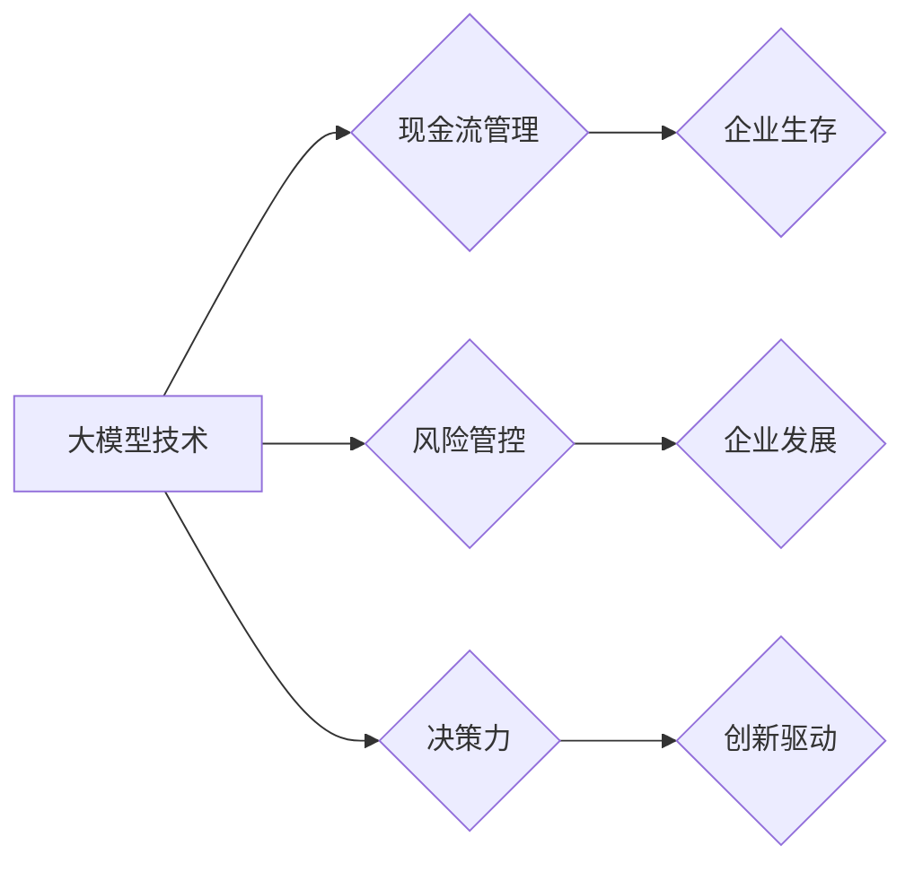

> 大模型、创业、现金流管理、风险管控、决策力、人工智能、商业模式、技术创新

## 1. 背景介绍

大模型时代已经到来，其强大的计算能力和泛化能力正在深刻地改变着各行各业。对于创业者来说，大模型技术带来了前所未有的机遇，但也带来了新的挑战。如何利用大模型技术创造价值，如何应对大模型带来的风险，如何做出明智的决策，成为创业者必须思考的问题。

传统的创业法则在面对大模型时代时显得有些力不从心。传统的创业模式往往依赖于产品创新和市场营销，而大模型技术则更侧重于数据驱动和算法优化。因此，创业者需要重新审视自己的创业理念和策略，并学习新的知识和技能，才能在竞争激烈的市场中立于不败之地。

## 2. 核心概念与联系

### 2.1 大模型

大模型是指参数量巨大、训练数据海量的人工智能模型。它们能够学习复杂的模式和关系，并应用于各种任务，例如自然语言处理、图像识别、语音合成等。

### 2.2 现金流管理

现金流管理是指企业控制和管理现金流动的过程，包括收入、支出、存货、应收账款等方面的管理。良好的现金流管理是企业生存和发展的关键。

### 2.3 风险管控

风险管控是指企业识别、评估、控制和应对各种风险的系统性过程。风险管控可以帮助企业规避风险，降低损失，提高经营效率。

### 2.4 决策力

决策力是指企业领导者在面对复杂情况时，能够做出明智的判断和选择的能力。良好的决策力是企业成功的关键因素。

**Mermaid 流程图**



## 3. 核心算法原理 & 具体操作步骤

### 3.1 算法原理概述

大模型的训练主要基于深度学习算法，例如Transformer模型。这些算法通过多层神经网络结构，学习数据中的复杂模式和关系。

### 3.2 算法步骤详解

1. **数据预处理:** 将原始数据清洗、转换、格式化，使其适合模型训练。
2. **模型构建:** 根据任务需求选择合适的深度学习模型架构，并设置模型参数。
3. **模型训练:** 使用训练数据训练模型，调整模型参数，使其能够准确地完成任务。
4. **模型评估:** 使用测试数据评估模型的性能，并根据评估结果进行模型调优。
5. **模型部署:** 将训练好的模型部署到生产环境中，用于实际应用。

### 3.3 算法优缺点

**优点:**

* 强大的泛化能力，能够应用于多种任务。
* 学习能力强，能够从海量数据中提取有价值的信息。
* 性能不断提升，模型精度不断提高。

**缺点:**

* 训练成本高，需要大量的计算资源和数据。
* 模型解释性差，难以理解模型的决策过程。
* 容易受到数据偏差的影响，可能产生偏见和歧视。

### 3.4 算法应用领域

大模型技术应用领域广泛，包括：

* 自然语言处理：机器翻译、文本摘要、问答系统等。
* 图像识别：物体检测、图像分类、图像生成等。
* 语音识别：语音转文本、语音合成等。
* 医疗诊断：疾病预测、影像分析等。
* 金融分析：风险评估、欺诈检测等。

## 4. 数学模型和公式 & 详细讲解 & 举例说明

### 4.1 数学模型构建

大模型训练的核心是优化模型参数，使其能够最小化预测误差。常用的优化算法包括梯度下降法、Adam算法等。

**梯度下降法:**

梯度下降法是一种迭代优化算法，其目标是通过不断调整模型参数，使损失函数的值最小化。

**公式:**

$$
\theta_{t+1} = \theta_t - \eta \nabla L(\theta_t)
$$

其中：

* $\theta$ 表示模型参数
* $t$ 表示迭代次数
* $\eta$ 表示学习率
* $L(\theta)$ 表示损失函数

**举例说明:**

假设我们有一个线性回归模型，其损失函数为均方误差。梯度下降法会计算损失函数对模型参数的梯度，然后根据梯度方向调整模型参数，直到损失函数达到最小值。

### 4.2 公式推导过程

梯度下降法的推导过程基于微积分的知识。损失函数的梯度表示损失函数变化的方向和幅度。通过沿着梯度负方向调整模型参数，可以使损失函数的值逐渐减小。

### 4.3 案例分析与讲解

在实际应用中，梯度下降法通常会结合动量、学习率衰减等技巧，以提高优化效率和收敛速度。

## 5. 项目实践：代码实例和详细解释说明

### 5.1 开发环境搭建

使用Python语言和深度学习框架TensorFlow或PyTorch搭建开发环境。

### 5.2 源代码详细实现

```python
import tensorflow as tf

# 定义模型结构
model = tf.keras.models.Sequential([
    tf.keras.layers.Dense(64, activation='relu', input_shape=(10,)),
    tf.keras.layers.Dense(10, activation='softmax')
])

# 定义损失函数和优化器
model.compile(loss='sparse_categorical_crossentropy', optimizer='adam', metrics=['accuracy'])

# 训练模型
model.fit(x_train, y_train, epochs=10)

# 评估模型
loss, accuracy = model.evaluate(x_test, y_test)
print('Loss:', loss)
print('Accuracy:', accuracy)
```

### 5.3 代码解读与分析

这段代码定义了一个简单的多层感知机模型，并使用梯度下降法进行训练。

### 5.4 运行结果展示

训练完成后，可以评估模型的性能，并使用模型进行预测。

## 6. 实际应用场景

### 6.1 自然语言处理

大模型可以用于机器翻译、文本摘要、问答系统等自然语言处理任务。

### 6.2 图像识别

大模型可以用于物体检测、图像分类、图像生成等图像识别任务。

### 6.3 语音识别

大模型可以用于语音转文本、语音合成等语音识别任务。

### 6.4 未来应用展望

大模型技术还在不断发展，未来将应用于更多领域，例如医疗诊断、金融分析、自动驾驶等。

## 7. 工具和资源推荐

### 7.1 学习资源推荐

* **书籍:**
    * 深度学习
    * 自然语言处理
* **在线课程:**
    * Coursera
    * edX
* **开源项目:**
    * TensorFlow
    * PyTorch

### 7.2 开发工具推荐

* **编程语言:** Python
* **深度学习框架:** TensorFlow, PyTorch
* **云计算平台:** AWS, Azure, GCP

### 7.3 相关论文推荐

* Attention Is All You Need
* BERT: Pre-training of Deep Bidirectional Transformers for Language Understanding

## 8. 总结：未来发展趋势与挑战

### 8.1 研究成果总结

大模型技术取得了显著的进展，在多个领域取得了突破性成果。

### 8.2 未来发展趋势

大模型技术将继续发展，朝着更强大、更智能、更安全的方向发展。

### 8.3 面临的挑战

大模型技术还面临着一些挑战，例如模型解释性差、数据安全问题、伦理问题等。

### 8.4 研究展望

未来研究将重点关注解决大模型技术面临的挑战，并探索大模型技术的更多应用场景。

## 9. 附录：常见问题与解答

### 9.1 什么是大模型？

大模型是指参数量巨大、训练数据海量的人工智能模型。

### 9.2 大模型的训练成本高吗？

是的，大模型的训练成本很高，需要大量的计算资源和数据。

### 9.3 大模型的应用场景有哪些？

大模型的应用场景广泛，包括自然语言处理、图像识别、语音识别等。

### 9.4 如何学习大模型技术？

可以通过阅读书籍、参加在线课程、参与开源项目等方式学习大模型技术。


作者：禅与计算机程序设计艺术 / Zen and the Art of Computer Programming 
<end_of_turn>