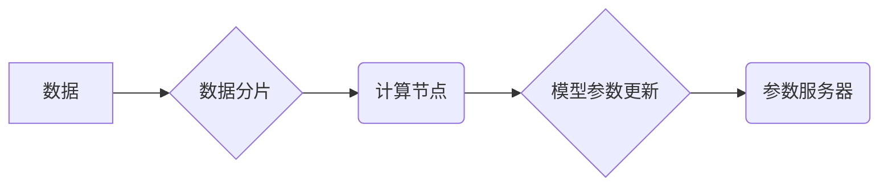

> 大规模语言模型，分布式训练，集群架构，深度学习，并行计算，参数服务器

## 1. 背景介绍

近年来，深度学习技术取得了飞速发展，大规模语言模型（LLM）作为其重要分支，在自然语言处理领域展现出强大的能力，例如文本生成、机器翻译、问答系统等。然而，训练这些庞大的模型需要海量数据和强大的计算资源，传统的单机训练已经难以满足需求。分布式训练应运而生，通过将模型参数和数据分布到多个机器节点上进行并行计算，有效提高了训练效率。

本文将深入探讨大规模语言模型的分布式训练，重点介绍集群架构的设计和实现，并结合实际案例分析其优缺点和应用场景。

## 2. 核心概念与联系

### 2.1 分布式训练

分布式训练是指将一个大型机器学习模型的训练任务分解成多个子任务，分别在不同的计算节点上进行并行计算，最终将各个节点的计算结果汇总起来，得到最终的模型参数。

### 2.2 集群架构

集群架构是一种将多个计算节点连接在一起，形成一个统一的计算资源池的架构。在分布式训练中，集群架构可以提供强大的计算能力和数据处理能力，支持大规模模型的训练。

### 2.3 参数服务器

参数服务器是分布式训练中重要的组件，负责存储和管理模型参数。每个计算节点都会从参数服务器获取最新的模型参数，并将其更新回参数服务器。

**Mermaid 流程图**



## 3. 核心算法原理 & 具体操作步骤

### 3.1 算法原理概述

分布式训练的核心算法是并行计算，通过将模型参数和数据分布到多个节点上，并行计算模型梯度，从而加速模型训练。常见的并行计算方法包括数据并行、模型并行和混合并行。

* 数据并行：将训练数据分割成多个子集，分别在不同的节点上进行训练。
* 模型并行：将模型参数分割成多个子模型，分别在不同的节点上进行训练。
* 混合并行：将数据并行和模型并行结合起来，进一步提高训练效率。

### 3.2 算法步骤详解

1. 将模型参数和数据分布到多个计算节点上。
2. 每个节点根据其分配的数据，计算模型梯度。
3. 将每个节点计算的梯度汇总到参数服务器。
4. 参数服务器根据汇总的梯度更新模型参数。
5. 将更新后的模型参数广播到所有计算节点。
6. 重复步骤2-5，直到模型训练完成。

### 3.3 算法优缺点

**优点：**

* 提高训练效率：并行计算可以显著加速模型训练速度。
* 扩展性强：可以根据需要增加计算节点，扩展训练规模。
* 资源利用率高：充分利用集群资源，提高资源利用率。

**缺点：**

* 通信开销：节点间数据传输会带来一定的通信开销。
* 复杂性增加：分布式训练的系统架构更加复杂，需要考虑数据同步、参数更新等问题。
* 硬件要求高：分布式训练需要高性能的计算节点和网络设备。

### 3.4 算法应用领域

分布式训练广泛应用于各种大规模机器学习任务，例如：

* 自然语言处理：训练大型语言模型，例如BERT、GPT-3等。
* 图像识别：训练深度卷积神经网络，用于图像分类、目标检测等任务。
* 机器翻译：训练神经机器翻译模型，提高翻译质量和效率。

## 4. 数学模型和公式 & 详细讲解 & 举例说明

### 4.1 数学模型构建

假设我们有一个包含 $N$ 个样本的训练数据集 $D = \{x_1, y_1, x_2, y_2, ..., x_N, y_N\}$, 其中 $x_i$ 是输入样本，$y_i$ 是对应的标签。我们的目标是学习一个模型参数 $\theta$，使得模型在训练数据上的损失函数最小化。

损失函数通常定义为预测值与真实值的差值，例如均方误差 (MSE) 或交叉熵损失 (Cross-Entropy Loss)。

### 4.2 公式推导过程

使用梯度下降算法优化模型参数 $\theta$，其更新公式如下：

$$\theta = \theta - \eta \nabla L(\theta)$$

其中：

* $\theta$ 是模型参数
* $\eta$ 是学习率
* $\nabla L(\theta)$ 是损失函数 $L(\theta)$ 对参数 $\theta$ 的梯度

### 4.3 案例分析与讲解

假设我们使用线性回归模型，其损失函数为均方误差：

$$L(\theta) = \frac{1}{N} \sum_{i=1}^{N} (y_i - \hat{y}_i)^2$$

其中：

* $\hat{y}_i = \theta^T x_i$ 是模型预测的输出值

梯度 $\nabla L(\theta)$ 可以通过求导得到：

$$\nabla L(\theta) = \frac{1}{N} \sum_{i=1}^{N} 2(y_i - \hat{y}_i) x_i$$

将梯度代入更新公式，即可得到模型参数的更新规则。

## 5. 项目实践：代码实例和详细解释说明

### 5.1 开发环境搭建

* 操作系统：Linux
* 编程语言：Python
* 深度学习框架：TensorFlow 或 PyTorch
* 集群管理工具：Kubernetes 或 Docker Swarm

### 5.2 源代码详细实现

以下是一个使用 TensorFlow 实现分布式训练的简单代码示例：

```python
import tensorflow as tf

# 定义模型
model = tf.keras.Sequential([
    tf.keras.layers.Dense(64, activation='relu'),
    tf.keras.layers.Dense(10, activation='softmax')
])

# 定义优化器和损失函数
optimizer = tf.keras.optimizers.Adam()
loss_fn = tf.keras.losses.CategoricalCrossentropy()

# 分布式训练
strategy = tf.distribute.MirroredStrategy()
with strategy.scope():
    model.compile(optimizer=optimizer, loss=loss_fn)
    model.fit(x_train, y_train, epochs=10)
```

### 5.3 代码解读与分析

* 使用 `tf.distribute.MirroredStrategy()` 创建分布式训练策略，将模型参数和数据分布到多个 GPU 上。
* 使用 `with strategy.scope()` 块，在分布式策略范围内训练模型。
* `model.compile()` 方法配置优化器和损失函数。
* `model.fit()` 方法开始训练模型。

### 5.4 运行结果展示

训练完成后，可以评估模型在测试集上的性能，例如准确率、召回率等。

## 6. 实际应用场景

### 6.1 自然语言处理

* **大型语言模型训练:** BERT、GPT-3 等大型语言模型的训练需要海量数据和强大的计算资源，分布式训练是其训练的关键技术。
* **机器翻译:** 神经机器翻译模型的训练可以利用分布式训练提高翻译质量和效率。
* **文本生成:** 文本生成模型，例如对话系统、故事生成器等，也可以通过分布式训练提高生成质量和速度。

### 6.2 图像识别

* **深度卷积神经网络训练:** 图像分类、目标检测等任务的深度卷积神经网络训练可以利用分布式训练加速训练速度。
* **图像分割:** 图像分割模型的训练也需要大量的计算资源，分布式训练可以有效提高训练效率。

### 6.3 其他领域

* **推荐系统:** 分布式训练可以用于训练大型推荐系统，提高推荐准确率和个性化程度。
* **金融预测:** 分布式训练可以用于训练金融预测模型，例如股票价格预测、信用风险评估等。

### 6.4 未来应用展望

随着计算资源的不断发展，分布式训练技术将应用于更多领域，例如：

* **科学计算:** 分布式训练可以用于加速科学计算任务，例如分子模拟、天体物理学模拟等。
* **药物研发:** 分布式训练可以用于加速药物研发过程，例如药物分子设计、药物作用机制研究等。

## 7. 工具和资源推荐

### 7.1 学习资源推荐

* **书籍:**
    * "Deep Learning" by Ian Goodfellow, Yoshua Bengio, and Aaron Courville
    * "Distributed Machine Learning with Python" by  A. K. Singh
* **在线课程:**
    * Coursera: "Deep Learning Specialization" by Andrew Ng
    * Udacity: "Deep Learning Nanodegree"
* **博客和论坛:**
    * TensorFlow Blog: https://blog.tensorflow.org/
    * PyTorch Blog: https://pytorch.org/blog/
    * Stack Overflow: https://stackoverflow.com/

### 7.2 开发工具推荐

* **深度学习框架:** TensorFlow, PyTorch, MXNet
* **集群管理工具:** Kubernetes, Docker Swarm
* **分布式计算库:** Apache Spark, Dask

### 7.3 相关论文推荐

* "Parameter Server: A Distributed Machine Learning Architecture" by Dean et al. (2012)
* "Asynchronous Stochastic Gradient Descent" by Recht et al. (2011)
* "Deep Learning with Large-Scale Distributed Training" by H. Zhang et al. (2018)

## 8. 总结：未来发展趋势与挑战

### 8.1 研究成果总结

分布式训练技术在近年来取得了显著进展，为大规模模型的训练提供了强大的支持。

### 8.2 未来发展趋势

* **模型并行:** 进一步探索模型并行策略，例如模型拆分、模型融合等，提高训练效率。
* **混合并行:** 结合数据并行和模型并行，充分利用计算资源。
* **自动机器学习:** 自动化分布式训练流程，降低训练门槛。
* **异构计算:** 利用 CPU、GPU、FPGA 等不同类型的计算资源，提高训练效率。

### 8.3 面临的挑战

* **通信开销:** 节点间数据传输会带来一定的通信开销，需要优化通信策略。
* **模型并行复杂度:** 模型并行策略的实现较为复杂，需要深入研究模型结构和并行算法。
* **资源管理:** 分布式训练需要高效的资源管理机制，确保资源的合理分配和利用。

### 8.4 研究展望

未来，分布式训练技术将继续发展，为大规模模型的训练提供更强大的支持，推动人工智能技术的发展。

## 9. 附录：常见问题与解答

### 9.1 什么是参数服务器？

参数服务器是分布式训练中重要的组件，负责存储和管理模型参数。每个计算节点都会从参数服务器获取最新的模型参数，并将其更新回参数服务器。

### 9.2 分布式训练有哪些优势？

分布式训练的主要优势包括：

* 提高训练效率：并行计算可以显著加速模型训练速度。
* 扩展性强：可以根据需要增加计算节点，扩展训练规模。
* 资源利用率高：充分利用集群资源，提高资源利用率。

### 9.3 分布式训练有哪些挑战？

分布式训练面临的挑战包括：

* 通信开销：节点间数据传输会带来一定的通信开销。
* 模型并行复杂度：模型并行策略的实现较为复杂。
* 资源管理：分布式训练需要高效的资源管理机制。


作者：禅与计算机程序设计艺术 / Zen and the Art of Computer Programming 
<end_of_turn>