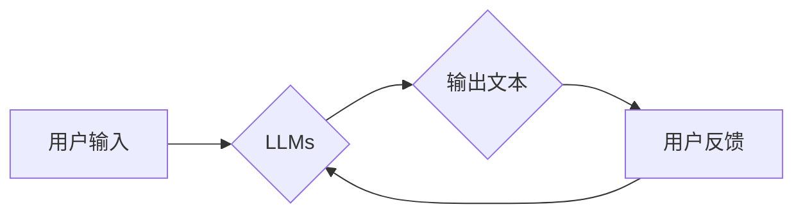

> 大规模语言模型，提示学习，自然语言处理，深度学习，Transformer，文本生成，代码生成

## 1. 背景介绍

近年来，大规模语言模型（Large Language Models，LLMs）在自然语言处理（Natural Language Processing，NLP）领域取得了令人瞩目的成就。从文本生成、机器翻译到代码编写，LLMs展现出强大的能力，深刻地改变了我们与语言交互的方式。

LLMs的成功离不开深度学习技术的进步，特别是Transformer架构的提出。Transformer模型通过自注意力机制（Self-Attention）有效地捕捉文本中的长距离依赖关系，为LLMs的训练和应用奠定了基础。

然而，LLMs的性能仍然受到一些限制，例如：

* **训练成本高昂：** 训练大型语言模型需要大量的计算资源和数据，这对于个人开发者和小型机构来说是一个巨大的挑战。
* **可解释性差：** LLMs的决策过程往往是黑盒，难以理解模型是如何生成特定输出的。
* **提示依赖性强：** LLMs的性能很大程度上依赖于输入的提示（Prompt），如何设计有效的提示是一个关键问题。

## 2. 核心概念与联系

提示学习（Prompt Learning）是一种通过优化提示文本来提高LLMs性能的技术。它旨在通过设计更精确、更具指导性的提示，引导模型生成更准确、更符合预期结果的输出。

**提示学习的原理：**

LLMs本质上是一个强大的文本生成器，它根据输入的提示文本生成相应的输出文本。提示学习的目标是找到最优的提示文本，以最大化模型的性能。

**提示学习与LLMs的关系：**

提示学习是LLMs应用的一个重要组成部分。它可以帮助我们更好地利用LLMs的潜力，提高模型的性能和效率。

**Mermaid 流程图：**



## 3. 核心算法原理 & 具体操作步骤

### 3.1  算法原理概述

提示学习算法的核心思想是通过优化提示文本来提高LLMs的性能。这可以通过以下几种方法实现：

* **模板化提示：** 使用预定义的提示模板，并在模板中填充特定信息。
* **强化学习：** 使用强化学习算法训练一个提示生成器，该生成器可以根据模型的输出反馈生成更有效的提示。
* **进化算法：** 使用进化算法搜索最优的提示文本。

### 3.2  算法步骤详解

以下是一个基于模板化提示的提示学习算法的具体步骤：

1. **定义提示模板：** 根据具体的应用场景，设计一个通用的提示模板。
2. **填充模板信息：** 将需要传递给LLMs的信息填充到模板中。
3. **生成输出文本：** 将填充后的提示文本输入到LLMs中，获取模型的输出文本。
4. **评估输出质量：** 根据预设的评估指标，评估输出文本的质量。
5. **优化提示模板：** 根据评估结果，调整提示模板，以提高输出质量。

### 3.3  算法优缺点

**优点：**

* **易于实现：** 模板化提示方法相对简单易实现。
* **可扩展性强：** 可以根据不同的应用场景调整提示模板。

**缺点：**

* **性能有限：** 模板化提示方法的性能可能不如其他更复杂的提示学习方法。
* **提示设计依赖性强：** 需要精心设计有效的提示模板。

### 3.4  算法应用领域

提示学习算法在以下领域具有广泛的应用：

* **文本生成：** 生成故事、诗歌、文章等文本内容。
* **机器翻译：** 将文本从一种语言翻译成另一种语言。
* **代码生成：** 根据自然语言描述生成代码。
* **问答系统：** 回答用户提出的问题。

## 4. 数学模型和公式 & 详细讲解 & 举例说明

### 4.1  数学模型构建

提示学习可以看作是一个优化问题，目标是找到最优的提示文本，以最大化模型的输出质量。

我们可以使用以下数学模型来表示提示学习问题：

$$
\text{maximize} \quad f(p, x)
$$

$$
\text{subject to} \quad p \in P
$$

其中：

* $p$ 是提示文本。
* $x$ 是LLMs的输入数据。
* $f(p, x)$ 是模型输出质量的评估函数。
* $P$ 是提示文本的集合。

### 4.2  公式推导过程

为了找到最优的提示文本，我们可以使用梯度下降算法进行优化。梯度下降算法的基本思想是：沿着梯度的负方向更新参数，直到找到最优解。

在提示学习中，梯度下降算法可以用来更新提示文本 $p$。

$$
p_{t+1} = p_t - \alpha \nabla_p f(p_t, x)
$$

其中：

* $p_t$ 是当前的提示文本。
* $p_{t+1}$ 是更新后的提示文本。
* $\alpha$ 是学习率。
* $\nabla_p f(p_t, x)$ 是关于提示文本 $p_t$ 的梯度。

### 4.3  案例分析与讲解

假设我们想使用LLMs生成一篇关于机器学习的文章。我们可以使用以下提示模板：

```
机器学习是一种利用数据训练模型，使其能够从数据中学习规律的技术。

以下是一些机器学习的应用场景：

* [应用场景1]
* [应用场景2]
* [应用场景3]

请根据以上信息，写一篇关于机器学习的文章。
```

我们可以将不同的应用场景填充到模板中，并使用梯度下降算法优化提示模板，以生成更准确、更符合预期结果的文章。

## 5. 项目实践：代码实例和详细解释说明

### 5.1  开发环境搭建

为了进行提示学习的项目实践，我们需要搭建一个开发环境。

* **操作系统：** Linux、macOS 或 Windows。
* **编程语言：** Python。
* **深度学习框架：** TensorFlow 或 PyTorch。
* **LLMs库：** HuggingFace Transformers。

### 5.2  源代码详细实现

以下是一个使用HuggingFace Transformers库进行提示学习的代码示例：

```python
from transformers import AutoModelForSeq2SeqLM, AutoTokenizer

# 加载预训练模型和词典
model_name = "t5-base"
tokenizer = AutoTokenizer.from_pretrained(model_name)
model = AutoModelForSeq2SeqLM.from_pretrained(model_name)

# 定义提示模板
prompt_template = "请根据以下信息，写一篇关于[主题]的文章：

[信息]"

# 填充提示模板
topic = "机器学习"
information = "机器学习是一种利用数据训练模型，使其能够从数据中学习规律的技术。"
prompt = prompt_template.format(topic=topic, information=information)

# 生成文本
inputs = tokenizer(prompt, return_tensors="pt")
outputs = model.generate(**inputs)

# 解码文本
generated_text = tokenizer.decode(outputs[0], skip_special_tokens=True)

# 打印结果
print(generated_text)
```

### 5.3  代码解读与分析

* **加载预训练模型和词典：** 使用HuggingFace Transformers库加载预训练的T5模型和词典。
* **定义提示模板：** 定义一个通用的提示模板，用于生成关于特定主题的文章。
* **填充提示模板：** 将主题和相关信息填充到提示模板中。
* **生成文本：** 使用模型生成文本。
* **解码文本：** 将模型生成的文本解码成可读文本。
* **打印结果：** 打印生成的文本。

### 5.4  运行结果展示

运行以上代码，可以生成一篇关于机器学习的文章。

## 6. 实际应用场景

提示学习在许多实际应用场景中发挥着重要作用，例如：

* **聊天机器人：** 通过设计有效的提示，可以引导聊天机器人生成更自然、更符合语境的对话。
* **文本摘要：** 使用提示学习可以生成更准确、更简洁的文本摘要。
* **代码生成：** 通过设计特定的提示，可以引导LLMs生成更准确、更符合规范的代码。

### 6.4  未来应用展望

随着LLMs技术的不断发展，提示学习的应用场景将会更加广泛。未来，我们可能会看到：

* **个性化提示学习：** 根据用户的偏好和需求，生成个性化的提示。
* **多模态提示学习：** 将文本、图像、音频等多模态信息融合到提示中，提高模型的理解和生成能力。
* **自动提示生成：** 使用机器学习算法自动生成有效的提示，降低用户的学习成本。

## 7. 工具和资源推荐

### 7.1  学习资源推荐

* **HuggingFace Transformers库文档：** https://huggingface.co/docs/transformers/index
* **OpenAI API文档：** https://platform.openai.com/docs/api-reference
* **Google AI Blog：** https://ai.googleblog.com/

### 7.2  开发工具推荐

* **Jupyter Notebook：** https://jupyter.org/
* **VS Code：** https://code.visualstudio.com/

### 7.3  相关论文推荐

* **BERT: Pre-training of Deep Bidirectional Transformers for Language Understanding**
* **GPT-3: Language Models are Few-Shot Learners**
* **Prompt Engineering for Large Language Models**

## 8. 总结：未来发展趋势与挑战

### 8.1  研究成果总结

提示学习是LLMs应用的一个重要方向，它可以有效地提高模型的性能和效率。近年来，在提示学习领域取得了显著的进展，例如：

* **模板化提示：** 提供了一种简单易实现的提示学习方法。
* **强化学习：** 可以训练更有效的提示生成器。
* **进化算法：** 可以搜索更优的提示文本。

### 8.2  未来发展趋势

未来，提示学习的研究将朝着以下方向发展：

* **个性化提示学习：** 根据用户的偏好和需求，生成个性化的提示。
* **多模态提示学习：** 将文本、图像、音频等多模态信息融合到提示中，提高模型的理解和生成能力。
* **自动提示生成：** 使用机器学习算法自动生成有效的提示，降低用户的学习成本。

### 8.3  面临的挑战

提示学习仍然面临一些挑战，例如：

* **提示设计：** 设计有效的提示仍然是一个困难的问题。
* **可解释性：** LLMs的决策过程仍然难以理解，这使得提示学习的原理和效果难以解释。
* **数据效率：** 提示学习算法通常需要大量的训练数据。

### 8.4  研究展望

尽管面临挑战，但提示学习仍然是一个充满希望的研究方向。随着LLMs技术的不断发展，我们相信提示学习将会在未来发挥更加重要的作用，推动人工智能技术的发展。

## 9. 附录：常见问题与解答

**Q1：提示学习和微调有什么区别？**

**A1：** 提示学习和微调都是LLMs应用的常用技术，但它们侧重点不同。微调是指对预训练模型进行进一步训练，调整模型参数，使其适应特定的任务。提示学习则是在不改变模型参数的情况下，通过优化提示文本来提高模型性能。

**Q2：如何设计有效的提示？**

**A2：** 设计有效的提示是一个复杂的问题，需要根据具体的应用场景和模型特点进行调整。一些常用的技巧包括：

* **明确目标：** 提示应该清晰地表达模型需要完成的任务。
* **提供上下文信息：** 提供足够的上下文信息，帮助模型理解问题和生成更准确的答案。
* **使用模板：** 使用预定义的提示模板，可以提高提示的效率和一致性。
* **进行实验：** 通过实验和测试，不断优化提示文本，以提高模型性能。


作者：禅与计算机程序设计艺术 / Zen and the Art of Computer Programming 
<end_of_turn>