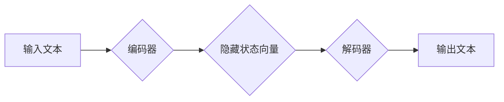

> 大规模语言模型，编码器，解码器，Transformer，BERT，GPT，自然语言处理，深度学习

## 1. 背景介绍

近年来，深度学习在自然语言处理 (NLP) 领域取得了显著进展，大规模语言模型 (LLM) 作为其重要组成部分，展现出强大的文本生成、理解和翻译能力。LLM 的核心结构通常由编码器和解码器组成，它们协同工作以完成各种 NLP 任务。本文将深入探讨编码器和解码器结构，从理论基础到实际应用，并分析其优缺点以及未来发展趋势。

## 2. 核心概念与联系

编码器和解码器是 LLM 的两大核心模块，它们分别负责对输入文本进行编码和生成输出文本。

**2.1 编码器**

编码器负责将输入文本序列映射到一个固定长度的隐藏状态向量，该向量包含了输入文本的语义信息。编码器通常由多层 Transformer 结构组成，每层 Transformer 包含多头自注意力机制和前馈神经网络。

**2.2 解码器**

解码器接收编码器输出的隐藏状态向量，并根据该向量生成输出文本序列。解码器也通常由多层 Transformer 结构组成，并包含掩码机制，以确保解码器在生成每个单词时只参考之前生成的单词。

**2.3 编码器-解码器结构示意图**



## 3. 核心算法原理 & 具体操作步骤

### 3.1 算法原理概述

编码器和解码器结构的核心算法是 Transformer，它是一种基于注意力机制的序列到序列模型。Transformer 能够有效地捕捉文本序列中的长距离依赖关系，并实现高效的并行计算。

### 3.2 算法步骤详解

**3.2.1 编码器**

1. 将输入文本序列分割成单词，并将其嵌入到词向量空间中。
2. 将词向量输入到 Transformer 的第一层，并进行多头自注意力机制和前馈神经网络的计算。
3. 将计算结果作为输入，重复步骤 2，直到达到预设的编码器层数。
4. 将最后层的隐藏状态向量作为编码器的输出。

**3.2.2 解码器**

1. 将编码器的输出作为输入，并将其与特殊的开始标记一起输入到 Transformer 的第一层。
2. 在解码器的每一层中，使用掩码机制，确保解码器只参考之前生成的单词。
3. 使用多头自注意力机制和前馈神经网络计算解码器的隐藏状态向量。
4. 将隐藏状态向量输入到输出层，生成下一个单词的概率分布。
5. 根据概率分布选择最可能的单词，并将其添加到输出文本序列中。
6. 重复步骤 3-5，直到生成结束标记。

### 3.3 算法优缺点

**优点:**

* 能够有效地捕捉文本序列中的长距离依赖关系。
* 实现高效的并行计算。
* 在各种 NLP 任务中取得了优异的性能。

**缺点:**

* 训练成本高，需要大量的计算资源和数据。
* 模型规模较大，部署成本较高。

### 3.4 算法应用领域

编码器-解码器结构广泛应用于各种 NLP 任务，例如：

* 机器翻译
* 文本摘要
* 问答系统
* 文本生成
* 代码生成

## 4. 数学模型和公式 & 详细讲解 & 举例说明

### 4.1 数学模型构建

**4.1.1 编码器**

编码器的数学模型可以表示为：

$$
h_i = f(x_i, h_{i-1})
$$

其中：

* $h_i$ 是第 i 个单词的隐藏状态向量。
* $x_i$ 是第 i 个单词的词向量。
* $h_{i-1}$ 是前一个单词的隐藏状态向量。
* $f$ 是编码器网络的计算函数，通常包含多头自注意力机制和前馈神经网络。

**4.1.2 解码器**

解码器的数学模型可以表示为：

$$
y_i = g(h_i, y_{i-1})
$$

其中：

* $y_i$ 是第 i 个单词的预测概率分布。
* $h_i$ 是编码器输出的隐藏状态向量。
* $y_{i-1}$ 是之前生成的单词序列。
* $g$ 是解码器网络的计算函数，通常包含多头自注意力机制和前馈神经网络。

**4.1.3 注意力机制**

注意力机制是 Transformer 模型的核心，它允许模型关注输入序列中与当前任务相关的部分。注意力机制的计算公式可以表示为：

$$
Attention(Q, K, V) = softmax(\frac{QK^T}{\sqrt{d_k}})V
$$

其中：

* $Q$ 是查询矩阵。
* $K$ 是键矩阵。
* $V$ 是值矩阵。
* $d_k$ 是键向量的维度。

### 4.2 公式推导过程

注意力机制的公式推导过程可以参考 Transformer 原文论文。

### 4.3 案例分析与讲解

**4.3.1 机器翻译**

在机器翻译任务中，编码器将源语言文本编码为隐藏状态向量，解码器则根据该向量生成目标语言文本。

**4.3.2 文本摘要**

在文本摘要任务中，编码器将整个文档编码为隐藏状态向量，解码器则根据该向量生成摘要文本。

## 5. 项目实践：代码实例和详细解释说明

### 5.1 开发环境搭建

* Python 3.7+
* PyTorch 1.7+
* CUDA 10.2+

### 5.2 源代码详细实现

```python
import torch
import torch.nn as nn

class Encoder(nn.Module):
    def __init__(self, vocab_size, embedding_dim, hidden_dim, num_layers, num_heads):
        super(Encoder, self).__init__()
        self.embedding = nn.Embedding(vocab_size, embedding_dim)
        self.transformer_layers = nn.ModuleList([
            nn.TransformerEncoderLayer(embedding_dim, num_heads, hidden_dim)
            for _ in range(num_layers)
        ])

    def forward(self, x):
        x = self.embedding(x)
        for layer in self.transformer_layers:
            x = layer(x)
        return x

class Decoder(nn.Module):
    def __init__(self, vocab_size, embedding_dim, hidden_dim, num_layers, num_heads):
        super(Decoder, self).__init__()
        self.embedding = nn.Embedding(vocab_size, embedding_dim)
        self.transformer_layers = nn.ModuleList([
            nn.TransformerDecoderLayer(embedding_dim, num_heads, hidden_dim)
            for _ in range(num_layers)
        ])

    def forward(self, x, encoder_output):
        x = self.embedding(x)
        for layer in self.transformer_layers:
            x = layer(x, encoder_output)
        return x

# 实例化编码器和解码器
encoder = Encoder(vocab_size=10000, embedding_dim=512, hidden_dim=2048, num_layers=6, num_heads=8)
decoder = Decoder(vocab_size=10000, embedding_dim=512, hidden_dim=2048, num_layers=6, num_heads=8)

# 输入数据
input_text = torch.randint(0, 10000, (1, 10))

# 编码器输出
encoder_output = encoder(input_text)

# 解码器输出
decoder_output = decoder(torch.zeros(1, 1), encoder_output)

```

### 5.3 代码解读与分析

* 编码器和解码器分别由嵌入层、Transformer 层组成。
* Transformer 层包含多头自注意力机制和前馈神经网络。
* 嵌入层将单词转换为词向量。
* 解码器使用掩码机制，确保只参考之前生成的单词。

### 5.4 运行结果展示

运行上述代码，可以得到解码器输出的预测概率分布，并根据该分布生成输出文本。

## 6. 实际应用场景

### 6.1 机器翻译

编码器-解码器结构在机器翻译领域取得了显著成果，例如 Google Translate 和 DeepL 等翻译工具都采用了 Transformer 模型。

### 6.2 文本摘要

编码器-解码器结构也广泛应用于文本摘要任务，可以自动生成文章的简短摘要。

### 6.3 问答系统

编码器-解码器结构可以用于构建问答系统，根据用户的问题，从文本库中找到最相关的答案。

### 6.4 未来应用展望

编码器-解码器结构在未来将继续推动 NLP 领域的发展，并应用于更多新的场景，例如：

* 代码生成
* 创意写作
* 聊天机器人

## 7. 工具和资源推荐

### 7.1 学习资源推荐

* Transformer 原文论文：https://arxiv.org/abs/1706.03762
* Hugging Face Transformers 库：https://huggingface.co/transformers/

### 7.2 开发工具推荐

* PyTorch：https://pytorch.org/
* TensorFlow：https://www.tensorflow.org/

### 7.3 相关论文推荐

* BERT：https://arxiv.org/abs/1810.04805
* GPT：https://openai.com/blog/language-unsupervised/

## 8. 总结：未来发展趋势与挑战

### 8.1 研究成果总结

编码器-解码器结构是 LLM 的核心结构，在各种 NLP 任务中取得了显著成果。Transformer 模型的出现，进一步提升了 LLM 的性能，并推动了 NLP 领域的发展。

### 8.2 未来发展趋势

* 模型规模的进一步扩大
* 训练数据的多样化和高质量
* 算法的创新和优化
* 跨模态学习

### 8.3 面临的挑战

* 训练成本高
* 模型解释性差
* 数据偏差和公平性问题

### 8.4 研究展望

未来，LLM 将继续朝着更强大、更智能的方向发展，并应用于更多新的领域。

## 9. 附录：常见问题与解答

### 9.1 什么是 Transformer 模型？

Transformer 模型是一种基于注意力机制的序列到序列模型，能够有效地捕捉文本序列中的长距离依赖关系。

### 9.2 编码器和解码器分别做什么？

编码器负责将输入文本序列映射到一个固定长度的隐藏状态向量，解码器则根据该向量生成输出文本序列。

### 9.3 如何训练 LLM？

LLM 的训练通常使用大量的文本数据，并采用自监督学习的方式。

### 9.4 如何部署 LLM？

LLM 的部署需要考虑模型规模、计算资源和数据传输等因素。

### 9.5 LLM 的应用场景有哪些？

LLM 的应用场景非常广泛，例如机器翻译、文本摘要、问答系统、代码生成等。


作者：禅与计算机程序设计艺术 / Zen and the Art of Computer Programming 
<end_of_turn>