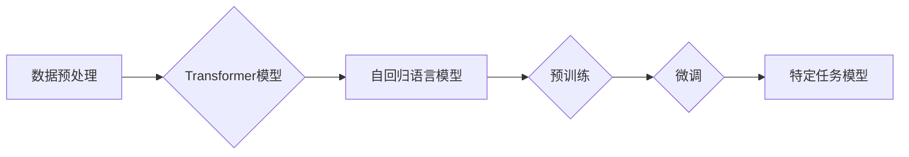

> 大语言模型、Transformer、深度学习、自然语言处理、训练技术、参数量、效率优化、模型评估

## 1. 背景介绍

近年来，深度学习技术取得了飞速发展，特别是Transformer模型的出现，为自然语言处理（NLP）领域带来了革命性的变革。大语言模型（LLM）作为Transformer模型的升级版，拥有海量参数和强大的语义理解能力，在文本生成、机器翻译、问答系统等领域展现出令人惊叹的性能。

然而，训练大型语言模型也面临着巨大的挑战，包括海量数据需求、高昂的计算成本、模型训练时间长等。因此，选择合适的训练技术和策略至关重要，才能有效地训练出高性能的LLM。

## 2. 核心概念与联系

大语言模型的核心概念包括：

* **Transformer模型:**  Transformer模型是一种基于注意力机制的深度神经网络架构，能够有效地捕捉文本序列中的长距离依赖关系。
* **自回归语言模型:**  自回归语言模型是一种预测下一个词的概率分布的模型，通过训练大量的文本数据，学习语言的语法和语义规律。
* **预训练和微调:**  预训练是指在大量通用文本数据上训练模型，学习语言的通用知识；微调是指在特定任务数据上进一步训练模型，使其能够完成特定任务。

**Mermaid 流程图:**



## 3. 核心算法原理 & 具体操作步骤

### 3.1  算法原理概述

大语言模型的训练主要基于深度学习算法，特别是Transformer模型的变体。Transformer模型的核心是注意力机制，它能够学习文本序列中不同词之间的关系，并赋予每个词不同的权重。

### 3.2  算法步骤详解

1. **数据预处理:** 将原始文本数据进行清洗、分词、标记等操作，使其能够被模型理解。
2. **模型构建:** 根据预定的模型架构，搭建Transformer模型，并设置模型参数。
3. **模型训练:** 使用训练数据，通过反向传播算法，更新模型参数，使其能够预测下一个词的概率分布。
4. **模型评估:** 使用验证数据，评估模型的性能，例如困惑度、BLEU分数等。
5. **模型微调:** 根据评估结果，对模型参数进行微调，使其能够更好地完成特定任务。

### 3.3  算法优缺点

**优点:**

* 能够捕捉文本序列中的长距离依赖关系。
* 训练出的模型具有强大的语义理解能力。
* 可以通过预训练和微调，适应不同的任务。

**缺点:**

* 训练成本高昂，需要大量的计算资源和时间。
* 模型参数量大，容易过拟合。
* 对训练数据的质量要求高。

### 3.4  算法应用领域

大语言模型在以下领域具有广泛的应用：

* 文本生成：小说、诗歌、剧本等。
* 机器翻译：将一种语言翻译成另一种语言。
* 问答系统：回答用户提出的问题。
* 对话系统：与用户进行自然语言对话。
* 代码生成：自动生成代码。

## 4. 数学模型和公式 & 详细讲解 & 举例说明

### 4.1  数学模型构建

大语言模型的数学模型通常基于概率论和统计学，目标是学习文本序列的概率分布。

**例子:**

假设我们有一个文本序列 "The cat sat on the mat"，我们想要预测下一个词。我们可以使用以下公式计算下一个词的概率分布：

$$P(w_n | w_1, w_2, ..., w_{n-1})$$

其中：

* $w_n$ 是下一个词。
* $w_1, w_2, ..., w_{n-1}$ 是前面的词。

### 4.2  公式推导过程

Transformer模型使用注意力机制来计算每个词之间的关系，并赋予每个词不同的权重。注意力机制的公式如下：

$$Attention(Q, K, V) = softmax(\frac{QK^T}{\sqrt{d_k}})V$$

其中：

* $Q$ 是查询矩阵。
* $K$ 是键矩阵。
* $V$ 是值矩阵。
* $d_k$ 是键向量的维度。

### 4.3  案例分析与讲解

通过注意力机制，Transformer模型能够学习到文本序列中不同词之间的关系，例如，在句子 "The cat sat on the mat" 中，"cat" 和 "sat" 之间存在着语义上的关系，而 "the" 和 "mat" 之间也存在着语义上的关系。

## 5. 项目实践：代码实例和详细解释说明

### 5.1  开发环境搭建

* Python 3.7+
* PyTorch 1.7+
* CUDA 10.2+

### 5.2  源代码详细实现

```python
import torch
import torch.nn as nn

class Transformer(nn.Module):
    def __init__(self, vocab_size, embedding_dim, num_heads, num_layers):
        super(Transformer, self).__init__()
        self.embedding = nn.Embedding(vocab_size, embedding_dim)
        self.transformer_layers = nn.ModuleList([
            nn.TransformerEncoderLayer(embedding_dim, num_heads)
            for _ in range(num_layers)
        ])
        self.linear = nn.Linear(embedding_dim, vocab_size)

    def forward(self, x):
        x = self.embedding(x)
        for layer in self.transformer_layers:
            x = layer(x)
        x = self.linear(x)
        return x
```

### 5.3  代码解读与分析

* `__init__` 方法初始化模型参数，包括词嵌入层、Transformer编码器层和输出层。
* `forward` 方法定义模型的正向传播过程，将输入序列经过词嵌入层、Transformer编码器层和输出层，最终得到下一个词的概率分布。

### 5.4  运行结果展示

训练完成后，可以使用模型对新的文本序列进行预测，例如：

```python
model.eval()
input_text = "The cat sat on"
input_ids = tokenizer.encode(input_text)
output_ids = model(input_ids)
predicted_word = tokenizer.decode(output_ids.argmax())
print(f"Predicted word: {predicted_word}")
```

## 6. 实际应用场景

### 6.1  文本生成

大语言模型可以用于生成各种类型的文本，例如：

* **小说、诗歌、剧本:**  通过训练大量的文学作品数据，模型能够学习到写作风格和语法规则，并生成具有创意和情感的文本。
* **新闻报道、文章摘要:**  模型可以根据给定的新闻事件或文章内容，自动生成新闻报道或文章摘要。

### 6.2  机器翻译

大语言模型可以用于将一种语言翻译成另一种语言，例如：

* **英语-中文翻译:**  模型可以学习英语和中文之间的语义关系，并准确地翻译文本。
* **多语言翻译:**  模型可以支持多种语言的翻译，例如英语、中文、日语、韩语等。

### 6.3  问答系统

大语言模型可以用于构建问答系统，例如：

* **聊天机器人:**  模型可以与用户进行自然语言对话，并回答用户的提问。
* **知识问答系统:**  模型可以根据给定的问题，从知识库中检索相关信息并提供答案。

### 6.4  未来应用展望

大语言模型在未来将有更广泛的应用场景，例如：

* **个性化教育:**  根据学生的学习情况，提供个性化的学习内容和辅导。
* **医疗诊断:**  辅助医生进行疾病诊断，并提供治疗方案建议。
* **法律服务:**  帮助律师进行法律研究和案件分析。

## 7. 工具和资源推荐

### 7.1  学习资源推荐

* **书籍:**
    * 《深度学习》
    * 《自然语言处理》
    * 《Transformer模型详解》
* **在线课程:**
    * Coursera: 深度学习
    * Udacity: 自然语言处理
    * fast.ai: 深度学习

### 7.2  开发工具推荐

* **PyTorch:**  一个开源的深度学习框架。
* **TensorFlow:**  另一个开源的深度学习框架。
* **HuggingFace Transformers:**  一个用于加载和训练预训练Transformer模型的库。

### 7.3  相关论文推荐

* 《Attention Is All You Need》
* 《BERT: Pre-training of Deep Bidirectional Transformers for Language Understanding》
* 《GPT-3: Language Models are Few-Shot Learners》

## 8. 总结：未来发展趋势与挑战

### 8.1  研究成果总结

近年来，大语言模型取得了显著的进展，在文本生成、机器翻译、问答系统等领域展现出强大的能力。

### 8.2  未来发展趋势

* **模型规模更大:**  随着计算资源的不断发展，模型规模将继续扩大，从而提升模型的性能。
* **多模态学习:**  大语言模型将与其他模态数据（例如图像、音频）进行融合，实现多模态理解和生成。
* **可解释性增强:**  研究人员将致力于提高大语言模型的可解释性，使其能够更好地解释自己的决策过程。

### 8.3  面临的挑战

* **数据安全和隐私:**  大语言模型的训练需要大量的文本数据，如何保证数据安全和隐私是一个重要的挑战。
* **模型偏见和歧视:**  大语言模型可能存在偏见和歧视，需要采取措施进行缓解。
* **伦理问题:**  大语言模型的应用可能引发一些伦理问题，例如虚假信息生成、深度伪造等，需要进行深入探讨和规范。

### 8.4  研究展望

未来，大语言模型的研究将继续深入，在更多领域发挥作用，为人类社会带来更多便利和福祉。

## 9. 附录：常见问题与解答

**问题 1:** 如何选择合适的训练技术？

**答案:**  选择合适的训练技术需要根据具体任务和模型规模进行考虑。对于小型模型，可以使用梯度下降算法；对于大型模型，可以使用分布式训练技术。

**问题 2:** 如何评估大语言模型的性能？

**答案:**  常用的评估指标包括困惑度、BLEU分数、ROUGE分数等。

**问题 3:** 如何避免大语言模型的过拟合？

**答案:**  可以使用正则化技术、数据增强技术、早停策略等方法来避免模型过拟合。


作者：禅与计算机程序设计艺术 / Zen and the Art of Computer Programming 
<end_of_turn>