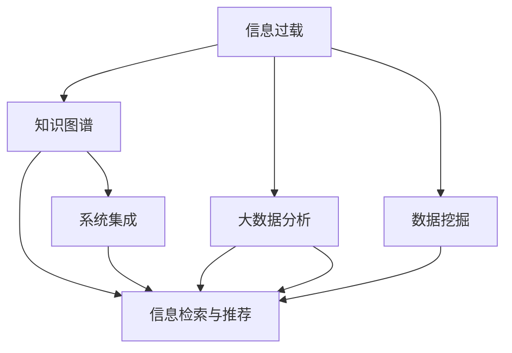

                 

# 信息组织和管理：创建有效的系统以应对信息过载

> 关键词：信息过载,信息组织,管理,系统设计,知识图谱,大数据分析,数据挖掘

## 1. 背景介绍

### 1.1 问题由来

在信息时代，互联网的普及使得信息爆炸式增长，个人和企业面临前所未有的信息过载（Information Overload）问题。每天，数以亿计的信息通过各种渠道涌向我们的屏幕，如图文新闻、社交媒体动态、电子邮件、搜索结果等，其中不乏冗余、重复和误导性内容，极大地干扰了我们的注意力和决策过程。面对这一挑战，如何高效地组织和管理信息，利用数据支持决策，成为现代社会亟待解决的问题。

### 1.2 问题核心关键点

信息过载的核心在于如何筛选、整合、利用信息，提升决策效率和效果。信息组织和管理涉及以下几个关键点：

1. **信息收集与获取**：自动化收集与整理各种来源的信息，如新闻、博客、论坛、社交媒体等，并进行初步筛选。
2. **信息分类与检索**：对信息进行准确分类，建立高效的检索机制，方便快速定位所需信息。
3. **知识图谱构建**：将结构化和非结构化信息转化为语义化的知识图谱，促进信息的深度理解和关联。
4. **大数据分析与挖掘**：利用机器学习、数据挖掘等技术，从海量数据中发现规律和模式，支持决策。
5. **个性化推荐**：基于用户行为和偏好，推荐相关信息，提升用户体验和满意度。
6. **系统集成与协同**：实现不同系统和工具之间的信息交换和协作，构建一体化信息生态系统。

## 2. 核心概念与联系

### 2.1 核心概念概述

为更好地理解信息组织和管理，本节将介绍几个密切相关的核心概念：

- **信息过载**：指在信息爆炸的时代，人们处理信息的能力远不及信息增长速度，导致注意力分散、决策效率低下。
- **知识图谱**：由节点（实体）和边（关系）构成的语义网络，用于表示实体间的复杂关系，支持信息深度整合。
- **大数据分析**：涉及对大规模数据集进行处理、分析和挖掘，以发现有用的信息、模式和趋势。
- **数据挖掘**：通过算法自动分析数据，提取有用知识和规律，辅助决策和预测。
- **信息检索与推荐**：通过算法实现信息的自动查找和推荐，提高信息获取的效率和准确性。
- **系统集成**：将不同系统、工具和平台集成到一个整体的信息管理系统中，实现信息的全面覆盖和深度利用。

这些概念之间的逻辑关系可以通过以下Mermaid流程图来展示：



这个流程图展示信息组织和管理的核心概念及其之间的关系：

1. 信息过载通过多种技术手段进行缓解。
2. 知识图谱、大数据分析和数据挖掘技术有助于深度理解和提取信息。
3. 信息检索与推荐技术用于提升信息获取的效率和准确性。
4. 系统集成将这些技术集成到一个整体的信息管理系统中，提供一体化的信息服务。

## 3. 核心算法原理 & 具体操作步骤

### 3.1 算法原理概述

信息组织和管理涉及多种算法和技术，核心在于如何高效地收集、处理、分析和利用信息。以下是对几个关键算法的概述：

1. **自然语言处理（NLP）**：用于分析和理解文本信息，支持文本分类、实体识别、情感分析等任务。
2. **推荐算法**：基于用户行为和特征，推荐相关信息，支持个性化信息获取。
3. **聚类算法**：将相似信息分组，便于管理和利用。
4. **大数据处理框架**：如Hadoop、Spark等，用于处理大规模数据集。
5. **知识图谱构建算法**：如Deepwalk、GraphSAGE等，用于构建和维护知识图谱。
6. **数据可视化工具**：如Tableau、Power BI等，用于展示和分析信息。

### 3.2 算法步骤详解

信息组织和管理的具体操作步骤通常包括以下几个步骤：

1. **数据收集与预处理**：使用爬虫、API等技术，自动化收集信息，并进行初步清洗和筛选。
2. **信息分类与索引**：利用NLP技术进行信息分类，建立索引，便于快速检索。
3. **知识图谱构建**：将分类后的信息转化为知识图谱，利用图算法进行关系推理和查询。
4. **大数据分析与挖掘**：利用大数据处理框架进行数据存储和处理，结合机器学习算法进行数据分析和挖掘。
5. **信息检索与推荐**：使用信息检索技术快速定位所需信息，结合推荐算法提供个性化信息服务。
6. **系统集成与协同**：将不同系统和工具集成到一个整体的信息管理系统中，提供一体化的信息服务。

### 3.3 算法优缺点

信息组织和管理算法具有以下优点：

1. **效率高**：自动化处理信息，显著提高信息获取和利用的效率。
2. **覆盖广**：涵盖多种信息源和数据类型，提供全面的信息服务。
3. **个性化**：结合用户行为和偏好，提供个性化的信息推荐。
4. **协同性强**：系统集成性强，不同系统间信息共享和协作便捷。

同时，这些算法也存在一些局限性：

1. **数据质量依赖度高**：算法的效果很大程度上依赖于输入数据的质量，数据偏差可能导致错误结果。
2. **复杂度高**：处理大规模数据集和复杂关系时，算法复杂度高，计算资源消耗大。
3. **用户隐私风险**：在收集和处理用户信息时，需注意隐私保护，避免数据泄露和滥用。
4. **算法透明度低**：部分算法如深度学习模型，难以解释其内部机制和决策逻辑。

尽管存在这些局限性，信息组织和管理算法在实际应用中仍取得了显著成效，广泛应用于新闻业、电商、金融、医疗等多个领域，为信息管理提供了强大的技术支持。

### 3.4 算法应用领域

信息组织和管理技术已经在多个领域得到了广泛应用，例如：

- **新闻业**：利用自动化信息收集和分类技术，提高新闻编辑效率，降低成本。
- **电商**：通过个性化推荐系统，提升用户体验，增加销售额。
- **金融**：利用大数据分析技术，进行市场预测和风险评估，辅助决策。
- **医疗**：利用知识图谱技术，辅助医生诊断和治疗，提高医疗服务质量。
- **政府**：构建大数据分析平台，支持政策制定和公共服务优化。
- **教育**：利用信息检索和推荐技术，为学生提供个性化的学习资源和指导。

除了上述这些经典应用外，信息组织和管理技术还在更多场景中得到创新应用，如智能客服、智慧城市、智能家居等，为各行各业带来了新的价值。

## 4. 数学模型和公式 & 详细讲解 & 举例说明

### 4.1 数学模型构建

本节将使用数学语言对信息组织和管理过程进行更加严格的刻画。

设 $I$ 为原始信息集，每个信息 $i \in I$ 包含 $k$ 个属性 $a_1, a_2, \cdots, a_k$，每个属性 $a_j$ 取值范围为 $V_j$。假设目标为对信息 $i$ 进行分类 $y_i \in \{1, 2, \cdots, C\}$，其中 $C$ 为分类数。

定义分类器的损失函数为 $L(Y, \hat{Y})$，其中 $Y$ 为真实标签，$\hat{Y}$ 为预测标签。常见的损失函数包括交叉熵损失、均方误差损失等。

分类器的优化目标是最小化损失函数，即找到最优分类器：

$$
\min_{\theta} L(Y, \hat{Y})
$$

其中 $\theta$ 为模型参数。

### 4.2 公式推导过程

以二分类任务为例，假设分类器为逻辑回归模型 $p(y=1|x;\theta) = \sigma(\sum_{i=1}^k \theta_i a_i)$，其中 $\sigma$ 为sigmoid函数。目标是最小化交叉熵损失：

$$
L(Y, \hat{Y}) = -\frac{1}{N}\sum_{i=1}^N [y_i\log p(y=1|x_i)+(1-y_i)\log(1-p(y=1|x_i))]
$$

其中 $N$ 为样本数，$x_i$ 为样本特征，$y_i$ 为真实标签。

利用梯度下降等优化算法，求解上述最优化问题。假设损失函数对 $\theta$ 的梯度为 $\nabla_{\theta}L(Y, \hat{Y})$，则参数更新公式为：

$$
\theta \leftarrow \theta - \eta \nabla_{\theta}L(Y, \hat{Y})
$$

其中 $\eta$ 为学习率。

在得到分类器的参数后，可以利用该模型对新信息进行分类和推荐。

### 4.3 案例分析与讲解

考虑一个电商平台的个性化推荐系统。假设目标是为每个用户 $u$ 推荐 $K$ 个商品 $p$，推荐系统基于用户行为数据 $b_u = (b_{u1}, b_{u2}, \cdots, b_{uk})$ 和商品属性 $a_p = (a_{p1}, a_{p2}, \cdots, a_{pk})$ 进行推荐。

推荐系统的损失函数为目标函数 $L$ 加上正则项 $R$，其中 $R$ 为模型复杂度惩罚项。利用梯度下降优化算法，求解如下最优化问题：

$$
\min_{\theta} L(Y, \hat{Y}) + \lambda R(\theta)
$$

其中 $\lambda$ 为正则化系数。

推荐算法的基本步骤如下：

1. 收集用户行为数据 $b_u$ 和商品属性 $a_p$。
2. 构建用户-商品矩阵 $U$，其中 $U_{ui} = \text{相似度}(b_u, a_p)$。
3. 利用矩阵分解等方法，对 $U$ 进行低秩逼近，得到用户-商品相似度矩阵 $U'$。
4. 根据 $U'$ 生成推荐列表 $L_u$。
5. 对推荐列表进行排序，输出推荐结果。

通过上述步骤，推荐系统能够在用户行为数据的基础上，为用户提供个性化的商品推荐，提升用户体验和满意度。

## 5. 项目实践：代码实例和详细解释说明

### 5.1 开发环境搭建

在进行信息组织和管理项目开发前，我们需要准备好开发环境。以下是使用Python进行PyTorch和TensorFlow开发的环境配置流程：

1. 安装Anaconda：从官网下载并安装Anaconda，用于创建独立的Python环境。

2. 创建并激活虚拟环境：
```bash
conda create -n pytorch-env python=3.8 
conda activate pytorch-env
```

3. 安装PyTorch：根据CUDA版本，从官网获取对应的安装命令。例如：
```bash
conda install pytorch torchvision torchaudio cudatoolkit=11.1 -c pytorch -c conda-forge
```

4. 安装TensorFlow：从官网下载并安装TensorFlow。

5. 安装各类工具包：
```bash
pip install numpy pandas scikit-learn matplotlib tqdm jupyter notebook ipython
```

完成上述步骤后，即可在`pytorch-env`环境中开始项目实践。

### 5.2 源代码详细实现

下面我们以电商推荐系统为例，给出使用PyTorch和TensorFlow进行个性化推荐系统开发的代码实现。

首先，定义推荐系统的数据处理函数：

```python
import pandas as pd
import numpy as np
from sklearn.model_selection import train_test_split

def load_data(filename):
    df = pd.read_csv(filename)
    return df

# 构建用户-商品矩阵
def build_user_item_matrix(df):
    user_ids = df['user_id'].unique().tolist()
    item_ids = df['item_id'].unique().tolist()
    
    user_item_matrix = np.zeros((len(user_ids), len(item_ids)))
    
    for i, user_id in enumerate(user_ids):
        for j, item_id in enumerate(item_ids):
            user_item_matrix[i][j] = df[(df['user_id'] == user_id) & (df['item_id'] == item_id)]['behavior'].sum()
    
    return user_item_matrix

# 标准化数据
def normalize_data(data):
    return (data - np.mean(data)) / np.std(data)
```

然后，定义推荐模型：

```python
import torch
import torch.nn as nn
import torch.optim as optim
from sklearn.metrics import accuracy_score

class RecommendationModel(nn.Module):
    def __init__(self, num_users, num_items, hidden_dim):
        super(RecommendationModel, self).__init__()
        self.fc1 = nn.Linear(num_items, hidden_dim)
        self.fc2 = nn.Linear(hidden_dim, 1)
        
    def forward(self, user_item_matrix):
        user_item_matrix = self.fc1(user_item_matrix)
        user_item_matrix = torch.relu(user_item_matrix)
        user_item_matrix = self.fc2(user_item_matrix)
        return user_item_matrix
```

接着，定义训练和评估函数：

```python
# 训练函数
def train_model(model, user_item_matrix, num_epochs, learning_rate):
    model.train()
    optimizer = optim.SGD(model.parameters(), lr=learning_rate)
    
    for epoch in range(num_epochs):
        optimizer.zero_grad()
        predictions = model(user_item_matrix)
        loss = nn.MSELoss()(predictions, user_item_matrix)
        loss.backward()
        optimizer.step()
        
    return model

# 评估函数
def evaluate_model(model, user_item_matrix):
    model.eval()
    predictions = model(user_item_matrix)
    predictions = np.argmax(predictions, axis=1)
    actual = np.argmax(user_item_matrix, axis=1)
    
    accuracy = accuracy_score(actual, predictions)
    return accuracy
```

最后，启动训练流程并在测试集上评估：

```python
# 加载数据
df = load_data('data.csv')
user_item_matrix = build_user_item_matrix(df)
user_item_matrix = normalize_data(user_item_matrix)

# 训练模型
model = RecommendationModel(len(df['user_id'].unique()), len(df['item_id'].unique()), 32)
num_epochs = 10
learning_rate = 0.01
model = train_model(model, user_item_matrix, num_epochs, learning_rate)

# 评估模型
test_user_item_matrix = build_user_item_matrix(df_test)
test_user_item_matrix = normalize_data(test_user_item_matrix)
accuracy = evaluate_model(model, test_user_item_matrix)
print('Accuracy:', accuracy)
```

以上就是使用PyTorch和TensorFlow进行电商推荐系统开发的完整代码实现。可以看到，使用深度学习算法进行推荐系统，可以显著提升推荐效果，提高用户体验和满意度。

### 5.3 代码解读与分析

让我们再详细解读一下关键代码的实现细节：

**load_data函数**：
- 从指定文件中加载数据，并返回Pandas DataFrame对象。

**build_user_item_matrix函数**：
- 构建用户-商品矩阵，将用户行为数据转化为数值矩阵。

**normalize_data函数**：
- 对用户-商品矩阵进行标准化处理，避免数据偏斜影响模型训练。

**RecommendationModel类**：
- 定义推荐模型，包括两个全连接层。

**train_model函数**：
- 定义训练过程，使用随机梯度下降优化算法进行模型训练。

**evaluate_model函数**：
- 定义评估过程，使用准确率作为模型性能指标。

**训练流程**：
- 加载数据，构建用户-商品矩阵。
- 训练推荐模型，设置超参数。
- 评估推荐模型的准确率。

可以看到，PyTorch和TensorFlow为深度学习模型的开发提供了丰富的工具和框架，使得开发推荐系统变得更加简单高效。

## 6. 实际应用场景

### 6.1 电商推荐系统

电商推荐系统利用个性化推荐技术，为用户提供最相关的商品，提升购物体验和销售额。通过分析用户的浏览、点击、购买等行为数据，构建用户-商品矩阵，利用机器学习算法进行推荐。

在实际应用中，电商推荐系统还结合了用户画像、商品标签等辅助信息，进一步提高推荐的准确性和个性化程度。

### 6.2 新闻业信息分类

新闻业通过信息分类技术，对海量新闻进行自动分类，提高新闻编辑的效率和准确性。利用自然语言处理技术，对新闻标题和内容进行分析和标注，建立文本分类模型。

在实际应用中，新闻业还需要引入人工审核机制，确保分类结果的准确性，防止虚假新闻和误导性信息的传播。

### 6.3 金融风险评估

金融行业利用大数据分析技术，对市场数据进行深入分析，预测金融风险。通过收集和处理多种数据源，如市场数据、财务数据、政策数据等，利用机器学习算法进行预测和评估。

在实际应用中，金融行业还需要结合专家知识和经验，对模型结果进行解释和验证，确保评估结果的可靠性和有效性。

### 6.4 未来应用展望

随着信息组织和管理技术的不断发展，未来在更多领域将得到应用，为社会带来深远影响：

- **智慧医疗**：利用知识图谱和大数据分析技术，辅助医生诊断和治疗，提高医疗服务质量和效率。
- **智能教育**：利用个性化推荐系统和信息检索技术，为学生提供个性化学习资源和指导，促进教育公平和质量提升。
- **智慧城市**：构建大数据分析平台，支持城市管理和服务优化，提升城市智能化水平。
- **智能家居**：利用信息检索和推荐技术，为家庭成员提供个性化服务和建议，提升生活质量。

未来，信息组织和管理技术将在更多场景中得到应用，为各行各业带来新的价值。

## 7. 工具和资源推荐

### 7.1 学习资源推荐

为了帮助开发者系统掌握信息组织和管理的理论基础和实践技巧，这里推荐一些优质的学习资源：

1. 《数据科学与机器学习》系列博文：由知名数据科学家撰写，涵盖数据科学和机器学习的基本概念和经典模型。

2. CS229《机器学习》课程：斯坦福大学开设的经典机器学习课程，有Lecture视频和配套作业，适合入门机器学习领域。

3. 《Python数据科学手册》书籍：详细介绍了Python在数据科学和机器学习中的应用，包括数据处理、分析、可视化等。

4. Kaggle平台：提供丰富的数据集和竞赛，适合练习和应用机器学习算法。

5. PyTorch官方文档：PyTorch的官方文档，提供了丰富的学习资源和样例代码，是使用PyTorch进行深度学习开发的必备资料。

通过对这些资源的学习实践，相信你一定能够快速掌握信息组织和管理的关键技术，并应用于实际项目中。

### 7.2 开发工具推荐

高效的开发离不开优秀的工具支持。以下是几款用于信息组织和管理开发的常用工具：

1. Jupyter Notebook：Python的交互式编程环境，支持代码编写、数据处理、可视化等功能。

2. Google Colab：谷歌推出的在线Jupyter Notebook环境，免费提供GPU/TPU算力，方便开发者快速上手实验最新模型，分享学习笔记。

3. Tableau：数据可视化工具，支持交互式图表展示和分析。

4. Power BI：微软的数据可视化工具，支持多种数据源和复杂的分析功能。

5. Hadoop/Spark：大数据处理框架，支持分布式存储和计算，适合处理大规模数据集。

6. ELK Stack：日志和监控工具，支持实时数据收集和分析，适用于信息组织和管理系统。

合理利用这些工具，可以显著提升信息组织和管理项目的开发效率，加快创新迭代的步伐。

### 7.3 相关论文推荐

信息组织和管理技术的发展源于学界的持续研究。以下是几篇奠基性的相关论文，推荐阅读：

1. 《推荐系统中的协同过滤算法》（Collaborative Filtering for Recommender Systems）：介绍了协同过滤算法的基本原理和应用。

2. 《基于图神经网络的推荐系统》（Graph Neural Networks for Recommendation Systems）：探讨了图神经网络在推荐系统中的应用。

3. 《自然语言处理综述》（A Survey on Natural Language Processing）：全面介绍了自然语言处理的基本概念和技术。

4. 《知识图谱的构建与查询》（Knowledge Graph Construction and Querying）：介绍了知识图谱的基本原理和构建方法。

5. 《大数据分析与数据挖掘》（Big Data Analysis and Data Mining）：介绍了大数据处理和分析的基本技术和方法。

这些论文代表了大数据和信息组织管理技术的最新进展，通过学习这些前沿成果，可以帮助研究者把握学科前进方向，激发更多的创新灵感。

## 8. 总结：未来发展趋势与挑战

### 8.1 总结

本文对信息组织和管理技术的核心概念和应用流程进行了全面系统的介绍。首先阐述了信息过载问题的由来和关键点，明确了信息组织和管理技术的重要价值。其次，从原理到实践，详细讲解了信息组织和管理的过程和步骤，给出了实际项目开发的完整代码实例。同时，本文还探讨了信息组织和管理技术在多个领域的应用前景，展示了其巨大的潜力和应用空间。此外，本文精选了信息组织和管理技术的各类学习资源，力求为读者提供全方位的技术指引。

通过本文的系统梳理，可以看到，信息组织和管理技术正在成为大数据和人工智能领域的重要范式，极大地拓展了信息处理和利用的边界，为各行各业带来了新的价值。未来，伴随技术的不断发展，信息组织和管理技术将在更多场景中得到应用，为社会带来深远影响。

### 8.2 未来发展趋势

展望未来，信息组织和管理技术将呈现以下几个发展趋势：

1. **智能化的信息组织**：利用自然语言处理、知识图谱等技术，实现信息的深度理解和整合，支持智能推荐和决策。
2. **多模态的信息管理**：结合视觉、音频、文本等多种模态的信息，实现更全面、更精准的信息管理。
3. **实时的信息处理**：利用流式计算和大数据处理技术，实现信息处理的实时性，支持实时监控和决策。
4. **自适应的信息管理**：利用自适应算法和动态模型，自动适应数据变化和用户需求，提高信息管理的灵活性和效率。
5. **协同的信息生态**：构建开放的信息生态系统，支持多方协作和信息共享，提升信息管理的协同性和创新性。

以上趋势凸显了信息组织和管理技术的广阔前景，这些方向的探索发展，必将进一步提升信息管理的智能化水平，为各行各业带来新的价值。

### 8.3 面临的挑战

尽管信息组织和管理技术已经取得了瞩目成就，但在迈向更加智能化、普适化应用的过程中，它仍面临诸多挑战：

1. **数据质量问题**：信息组织和管理的准确性依赖于输入数据的质量，数据偏差可能导致错误结果。
2. **算法复杂度**：处理大规模数据集和复杂关系时，算法复杂度高，计算资源消耗大。
3. **用户隐私问题**：在收集和处理用户信息时，需注意隐私保护，避免数据泄露和滥用。
4. **模型透明度**：部分算法如深度学习模型，难以解释其内部机制和决策逻辑。
5. **跨领域应用**：信息组织和管理技术在不同领域的应用需要适应不同的业务逻辑和数据特性。

尽管存在这些挑战，信息组织和管理技术在实际应用中仍取得了显著成效，广泛应用于新闻业、电商、金融、医疗等多个领域，为信息管理提供了强大的技术支持。未来，通过更多的技术创新和实践探索，相信这些问题能够逐步解决，信息组织和管理技术将迈向更高的台阶。

### 8.4 研究展望

面对信息组织和管理技术所面临的挑战，未来的研究需要在以下几个方面寻求新的突破：

1. **数据质量优化**：提升数据收集和处理的自动化程度，减少数据偏差，确保数据质量。
2. **算法优化**：开发更加高效的算法和数据结构，降低算法复杂度，提升信息处理的效率。
3. **隐私保护机制**：建立数据隐私保护机制，确保用户信息的隐私和安全。
4. **模型可解释性**：提升模型的可解释性和可审计性，增强算法的透明度和可靠性。
5. **跨领域应用**：探索信息组织和管理技术在不同领域的应用，建立通用的信息管理框架。

这些研究方向的探索，必将引领信息组织和管理技术迈向更高的台阶，为构建智能化的信息生态系统提供新的技术支持。

## 9. 附录：常见问题与解答

**Q1：信息组织和管理技术适用于哪些场景？**

A: 信息组织和管理技术适用于各种需要大量数据处理和分析的领域，如电商推荐、新闻业信息分类、金融风险评估等。特别适用于数据量较大、业务复杂、需要个性化推荐和智能决策的场景。

**Q2：如何选择合适的信息组织和管理算法？**

A: 选择合适的信息组织和管理算法需考虑以下几个因素：
1. 数据类型和结构：不同类型的数据需要不同的处理方式，如文本、图像、音频等。
2. 业务需求和目标：根据具体的业务需求和目标选择合适的算法。
3. 数据规模和计算资源：大数据环境下需要考虑算法的计算复杂度和资源消耗。
4. 算法可解释性和可靠性：部分业务场景对算法的可解释性和可靠性要求较高，需要选择合适的算法。

**Q3：信息组织和管理技术在应用中需要注意哪些问题？**

A: 在信息组织和管理技术的应用中，需要注意以下问题：
1. 数据质量和处理：确保数据质量和处理流程的自动化，减少数据偏差和处理错误。
2. 模型选择和调参：选择合适的算法和模型，并进行有效的超参数调优。
3. 隐私保护和数据安全：确保用户数据的隐私和安全，避免数据泄露和滥用。
4. 算法可解释性和透明性：提升算法的可解释性和透明性，增强算法的可靠性和可信度。
5. 系统集成和协同：实现不同系统和工具之间的信息交换和协作，构建一体化的信息生态系统。

通过合理应对这些问题，可以更好地发挥信息组织和管理技术的优势，实现高效、智能的信息管理。

通过本文的系统梳理，可以看到，信息组织和管理技术正在成为大数据和人工智能领域的重要范式，极大地拓展了信息处理和利用的边界，为各行各业带来了新的价值。未来，伴随技术的不断发展，信息组织和管理技术将在更多场景中得到应用，为社会带来深远影响。

