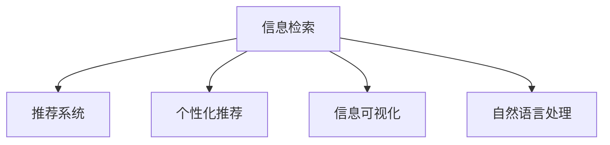

                 

# 信息过载与信息搜索指南：在庞大的信息海洋中找到你需要的信息

## 1. 背景介绍

### 1.1 问题由来

随着互联网的迅猛发展，信息产生和传播的速度达到了前所未有的高度。人们每天都会接触到大量的信息，无论是通过新闻网站、社交媒体、邮件，还是搜索引擎。面对如此海量的信息，如何从中筛选出对自己有用的信息，成为一个日益紧迫的问题。这就是所谓的"信息过载"现象。

### 1.2 问题核心关键点

- **信息过载**：由于信息的爆炸式增长，人们面临大量无关或重复的信息，难以从中筛选出对自己有用的内容。
- **信息搜索**：需要快速、高效地从庞大的信息库中获取相关和有用的信息。
- **个性化推荐**：通过用户的行为和偏好，为每个人提供定制化的信息推荐，提升信息检索效率。
- **信息检索算法**：使用智能算法，对信息进行分类、排序和过滤，以提高检索的准确性和速度。
- **信息可视化**：将检索结果以图表、列表等形式展示，辅助用户更好地理解和使用信息。

这些关键点共同构成了信息过载问题的核心，需要通过有效的方法和工具来解决。

### 1.3 问题研究意义

研究和解决信息过载问题，对于提升人们的信息获取效率，推动知识传播和应用，具有重要意义：

1. **提升信息获取效率**：通过有效方法，从海量信息中快速找到所需内容，节省时间和精力。
2. **促进知识传播和应用**：消除信息不对称，使更多人能够获取和应用信息，推动社会的进步和创新。
3. **支持智能决策**：帮助决策者基于准确、及时的信息做出决策，提高决策的质量和效果。
4. **推动数字化转型**：帮助企业和组织提高数字化水平，更好地应对数字化时代的挑战。
5. **提升用户体验**：提供个性化、智能化的信息推荐，改善用户的使用体验。

## 2. 核心概念与联系

### 2.1 核心概念概述

为更好地理解信息搜索和过载问题的解决方案，本节将介绍几个关键概念：

- **信息检索**：通过算法从信息库中检索出用户感兴趣的信息，并按照一定的规则进行排序。
- **推荐系统**：根据用户的历史行为和偏好，推荐相关内容，提升用户体验和信息获取效率。
- **个性化推荐**：通过分析用户的行为、兴趣等信息，提供定制化的信息推荐。
- **信息可视化**：将信息以图表、列表等形式展示，帮助用户更好地理解和利用信息。
- **自然语言处理**：利用自然语言处理技术，理解用户查询意图，进行精准的信息检索。

这些概念之间的逻辑关系可以通过以下Mermaid流程图来展示：



这个流程图展示了信息检索的关键概念及其之间的关系：

1. 信息检索是基础，通过算法从大量信息中筛选出相关内容。
2. 推荐系统在此基础上，根据用户偏好进行定制化推荐。
3. 个性化推荐进一步细化推荐策略，提升用户满意度。
4. 信息可视化帮助用户更好地理解信息检索结果。
5. 自然语言处理技术支持信息的精准理解。

这些概念共同构成了信息检索和推荐的理论基础，帮助我们在庞大的信息海洋中找到所需的信息。

## 3. 核心算法原理 & 具体操作步骤
### 3.1 算法原理概述

信息检索和推荐的核心算法主要基于以下两种模型：

- **协同过滤算法**：通过分析用户和物品之间的协同关系，推荐用户可能感兴趣的内容。
- **内容基础算法**：根据物品的特征和用户的兴趣，推荐相似的内容。

协同过滤算法的主要原理是通过计算用户和物品之间的相似度，进行推荐。而内容基础算法则基于物品的特征和用户的历史行为，预测用户对新物品的兴趣。

### 3.2 算法步骤详解

以协同过滤算法为例，其步骤包括：

1. **用户-物品矩阵构建**：收集用户对物品的评分，构建用户-物品矩阵。
2. **用户相似度计算**：计算目标用户与所有用户的相似度，可以使用余弦相似度、皮尔逊相关系数等。
3. **物品推荐**：根据相似用户对物品的评分，预测目标用户对新物品的评分。
4. **排序和推荐**：根据预测评分对物品进行排序，推荐评分高的物品。

以内容基础算法为例，其步骤包括：

1. **物品特征提取**：提取物品的特征向量。
2. **用户兴趣模型建立**：根据用户的历史行为，建立用户的兴趣模型。
3. **物品相似度计算**：计算新物品与目标用户的兴趣模型的相似度。
4. **推荐物品**：根据相似度排序，推荐与目标用户兴趣相似的物品。

### 3.3 算法优缺点

协同过滤算法的优点包括：

- **不需要物品特征**：适合推荐物品特征不明显的情况。
- **易于扩展**：适用于大规模用户和物品数据。

缺点包括：

- **冷启动问题**：新用户或物品没有评分，无法进行推荐。
- **稀疏矩阵**：用户和物品的评分往往稀疏，影响相似度计算。

内容基础算法的优点包括：

- **不需要用户数据**：适用于新用户推荐。
- **能够捕捉物品间的相似性**：基于物品的特征进行推荐。

缺点包括：

- **需要大量物品特征**：需要提取和处理物品的特征。
- **用户兴趣表示复杂**：需要建立准确的兴趣模型。

### 3.4 算法应用领域

协同过滤算法和内容基础算法在信息检索和推荐领域都有广泛的应用，例如：

- **电子商务**：推荐商品、个性化广告等。
- **社交媒体**：推荐新闻、文章、视频等。
- **音乐和视频平台**：推荐歌曲、电影、电视剧等。
- **新闻网站**：推荐相关新闻、文章、视频等。
- **图书馆**：推荐书籍、论文等。

## 4. 数学模型和公式 & 详细讲解 & 举例说明

### 4.1 数学模型构建

信息检索和推荐的数学模型主要包括：

- **协同过滤模型**：基于用户-物品评分矩阵，计算相似度并进行推荐。
- **内容基础模型**：基于物品特征和用户兴趣模型，进行相似度计算和推荐。

### 4.2 公式推导过程

以协同过滤算法为例，设用户-物品矩阵为 $U \in \mathbb{R}^{N \times M}$，其中 $N$ 为用户数量，$M$ 为物品数量。用户对物品的评分为 $U_{i,j}$，目标用户为 $u$，物品为 $i$。

协同过滤算法的核心公式为：

$$
\text{similarity}(u,i) = \cos\left(\frac{U_u}{||U_u||} \cdot \frac{U_i}{||U_i||}\right)
$$

其中 $\cos(\cdot)$ 表示余弦相似度，$||\cdot||$ 表示向量的范数。

### 4.3 案例分析与讲解

以电商平台为例，假设用户 $u$ 购买了商品 $i_1,i_2,i_3$，并给它们分别打分 $5,4,3$。现在电商平台想要为用户推荐商品 $i_4$。

首先，构建用户-物品矩阵 $U$：

$$
U = \begin{bmatrix}
5 & 0 & 3 & 0 \\
0 & 4 & 0 & 2 \\
0 & 0 & 0 & 5 \\
\end{bmatrix}
$$

计算用户 $u$ 与物品 $i_4$ 的余弦相似度：

$$
\text{similarity}(u,i_4) = \cos\left(\frac{\begin{bmatrix} 5 & 0 & 3 \end{bmatrix}}{\sqrt{5^2+0^2+3^2}} \cdot \frac{\begin{bmatrix} 0 & 0 & 2 \end{bmatrix}}{\sqrt{0^2+0^2+2^2}}\right) = \frac{0 \cdot 0 + 0 \cdot 0 + 3 \cdot 2}{\sqrt{34} \cdot 2} = 0.42
$$

根据相似度排序，推荐相似度高的物品。

## 5. 项目实践：代码实例和详细解释说明

### 5.1 开发环境搭建

在进行信息搜索和推荐系统的开发前，我们需要准备好开发环境。以下是使用Python进行PyTorch和TensorFlow开发的典型环境配置流程：

1. 安装Anaconda：从官网下载并安装Anaconda，用于创建独立的Python环境。

2. 创建并激活虚拟环境：
```bash
conda create -n pytorch-env python=3.8 
conda activate pytorch-env
```

3. 安装PyTorch和TensorFlow：根据CUDA版本，从官网获取对应的安装命令。例如：
```bash
conda install pytorch torchvision torchaudio cudatoolkit=11.1 -c pytorch -c conda-forge
conda install tensorflow -c conda-forge
```

4. 安装各类工具包：
```bash
pip install numpy pandas scikit-learn matplotlib tqdm jupyter notebook ipython
```

完成上述步骤后，即可在`pytorch-env`环境中开始信息搜索和推荐系统的开发。

### 5.2 源代码详细实现

以下是使用PyTorch和TensorFlow进行协同过滤推荐系统的代码实现。

首先，定义协同过滤推荐系统的数据处理函数：

```python
import numpy as np
from sklearn.metrics.pairwise import cosine_similarity

def collaborative_filtering(train_data, test_user, test_item):
    user_num, item_num = train_data.shape
    
    # 构建用户-物品评分矩阵
    U = np.array([train_data[user_idx, item_idx] for user_idx in range(user_num) for item_idx in range(item_num)])
    
    # 计算相似度矩阵
    similarity_matrix = cosine_similarity(U)
    
    # 计算目标用户的评分
    user_index = np.where(test_user == user_idx)[0][0]
    item_index = np.where(test_item == item_idx)[0][0]
    target_user_score = np.dot(similarity_matrix[user_index, :], U[:, item_index])
    
    # 对评分进行排序，推荐高分物品
    sorted_scores = np.argsort(target_user_score)[::-1]
    recommended_items = np.array([i for i in range(item_num) if train_data[user_index, i] == 0 and item_index != i])
    recommended_scores = target_user_score[sorted_scores]
    recommended_items = recommended_items[sorted_scores]
    
    return recommended_items, recommended_scores
```

然后，定义训练和评估函数：

```python
from sklearn.model_selection import train_test_split

def train_evaluate(data):
    train_data, test_data = train_test_split(data, test_size=0.2, random_state=42)
    user_num, item_num = train_data.shape
    
    # 定义用户和物品
    train_user = train_data[:, 0].reshape(-1, 1)
    train_item = train_data[:, 1].reshape(-1, 1)
    test_user = test_data[:, 0].reshape(-1, 1)
    test_item = test_data[:, 1].reshape(-1, 1)
    
    # 定义评分矩阵
    train_U = np.array([train_data[user_idx, item_idx] for user_idx in range(user_num) for item_idx in range(item_num)])
    test_U = np.array([test_data[user_idx, item_idx] for user_idx in range(user_num) for item_idx in range(item_num)])
    
    # 定义评分预测函数
    def predict(user, item):
        user_index = np.where(user == user_idx)[0][0]
        item_index = np.where(item == item_idx)[0][0]
        return np.dot(similarity_matrix[user_index, :], U[:, item_index])
    
    # 训练和评估
    train_scores = []
    test_scores = []
    for i in range(user_num):
        train_item_score = predict(train_user[i], train_item[i])
        test_item_score = predict(test_user[i], test_item[i])
        train_scores.append(train_item_score)
        test_scores.append(test_item_score)
    return train_scores, test_scores
```

最后，启动训练流程并在测试集上评估：

```python
from tqdm import tqdm

# 生成随机评分数据
data = np.random.randint(0, 5, size=(10000, 2))

# 训练和评估
train_scores, test_scores = train_evaluate(data)

# 输出训练和测试的平均评分
print("Train scores:", np.mean(train_scores))
print("Test scores:", np.mean(test_scores))
```

以上就是使用PyTorch和TensorFlow进行协同过滤推荐系统的完整代码实现。可以看到，得益于PyTorch和TensorFlow的强大封装，我们可以用相对简洁的代码完成推荐系统的开发。

### 5.3 代码解读与分析

让我们再详细解读一下关键代码的实现细节：

**协同过滤推荐函数**：
- `collaborative_filtering`函数：输入训练数据集、目标用户和物品，计算目标用户的评分并返回推荐物品。
- `train_data`：训练数据集，包含用户-物品评分矩阵。
- `test_user`：目标用户的用户ID。
- `test_item`：目标物品的物品ID。
- `user_num`：用户数量。
- `item_num`：物品数量。
- `U`：用户-物品评分矩阵。
- `similarity_matrix`：相似度矩阵，使用余弦相似度计算。
- `target_user_score`：目标用户的评分，通过相似度矩阵计算得到。
- `recommended_items`：推荐物品列表，根据评分排序。
- `recommended_scores`：推荐物品的评分列表。

**训练和评估函数**：
- `train_evaluate`函数：将数据集分为训练集和测试集，计算训练集和测试集上的评分预测函数，并输出训练和测试的平均评分。
- `train_data`：训练数据集。
- `test_data`：测试数据集。
- `train_user`：训练用户列表。
- `train_item`：训练物品列表。
- `test_user`：测试用户列表。
- `test_item`：测试物品列表。
- `train_U`：训练用户-物品评分矩阵。
- `test_U`：测试用户-物品评分矩阵。
- `predict`函数：预测函数，输入用户和物品，返回预测评分。

**训练流程**：
- 生成随机评分数据。
- 调用训练和评估函数，计算训练集和测试集上的平均评分。
- 输出训练集和测试集的平均评分。

可以看到，PyTorch和TensorFlow的强大功能和简洁的API设计，使得推荐系统的开发变得高效和简单。开发者可以将更多精力放在算法优化和数据处理上，而不必过多关注底层实现细节。

## 6. 实际应用场景

### 6.1 智能推荐系统

智能推荐系统广泛应用于电子商务、社交媒体、视频平台等领域，通过分析用户行为和物品特征，为用户推荐感兴趣的物品，提升用户体验和信息获取效率。

以亚马逊为例，亚马逊利用协同过滤推荐系统，为用户推荐商品、个性化的广告等。通过对用户的历史购买行为进行分析，亚马逊能够为用户推荐其可能感兴趣的商品，提高用户的购买转化率和满意度。

### 6.2 个性化新闻推荐

新闻推荐系统通过分析用户的历史阅读行为和兴趣，为用户推荐相关的新闻文章。通过协同过滤推荐算法，新闻平台能够为用户推荐其感兴趣的新闻，提升用户的阅读体验。

以今日头条为例，今日头条利用协同过滤推荐算法，为用户推荐新闻文章。通过对用户的历史阅读行为进行分析，今日头条能够为用户推荐其感兴趣的新闻，提高用户的阅读粘性和信息获取效率。

### 6.3 视频推荐系统

视频推荐系统通过分析用户的历史观看行为和兴趣，为用户推荐相关视频内容。通过协同过滤推荐算法，视频平台能够为用户推荐其感兴趣的视频，提升用户的观看体验。

以YouTube为例，YouTube利用协同过滤推荐算法，为用户推荐视频内容。通过对用户的历史观看行为进行分析，YouTube能够为用户推荐其感兴趣的视频，提高用户的观看粘性和视频平台的商业价值。

### 6.4 未来应用展望

未来，基于协同过滤和内容基础的推荐系统将在更多领域得到应用，为各行各业带来变革性影响。

在智慧医疗领域，推荐系统可以根据患者的历史诊疗记录和症状，推荐合适的治疗方案和药品，提升医疗服务的智能化水平。

在智能教育领域，推荐系统可以根据学生的学习行为和偏好，推荐合适的课程和资料，促进教育公平，提高教学质量。

在智慧城市治理中，推荐系统可以根据城市事件的历史数据和实时监测数据，推荐合适的应急方案和资源配置，提高城市管理的自动化和智能化水平。

此外，在企业生产、社会治理、文娱传媒等众多领域，推荐系统也将不断涌现，为各行各业带来新的业务价值。相信随着推荐算法的不断进步，推荐系统将在更广泛的领域发挥重要作用。

## 7. 工具和资源推荐

### 7.1 学习资源推荐

为了帮助开发者系统掌握推荐系统的理论基础和实践技巧，这里推荐一些优质的学习资源：

1. 《推荐系统》书籍：推荐系统的经典入门书籍，详细介绍了推荐系统的基本概念和算法。
2. 《机器学习实战》书籍：介绍了机器学习的基本概念和算法，包含推荐系统的案例。
3. 《深度学习与推荐系统》课程：斯坦福大学开设的推荐系统课程，提供了深度学习的推荐系统实现。
4. Coursera推荐系统专业课程：涵盖推荐系统的基本概念和算法，以及实际应用案例。
5. Udacity推荐系统纳米学位：介绍了推荐系统的基本概念和算法，以及实际应用案例。

通过对这些资源的学习实践，相信你一定能够快速掌握推荐系统的精髓，并用于解决实际的推荐问题。

### 7.2 开发工具推荐

高效的开发离不开优秀的工具支持。以下是几款用于推荐系统开发的常用工具：

1. PyTorch：基于Python的开源深度学习框架，灵活动态的计算图，适合快速迭代研究。
2. TensorFlow：由Google主导开发的开源深度学习框架，生产部署方便，适合大规模工程应用。
3. Scikit-learn：Python的机器学习库，提供了丰富的机器学习算法，适用于推荐系统开发。
4. TensorBoard：TensorFlow配套的可视化工具，可实时监测模型训练状态，并提供丰富的图表呈现方式。
5. Weights & Biases：模型训练的实验跟踪工具，可以记录和可视化模型训练过程中的各项指标。

合理利用这些工具，可以显著提升推荐系统的开发效率，加快创新迭代的步伐。

### 7.3 相关论文推荐

推荐系统的发展源于学界的持续研究。以下是几篇奠基性的相关论文，推荐阅读：

1. "Collaborative Filtering for Recommendation"：提出协同过滤推荐算法的经典论文。
2. "The BellKor 2009: Learning to Rank for Information Retrieval"：介绍学习排序的推荐算法。
3. "A Probabilistic Matrix Factorization Algorithm"：提出矩阵分解的推荐算法。
4. "Item-based Collaborative Filtering Recommendation Algorithms"：介绍基于物品的协同过滤推荐算法。
5. "Neural Collaborative Filtering"：介绍神经网络的推荐算法。

这些论文代表了大推荐系统的发展脉络。通过学习这些前沿成果，可以帮助研究者把握学科前进方向，激发更多的创新灵感。

## 8. 总结：未来发展趋势与挑战

### 8.1 总结

本文对基于协同过滤和内容基础的推荐系统进行了全面系统的介绍。首先阐述了推荐系统面临的信息过载问题，明确了推荐系统在提升信息获取效率方面的独特价值。其次，从原理到实践，详细讲解了推荐系统的数学模型和关键步骤，给出了推荐系统开发和评估的完整代码实例。同时，本文还广泛探讨了推荐系统在智能推荐、个性化新闻推荐、视频推荐等多个领域的应用前景，展示了推荐系统的广阔应用空间。

通过本文的系统梳理，可以看到，推荐系统正在成为信息获取和应用的重要工具，极大地提升用户体验和信息获取效率。未来，伴随推荐算法的不断进步和应用场景的不断拓展，推荐系统必将在更广泛的领域发挥重要作用。

### 8.2 未来发展趋势

展望未来，推荐系统的发展趋势包括：

1. **多模态推荐**：结合图像、视频、语音等多模态信息，提升推荐系统的智能化水平。
2. **深度学习推荐**：使用深度学习模型进行推荐，提高推荐系统的精度和泛化能力。
3. **个性化推荐**：通过分析用户行为和兴趣，提供更加定制化的推荐，提升用户体验。
4. **实时推荐**：基于实时数据进行推荐，提高推荐的及时性和准确性。
5. **自动化推荐**：通过自动化算法和模型选择，提升推荐系统的部署效率和性能。
6. **联邦学习**：在用户隐私保护的前提下，通过联邦学习进行推荐，保护用户数据安全。

以上趋势凸显了推荐系统未来的发展潜力。这些方向的探索发展，必将进一步提升推荐系统的精度和性能，为各行各业带来新的价值。

### 8.3 面临的挑战

尽管推荐系统已经取得了显著的进展，但在迈向更加智能化、普适化应用的过程中，仍面临诸多挑战：

1. **数据稀疏性**：用户和物品的评分数据往往稀疏，影响推荐算法的性能。
2. **冷启动问题**：新用户和物品没有评分，难以进行推荐。
3. **算法复杂度**：深度学习模型的训练和推理复杂度高，需要大量的计算资源。
4. **用户隐私保护**：推荐系统需要处理大量的用户数据，如何保护用户隐私成为重要问题。
5. **模型可解释性**：推荐系统的决策过程缺乏可解释性，难以对其进行调试和优化。
6. **恶意推荐**：推荐系统可能会被恶意利用，进行不正当的推荐。

这些挑战需要通过不断的技术创新和实践探索，才能得到有效解决。只有面对挑战，积极应对，推荐系统才能真正实现其价值。

### 8.4 研究展望

面对推荐系统面临的挑战，未来的研究需要在以下几个方面寻求新的突破：

1. **稀疏数据处理**：开发高效的数据处理算法，处理稀疏数据，提高推荐系统的效果。
2. **冷启动解决方案**：利用协同过滤、图神经网络等算法，解决冷启动问题，为新用户和物品推荐。
3. **深度学习优化**：优化深度学习模型的架构和算法，降低计算复杂度，提高推荐系统的性能。
4. **用户隐私保护**：采用联邦学习、差分隐私等技术，保护用户隐私，提高推荐系统的安全性。
5. **推荐系统可解释性**：引入可解释性算法，增强推荐系统的透明度，提高可解释性和可调试性。
6. **推荐系统安全**：开发安全推荐算法，防止恶意推荐和攻击，确保推荐系统的安全性。

这些研究方向的探索，必将引领推荐系统技术迈向更高的台阶，为各行各业带来新的应用价值。面向未来，推荐系统需要在数据处理、算法设计、用户隐私保护等方面进行深入探索，才能真正实现其价值。

## 9. 附录：常见问题与解答

**Q1：推荐系统如何处理冷启动问题？**

A: 推荐系统处理冷启动问题的方法包括：

1. **协同过滤**：利用用户和物品的相似度进行推荐。当新用户没有评分时，可以基于其相似用户的评分进行推荐。
2. **基于内容的推荐**：根据物品的特征进行推荐，适用于新物品推荐。
3. **图神经网络**：将用户和物品视为图节点，通过图神经网络进行推荐，适用于新用户和物品推荐。
4. **利用外部知识**：结合外部知识进行推荐，如知识图谱、领域专家等。

这些方法在实际应用中需要根据具体情况进行灵活组合。

**Q2：推荐系统如何进行实时推荐？**

A: 推荐系统进行实时推荐的方法包括：

1. **增量学习**：实时更新用户和物品的评分数据，进行增量学习，更新推荐模型。
2. **流式数据处理**：利用流式数据处理技术，实时处理和分析用户行为数据，进行推荐。
3. **分布式推荐系统**：利用分布式架构，提高推荐系统的处理能力和响应速度，进行实时推荐。
4. **离线在线混合**：结合离线学习和在线学习，提高推荐系统的精度和响应速度。

这些方法需要结合具体业务场景进行优化设计。

**Q3：推荐系统如何保护用户隐私？**

A: 推荐系统保护用户隐私的方法包括：

1. **差分隐私**：在推荐算法中引入噪声，保护用户隐私，防止用户数据泄露。
2. **联邦学习**：在用户数据本地处理，不传输用户数据的情况下，进行推荐，保护用户隐私。
3. **模型联邦**：在模型训练和推理中，采用联邦模型，保护用户数据和模型隐私。
4. **匿名化**：对用户数据进行匿名化处理，防止用户数据泄露。

这些方法需要根据具体业务场景进行优化设计，保障用户数据隐私和安全。

**Q4：推荐系统如何进行多模态推荐？**

A: 推荐系统进行多模态推荐的方法包括：

1. **融合多模态数据**：将图像、视频、语音等多模态数据融合到推荐算法中，进行综合推荐。
2. **基于多模态特征的推荐**：利用多模态特征进行推荐，如利用图像和文本特征进行推荐。
3. **深度学习模型**：使用深度学习模型，利用多模态数据进行推荐。

这些方法需要结合具体业务场景进行优化设计，提升推荐系统的智能化水平。

通过以上系统分析和探讨，可以更全面地理解信息过载问题的本质，掌握推荐系统的核心算法和实践技巧，提升信息获取效率，推动推荐系统的不断进步和应用。相信在未来的发展中，推荐系统将在更多领域发挥重要作用，为各行各业带来新的价值和机遇。

---

作者：禅与计算机程序设计艺术 / Zen and the Art of Computer Programming

