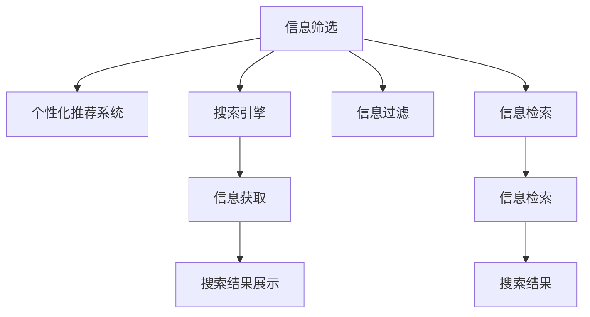

                 

# 信息过载与信息筛选策略：在信息洪流中找到有价值的信息

## 1. 背景介绍

### 1.1 问题由来
在信息时代，我们每天接触到海量的信息流，如新闻、社交媒体、邮件、文档、音频视频等。面对信息的泛滥，我们往往感到无从下手，容易陷入信息过载。信息过载不仅会浪费大量时间，还可能导致信息缺失、决策失误甚至焦虑。因此，如何有效地筛选和处理信息，成为现代社会一个重要而紧迫的问题。

### 1.2 问题核心关键点
信息筛选的核心在于找到最有价值的信息，同时过滤掉无关的噪音。关键问题包括：

- 如何选择高质量的信息源？
- 如何构建有效的信息筛选模型？
- 如何在海量的信息中快速定位有价值的内容？
- 如何优化信息检索算法以提高搜索效率？
- 如何构建智能推荐系统以提供个性化信息？

这些问题不仅关系到我们每天的工作效率，还影响到我们的生活质量和决策能力。

## 2. 核心概念与联系

### 2.1 核心概念概述

为更好地理解信息筛选方法，本节将介绍几个密切相关的核心概念：

- **信息筛选(Information Filtering)**：从大量信息中过滤出与用户需求相关的内容，以提升用户的信息获取效率和体验。
- **个性化推荐系统(Personalized Recommendation System)**：通过用户的历史行为和偏好，推荐符合其兴趣的信息，提升信息的相关性和满意度。
- **搜索引擎(Search Engine)**：通过信息检索技术，帮助用户快速找到所需信息，提升信息查找的效率和准确性。
- **推荐系统(Recommendation System)**：利用机器学习算法，预测用户可能感兴趣的内容，提升用户的信息发现效率。
- **信息过滤(Information Filtering)**：从海量的信息中筛选出高质量的、与用户兴趣相关的内容。
- **信息检索(Information Retrieval)**：通过自然语言处理技术，实现信息的快速定位和获取。

这些核心概念之间的逻辑关系可以通过以下Mermaid流程图来展示：



这个流程图展示了几大核心概念之间的关系：

1. **信息筛选**：直接从大量信息中筛选出与用户需求相关的内容。
2. **个性化推荐系统**：通过用户历史行为预测其兴趣，推荐个性化内容。
3. **搜索引擎**：通过信息检索技术，辅助信息筛选，提升信息获取效率。
4. **信息过滤**：对搜索结果进行过滤，提高信息的相关性。
5. **信息检索**：通过信息检索技术，实现信息的快速定位和获取。

这些概念共同构成了信息筛选和推荐的整体框架，帮助用户在海量信息中快速找到有价值的内容。

## 3. 核心算法原理 & 具体操作步骤

### 3.1 算法原理概述

信息筛选的核心理念是通过模型预测文本的相关性，从而对搜索结果进行排序和过滤。常见的信息筛选方法包括基于内容的推荐、协同过滤、深度学习等。

### 3.2 算法步骤详解

#### 3.2.1 数据预处理
- 收集用户的历史行为数据和文本数据，清洗和预处理文本。
- 将文本转换为向量表示，如TF-IDF、word2vec、BERT等。

#### 3.2.2 构建推荐模型
- 根据数据特点选择模型类型，如协同过滤、深度学习等。
- 训练模型，得到用户和物品之间的相似度矩阵。
- 对于用户输入的查询，计算其与所有物品的相似度，排序并返回前N条推荐。

#### 3.2.3 模型评估与优化
- 使用准确率、召回率、F1-score等指标评估模型效果。
- 优化模型参数，如学习率、正则化系数、迭代轮数等。
- 引入新的数据进行模型调参，避免过拟合。

#### 3.2.4 用户反馈与持续学习
- 收集用户对推荐结果的反馈，如点击、购买、评分等。
- 根据用户反馈调整模型，进行增量学习。
- 定期更新模型，保持其性能。

### 3.3 算法优缺点

#### 3.3.1 优点
- 提升了用户的信息获取效率。
- 个性化推荐系统可以根据用户兴趣推荐有价值的内容，提升用户满意度。
- 搜索引擎通过信息检索技术，实现了快速定位和获取信息。
- 信息过滤技术提高了信息的相关性和精准性。

#### 3.3.2 缺点
- 依赖大量标注数据，标注成本高。
- 模型复杂度高，计算资源消耗大。
- 数据稀疏性问题，推荐系统无法处理新用户和新物品。
- 推荐系统的冷启动问题，新用户初期推荐效果差。
- 信息过载问题的存在，大量无关信息会干扰推荐结果。

### 3.4 算法应用领域

信息筛选和推荐技术已经在多个领域得到广泛应用：

- **电商推荐**：根据用户浏览、购买历史，推荐相关商品。
- **内容推荐**：推荐新闻、文章、视频等，提升用户阅读和观看体验。
- **社交媒体**：推荐好友、群组、内容，增加用户互动和粘性。
- **搜索引擎优化(SEO)**：优化网页内容和结构，提升搜索排名和用户体验。
- **广告定向**：根据用户兴趣定向推送广告，提高广告点击率。
- **金融风控**：通过用户行为预测其风险等级，进行风险控制。

## 4. 数学模型和公式 & 详细讲解

### 4.1 数学模型构建

信息筛选的数学模型主要围绕预测用户对文本的兴趣进行构建。常见模型包括基于内容的推荐、协同过滤、深度学习等。

#### 4.1.1 基于内容的推荐
基于内容的推荐模型通过文本表示预测用户对物品的兴趣，常见公式如下：

$$
\hat{y} = f(x; \theta)
$$

其中，$f$ 表示模型函数，$\theta$ 为模型参数，$x$ 为物品的特征向量，$\hat{y}$ 表示用户对物品的兴趣评分。

#### 4.1.2 协同过滤
协同过滤模型通过用户对物品的评分数据，预测用户对未评分物品的兴趣。常见公式如下：

$$
\hat{y} = \sum_{i=1}^N w_i \times y_i
$$

其中，$w_i$ 为物品$i$对用户$u$的相似权重，$y_i$ 为物品$i$的评分。

#### 4.1.3 深度学习模型
深度学习模型如RNN、CNN、Transformer等，通过学习用户和物品的向量表示，预测用户对物品的兴趣。常见公式如下：

$$
\hat{y} = \text{sigmoid}(W_x x + b_x + W_u u + b_u)
$$

其中，$W_x$、$W_u$ 为权重矩阵，$b_x$、$b_u$ 为偏置向量，$x$、$u$ 分别为物品和用户的向量表示。

### 4.2 公式推导过程

#### 4.2.1 基于内容的推荐公式推导
以协同过滤为例，假设用户$u$对物品$i$的评分$y_i$为1（表示喜欢）或0（表示不喜欢），则模型的目标是最小化损失函数：

$$
\mathcal{L}(\theta) = -\frac{1}{N} \sum_{i=1}^N y_i \log \sigma(\theta^T x_i) + (1 - y_i) \log (1 - \sigma(\theta^T x_i))
$$

其中，$\sigma$ 为sigmoid函数，$\theta$ 为模型参数。

通过梯度下降等优化算法，不断更新$\theta$，最小化损失函数，得到用户对物品的兴趣评分$\hat{y}$。

#### 4.2.2 协同过滤公式推导
以基于矩阵分解的协同过滤为例，假设用户$u$对物品$i$的评分$y_{ui}$为1（表示喜欢）或0（表示不喜欢），则模型的目标是最小化损失函数：

$$
\mathcal{L}(\theta) = \frac{1}{2N} \sum_{u=1}^M \sum_{i=1}^N (y_{ui} - \hat{y}_{ui})^2
$$

其中，$y_{ui}$ 为实际评分，$\hat{y}_{ui}$ 为预测评分，$\theta$ 为模型参数。

通过最小二乘等优化算法，不断更新$\theta$，最小化损失函数，得到用户对物品的评分预测值$\hat{y}_{ui}$。

#### 4.2.3 深度学习模型公式推导
以基于Transformer的深度学习模型为例，假设用户$u$对物品$i$的评分$y_{ui}$为1（表示喜欢）或0（表示不喜欢），则模型的目标是最小化损失函数：

$$
\mathcal{L}(\theta) = -\frac{1}{N} \sum_{i=1}^N \sum_{j=1}^M y_{ij} \log \hat{y}_{ij}
$$

其中，$y_{ij}$ 为实际评分，$\hat{y}_{ij}$ 为预测评分，$\theta$ 为模型参数。

通过反向传播等优化算法，不断更新$\theta$，最小化损失函数，得到用户对物品的评分预测值$\hat{y}_{ij}$。

### 4.3 案例分析与讲解

#### 4.3.1 电商推荐案例
假设某电商平台收集了用户的历史浏览、购买记录和产品评论。电商平台希望通过这些数据，为用户推荐可能感兴趣的商品。

1. 数据预处理：收集用户历史数据和产品信息，清洗和预处理文本数据。
2. 构建模型：基于用户和产品的文本特征，使用协同过滤模型进行评分预测。
3. 模型评估：使用准确率、召回率、F1-score等指标评估模型效果。
4. 用户反馈：收集用户对推荐结果的反馈，进行模型调参和优化。

#### 4.3.2 内容推荐案例
假设某新闻网站希望根据用户的历史阅读记录，推荐相关新闻。

1. 数据预处理：收集用户的历史阅读记录和新闻信息，清洗和预处理文本数据。
2. 构建模型：基于用户和新闻的文本特征，使用深度学习模型进行评分预测。
3. 模型评估：使用准确率、召回率、F1-score等指标评估模型效果。
4. 用户反馈：收集用户对推荐结果的反馈，进行模型调参和优化。

## 5. 项目实践：代码实例和详细解释说明

### 5.1 开发环境搭建

在进行信息筛选项目开发前，我们需要准备好开发环境。以下是使用Python进行TensorFlow开发的环境配置流程：

1. 安装Anaconda：从官网下载并安装Anaconda，用于创建独立的Python环境。

2. 创建并激活虚拟环境：
```bash
conda create -n tf-env python=3.8 
conda activate tf-env
```

3. 安装TensorFlow：根据CUDA版本，从官网获取对应的安装命令。例如：
```bash
conda install tensorflow-gpu=cuda11.1=4.6.0 
```

4. 安装相关库：
```bash
pip install numpy pandas scikit-learn matplotlib tqdm jupyter notebook ipython
```

完成上述步骤后，即可在`tf-env`环境中开始项目开发。

### 5.2 源代码详细实现

这里我们以电商推荐系统为例，给出使用TensorFlow进行协同过滤算法的代码实现。

首先，定义协同过滤的模型类：

```python
import tensorflow as tf
from tensorflow.keras.layers import Input, Embedding, Dense
from tensorflow.keras.models import Model

class CollaborativeFilteringModel:
    def __init__(self, num_users, num_items, embedding_dim, hidden_units):
        self.num_users = num_users
        self.num_items = num_items
        self.embedding_dim = embedding_dim
        self.hidden_units = hidden_units
        
        self.input_u = Input(shape=(self.num_users,), name='user_input')
        self.input_i = Input(shape=(self.num_items,), name='item_input')
        
        self.user_embedding = Embedding(input_dim=num_users, output_dim=embedding_dim, name='user_embedding')(self.input_u)
        self.item_embedding = Embedding(input_dim=num_items, output_dim=embedding_dim, name='item_embedding')(self.input_i)
        
        self.u_item = tf.keras.layers.Dot(axes=1, normalize=True)([self.user_embedding, self.item_embedding])
        self.u_item = tf.keras.layers.Dense(hidden_units, activation='relu')(self.u_item)
        self.u_item = tf.keras.layers.Dense(1, activation='sigmoid')(self.u_item)
        
        self.model = Model(inputs=[self.input_u, self.input_i], outputs=self.u_item)
        
    def compile(self, optimizer, loss):
        self.model.compile(optimizer=optimizer, loss=loss)
        
    def fit(self, train_data, epochs, batch_size):
        self.model.fit(x=train_data, epochs=epochs, batch_size=batch_size)
        
    def predict(self, test_data):
        return self.model.predict(test_data)
```

然后，准备训练数据和测试数据：

```python
# 定义用户和物品的评分数据
train_data = [[1, 4], [2, 1], [3, 3], [4, 2], [5, 4]]
test_data = [[1, 2], [2, 5], [3, 3], [4, 4], [5, 3]]

# 定义用户和物品的特征向量
user_feats = [1, 2, 3, 4, 5]
item_feats = [4, 1, 3, 2, 4]

# 定义模型的超参数
embedding_dim = 10
hidden_units = 32
epochs = 10
batch_size = 8
```

接着，实例化模型并进行训练和预测：

```python
# 实例化协同过滤模型
model = CollaborativeFilteringModel(num_users=len(user_feats), num_items=len(item_feats), embedding_dim=embedding_dim, hidden_units=hidden_units)

# 编译模型
model.compile(optimizer='adam', loss='binary_crossentropy')

# 训练模型
model.fit(train_data, epochs=epochs, batch_size=batch_size)

# 预测测试集评分
predictions = model.predict(test_data)
```

以上代码实现了基于协同过滤的电商推荐系统。可以看到，TensorFlow的Keras API使得模型的构建和训练非常简单，开发者可以更加专注于算法和业务逻辑。

### 5.3 代码解读与分析

让我们再详细解读一下关键代码的实现细节：

**CollaborativeFilteringModel类**：
- `__init__`方法：初始化模型超参数，定义输入层、嵌入层和全连接层。
- `compile`方法：编译模型，指定优化器和损失函数。
- `fit`方法：训练模型，传入训练数据、迭代轮数和批大小。
- `predict`方法：使用模型预测测试数据的评分。

**训练数据和测试数据**：
- `train_data`：用户和物品的评分数据，每行表示一个用户对多个物品的评分。
- `test_data`：用户和物品的评分数据，每行表示一个用户对多个物品的评分。

**模型实例化与训练**：
- 实例化`CollaborativeFilteringModel`类，传入用户和物品的特征向量。
- 使用`compile`方法指定优化器和损失函数，训练模型。
- 使用`predict`方法预测测试数据的评分。

## 6. 实际应用场景

### 6.1 电商推荐

电商推荐系统通过用户的历史浏览和购买记录，推荐相关商品，提升用户体验和购买率。在实际应用中，电商推荐系统可以收集用户的行为数据，使用协同过滤、基于内容的推荐等算法进行评分预测，并将预测结果排序返回给用户。

### 6.2 内容推荐

内容推荐系统通过用户的历史阅读和观看记录，推荐相关内容，提升用户满意度和粘性。在实际应用中，内容推荐系统可以收集用户的行为数据，使用协同过滤、基于内容的推荐等算法进行评分预测，并将预测结果排序返回给用户。

### 6.3 社交媒体推荐

社交媒体推荐系统通过用户的行为数据，推荐相关好友、群组、内容，增加用户互动和粘性。在实际应用中，社交媒体推荐系统可以收集用户的行为数据，使用协同过滤、基于内容的推荐等算法进行评分预测，并将预测结果排序返回给用户。

## 7. 工具和资源推荐

### 7.1 学习资源推荐

为了帮助开发者系统掌握信息筛选的理论基础和实践技巧，这里推荐一些优质的学习资源：

1. 《推荐系统实战》系列博文：由推荐系统专家撰写，深入浅出地介绍了推荐系统的原理、算法和实际应用。

2. CS223《信息检索》课程：斯坦福大学开设的IR课程，有Lecture视频和配套作业，带你入门信息检索领域的基本概念和经典算法。

3. 《推荐系统》书籍：作者为张胜威，全面介绍了推荐系统的设计、算法和工程实现。

4. Coursera《推荐系统》课程：由斯坦福大学开设，涵盖推荐系统的理论、算法和实际应用。

5. Kaggle推荐系统竞赛：参加Kaggle的推荐系统竞赛，通过实践积累经验，提升解决实际问题的能力。

通过对这些资源的学习实践，相信你一定能够快速掌握信息筛选的精髓，并用于解决实际的推荐问题。

### 7.2 开发工具推荐

高效的开发离不开优秀的工具支持。以下是几款用于信息筛选开发的常用工具：

1. TensorFlow：基于Python的深度学习框架，灵活的计算图，支持分布式计算，适合大规模工程应用。

2. PyTorch：基于Python的深度学习框架，动态计算图，适合快速迭代研究。

3. Scikit-learn：基于Python的机器学习库，包含多种经典算法和工具。

4. Keras：基于Python的深度学习框架，简化了TensorFlow和Theano等框架的使用。

5. Jupyter Notebook：基于Python的交互式计算环境，方便数据处理和模型调试。

6. Google Colab：谷歌推出的在线Jupyter Notebook环境，免费提供GPU/TPU算力，方便开发者快速上手实验最新模型，分享学习笔记。

合理利用这些工具，可以显著提升信息筛选任务的开发效率，加快创新迭代的步伐。

### 7.3 相关论文推荐

信息筛选和推荐技术的发展源于学界的持续研究。以下是几篇奠基性的相关论文，推荐阅读：

1. Surprise：基于Python的推荐系统开源库，提供了多种经典算法和工具。

2. Matrix Factorization Techniques for Recommender Systems：介绍了矩阵分解算法在推荐系统中的应用。

3. Deep Learning for Recommender Systems：介绍了深度学习在推荐系统中的应用。

4. Attention Is All You Need：Transformer的原始论文，提出了自注意力机制，显著提升了NLP模型的性能。

5. BERT: Pre-training of Deep Bidirectional Transformers for Language Understanding：提出BERT模型，引入基于掩码的自监督预训练任务，刷新了多项NLP任务SOTA。

这些论文代表了大语言模型和推荐系统的研究脉络。通过学习这些前沿成果，可以帮助研究者把握学科前进方向，激发更多的创新灵感。

## 8. 总结：未来发展趋势与挑战

### 8.1 总结

本文对信息筛选方法进行了全面系统的介绍。首先阐述了信息筛选和推荐系统的重要性和核心问题，明确了其对提升用户体验和决策效率的关键作用。其次，从原理到实践，详细讲解了信息筛选的数学模型和关键步骤，给出了推荐系统开发的完整代码实例。同时，本文还广泛探讨了信息筛选方法在电商、内容、社交媒体等多个行业领域的应用前景，展示了其广阔的应用前景。此外，本文精选了信息筛选技术的各类学习资源，力求为读者提供全方位的技术指引。

通过本文的系统梳理，可以看到，信息筛选和推荐技术正在成为数字时代的重要范式，极大地提升了信息获取的效率和体验。未来，伴随深度学习、分布式计算等技术的进步，信息筛选技术还将不断优化，进一步拓展其在更多领域的应用。

### 8.2 未来发展趋势

展望未来，信息筛选技术将呈现以下几个发展趋势：

1. 模型的复杂度和准确率将进一步提升。深度学习模型、多模态学习等新技术将不断提高信息筛选的准确率和泛化能力。

2. 算法将更加注重个性化和动态性。通过引入用户反馈和实时数据，动态调整推荐算法，提升推荐效果。

3. 推荐系统的多样性将更加丰富。除了基于内容的推荐和协同过滤，还将涌现更多创新方法，如混合推荐、异构推荐等。

4. 推荐系统的交互性将不断增强。通过引入社交网络、用户画像等额外信息，提升推荐系统的个性化和精准度。

5. 推荐系统的可解释性将得到重视。通过引入可解释性模型，提升推荐系统的透明度和可信度。

6. 推荐系统的安全性将进一步保障。通过引入数据隐私保护、安全审计等技术，保障用户数据的安全和隐私。

以上趋势凸显了信息筛选技术的广阔前景。这些方向的探索发展，必将进一步提升推荐系统的性能和应用范围，为数字时代带来更深远的影响。

### 8.3 面临的挑战

尽管信息筛选和推荐技术已经取得了瞩目成就，但在迈向更加智能化、普适化应用的过程中，它仍面临着诸多挑战：

1. 数据获取和标注成本高。信息筛选和推荐系统需要大量高质量的标注数据，获取成本高，标注难度大。如何降低数据获取和标注成本，成为一大难题。

2. 推荐系统存在冷启动问题。新用户和新物品初期推荐效果差，如何快速提升推荐效果，仍需进一步研究。

3. 推荐系统存在推荐偏差。某些物品或用户可能被长期忽略，导致推荐结果存在偏差。如何克服推荐偏差，提高推荐公平性，还需进一步研究。

4. 推荐系统存在数据隐私问题。用户数据隐私保护和数据安全成为重要问题。如何保护用户数据隐私，提升推荐系统的可信度，仍需进一步研究。

5. 推荐系统存在计算资源消耗高问题。推荐系统计算复杂度高，资源消耗大。如何优化计算资源，提升推荐系统效率，仍需进一步研究。

6. 推荐系统存在用户接受度问题。推荐结果不满足用户期望，会导致用户反感和抵触。如何提升推荐系统用户接受度，提升用户满意度，还需进一步研究。

正视信息筛选和推荐系统面临的这些挑战，积极应对并寻求突破，将是大数据和人工智能技术不断进步的关键。相信随着学界和产业界的共同努力，这些挑战终将一一被克服，信息筛选技术必将为数字时代带来更大的价值。

### 8.4 研究展望

面对信息筛选和推荐系统所面临的种种挑战，未来的研究需要在以下几个方面寻求新的突破：

1. 探索无监督和半监督推荐方法。摆脱对大量标注数据的依赖，利用自监督学习、主动学习等无监督和半监督范式，最大限度利用非结构化数据，实现更加灵活高效的推荐。

2. 研究计算资源和效率优化。开发更加参数高效和计算高效的推荐方法，在固定大部分预训练参数的情况下，只更新极少量的任务相关参数，同时优化计算图，减少资源消耗。

3. 融合因果和对比学习范式。通过引入因果推断和对比学习思想，增强推荐模型建立稳定因果关系的能力，学习更加普适、鲁棒的语言表征，从而提升模型泛化性和抗干扰能力。

4. 引入更多先验知识。将符号化的先验知识，如知识图谱、逻辑规则等，与神经网络模型进行巧妙融合，引导推荐过程学习更准确、合理的语言模型。

5. 结合因果分析和博弈论工具。将因果分析方法引入推荐模型，识别出模型决策的关键特征，增强推荐结果的因果性和逻辑性。借助博弈论工具刻画人机交互过程，主动探索并规避推荐系统的脆弱点，提高系统稳定性。

6. 纳入伦理道德约束。在推荐目标中引入伦理导向的评估指标，过滤和惩罚有偏见、有害的推荐结果，确保推荐系统的公正性。同时加强人工干预和审核，建立推荐系统的监管机制，确保推荐内容符合人类价值观和伦理道德。

这些研究方向的探索，必将引领信息筛选和推荐技术迈向更高的台阶，为数字时代带来更深远的影响。面向未来，信息筛选和推荐技术还需要与其他人工智能技术进行更深入的融合，如知识表示、因果推理、强化学习等，多路径协同发力，共同推动推荐系统的发展。只有勇于创新、敢于突破，才能不断拓展推荐系统的边界，让推荐系统更好地服务于数字时代。

## 9. 附录：常见问题与解答

**Q1：如何评估推荐系统的性能？**

A: 推荐系统的性能评估通常使用准确率、召回率、F1-score、ROC曲线等指标。准确率表示推荐结果的正确率，召回率表示相关物品被推荐的比例，F1-score是准确率和召回率的调和平均值，ROC曲线用于评估推荐系统的鲁棒性。

**Q2：推荐系统中如何处理稀疏性问题？**

A: 推荐系统中常存在数据稀疏性问题，即用户-物品矩阵中大部分位置为0。可以使用矩阵分解、低秩分解、深度学习等方法，对稀疏数据进行降维和填充，从而提升推荐系统的准确率。

**Q3：推荐系统如何克服冷启动问题？**

A: 冷启动问题是指新用户或新物品的推荐效果差。可以通过引入基于内容的推荐、基于协同过滤的推荐、基于混合推荐的多种方法，综合提升推荐系统对新用户和新物品的推荐效果。

**Q4：推荐系统中如何处理数据隐私问题？**

A: 推荐系统需要收集用户行为数据，可能涉及用户隐私。可以通过数据匿名化、差分隐私、联邦学习等方法，保障用户数据的隐私安全。

**Q5：推荐系统中如何提高计算效率？**

A: 推荐系统计算复杂度高，资源消耗大。可以使用模型裁剪、量化加速、分布式计算等方法，优化计算效率，提升推荐系统性能。

通过这些常见问题的解答，相信你对信息筛选和推荐系统有了更深入的理解。无论是在电商、内容推荐、社交媒体等领域，还是更多的未来应用场景，掌握信息筛选和推荐技术，都能为数字化转型带来显著的提升和改进。

