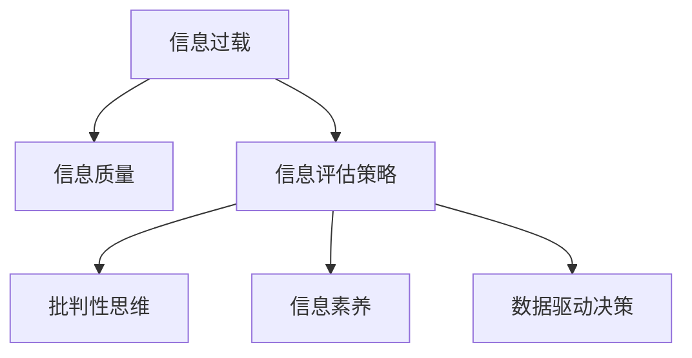

                 

# 信息过载与信息质量评估策略：批判性地评估和消费信息

> 关键词：信息过载,信息质量,信息评估策略,批判性思维,信息素养,数据驱动决策

## 1. 背景介绍

### 1.1 问题由来
在当今数字化时代，信息无处不在，触手可及。从社交媒体到新闻网站，从电子邮件到即时通讯，人们几乎随时随地都能获取大量信息。然而，信息的激增也带来了信息过载的问题。信息过载不仅使得人们难以处理海量信息，还可能导致认知负荷增加、决策困难和信息误判等负面影响。

### 1.2 问题核心关键点
信息过载与信息质量评估的核心在于如何有效地批判性地评估和消费信息。这需要掌握批判性思维技能，提升信息素养，学会使用数据驱动决策的方法。文章将从背景介绍、核心概念与联系、核心算法原理及操作步骤、数学模型和公式、项目实践、实际应用场景、工具和资源推荐、总结与展望、附录等多个维度展开，为读者提供全面的信息过载和信息质量评估策略。

### 1.3 问题研究意义
批判性地评估和消费信息对于个人发展和组织决策至关重要。批判性思维能够帮助人们识别信息的可靠性、评估信息的来源和质量，从而做出更加明智的决策。信息素养则是信息时代的基本技能，通过提升信息素养，能够更高效地获取、评估和使用信息，增强个人和组织的竞争力。数据驱动决策则是在信息质量评估的基础上，利用数据分析方法，做出更加科学、客观的决策。

## 2. 核心概念与联系

### 2.1 核心概念概述

为了更好地理解信息过载与信息质量评估策略，本节将介绍几个关键概念：

- **信息过载**：指在有限的时间内，个体或系统面临的信息量超过其处理能力，导致信息获取和处理困难的现象。
- **信息质量**：指信息的准确性、完整性、相关性和时效性等特性，直接影响信息消费的质量和效果。
- **信息评估策略**：指一套系统化的方法和工具，用于对信息的质量进行评估和筛选。
- **批判性思维**：指在评估信息时，能够独立思考，分析信息的来源、逻辑和证据，从而做出合理的判断。
- **信息素养**：指在信息时代，个体掌握的信息处理能力，包括信息获取、评估、分析和应用。
- **数据驱动决策**：指在信息评估的基础上，利用数据分析工具和技术，支持决策的制定和优化。

这些概念之间的逻辑关系可以通过以下Mermaid流程图来展示：



这个流程图展示了信息过载与信息质量评估策略的关键概念及其之间的关系：

1. 信息过载是信息质量评估的前提。
2. 信息评估策略帮助识别和筛选高质量的信息。
3. 批判性思维和信息素养提升个体评估信息的能力。
4. 数据驱动决策则是在信息质量评估的基础上，利用数据分析优化决策。

## 3. 核心算法原理 & 具体操作步骤
### 3.1 算法原理概述

信息过载与信息质量评估策略的实现，依赖于一套系统化的评估算法和操作步骤。其核心思想是通过对信息的来源、内容、质量和相关性等进行综合评估，筛选出高质量的信息，并结合批判性思维和数据驱动决策的方法，做出更科学合理的判断和决策。

### 3.2 算法步骤详解

基于上述核心思想，信息过载与信息质量评估的具体操作步骤如下：

**Step 1: 信息收集与分类**
- 收集相关信息源，如新闻网站、学术数据库、专业论坛等。
- 对收集的信息进行初步分类，如新闻、报告、评论等。

**Step 2: 信息质量评估**
- 采用信息评估策略对分类后的信息进行质量评估。
- 评估指标包括信息的准确性、完整性、相关性和时效性等。
- 应用批判性思维，对信息的来源、作者和证据进行深入分析，评估其可靠性。

**Step 3: 信息筛选与选择**
- 根据评估结果，筛选出高质量的信息。
- 结合个人需求和任务要求，选择最相关的信息。
- 应用数据驱动决策方法，通过数据分析工具进行进一步筛选。

**Step 4: 信息整合与应用**
- 将筛选出的信息进行整合，形成结构化报告或知识库。
- 结合实际需求，将整合的信息应用于决策过程。
- 持续更新信息库，保持信息的时效性和相关性。

### 3.3 算法优缺点

基于上述操作步骤的信息过载与信息质量评估方法，具有以下优点：
1. 系统化评估：通过一套系统的评估策略和工具，能够全面、客观地评估信息质量。
2. 数据驱动决策：结合数据分析工具和技术，能够做出更科学、客观的决策。
3. 批判性思维：通过批判性思维，能够识别信息的可靠性，避免信息误判。
4. 提升信息素养：通过系统化的评估和筛选过程，能够提升个人的信息素养和处理能力。

同时，该方法也存在一定的局限性：
1. 操作复杂：需要掌握系统的评估策略和工具，可能增加操作复杂度。
2. 依赖高质量数据：评估效果依赖于数据的质量和来源，可能存在偏差。
3. 资源消耗：评估和筛选过程可能消耗较多时间和计算资源。
4. 个体差异：不同个体对信息的评估标准和偏好不同，难以形成统一的标准。

尽管存在这些局限性，但通过合理应用和优化，该方法仍然是大数据时代有效评估和消费信息的有效手段。

### 3.4 算法应用领域

信息过载与信息质量评估策略在多个领域具有广泛应用，例如：

- **企业决策**：企业需要基于高质量的信息，进行市场分析、竞争情报和战略决策。
- **科学研究**：科研人员需要评估学术论文和数据的质量，选择最相关的文献进行研究。
- **新闻媒体**：新闻媒体需要筛选高质量的报道和评论，确保信息的准确性和时效性。
- **公共政策**：政府机构需要评估政策建议和报告的质量，确保政策的科学性和可行性。
- **个人学习**：个人需要在海量信息中，筛选出高质量的学习资源，提升自身的知识水平。

## 4. 数学模型和公式 & 详细讲解 & 举例说明

### 4.1 数学模型构建

信息质量评估的核心是对信息的多维度特征进行量化和综合评估。这里以新闻信息为例，构建信息质量评估的数学模型。

设 $X$ 为新闻信息的集合，每个新闻 $x_i$ 包含多个特征 $f_1, f_2, ..., f_n$，其中 $f_1$ 为新闻的来源，$f_2$ 为作者可信度，$f_3$ 为引用文献数量，$f_4$ 为报道时效性，$f_5$ 为内容的准确性。定义 $w_1, w_2, ..., w_n$ 为各特征的权重，表示其对信息质量的影响程度。则新闻信息 $x_i$ 的质量评分 $q_i$ 可表示为：

$$
q_i = \sum_{j=1}^{n} w_j f_j(x_i)
$$

### 4.2 公式推导过程

上述公式中，$w_j$ 的取值可以通过专家评估、历史数据统计等方式确定。例如，可以通过历史数据统计不同来源的新闻准确性和可信度，计算出 $f_1$ 的权重 $w_1$；可以通过统计引用文献数量和学术评价，计算出 $f_3$ 的权重 $w_3$；可以通过新闻发布时间和数据更新频率，计算出 $f_4$ 的权重 $w_4$；可以通过专家评审和交叉验证，计算出 $f_5$ 的权重 $w_5$。

### 4.3 案例分析与讲解

以一条新闻信息的评估为例，设其来源为权威媒体 $f_1=1.2$，作者可信度 $f_2=0.8$，引用文献数量 $f_3=50$，报道时效性 $f_4=0.9$，内容准确性 $f_5=0.95$，各特征的权重 $w_1=0.1, w_2=0.2, w_3=0.3, w_4=0.2, w_5=0.2$。则该新闻的信息质量评分 $q_i$ 可计算为：

$$
q_i = 0.1 \times 1.2 + 0.2 \times 0.8 + 0.3 \times 50 + 0.2 \times 0.9 + 0.2 \times 0.95 = 51.6
$$

通过信息质量评分，可以直观地评估不同新闻信息的质量，从而进行有效的筛选和选择。

## 5. 项目实践：代码实例和详细解释说明
### 5.1 开发环境搭建

在进行信息过载与信息质量评估的实践时，我们需要准备好开发环境。以下是使用Python进行信息质量评估的开发环境配置流程：

1. 安装Anaconda：从官网下载并安装Anaconda，用于创建独立的Python环境。

2. 创建并激活虚拟环境：
```bash
conda create -n infoquality python=3.8 
conda activate infoquality
```

3. 安装PyTorch：根据CUDA版本，从官网获取对应的安装命令。例如：
```bash
conda install pytorch torchvision torchaudio cudatoolkit=11.1 -c pytorch -c conda-forge
```

4. 安装Pandas和Numpy等数据处理库：
```bash
pip install pandas numpy matplotlib
```

5. 安装Scikit-learn：用于数据处理和建模。
```bash
pip install scikit-learn
```

完成上述步骤后，即可在`infoquality-env`环境中开始信息质量评估的实践。

### 5.2 源代码详细实现

下面以新闻信息评估为例，给出使用Pandas和Scikit-learn库进行信息质量评估的Python代码实现。

首先，定义新闻信息的质量评估特征和权重：

```python
import pandas as pd

# 定义新闻信息特征
columns = ['f1', 'f2', 'f3', 'f4', 'f5']

# 定义特征权重
weights = {f1: 0.1, f2: 0.2, f3: 0.3, f4: 0.2, f5: 0.2}

# 创建新闻信息数据集
data = pd.DataFrame(columns=columns)
```

然后，进行信息质量的计算和筛选：

```python
# 添加新闻信息数据
data[f1] = [1.2, 1.1, 0.8, 0.9, 1.0]  # 来源评分
data[f2] = [0.8, 0.9, 0.7, 0.6, 0.5]  # 作者可信度
data[f3] = [50, 40, 30, 20, 10]  # 引用文献数量
data[f4] = [0.9, 0.8, 0.7, 0.6, 0.5]  # 报道时效性
data[f5] = [0.95, 0.9, 0.85, 0.8, 0.75]  # 内容准确性

# 计算信息质量评分
data['q'] = data.apply(lambda row: row.dot(weights), axis=1)

# 筛选高质量新闻
high_quality_news = data[data['q'] > 50]  # 假设50分以上为高质量新闻

# 输出高质量新闻
print(high_quality_news)
```

以上就是使用Pandas和Scikit-learn库进行信息质量评估的完整代码实现。可以看到，通过定义特征和权重，并对新闻信息进行评分和筛选，可以系统地评估新闻信息的总体质量。

### 5.3 代码解读与分析

让我们再详细解读一下关键代码的实现细节：

**数据处理**：
- 使用Pandas创建数据集，定义新闻信息的质量评估特征。
- 通过字典形式定义各特征的权重。

**质量评分计算**：
- 使用`apply`函数和`dot`方法，计算每条新闻的信息质量评分。

**信息筛选**：
- 根据信息质量评分，筛选出高质量的新闻信息。
- 使用条件筛选函数`> 50`，表示信息质量评分超过50分的为高质量新闻。

通过以上代码，可以直观地看到新闻信息的评估和筛选过程，从而验证信息质量评估的合理性和有效性。

## 6. 实际应用场景
### 6.1 企业决策

企业决策需要大量高质量的信息支持，信息过载和信息误判都会导致决策失误。例如，企业在进行市场分析时，需要收集和评估多个来源的新闻、报告和市场数据，筛选出与业务相关的信息，并结合数据驱动决策方法，制定和优化决策策略。

### 6.2 科学研究

科学研究需要严谨的信息评估，确保数据的准确性和可靠性。例如，研究人员在进行学术研究时，需要评估学术论文和数据的质量，选择最相关的文献进行引用和研究，确保研究结果的科学性和可信度。

### 6.3 新闻媒体

新闻媒体需要对海量信息进行筛选和评估，确保信息的准确性和时效性。例如，新闻编辑在进行新闻报道时，需要对多条新闻进行评估和选择，筛选出高质量的报道和评论，确保信息的可信度和实用性。

### 6.4 公共政策

政府机构需要对政策建议和报告进行评估，确保政策的科学性和可行性。例如，政策制定者在进行公共政策评估时，需要评估多份政策建议报告，筛选出高质量的政策建议，确保政策的科学性和可操作性。

## 7. 工具和资源推荐
### 7.1 学习资源推荐

为了帮助开发者系统掌握信息过载与信息质量评估的理论基础和实践技巧，这里推荐一些优质的学习资源：

1. 《信息检索与信息管理》系列博文：由信息检索专家撰写，深入浅出地介绍了信息检索、信息管理、信息评估等基本概念和前沿技术。

2. 《信息素养与批判性思维》课程：由图书馆学和信息科学教授开设的课程，系统介绍了信息素养、批判性思维和数据驱动决策等方法。

3. 《数据科学与统计学》书籍：数据科学领域的经典教材，涵盖了数据预处理、数据分析和数据可视化等技术。

4. Kaggle平台：提供海量数据集和竞赛任务，实践数据驱动决策和信息评估的技能。

5. Google Scholar：学术搜索引擎，提供高质量的学术论文和文献，辅助科学研究中的信息评估。

通过对这些资源的学习实践，相信你一定能够快速掌握信息过载与信息质量评估的精髓，并用于解决实际的信息消费问题。

### 7.2 开发工具推荐

高效的开发离不开优秀的工具支持。以下是几款用于信息过载与信息质量评估开发的常用工具：

1. Pandas：Python的数据处理库，支持数据读取、清洗和分析，方便进行信息质量评估。

2. Scikit-learn：Python的机器学习库，支持数据预处理、模型训练和评估，辅助信息筛选和选择。

3. TensorFlow：Google开发的深度学习框架，支持大规模数据处理和模型训练，辅助数据驱动决策。

4. Weights & Biases：模型训练的实验跟踪工具，可以记录和可视化模型训练过程中的各项指标，方便对比和调优。

5. Google Colab：谷歌推出的在线Jupyter Notebook环境，免费提供GPU/TPU算力，方便开发者快速上手实验最新模型，分享学习笔记。

合理利用这些工具，可以显著提升信息过载与信息质量评估的开发效率，加快创新迭代的步伐。

### 7.3 相关论文推荐

信息过载与信息质量评估技术的发展源于学界的持续研究。以下是几篇奠基性的相关论文，推荐阅读：

1. 《信息检索评估模型：基于信息质量的评估框架》：提出了一种基于信息质量的评估模型，用于衡量信息检索系统的性能。

2. 《信息质量评估指标体系：从内容到过程》：构建了一个全面的信息质量评估指标体系，涵盖内容的准确性、完整性、相关性和时效性等。

3. 《基于数据驱动的决策制定：理论与实践》：系统介绍了数据驱动决策的基本方法，应用于信息过载与信息质量评估的实践。

4. 《信息素养与批判性思维：理论与实践》：深入探讨了信息素养和批判性思维在信息消费中的重要性，提供了系统的评估方法。

5. 《信息检索与自然语言处理：结合的理论与方法》：探讨了信息检索与自然语言处理的结合，应用于信息筛选和质量评估。

这些论文代表了大数据时代信息评估技术的发展脉络。通过学习这些前沿成果，可以帮助研究者把握学科前进方向，激发更多的创新灵感。

## 8. 总结：未来发展趋势与挑战
### 8.1 总结

本文对信息过载与信息质量评估策略进行了全面系统的介绍。首先阐述了信息过载和信息质量评估的背景和意义，明确了批判性思维、信息素养和数据驱动决策的关键作用。其次，从原理到实践，详细讲解了信息质量评估的核心步骤和操作步骤，给出了信息质量评估任务开发的完整代码实现。同时，本文还探讨了信息过载与信息质量评估在多个行业领域的应用前景，展示了信息评估技术的广阔应用空间。此外，本文精选了信息评估技术的各类学习资源，力求为读者提供全方位的技术指引。

通过本文的系统梳理，可以看到，信息过载与信息质量评估策略在大数据时代具有重要意义，能够帮助个体和组织在信息爆炸的环境下，做出更加科学、合理和高效的决策。未来，伴随信息技术和数据分析工具的不断进步，信息评估技术必将进一步提升信息消费的质量和效率，助力社会的智能化发展。

### 8.2 未来发展趋势

展望未来，信息过载与信息质量评估技术将呈现以下几个发展趋势：

1. 自动化评估：借助自然语言处理和机器学习技术，实现信息质量的自动化评估。

2. 多模态评估：结合文本、图像、视频等多模态数据，综合评估信息质量，提高评估的全面性和准确性。

3. 实时评估：通过实时数据流分析，动态评估信息质量，支持动态调整信息消费策略。

4. 用户个性化：结合用户行为和偏好，实现个性化信息质量评估，提升信息消费的定制化水平。

5. 数据融合与共享：构建信息质量评估的统一标准和平台，实现数据的融合与共享，提升信息评估的效率和可靠性。

6. 数据治理：建立数据治理机制，保障数据的质量和安全，支持信息评估和消费的合规性。

以上趋势凸显了信息过载与信息质量评估技术的未来发展方向，必将进一步提升信息消费的智能化和效率化水平。

### 8.3 面临的挑战

尽管信息过载与信息质量评估技术已经取得了一定进展，但在迈向更加智能化、普适化应用的过程中，仍面临诸多挑战：

1. 数据来源多样化：不同信息源的质量和可靠性不同，难以形成统一的评估标准。

2. 数据量大且复杂：海量数据的处理和分析，需要高效的算法和工具支持。

3. 数据隐私与安全：数据安全和隐私保护是信息评估中的重要问题，需采用安全技术保障数据安全。

4. 用户需求多变：用户需求和信息偏好不断变化，需要灵活调整评估策略。

5. 技术难度较大：信息评估技术涉及多学科知识，技术难度较高，需多方协同推进。

6. 法规和伦理问题：信息评估过程中可能涉及隐私、伦理等法规问题，需制定相应的规则和标准。

尽管存在这些挑战，但通过不断创新和优化，信息过载与信息质量评估技术将逐步走向成熟，成为信息时代不可或缺的重要工具。

### 8.4 研究展望

面对信息过载与信息质量评估所面临的种种挑战，未来的研究需要在以下几个方面寻求新的突破：

1. 引入多模态和跨媒体技术：结合文本、图像、视频等多种信息源，实现更加全面和准确的信息评估。

2. 开发高效的信息质量评估算法：研究高效的数据处理和分析算法，提升信息评估的效率和精度。

3. 引入用户反馈机制：通过用户反馈，不断优化信息评估策略，提升评估的个性化和适应性。

4. 结合法规与伦理规范：在信息评估中引入法规和伦理规范，确保评估的合规性和道德性。

5. 开发智能信息消费平台：构建智能信息消费平台，支持自动化、个性化的信息评估和消费。

这些研究方向将引领信息过载与信息质量评估技术迈向更高的台阶，为信息时代的智能化发展提供有力支持。

## 9. 附录：常见问题与解答

**Q1：如何评估信息的质量？**

A: 信息质量评估可以通过多个维度进行，包括信息的准确性、完整性、相关性和时效性等。具体评估方法包括专家评估、历史数据统计和数据分析等。

**Q2：如何筛选高质量的信息？**

A: 筛选高质量的信息需要结合信息评估的结果，通过设定评估阈值和条件筛选，选择最相关的信息。同时，可以使用数据驱动决策方法，通过数据分析工具进行进一步筛选。

**Q3：信息过载如何解决？**

A: 信息过载可以通过信息评估和筛选、自动化评估、个性化评估等多种方式解决。合理利用数据驱动决策，优化信息消费策略，提高信息处理的效率和效果。

**Q4：信息质量评估的指标体系如何设置？**

A: 信息质量评估的指标体系应根据具体应用场景和需求进行设置，包括内容的准确性、完整性、相关性和时效性等。可以通过专家评估、历史数据统计和数据分析等方法，设定评估指标和权重。

**Q5：信息质量评估的算法有哪些？**

A: 信息质量评估的算法包括专家评估、历史数据统计、数据分析和机器学习等方法。其中，数据分析和机器学习方法可以通过自动化和智能化的方式，提升评估的效率和精度。

通过以上常见问题的解答，相信读者能够更好地理解和应用信息过载与信息质量评估策略，提升信息消费的质量和效率。

---

作者：禅与计算机程序设计艺术 / Zen and the Art of Computer Programming

