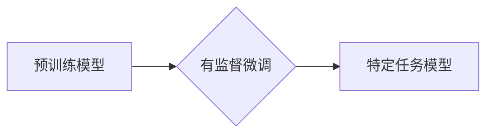

> 大语言模型、有监督微调、预训练模型、迁移学习、自然语言处理、深度学习、Transformer

## 1. 背景介绍

近年来，深度学习在自然语言处理 (NLP) 领域取得了显著进展，大语言模型 (LLM) 作为其重要代表，展现出强大的文本生成、理解和翻译能力。这些模型通常通过海量文本数据进行预训练，学习到丰富的语言表示和语法规则。然而，预训练模型在特定任务上的表现往往有限，需要进一步的微调才能达到最佳效果。

有监督微调是针对特定任务对预训练模型进行进一步训练的一种重要方法。通过使用标记数据，模型可以学习到任务相关的知识和模式，从而在目标任务上取得更高的准确率和性能。

## 2. 核心概念与联系

### 2.1 预训练模型

预训练模型是指在大量通用文本数据上进行训练的深度学习模型，其目标是学习语言的通用表示和语法规则。常见的预训练模型包括 BERT、GPT-3、T5 等。

### 2.2 有监督微调

有监督微调是指使用标记数据对预训练模型进行进一步训练，以使其在特定任务上表现更好。标记数据包含输入文本和对应的目标输出，例如文本分类、情感分析、问答等。

### 2.3 迁移学习

迁移学习是一种机器学习范式，它利用预先训练好的模型在新的任务上进行训练。有监督微调可以看作是迁移学习的一种应用，它将预训练模型的知识迁移到新的任务中。

**Mermaid 流程图**



## 3. 核心算法原理 & 具体操作步骤

### 3.1 算法原理概述

有监督微调的基本原理是利用预训练模型已经学习到的语言表示和语法规则，通过在标记数据上进行训练，进一步调整模型参数，使其能够更好地完成特定任务。

### 3.2 算法步骤详解

1. **选择预训练模型:** 根据任务需求选择合适的预训练模型。
2. **准备标记数据:** 收集和准备用于微调的标记数据。
3. **冻结部分参数:** 通常情况下，会冻结预训练模型的大部分参数，只微调部分可训练参数，例如分类层的权重。
4. **训练模型:** 使用标记数据对模型进行训练，优化模型参数。
5. **评估模型:** 在验证集上评估模型性能，并根据需要调整超参数。
6. **部署模型:** 将训练好的模型部署到实际应用场景中。

### 3.3 算法优缺点

**优点:**

* **提高性能:** 有监督微调可以显著提高模型在特定任务上的性能。
* **减少训练数据:** 相比于从头训练模型，有监督微调只需要少量标记数据。
* **加速训练:** 预训练模型已经学习了语言的通用知识，因此微调过程比从头训练更快。

**缺点:**

* **数据依赖:** 微调效果依赖于标记数据的质量和数量。
* **过拟合风险:** 如果标记数据不足，模型容易过拟合。
* **计算资源:** 微调大型预训练模型需要较大的计算资源。

### 3.4 算法应用领域

* **文本分类:** 识别文本的类别，例如情感分析、主题分类、垃圾邮件过滤。
* **问答系统:** 回答用户提出的问题。
* **机器翻译:** 将文本从一种语言翻译成另一种语言。
* **文本摘要:** 生成文本的简短摘要。
* **对话系统:** 与用户进行自然语言对话。

## 4. 数学模型和公式 & 详细讲解 & 举例说明

### 4.1 数学模型构建

在有监督微调中，通常使用交叉熵损失函数来衡量模型预测结果与真实标签之间的差异。

**公式:**

$$
Loss = - \sum_{i=1}^{N} y_i \log(p_i)
$$

其中：

* $N$ 是样本数量。
* $y_i$ 是第 $i$ 个样本的真实标签。
* $p_i$ 是模型预测第 $i$ 个样本的概率分布。

### 4.2 公式推导过程

交叉熵损失函数的推导过程基于信息论的原理。

**信息熵:**

$$
H(p) = - \sum_{i=1}^{K} p_i \log(p_i)
$$

其中：

* $K$ 是类别数量。
* $p_i$ 是第 $i$ 个类别的概率。

**交叉熵:**

$$
H(p, q) = - \sum_{i=1}^{K} p_i \log(q_i)
$$

其中：

* $p_i$ 是真实标签的概率分布。
* $q_i$ 是模型预测的概率分布。

交叉熵损失函数可以看作是真实标签分布和模型预测分布之间的差异度量。

### 4.3 案例分析与讲解

假设我们有一个文本分类任务，需要将文本分类为正向情感和负向情感。

* 真实标签：$y = [1, 0, 1, 0]$
* 模型预测概率分布：$p = [0.8, 0.2, 0.3, 0.7]$

使用交叉熵损失函数计算损失值：

$$
Loss = - (1 \log(0.8) + 0 \log(0.2) + 1 \log(0.3) + 0 \log(0.7)) \approx 0.4
$$

## 5. 项目实践：代码实例和详细解释说明

### 5.1 开发环境搭建

* Python 3.7+
* PyTorch 1.7+
* Transformers 4.0+

### 5.2 源代码详细实现

```python
from transformers import AutoModelForSequenceClassification, AutoTokenizer

# 加载预训练模型和词典
model_name = "bert-base-uncased"
tokenizer = AutoTokenizer.from_pretrained(model_name)
model = AutoModelForSequenceClassification.from_pretrained(model_name, num_labels=2)

# 准备训练数据
train_data = ...

# 定义训练函数
def train_model(model, train_data, epochs=3):
    # ...

# 训练模型
train_model(model, train_data)

# 保存模型
model.save_pretrained("my_fine_tuned_model")
```

### 5.3 代码解读与分析

* 使用 `transformers` 库加载预训练模型和词典。
* 准备训练数据，并将其转换为模型可识别的格式。
* 定义训练函数，使用交叉熵损失函数和优化器进行训练。
* 训练模型，并保存训练好的模型。

### 5.4 运行结果展示

训练完成后，可以使用验证集评估模型性能，例如计算准确率、F1-score 等指标。

## 6. 实际应用场景

* **医疗领域:** 疾病诊断、药物研发、患者记录分析。
* **金融领域:** 欺诈检测、风险评估、客户服务自动化。
* **教育领域:** 智能辅导、自动批改、个性化学习。
* **法律领域:** 法律文本分析、合同审查、法律研究。

### 6.4 未来应用展望

随着大语言模型的不断发展，有监督微调将在更多领域得到应用，例如：

* **多模态理解:** 将文本与图像、音频等其他模态数据结合，实现更全面的理解。
* **个性化服务:** 根据用户的需求和偏好，提供个性化的服务和体验。
* **代码生成:** 自动生成代码，提高开发效率。

## 7. 工具和资源推荐

### 7.1 学习资源推荐

* **Hugging Face Transformers:** https://huggingface.co/docs/transformers/index
* **OpenAI API:** https://beta.openai.com/docs/api-reference/introduction
* **Stanford NLP Group:** https://nlp.stanford.edu/

### 7.2 开发工具推荐

* **PyTorch:** https://pytorch.org/
* **TensorFlow:** https://www.tensorflow.org/
* **Jupyter Notebook:** https://jupyter.org/

### 7.3 相关论文推荐

* **BERT: Pre-training of Deep Bidirectional Transformers for Language Understanding:** https://arxiv.org/abs/1810.04805
* **GPT-3: Language Models are Few-Shot Learners:** https://arxiv.org/abs/2005.14165
* **T5: Text-to-Text Transfer Transformer:** https://arxiv.org/abs/1910.10683

## 8. 总结：未来发展趋势与挑战

### 8.1 研究成果总结

近年来，大语言模型和有监督微调取得了显著进展，在许多自然语言处理任务上取得了突破性成果。

### 8.2 未来发展趋势

* **模型规模和能力提升:** 预训练模型规模将继续扩大，模型能力将进一步提升。
* **多模态理解:** 将文本与其他模态数据结合，实现更全面的理解。
* **个性化服务:** 根据用户的需求和偏好，提供个性化的服务和体验。
* **伦理和安全问题:** 需要关注大语言模型的潜在风险，例如生成虚假信息、歧视等问题。

### 8.3 面临的挑战

* **数据获取和标注:** 高质量的标记数据是训练大语言模型的关键，但获取和标注数据成本高昂。
* **计算资源:** 训练大型预训练模型需要大量的计算资源，这对于个人开发者和小型机构来说是一个挑战。
* **模型解释性和可解释性:** 大语言模型的决策过程往往难以理解，这对于模型的信任和应用推广存在挑战。

### 8.4 研究展望

未来，大语言模型和有监督微调将继续是人工智能研究的热点领域，需要进一步探索模型架构、训练方法、应用场景等方面，以推动人工智能技术的发展和应用。

## 9. 附录：常见问题与解答

* **Q: 如何选择合适的预训练模型？**

A: 选择预训练模型需要根据任务需求和数据特点进行选择。例如，对于文本分类任务，可以使用 BERT 或 RoBERTa 等模型；对于机器翻译任务，可以使用 T5 或 MarianMT 等模型。

* **Q: 如何评估模型性能？**

A: 模型性能可以使用准确率、F1-score、BLEU 等指标进行评估。

* **Q: 如何解决过拟合问题？**

A: 可以使用正则化技术、数据增强、Dropout 等方法来解决过拟合问题。


作者：禅与计算机程序设计艺术 / Zen and the Art of Computer Programming 
<end_of_turn>