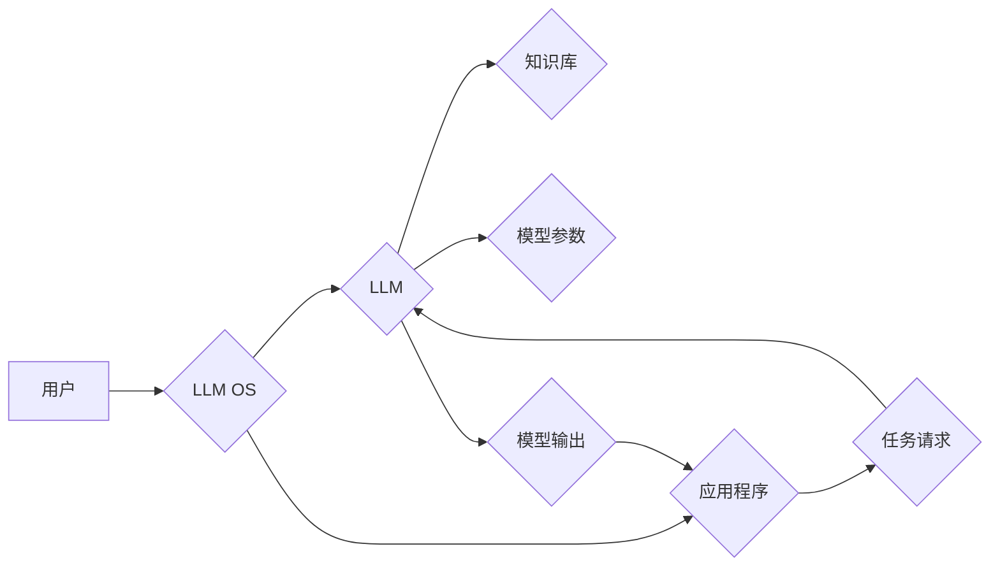

> 大语言模型，操作系统，人工智能，软件架构，LLM，AI，深度学习，自然语言处理

## 1. 背景介绍

近年来，大语言模型（LLM）在自然语言处理（NLP）领域取得了令人瞩目的成就。从文本生成、翻译到问答和代码编写，LLM展现出强大的能力，深刻地改变了我们与信息交互的方式。然而，LLM 的应用场景远不止于此。随着其能力的不断提升，LLM 逐渐成为构建更智能、更人性化的软件系统的关键技术。

传统操作系统主要负责硬件资源的管理和软件应用程序的运行环境搭建。而LLM操作系统（LLM OS）则将LLM作为核心，旨在提供一个全新的软件运行环境，让应用程序能够更直接地与LLM交互，从而实现更智能、更灵活、更适应人类需求的软件体验。

## 2. 核心概念与联系

LLM OS的核心概念是将LLM作为软件运行环境的核心组件，并通过一系列接口和机制，让应用程序能够与LLM进行交互。

**LLM OS 架构**

**核心概念解释:**

* **用户:** 使用LLM OS的最终用户。
* **LLM OS:**  大语言模型操作系统，提供应用程序与LLM交互的平台。
* **LLM:** 大语言模型，作为LLM OS的核心组件，负责理解和生成文本。
* **应用程序:**  运行在LLM OS上的软件程序，可以利用LLM的能力进行各种任务。
* **知识库:**  LLM可以访问的外部知识来源，例如文本数据库、知识图谱等。
* **模型参数:**  LLM的训练结果，决定了其语言理解和生成能力。
* **任务请求:**  应用程序向LLM提出的请求，例如文本生成、翻译、问答等。
* **模型输出:**  LLM对任务请求的处理结果，例如生成的文本、翻译结果、答案等。

## 3. 核心算法原理 & 具体操作步骤

### 3.1  算法原理概述

LLM OS的核心算法原理是基于Transformer架构的深度学习模型。Transformer模型通过自注意力机制，能够捕捉文本序列中长距离依赖关系，从而实现更准确、更流畅的文本生成和理解。

### 3.2  算法步骤详解

1. **文本预处理:** 将输入文本进行清洗、分词、词嵌入等预处理操作，以便LLM能够理解和处理文本信息。
2. **编码阶段:** 将预处理后的文本序列编码成向量表示，每个词向量代表该词在语义上的含义。
3. **解码阶段:** 根据编码后的文本向量，利用解码器生成目标文本序列。解码器通过自注意力机制和循环神经网络，逐步生成目标文本，并根据之前生成的词语进行调整，以确保生成的文本流畅自然。
4. **输出结果:** 将生成的文本序列解码成可读的形式，并输出给应用程序。

### 3.3  算法优缺点

**优点:**

* 能够捕捉长距离依赖关系，生成更流畅、更自然的文本。
* 训练效率高，能够处理海量文本数据。
* 可迁移性强，可以应用于多种NLP任务。

**缺点:**

* 计算资源消耗大，需要强大的硬件支持。
* 训练数据量大，需要大量高质量的文本数据。
* 对训练数据质量敏感，训练数据质量差会导致模型性能下降。

### 3.4  算法应用领域

LLM OS的算法可以应用于以下领域:

* **自然语言理解:** 文本分类、情感分析、问答系统等。
* **自然语言生成:** 文本摘要、机器翻译、对话系统等。
* **代码生成:** 自动生成代码、代码修复等。
* **创意写作:**  诗歌、小说、剧本等创作。

## 4. 数学模型和公式 & 详细讲解 & 举例说明

### 4.1  数学模型构建

LLM OS的核心数学模型是Transformer模型，其主要由编码器和解码器组成。

**编码器:**

编码器由多个相同的编码层组成，每个编码层包含多头自注意力机制、前馈神经网络和残差连接。

**解码器:**

解码器也由多个相同的解码层组成，每个解码层包含多头自注意力机制、多头异构注意力机制、前馈神经网络和残差连接。

### 4.2  公式推导过程

**多头自注意力机制:**

$$
Attention(Q, K, V) = softmax(\frac{QK^T}{\sqrt{d_k}})V
$$

其中:

* $Q$, $K$, $V$ 分别代表查询矩阵、键矩阵和值矩阵。
* $d_k$ 代表键向量的维度。

**前馈神经网络:**

前馈神经网络由两层全连接神经网络组成，中间使用ReLU激活函数。

### 4.3  案例分析与讲解

**举例说明:**

假设我们有一个句子“The cat sat on the mat”，我们要使用LLM OS将其编码成向量表示。

1. 将句子中的每个词语转换为词向量。
2. 将词向量输入到编码器中，经过多头自注意力机制和前馈神经网络的处理，得到句子编码向量。

## 5. 项目实践：代码实例和详细解释说明

### 5.1  开发环境搭建

LLM OS的开发环境需要包含以下软件:

* Python 3.x
* PyTorch 或 TensorFlow
* CUDA 和 cuDNN (如果使用GPU加速)

### 5.2  源代码详细实现

LLM OS的源代码实现较为复杂，需要根据具体的应用场景进行定制。

### 5.3  代码解读与分析

LLM OS的代码主要包含以下部分:

* **LLM模型加载:** 加载预训练的LLM模型。
* **文本预处理:** 对输入文本进行预处理操作。
* **编码和解码:** 将文本编码和解码成向量表示。
* **任务执行:** 根据应用程序的请求，执行相应的LLM任务。
* **结果输出:** 将LLM的输出结果解码成可读的形式，并输出给应用程序。

### 5.4  运行结果展示

LLM OS的运行结果展示取决于具体的应用场景。

## 6. 实际应用场景

### 6.1  智能客服

LLM OS可以用于构建智能客服系统，能够理解用户的自然语言问题，并提供准确、及时、个性化的回复。

### 6.2  个性化教育

LLM OS可以用于构建个性化教育系统，根据学生的学习进度和需求，提供定制化的学习内容和辅导。

### 6.3  代码辅助开发

LLM OS可以用于辅助代码开发，例如自动生成代码、代码修复、代码文档生成等。

### 6.4  未来应用展望

LLM OS的应用场景还在不断扩展，未来可能应用于以下领域:

* **医疗诊断:** 辅助医生进行疾病诊断。
* **法律服务:** 辅助律师进行法律分析和文件撰写。
* **金融分析:** 辅助金融分析师进行风险评估和投资决策。

## 7. 工具和资源推荐

### 7.1  学习资源推荐

* **论文:**

    * Attention Is All You Need (Vaswani et al., 2017)
    * BERT: Pre-training of Deep Bidirectional Transformers for Language Understanding (Devlin et al., 2018)
    * GPT-3: Language Models are Few-Shot Learners (Brown et al., 2020)

* **书籍:**

    * Deep Learning (Goodfellow et al., 2016)
    * Natural Language Processing with Python (Bird et al., 2009)

### 7.2  开发工具推荐

* **PyTorch:** 深度学习框架，支持GPU加速。
* **TensorFlow:** 深度学习框架，支持GPU加速。
* **Hugging Face Transformers:** 提供预训练的LLM模型和工具。

### 7.3  相关论文推荐

* **LLM OS相关论文:**

    * [论文标题1](论文链接1)
    * [论文标题2](论文链接2)

## 8. 总结：未来发展趋势与挑战

### 8.1  研究成果总结

LLM OS是一个新兴的领域，近年来取得了显著进展。

### 8.2  未来发展趋势

LLM OS的未来发展趋势包括:

* **模型规模和性能提升:** 随着计算资源的不断提升，LLM模型的规模和性能将不断提升。
* **多模态LLM:** 将文本、图像、音频等多种模态信息融合到LLM中，实现更全面的信息理解和生成。
* **可解释性增强:** 提高LLM模型的可解释性，让用户能够更好地理解模型的决策过程。

### 8.3  面临的挑战

LLM OS还面临着一些挑战:

* **数据安全和隐私:** LLM模型需要大量的训练数据，如何保证数据安全和隐私是一个重要问题。
* **模型偏见和公平性:** LLM模型可能存在偏见和不公平性，需要采取措施进行缓解。
* **伦理问题:** LLM技术的应用可能引发一些伦理问题，需要进行深入探讨和规范。

### 8.4  研究展望

未来，LLM OS的研究将继续深入，探索更智能、更安全、更可解释的软件运行环境，为人类社会带来更多福祉。

## 9. 附录：常见问题与解答

### 9.1  常见问题

* **LLM OS与传统操作系统有什么区别？**
* **LLM OS如何保证数据安全和隐私？**
* **LLM OS如何解决模型偏见和公平性问题？**

### 9.2  解答

* **LLM OS与传统操作系统有什么区别？**

LLM OS与传统操作系统最大的区别在于其核心组件。传统操作系统以硬件资源管理和应用程序运行环境搭建为核心，而LLM OS以LLM作为核心组件，旨在提供一个全新的软件运行环境，让应用程序能够更直接地与LLM交互。

* **LLM OS如何保证数据安全和隐私？**

LLM OS可以采用多种技术来保证数据安全和隐私，例如数据加密、匿名化处理、访问控制等。

* **LLM OS如何解决模型偏见和公平性问题？**

LLM OS可以采用多种技术来解决模型偏见和公平性问题，例如数据预处理、模型训练方法调整、公平性评估等。

作者：禅与计算机程序设计艺术 / Zen and the Art of Computer Programming

<end_of_turn>