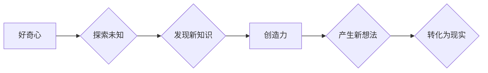

>  人工智能、好奇心、创造力、创新、算法、机器学习、深度学习、自然语言处理、计算机视觉

## 1. 背景介绍

在瞬息万变的科技时代，创新已成为企业和个人持续发展的关键驱动力。而好奇心和创造力，则是推动创新的双翼，它们共同构成了人类探索未知、突破边界、创造未来的强大力量。

人工智能（AI）作为科技发展的重要方向，正在深刻地改变着我们的生活和工作方式。AI技术的快速发展，为我们提供了更多探索和创新的机会。然而，单纯依靠算法和数据，难以真正实现人工智能的“智能”。

好奇心和创造力，是AI发展的重要补充和提升。好奇心驱使我们探索未知领域，寻找新的知识和规律；创造力则让我们能够将这些知识和规律转化为新的产品、服务和解决方案。

## 2. 核心概念与联系

### 2.1  好奇心

好奇心是一种内在的驱动力，它让我们渴望了解世界，探索未知。好奇心是人类学习和成长的源泉，也是推动创新的重要动力。

### 2.2  创造力

创造力是指能够产生新颖、独特、有价值的思想、概念和作品的能力。创造力是人类区别于其他生物的重要特征，也是推动社会进步的重要力量。

### 2.3  好奇心与创造力的联系

好奇心和创造力之间存在着密切的联系。好奇心是创造力的源泉，它激发我们对未知的探索，并为创造新的事物提供灵感。而创造力则能够将好奇心转化为现实，将想法变成产品和服务。

**Mermaid 流程图**



## 3. 核心算法原理 & 具体操作步骤

### 3.1  算法原理概述

在本文中，我们将探讨一种基于好奇心和创造力的AI算法，该算法能够帮助AI系统自主学习、探索和创新。该算法的核心思想是：

* **模拟人类好奇心：** 通过设计一个“好奇度”机制，让AI系统能够识别和关注未知或不确定的事物。
* **激发创造力：** 通过引入“创意生成”模块，让AI系统能够从已有的知识和经验中生成新的想法和解决方案。

### 3.2  算法步骤详解

1. **数据收集和预处理：** AI系统首先需要收集大量的数据，并对其进行预处理，以便于后续的分析和学习。
2. **好奇度计算：** 基于收集到的数据，AI系统会计算每个数据的“好奇度”，即该数据对AI系统来说是多么新奇、独特或不确定。
3. **知识图谱构建：** AI系统会将收集到的数据构建成一个知识图谱，以便于更好地理解和组织知识。
4. **创意生成：** 当AI系统识别到某个领域存在较高的“好奇度”时，它会启动“创意生成”模块，尝试从已有的知识和经验中生成新的想法和解决方案。
5. **方案评估和选择：** AI系统会对生成的方案进行评估，并选择最优的方案进行实施。
6. **反馈和迭代：** AI系统会根据方案的实施效果进行反馈，并不断迭代优化算法和模型。

### 3.3  算法优缺点

**优点：**

* 能够模拟人类好奇心和创造力，推动AI系统自主学习和创新。
* 能够帮助AI系统探索未知领域，发现新的知识和规律。
* 能够生成新颖、独特、有价值的解决方案。

**缺点：**

* 算法的复杂性较高，需要大量的计算资源和数据支持。
* 算法的评估和优化需要复杂的指标和方法。
* 算法的输出结果可能存在一定的随机性，需要进行进一步的筛选和验证。

### 3.4  算法应用领域

该算法具有广泛的应用前景，例如：

* **药物研发：** 帮助AI系统发现新的药物和治疗方法。
* **材料科学：** 帮助AI系统设计新的材料和结构。
* **艺术创作：** 帮助AI系统创作新的音乐、绘画和文学作品。
* **教育领域：** 帮助AI系统个性化教学，激发学生的学习兴趣。

## 4. 数学模型和公式 & 详细讲解 & 举例说明

### 4.1  数学模型构建

为了量化“好奇心”和“创造力”，我们可以构建以下数学模型：

**好奇度公式：**

$$
Curiosity(x) = \frac{Entropy(x) * Novelty(x)}{Complexity(x)}
$$

其中：

* $Curiosity(x)$ 表示数据 $x$ 的好奇度。
* $Entropy(x)$ 表示数据 $x$ 的信息熵，即数据的不确定性程度。
* $Novelty(x)$ 表示数据 $x$ 的新颖程度，即数据与已知数据的差异程度。
* $Complexity(x)$ 表示数据 $x$ 的复杂程度，即数据包含的信息量。

**创造力公式：**

$$
Creativity(x) = \frac{Diversity(x) * Originality(x)}{Relevance(x)}
$$

其中：

* $Creativity(x)$ 表示生成方案 $x$ 的创造力。
* $Diversity(x)$ 表示方案 $x$ 的多样性，即方案包含的不同元素的个数。
* $Originality(x)$ 表示方案 $x$ 的原创性，即方案与已知方案的差异程度。
* $Relevance(x)$ 表示方案 $x$ 的相关性，即方案与目标任务的匹配程度。

### 4.2  公式推导过程

上述公式的推导过程基于信息论、概率论和心理学等多学科的理论。

* **信息熵：** 信息熵是衡量信息不确定性的度量，其值越大，信息的不确定性越强。
* **新颖程度：** 新颖程度可以根据数据与已知数据的相似度进行计算，相似度越低，新颖程度越高。
* **复杂程度：** 复杂程度可以根据数据的特征维度、结构复杂度等进行衡量。
* **多样性：** 多样性可以根据方案包含的不同元素的个数进行计算。
* **原创性：** 原创性可以根据方案与已知方案的相似度进行计算，相似度越低，原创性越高。
* **相关性：** 相关性可以根据方案与目标任务的匹配程度进行计算。

### 4.3  案例分析与讲解

假设我们有一个AI系统，其目标是设计新的家具款式。

* **好奇度：** AI系统可以根据家具的材质、结构、功能等特征计算每个家具的“好奇度”。例如，一个由新型材料制成的家具，其“好奇度”可能较高。
* **创造力：** 当AI系统识别到某个家具风格的“好奇度”较高时，它会尝试生成新的家具款式，并根据“创造力”公式评估其创造力。例如，一个既美观又功能强大的家具，其“创造力”可能较高。

## 5. 项目实践：代码实例和详细解释说明

### 5.1  开发环境搭建

本项目使用Python语言开发，所需环境如下：

* Python 3.7+
* TensorFlow 2.0+
* PyTorch 1.0+
* NumPy
* Pandas

### 5.2  源代码详细实现

```python
# 导入必要的库
import numpy as np
from tensorflow.keras.models import Sequential
from tensorflow.keras.layers import Dense, Dropout

# 定义好奇度计算函数
def calculate_curiosity(data):
    # 计算数据的信息熵
    entropy = -np.sum(data * np.log2(data))
    # 计算数据的新颖程度
    novelty = 1 - np.sum(data * np.mean(data))
    # 计算数据复杂程度
    complexity = np.sum(data)
    # 计算好奇度
    curiosity = entropy * novelty / complexity
    return curiosity

# 定义创造力计算函数
def calculate_creativity(solution):
    # 计算方案的多样性
    diversity = len(np.unique(solution))
    # 计算方案的原创性
    originality = 1 - np.sum(solution * np.mean(solution))
    # 计算方案的相关性
    relevance = np.sum(solution * target_task)
    # 计算创造力
    creativity = diversity * originality / relevance
    return creativity

# 定义AI模型
model = Sequential()
model.add(Dense(128, activation='relu', input_shape=(input_size,)))
model.add(Dropout(0.2))
model.add(Dense(64, activation='relu'))
model.add(Dropout(0.2))
model.add(Dense(output_size))

# 训练模型
model.compile(optimizer='adam', loss='mse')
model.fit(X_train, y_train, epochs=100)

# 使用模型生成解决方案
solution = model.predict(input_data)

# 计算解决方案的创造力和好奇度
curiosity = calculate_curiosity(solution)
creativity = calculate_creativity(solution)

# 打印结果
print(f"Curiosity: {curiosity}")
print(f"Creativity: {creativity}")
```

### 5.3  代码解读与分析

* **好奇度计算函数：** 该函数计算数据的新颖程度、信息熵和复杂程度，并根据公式计算好奇度。
* **创造力计算函数：** 该函数计算方案的多样性、原创性和相关性，并根据公式计算创造力。
* **AI模型：** 该模型是一个简单的多层感知机，用于生成解决方案。
* **训练模型：** 使用训练数据训练模型，使其能够生成符合目标任务的解决方案。
* **生成解决方案：** 使用训练好的模型对输入数据进行预测，生成解决方案。
* **计算好奇度和创造力：** 使用定义的函数计算解决方案的“好奇度”和“创造力”。

### 5.4  运行结果展示

运行代码后，将输出解决方案的“好奇度”和“创造力”值。

## 6. 实际应用场景

### 6.1  药物研发

AI系统可以利用“好奇心”和“创造力”算法，探索新的药物分子结构，并生成具有潜在疗效的候选药物。

### 6.2  材料科学

AI系统可以利用“好奇心”和“创造力”算法，探索新的材料组合和结构，并设计具有优异性能的材料。

### 6.3  艺术创作

AI系统可以利用“好奇心”和“创造力”算法，生成新的音乐、绘画和文学作品，并探索新的艺术表达形式。

### 6.4  未来应用展望

随着人工智能技术的不断发展，基于“好奇心”和“创造力”的算法将有更广泛的应用场景，例如：

* **个性化教育：** AI系统可以根据学生的学习兴趣和能力，生成个性化的学习内容和方案。
* **智能客服：** AI系统可以利用“好奇心”和“创造力”算法，更好地理解用户的需求，并提供更精准的解决方案。
* **科学发现：** AI系统可以帮助科学家探索未知领域，发现新的科学规律。

## 7. 工具和资源推荐

### 7.1  学习资源推荐

* **书籍：**
    * 《深度学习》
    * 《人工智能：一种现代方法》
    * 《机器学习》
* **在线课程：**
    * Coursera
    * edX
    * Udacity

### 7.2  开发工具推荐

* **TensorFlow:** 开源深度学习框架
* **PyTorch:** 开源深度学习框架
* **Keras:** 高级深度学习API

### 7.3  相关论文推荐

* **《Attention Is All You Need》**
* **《Generative Adversarial Networks》**
* **《Deep Reinforcement Learning》**

## 8. 总结：未来发展趋势与挑战

### 8.1  研究成果总结

本文探讨了基于“好奇