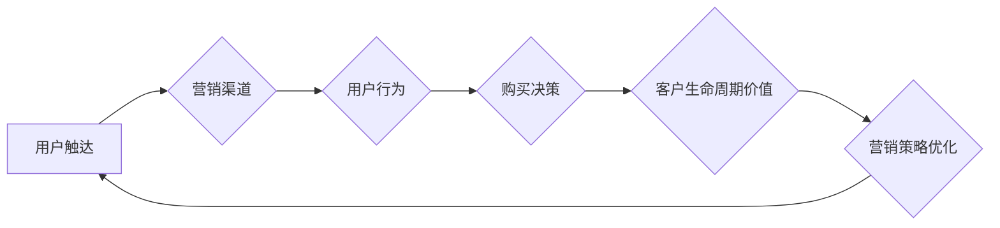

> MAC增长,供给驱动,人工智能,机器学习,数据分析,算法优化,业务增长

## 1. 背景介绍

在当今数据爆炸的时代，企业面临着如何从海量数据中挖掘价值、提升业务增长效率的挑战。其中，MAC（Marketing Attribution & Customer Lifetime Value）增长模型作为一种数据驱动型的增长策略，逐渐成为企业提升营销效果、优化资源配置的重要工具。

传统的营销增长策略往往依赖于经验和直觉，难以精准地衡量不同营销渠道的贡献，导致资源分配不合理，营销效果难以提升。而MAC增长模型通过数据分析和算法优化，能够精准地识别用户触点，量化营销渠道的贡献，并预测用户生命周期价值，从而为企业提供数据化的决策依据，实现精准营销、高效增长。

## 2. 核心概念与联系

MAC增长模型的核心概念包括：

* **营销归因（Marketing Attribution）：** 识别用户在购买决策过程中触及的各个营销渠道，并量化每个渠道的贡献度。
* **客户生命周期价值（Customer Lifetime Value，CLTV）：** 预估用户在整个生命周期内为企业带来的总价值。

MAC增长模型通过将营销归因和客户生命周期价值相结合，构建了一个完整的用户旅程分析框架，能够帮助企业全面了解用户行为，精准定位目标客户，优化营销策略，实现可持续增长。

**Mermaid 流程图：**



## 3. 核心算法原理 & 具体操作步骤

### 3.1  算法原理概述

MAC增长模型的算法原理主要基于机器学习和数据分析技术。通过训练机器学习模型，能够识别用户行为模式，预测用户购买行为，并量化不同营销渠道的贡献度。常见的MAC增长模型算法包括：

* **线性回归模型：** 将用户购买行为与营销渠道的曝光量建立线性关系，预测用户购买概率。
* **逻辑回归模型：** 将用户购买行为与营销渠道的曝光量建立非线性关系，预测用户购买概率。
* **决策树模型：** 通过构建决策树，根据用户特征和营销渠道信息，预测用户购买行为。
* **随机森林模型：** 通过构建多个决策树，并进行投票预测，提高预测准确率。

### 3.2  算法步骤详解

MAC增长模型的具体操作步骤如下：

1. **数据收集：** 收集用户行为数据、营销渠道数据、产品销售数据等相关数据。
2. **数据清洗：** 对收集到的数据进行清洗，去除无效数据、缺失数据等，确保数据质量。
3. **特征工程：** 对原始数据进行特征提取和转换，构建更适合机器学习模型的特征向量。
4. **模型训练：** 选择合适的机器学习算法，对训练数据进行模型训练，并进行模型评估。
5. **模型部署：** 将训练好的模型部署到线上环境，用于预测用户购买行为和量化营销渠道贡献度。
6. **结果分析：** 对模型预测结果进行分析，并根据分析结果优化营销策略。

### 3.3  算法优缺点

**优点：**

* 数据驱动，能够提供精准的营销决策依据。
* 能够量化营销渠道的贡献度，优化资源分配。
* 能够预测用户生命周期价值，实现精准营销。

**缺点：**

* 需要大量的数据支持，数据质量对模型效果影响较大。
* 模型训练和部署需要一定的技术门槛。
* 模型效果会随着用户行为变化而发生变化，需要定期进行模型更新。

### 3.4  算法应用领域

MAC增长模型广泛应用于以下领域：

* **电商平台：** 优化商品推荐、广告投放、用户转化等环节。
* **金融机构：** 预测客户流失、精准营销、风险控制等。
* **教育机构：** 优化招生策略、课程推荐、用户留存等。
* **游戏公司：** 提升用户活跃度、付费率、用户生命周期价值等。

## 4. 数学模型和公式 & 详细讲解 & 举例说明

### 4.1  数学模型构建

MAC增长模型的核心数学模型是基于用户生命周期价值（CLTV）的预测模型。CLTV可以定义为用户在整个生命周期内为企业带来的总价值，包括直接购买价值和间接价值（例如，用户推荐带来的价值）。

### 4.2  公式推导过程

CLTV的计算公式可以表示为：

$$CLTV = \sum_{t=1}^{T} \frac{PV_t}{(1+r)^t}$$

其中：

* $PV_t$ 表示用户在第t个时间段的购买价值。
* $r$ 表示用户生命周期内的折扣率，反映了时间价值。
* $T$ 表示用户生命周期的总长度。

### 4.3  案例分析与讲解

假设一个电商平台的用户在购买的第一年花费了100元，第二年花费了50元，第三年花费了20元，折扣率为5%。那么，该用户的CLTV可以计算为：

$$CLTV = \frac{100}{(1+0.05)^1} + \frac{50}{(1+0.05)^2} + \frac{20}{(1+0.05)^3} \approx 143.28$$

## 5. 项目实践：代码实例和详细解释说明

### 5.1  开发环境搭建

MAC增长模型的开发环境可以搭建在Python环境中，常用的库包括：

* **pandas：** 数据处理和分析。
* **scikit-learn：** 机器学习算法库。
* **matplotlib：** 数据可视化。

### 5.2  源代码详细实现

```python
import pandas as pd
from sklearn.linear_model import LinearRegression

# 数据加载
data = pd.read_csv('marketing_data.csv')

# 特征工程
features = ['channel_exposure', 'user_age', 'user_gender']
target = 'purchase_probability'

# 模型训练
model = LinearRegression()
model.fit(data[features], data[target])

# 模型预测
predictions = model.predict(data[features])

# 结果分析
print(predictions)
```

### 5.3  代码解读与分析

这段代码首先加载了营销数据，然后进行了特征工程，选择了一些重要的特征作为模型输入，并将购买概率作为目标变量。接着，使用线性回归模型对数据进行训练，并预测了用户的购买概率。最后，打印了预测结果。

### 5.4  运行结果展示

运行结果展示了每个用户的预测购买概率，可以根据这些结果进行营销策略优化，例如，针对购买概率较高的用户进行精准营销。

## 6. 实际应用场景

MAC增长模型在实际应用场景中可以应用于以下方面：

* **精准营销：** 根据用户行为和购买历史，精准地推送广告和推荐，提高营销转化率。
* **资源优化：** 量化不同营销渠道的贡献度，优化资源分配，提高营销效率。
* **用户留存：** 通过预测用户流失风险，采取措施提高用户留存率。
* **产品开发：** 分析用户需求和行为，为产品开发提供数据支持。

### 6.4  未来应用展望

随着人工智能和数据分析技术的不断发展，MAC增长模型的应用场景将会更加广泛，例如：

* **个性化营销：** 基于用户的个性化需求，提供更加个性化的营销服务。
* **跨渠道营销：** 将线上线下营销渠道整合起来，实现更加全面的用户触达。
* **预测性维护：** 通过预测用户设备故障风险，提前进行维护，降低维护成本。

## 7. 工具和资源推荐

### 7.1  学习资源推荐

* **书籍：** 《数据驱动营销》、《机器学习实战》
* **在线课程：** Coursera、edX、Udacity 等平台提供相关课程。
* **博客和论坛：** 数据分析、机器学习相关的博客和论坛，例如 Analytics Vidhya、Towards Data Science 等。

### 7.2  开发工具推荐

* **Python：** 数据分析和机器学习的常用编程语言。
* **pandas：** 数据处理和分析库。
* **scikit-learn：** 机器学习算法库。
* **TensorFlow、PyTorch：** 深度学习框架。

### 7.3  相关论文推荐

* **Marketing Attribution with Deep Learning**
* **Customer Lifetime Value Prediction Using Machine Learning**
* **A Survey of Customer Lifetime Value Prediction Models**

## 8. 总结：未来发展趋势与挑战

### 8.1  研究成果总结

MAC增长模型在数据驱动型营销策略中取得了显著的成果，能够帮助企业精准定位目标客户，优化营销资源分配，实现可持续增长。

### 8.2  未来发展趋势

未来，MAC增长模型的发展趋势包括：

* **模型更加精准：** 利用更先进的机器学习算法和数据分析技术，提高模型预测精度。
* **应用场景更加广泛：** 将MAC增长模型应用于更多领域，例如，金融、教育、医疗等。
* **个性化营销更加深入：** 基于用户的个性化需求，提供更加精准的营销服务。

### 8.3  面临的挑战

MAC增长模型的发展也面临着一些挑战：

* **数据质量问题：** 模型效果依赖于数据质量，需要不断完善数据收集和清洗流程。
* **模型解释性问题：** 一些复杂的机器学习模型难以解释，需要开发更易于理解的模型。
* **隐私保护问题：** 数据分析需要考虑用户隐私保护问题，需要采取相应的措施保障用户数据安全。

### 8.4  研究展望

未来，需要继续加强MAC增长模型的研究，探索更先进的算法和技术，解决模型面临的挑战，推动MAC增长模型在更多领域得到应用。

## 9. 附录：常见问题与解答

**常见问题：**

* MAC增长模型的适用范围是什么？
* MAC增长模型的训练需要哪些数据？
* MAC增长模型的评估指标有哪些？

**解答：**

* MAC增长模型适用于需要进行数据驱动型营销策略的企业，例如电商平台、金融机构、教育机构等。
* MAC增长模型的训练需要用户行为数据、营销渠道数据、产品销售数据等相关数据。
* MAC增长模型的评估指标包括预测准确率、AUC、F1-score等。


作者：禅与计算机程序设计艺术 / Zen and the Art of Computer Programming 
<end_of_turn>