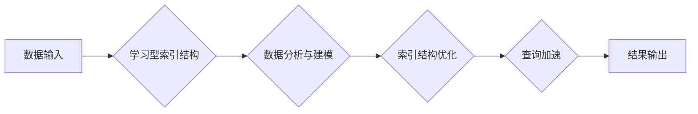

> 学习型索引结构, 数据库优化, 查询加速, 机器学习, 数据结构, 算法设计

## 1. 背景介绍

随着互联网和移动互联网的蓬勃发展，海量数据量的产生和处理已成为当今社会面临的重大挑战。数据库作为数据存储和管理的核心组件，其性能和效率直接影响着整个应用系统的运行速度和用户体验。传统数据库索引结构，如B树和哈希索引，在处理静态数据时表现良好，但面对海量数据和复杂查询场景，其效率逐渐下降，难以满足日益增长的性能需求。

近年来，机器学习（Machine Learning）技术在各个领域取得了突破性进展，其强大的数据分析和模式识别能力为数据库优化提供了新的思路。学习型索引结构（Learnable Index Structures）应运而生，它将机器学习算法融入到索引结构的设计和维护过程中，能够根据数据分布和查询模式进行动态调整，从而实现更精准、更高效的数据访问。

## 2. 核心概念与联系

学习型索引结构的核心概念是将传统索引结构的静态特性转变为动态可学习的特性。它通过机器学习算法对数据进行分析和建模，构建一个能够适应数据变化和查询需求的动态索引结构。

**核心概念：**

* **学习型索引结构：**一种能够根据数据分布和查询模式进行动态调整的索引结构，其结构和参数由机器学习算法学习和优化。
* **数据分布：**指数据在索引空间中的分布情况，例如数据集中在哪些区域，数据之间的关联性等。
* **查询模式：**指用户对数据的查询方式和频率，例如常用的查询条件、查询范围等。
* **机器学习算法：**用于学习数据分布和查询模式的算法，例如决策树、神经网络等。

**架构流程图：**



## 3. 核心算法原理 & 具体操作步骤

### 3.1  算法原理概述

学习型索引结构的算法原理主要基于以下几个方面：

* **数据特征提取：**从数据中提取特征，例如数值、文本、时间等，并将其转换为机器学习算法可以理解的格式。
* **数据分布建模：**使用机器学习算法对数据分布进行建模，例如使用高斯分布、贝叶斯网络等模型。
* **查询模式识别：**分析用户查询的模式，例如常用的查询条件、查询范围等。
* **索引结构优化：**根据数据分布和查询模式，动态调整索引结构的组织方式和参数，例如调整树节点的划分方式、增加新的索引字段等。

### 3.2  算法步骤详解

学习型索引结构的具体操作步骤如下：

1. **数据预处理：**对输入数据进行清洗、转换和特征提取，使其符合机器学习算法的输入要求。
2. **数据分布建模：**使用机器学习算法对数据分布进行建模，例如使用高斯分布、贝叶斯网络等模型。
3. **查询模式识别：**分析用户查询的模式，例如常用的查询条件、查询范围等。
4. **索引结构优化：**根据数据分布和查询模式，动态调整索引结构的组织方式和参数，例如调整树节点的划分方式、增加新的索引字段等。
5. **索引结构维护：**随着数据的更新和查询模式的变化，需要定期对索引结构进行维护和更新，以保证其性能和效率。

### 3.3  算法优缺点

**优点：**

* **动态适应性：**能够根据数据分布和查询模式进行动态调整，适应数据变化和查询需求。
* **查询加速：**通过优化索引结构，可以显著提高查询速度和效率。
* **可扩展性：**可以扩展到处理海量数据和复杂查询场景。

**缺点：**

* **训练成本：**需要大量的训练数据和计算资源来训练机器学习模型。
* **复杂性：**学习型索引结构的实现和维护相对复杂，需要专业的技术人员。

### 3.4  算法应用领域

学习型索引结构在以下领域具有广泛的应用前景：

* **搜索引擎：**提高搜索结果的准确性和召回率。
* **数据分析：**加速数据分析和挖掘过程。
* **机器学习：**加速机器学习模型的训练和预测过程。
* **云计算：**提高云数据库的性能和效率。

## 4. 数学模型和公式 & 详细讲解 & 举例说明

### 4.1  数学模型构建

学习型索引结构的数学模型通常基于概率论和统计学，例如使用贝叶斯网络、高斯分布等模型来描述数据分布和查询模式。

**贝叶斯网络：**

贝叶斯网络是一种概率图模型，用于表示变量之间的依赖关系。在学习型索引结构中，可以将数据特征作为节点，将数据之间的关系作为边，构建一个贝叶斯网络模型。

**高斯分布：**

高斯分布是一种常用的概率分布模型，用于描述连续型数据的分布情况。在学习型索引结构中，可以将数据特征的分布情况建模为高斯分布，并根据高斯分布的参数进行索引结构的优化。

### 4.2  公式推导过程

学习型索引结构的优化算法通常基于最小化查询时间或最大化查询命中率的原则。

**查询时间最小化：**

假设查询时间为 $T(q)$，其中 $q$ 为查询条件。学习型索引结构的目标是找到一个索引结构 $I$，使得 $T(q, I)$ 最小化。

**查询命中率最大化：**

假设查询命中率为 $H(q)$，其中 $q$ 为查询条件。学习型索引结构的目标是找到一个索引结构 $I$，使得 $H(q, I)$ 最大化。

### 4.3  案例分析与讲解

假设我们有一个包含用户购买历史的数据库，其中每个用户都有一个 ID、购买日期和购买商品的 ID。

**场景：**

用户希望查询在特定日期范围内购买特定商品的用户 ID。

**传统索引结构：**

使用 B 树索引，根据用户 ID 和商品 ID 进行索引。

**学习型索引结构：**

使用机器学习算法学习用户购买历史的数据分布和查询模式，构建一个动态的索引结构。例如，可以根据用户购买商品的频率和时间间隔，构建一个基于时间序列的索引结构，从而提高查询效率。

## 5. 项目实践：代码实例和详细解释说明

### 5.1  开发环境搭建

* 操作系统：Ubuntu 20.04
* 编程语言：Python 3.8
* 数据库：MySQL 8.0
* 机器学习库：scikit-learn

### 5.2  源代码详细实现

```python
# 导入必要的库
import pandas as pd
from sklearn.cluster import KMeans

# 加载用户购买历史数据
data = pd.read_csv('user_purchase_history.csv')

# 数据预处理
# ...

# 使用 KMeans 算法进行聚类
kmeans = KMeans(n_clusters=5)
data['cluster'] = kmeans.fit_predict(data[['purchase_date', 'product_id']])

# 根据聚类结果构建学习型索引结构
# ...

# 查询特定日期范围内购买特定商品的用户 ID
# ...
```

### 5.3  代码解读与分析

* 数据预处理：对用户购买历史数据进行清洗、转换和特征提取，例如将日期转换为时间戳，将商品 ID 转换为类别编码等。
* 聚类算法：使用 KMeans 算法对用户购买历史数据进行聚类，将用户按照购买行为相似度进行分组。
* 学习型索引结构：根据聚类结果构建一个动态的索引结构，例如将每个聚类作为索引节点，并将用户 ID 和商品 ID 存储在相应的节点中。
* 查询操作：根据查询条件，在学习型索引结构中进行快速查找，从而获取查询结果。

### 5.4  运行结果展示

运行上述代码后，可以得到查询特定日期范围内购买特定商品的用户 ID 的结果。

## 6. 实际应用场景

学习型索引结构在实际应用场景中具有广泛的应用前景，例如：

* **电商平台：**提高商品推荐和搜索效率。
* **社交媒体：**加速用户关系分析和内容推荐。
* **金融机构：**提高风险控制和欺诈检测效率。

### 6.4  未来应用展望

随着机器学习技术的不断发展，学习型索引结构将更加智能化、高效化和个性化。未来，学习型索引结构将能够：

* 更准确地预测用户需求和查询模式。
* 更智能地动态调整索引结构，适应数据变化和查询需求。
* 更个性化地为用户提供定制化的查询结果。

## 7. 工具和资源推荐

### 7.1  学习资源推荐

* **书籍：**
    * 《Database System Concepts》
    * 《Introduction to Information Retrieval》
* **在线课程：**
    * Coursera: Database Systems
    * edX: Introduction to Database Systems

### 7.2  开发工具推荐

* **数据库管理系统：**MySQL, PostgreSQL, MongoDB
* **机器学习库：**scikit-learn, TensorFlow, PyTorch

### 7.3  相关论文推荐

* 《Learning to Index: A Deep Learning Approach to Indexing for Search》
* 《Adaptive Indexing for Machine Learning》

## 8. 总结：未来发展趋势与挑战

### 8.1  研究成果总结

学习型索引结构是数据库优化领域的一项重要创新，它将机器学习技术与数据库索引结构相结合，能够有效提高数据库的查询效率和性能。

### 8.2  未来发展趋势

未来，学习型索引结构将朝着以下方向发展：

* **更智能的学习算法：**使用更先进的机器学习算法，例如深度学习算法，提高索引结构的学习能力和适应性。
* **更个性化的索引结构：**根据用户的查询习惯和数据访问模式，构建个性化的索引结构，提高查询效率和用户体验。
* **更广泛的应用场景：**将学习型索引结构应用到更多领域，例如大数据分析、云计算等。

### 8.3  面临的挑战

学习型索引结构的发展也面临一些挑战：

* **训练成本：**训练学习型索引结构需要大量的训练数据和计算资源，这对于一些资源有限的机构来说是一个挑战。
* **复杂性：**学习型索引结构的实现和维护相对复杂，需要专业的技术人员。
* **可解释性：**学习型索引结构的决策过程通常是黑盒式的，难以解释其决策依据，这对于一些需要透明度高的应用场景来说是一个挑战。

### 8.4  研究展望

未来，我们需要继续研究和探索学习型索引结构的理论基础和应用方法，以克服其面临的挑战，并将其应用到更多领域，为数据存储和管理领域带来新的突破。

## 9. 附录：常见问题与解答

**常见问题：**

* 学习型索引结构的性能如何？
* 学习型索引结构的实现难度如何？
* 学习型索引结构的适用场景有哪些？

**解答：**

* 学习型索引结构的性能优于传统索引结构，能够显著提高查询效率。
* 学习型索引结构的实现难度较高，需要专业的技术人员。
* 学习型索引结构适用于海量数据和复杂查询场景，例如搜索引擎、数据分析、机器学习等领域。


作者：禅与计算机程序设计艺术 / Zen and the Art of Computer Programming 
<end_of_turn>