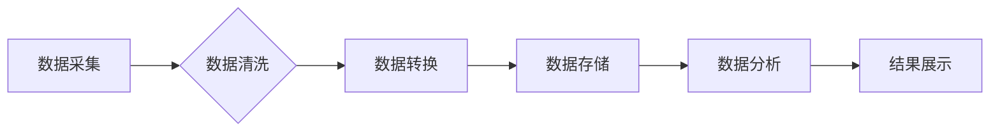

>实时数据处理，流式处理，数据管道，Apache Kafka，Apache Flink，Spark Streaming，数据分析，机器学习

## 1. 背景介绍

在当今数据爆炸的时代，海量数据以惊人的速度涌入企业系统。如何高效地处理这些实时数据，并从中提取有价值的洞察力，成为企业数字化转型和智能决策的关键。实时数据处理是指对数据进行实时分析和处理，以满足对低延迟、高吞吐量和实时响应的需求。

传统的批处理方式无法满足实时数据处理的需求，因为其处理过程通常需要一段时间，无法及时响应实时事件。实时数据处理技术应运而生，它能够实时地接收、处理和分析数据流，并提供即时反馈。

## 2. 核心概念与联系

实时数据处理的核心概念包括：

* **数据流:** 指的是连续不断的数据流，例如传感器数据、社交媒体数据、交易记录等。
* **数据管道:** 指的是用于传输和处理数据流的系统，它通常由多个组件组成，例如数据采集、数据清洗、数据转换、数据存储等。
* **流式处理:** 指的是一种数据处理模式，它能够实时地处理数据流，并提供即时反馈。

**数据处理流程图:**



## 3. 核心算法原理 & 具体操作步骤

### 3.1  算法原理概述

实时数据处理算法通常基于以下核心原理：

* **微批处理:** 将数据流划分为小的批次，并对每个批次进行处理。
* **窗口处理:** 对数据流中的数据进行分组，并对每个分组进行处理。
* **状态管理:** 维护数据流中的状态信息，以便进行更复杂的处理。

### 3.2  算法步骤详解

1. **数据采集:** 从各种数据源采集实时数据流。
2. **数据清洗:** 对采集到的数据进行清洗，例如去除重复数据、缺失数据等。
3. **数据转换:** 将数据转换为适合处理的格式。
4. **数据处理:** 使用流式处理算法对数据进行处理，例如计算统计指标、识别模式等。
5. **结果展示:** 将处理结果展示给用户，例如通过图表、报表等形式。

### 3.3  算法优缺点

**优点:**

* **低延迟:** 可以实时处理数据流，满足对低延迟的需求。
* **高吞吐量:** 可以处理海量数据流，满足对高吞吐量的需求。
* **实时响应:** 可以及时响应实时事件，例如报警、异常检测等。

**缺点:**

* **复杂性:** 实时数据处理系统通常比较复杂，需要专业的技术人员进行开发和维护。
* **成本:** 实时数据处理系统通常需要较高的硬件和软件成本。

### 3.4  算法应用领域

实时数据处理技术广泛应用于以下领域:

* **金融:** 风险管理、欺诈检测、交易监控等。
* **电商:** 商品推荐、用户行为分析、库存管理等。
* **社交媒体:** 情感分析、趋势预测、用户画像等。
* **物联网:** 设备监控、数据分析、智能控制等。

## 4. 数学模型和公式 & 详细讲解 & 举例说明

### 4.1  数学模型构建

实时数据处理系统通常使用以下数学模型来描述数据流和处理过程:

* **时间序列模型:** 用于描述数据随时间变化的规律。
* **概率模型:** 用于描述数据分布和事件发生的概率。
* **图模型:** 用于描述数据之间的关系和依赖性。

### 4.2  公式推导过程

例如，可以使用时间序列模型来预测未来数据值。常用的时间序列模型包括ARIMA模型、SARIMA模型等。

**ARIMA模型公式:**

$$
y_t = c + \phi_1 y_{t-1} + \phi_2 y_{t-2} + ... + \phi_p y_{t-p} + \theta_1 \epsilon_{t-1} + \theta_2 \epsilon_{t-2} + ... + \theta_q \epsilon_{t-q} + \epsilon_t
$$

其中:

* $y_t$ 是时间t的观测值。
* $c$ 是截距项。
* $\phi_i$ 是自回归系数。
* $\theta_i$ 是移动平均系数。
* $\epsilon_t$ 是随机误差项。

### 4.3  案例分析与讲解

例如，可以使用ARIMA模型来预测网站访问量。通过对历史访问量数据进行分析，可以确定ARIMA模型的参数，并预测未来访问量。

## 5. 项目实践：代码实例和详细解释说明

### 5.1  开发环境搭建

* 操作系统: Ubuntu 20.04
* Java 版本: OpenJDK 11
* Apache Flink 版本: 1.13.2

### 5.2  源代码详细实现

```java
import org.apache.flink.api.common.functions.MapFunction;
import org.apache.flink.streaming.api.datastream.DataStream;
import org.apache.flink.streaming.api.environment.StreamExecutionEnvironment;

public class RealtimeDataProcessing {

    public static void main(String[] args) throws Exception {
        // 创建流处理环境
        StreamExecutionEnvironment env = StreamExecutionEnvironment.getExecutionEnvironment();

        // 从模拟数据源读取数据
        DataStream<String> dataStream = env.fromElements("sensor1:10", "sensor2:20", "sensor3:30");

        // 将数据转换为SensorData对象
        DataStream<SensorData> sensorDataStream = dataStream.map(new MapFunction<String, SensorData>() {
            @Override
            public SensorData map(String value) throws Exception {
                String[] parts = value.split(":");
                String sensorId = parts[0];
                int temperature = Integer.parseInt(parts[1]);
                return new SensorData(sensorId, temperature);
            }
        });

        // 计算温度平均值
        DataStream<Double> averageTemperatureStream = sensorDataStream.keyBy("sensorId")
                .window(TumblingEventTimeWindows.of(Time.seconds(10)))
                .aggregate(new AvgTemperatureAggregation());

        // 打印结果
        averageTemperatureStream.print();

        // 执行任务
        env.execute("Realtime Data Processing");
    }
}

// SensorData类
class SensorData {
    String sensorId;
    int temperature;

    public SensorData(String sensorId, int temperature) {
        this.sensorId = sensorId;
        this.temperature = temperature;
    }

    // Getters and Setters
}

// AvgTemperatureAggregation类
class AvgTemperatureAggregation implements AggregateFunction<SensorData, Double> {
    @Override
    public Double createAccumulator() {
        return 0.0;
    }

    @Override
    public Double add(SensorData value, Double accumulator) {
        return accumulator + value.temperature;
    }

    @Override
    public Double getResult(Double accumulator) {
        return accumulator / 10;
    }

    @Override
    public Double merge(Double a, Double b) {
        return a + b;
    }
}
```

### 5.3  代码解读与分析

* **数据源:** 代码使用`env.fromElements()`方法模拟数据源，实际应用中可以连接数据库、消息队列等数据源。
* **数据转换:** 使用`map()`方法将字符串数据转换为`SensorData`对象，方便后续处理。
* **窗口处理:** 使用`keyBy()`和`window()`方法对数据进行分组和窗口处理，例如计算每秒钟的平均温度。
* **聚合操作:** 使用`aggregate()`方法对数据进行聚合操作，例如计算平均值、最大值、最小值等。
* **结果展示:** 使用`print()`方法将处理结果打印到控制台。

### 5.4  运行结果展示

运行代码后，会输出每秒钟的传感器温度平均值。

## 6. 实际应用场景

### 6.1  金融领域

* **欺诈检测:** 实时监控交易数据，识别异常交易行为，及时报警。
* **风险管理:** 实时分析市场数据，识别潜在风险，进行风险控制。
* **交易监控:** 实时监控交易情况，及时发现异常交易，防止损失。

### 6.2  电商领域

* **商品推荐:** 实时分析用户行为数据，推荐个性化商品。
* **库存管理:** 实时监控库存数据，及时补货，避免缺货。
* **用户画像:** 实时分析用户行为数据，构建用户画像，进行精准营销。

### 6.3  社交媒体领域

* **情感分析:** 实时分析用户评论数据，识别用户情感倾向，了解用户对产品的评价。
* **趋势预测:** 实时分析用户行为数据，预测热门话题和趋势。
* **用户画像:** 实时分析用户行为数据，构建用户画像，进行精准营销。

### 6.4  未来应用展望

随着物联网、人工智能等技术的快速发展，实时数据处理技术将得到更广泛的应用，例如：

* **智能制造:** 实时监控生产设备状态，进行预测性维护，提高生产效率。
* **智慧城市:** 实时监控城市环境数据，例如交通流量、空气质量等，进行城市管理优化。
* **医疗健康:** 实时监控患者健康数据，进行远程医疗诊断和治疗。

## 7. 工具和资源推荐

### 7.1  学习资源推荐

* **Apache Flink 官方文档:** https://flink.apache.org/docs/stable/
* **Apache Kafka 官方文档:** https://kafka.apache.org/documentation/
* **Spark Streaming 官方文档:** https://spark.apache.org/docs/latest/streaming-programming-guide.html

### 7.2  开发工具推荐

* **Eclipse IDE:** https://www.eclipse.org/
* **IntelliJ IDEA:** https://www.jetbrains.com/idea/
* **Apache Flink IDE:** https://flink.apache.org/docs/stable/getting_started.html#flink-ide

### 7.3  相关论文推荐

* **Apache Flink: A Unified Engine for Batch and Stream Processing:** https://arxiv.org/abs/1803.08937
* **Kafka: A Distributed Streaming Platform:** https://www.usenix.org/system/files/conference/osdi11/osdi11-paper-neumann.pdf

## 8. 总结：未来发展趋势与挑战

### 8.1  研究成果总结

实时数据处理技术已经取得了显著的进展，例如：

* **流式处理引擎:** Apache Flink、Apache Kafka等流式处理引擎的性能和功能不断提升。
* **机器学习算法:** 针对实时数据处理的机器学习算法不断发展，例如在线学习、微批处理等。
* **数据可视化:** 实时数据可视化工具不断发展，能够更直观地展示实时数据变化趋势。

### 8.2  未来发展趋势

* **更低延迟:** 追求更低的延迟，满足对毫秒级响应的需求。
* **更高吞吐量:** 处理海量数据流，满足对高吞吐量的需求。
* **更智能化:** 利用机器学习等技术，实现更智能的数据处理和分析。
* **更易用:** 提供更易用的开发工具和平台，降低开发门槛。

### 8.3  面临的挑战

* **数据质量:** 实时数据通常质量参差不齐，需要进行有效的数据清洗和处理。
* **系统可靠性:** 实时数据处理系统需要保证高可用性和可靠性，避免数据丢失和系统故障。
* **安全性和隐私:** 实时数据处理需要保障数据安全和用户隐私。

### 8.4  研究展望

未来，实时数据处理技术将继续朝着更低延迟、更高吞吐量、更智能化、