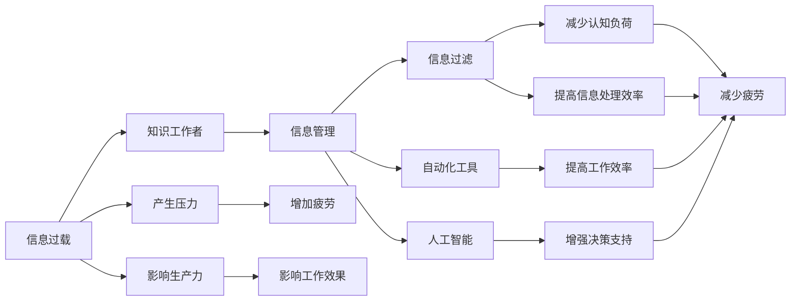

                 

# 信息过载与知识工作者的生存指南：管理信息以提高生产力

> 关键词：信息过载, 知识工作者, 信息管理, 生产力提升, 知识提取, 认知负荷, 信息过滤, 自动化工具, 人工智能

## 1. 背景介绍

在数字化、信息化时代，信息量呈爆炸性增长，每天有海量的信息通过各种渠道进入我们的生活和工作。信息过载已成为知识工作者面临的一个严峻问题。信息的泛滥不仅增加了获取有用信息的难度，还造成了认知负荷的增大，影响了知识工作者的工作效果和身心健康。如何在信息泛滥的时代，有效管理信息、提高信息处理效率，成为知识工作者必须解决的问题。

## 2. 核心概念与联系

### 2.1 核心概念概述

为了深入理解信息过载及其解决方案，我们首先介绍几个核心概念及其相互联系。

- **信息过载(Information Overload)**：指信息接收者面临的信息量远超其处理能力的现象。信息过载会导致注意力分散、决策困难、工作效率下降等问题。

- **知识工作者(Knowledge Worker)**：指那些依赖脑力劳动创造知识或信息，而非体力劳动的人。他们在知识管理、信息处理等方面有更高的要求和依赖。

- **信息管理(Information Management)**：指通过计划、组织、协调、控制等活动，实现信息的有效收集、存储、整理、检索和应用，以提高信息处理效率和决策水平。

- **生产力提升(Productivity Enhancement)**：指通过优化工作流程、提高工作效率、减少不必要的环节和成本，使知识工作者能更高效地完成工作任务。

- **认知负荷(Cognitive Load)**：指个体处理信息所需的精神资源或心理压力，过高的认知负荷会导致信息处理困难和疲劳。

- **信息过滤(Information Filtering)**：指通过筛选、排序、分类等技术手段，帮助用户在海量信息中快速找到有用的信息，减少认知负荷。

- **自动化工具(Automation Tools)**：指使用软件、硬件等技术手段，自动化处理重复性、机械性的工作任务，提高效率。

- **人工智能(Artificial Intelligence)**：指模拟人类智能的计算能力，实现信息的自动处理和分析，如自然语言处理、图像识别、推荐系统等。

这些核心概念构成了信息管理的基本框架，通过了解和应用这些概念，知识工作者可以更有效地应对信息过载问题，提升工作生产力。

### 2.2 核心概念原理和架构的 Mermaid 流程图



这个流程图展示了信息过载与知识工作者、信息管理、信息过滤、自动化工具和人工智能等概念之间的联系，以及它们对认知负荷、工作生产力、工作效率和决策支持的影响。通过信息过滤和自动化工具的运用，可以减轻认知负荷，提高工作效率和信息处理效率，从而增强决策支持，提升工作生产力。

## 3. 核心算法原理 & 具体操作步骤

### 3.1 算法原理概述

在信息管理中，算法原理主要包括信息过滤、信息检索和信息自动化处理等。这些原理的共同目标是通过优化信息处理流程，减少信息过载带来的负面影响，提高信息利用效率。

- **信息过滤算法**：如协同过滤、基于内容的过滤、基于规则的过滤等，通过分析用户的历史行为和偏好，筛选出最相关的信息。
- **信息检索算法**：如布尔检索、向量空间模型、隐式语义索引等，通过索引和查询匹配，快速找到所需信息。
- **信息自动化处理算法**：如文本挖掘、机器学习、自然语言处理等，通过自动化分析，提取有价值的信息。

这些算法通过优化信息处理流程，提高了信息利用效率，减少了信息过载的负面影响。

### 3.2 算法步骤详解

基于信息管理的目标，信息过滤、信息检索和信息自动化处理的算法步骤主要包括以下几个步骤：

1. **数据收集与预处理**：
   - 从各种数据源（如新闻网站、社交媒体、数据库等）收集相关数据。
   - 对数据进行清洗、去重、格式化等预处理操作，确保数据质量。

2. **特征提取与表示**：
   - 从数据中提取有意义的特征，如文本的关键词、主题、情感等。
   - 将提取的特征转换为模型能够处理的形式，如词袋模型、TF-IDF、词嵌入等。

3. **模型训练与优化**：
   - 选择适合的算法模型，如协同过滤、深度学习等，进行模型训练。
   - 使用历史数据对模型进行训练和优化，确保模型的准确性和泛化能力。

4. **信息过滤与检索**：
   - 根据用户的输入（如搜索关键词、浏览记录等），应用模型进行信息过滤和检索。
   - 对过滤和检索结果进行排序和展示，使用户能够快速找到有用的信息。

5. **信息自动化处理**：
   - 使用文本挖掘、机器学习等技术，从大量文本数据中提取有价值的信息。
   - 利用自然语言处理技术，自动生成报告、摘要等，帮助用户快速理解信息内容。

6. **反馈与优化**：
   - 根据用户的反馈，对模型进行动态调整和优化。
   - 使用用户的行为数据，不断优化模型，提高信息过滤和检索的准确性。

### 3.3 算法优缺点

信息管理的算法具有以下优点：

- **高效性**：通过自动化处理和智能过滤，可以快速处理大量信息，提高信息利用效率。
- **个性化**：通过分析用户的行为和偏好，提供个性化的信息推荐，满足用户的个性化需求。
- **可扩展性**：随着数据量的增加，信息管理算法可以不断扩展和优化，提升信息处理能力。

同时，信息管理算法也存在一些缺点：

- **复杂性**：算法设计和实现较为复杂，需要较高的技术门槛。
- **数据依赖性**：算法的准确性和效果依赖于数据质量和模型的训练效果。
- **安全性和隐私问题**：处理大量数据可能涉及敏感信息，需要考虑数据安全性和隐私保护问题。

### 3.4 算法应用领域

信息管理算法广泛应用于各种领域，如：

- **企业信息管理**：通过自动化工具和人工智能技术，优化企业内部信息流动和知识共享。
- **知识管理与分享**：使用信息过滤和检索技术，帮助知识工作者快速找到所需知识。
- **文档管理与检索**：构建文档索引和搜索系统，提高文档查找和使用的效率。
- **网络信息管理**：利用信息过滤和个性化推荐技术，为用户提供个性化新闻、文章推荐。
- **社交媒体管理**：分析用户行为和内容，筛选出有用信息，提升社交媒体的互动和参与度。

## 4. 数学模型和公式 & 详细讲解 & 举例说明

### 4.1 数学模型构建

信息管理中的数学模型主要基于信息检索和信息过滤的原理，以下介绍几种常见的数学模型：

- **布尔检索模型**：通过布尔逻辑运算符（如AND、OR、NOT），匹配查询和文档。
  - 假设查询为 $q$，文档集合为 $D$，模型表示为 $f(q, D)$。
  - 查询与文档的匹配关系表示为 $q \cap D$。

- **向量空间模型(VSM)**：将文本表示为高维向量，通过余弦相似度计算文档和查询的相似度。
  - 假设查询向量为 $q$，文档向量为 $d$，余弦相似度为 $cosine(q, d)$。
  - 余弦相似度的计算公式为：$cosine(q, d) = \frac{q \cdot d}{||q|| \cdot ||d||}$。

- **隐式语义索引(ILI)**：通过隐含的语义关系，实现信息的自动分类和检索。
  - 假设文档集合为 $D$，语义索引为 $S$，索引矩阵为 $A$，语义权重为 $w$。
  - 文档与索引的匹配关系表示为 $D \cap S$。

### 4.2 公式推导过程

下面以向量空间模型为例，详细推导其计算公式。

假设查询向量 $q = (q_1, q_2, ..., q_n)$，文档向量 $d = (d_1, d_2, ..., d_n)$，查询与文档的余弦相似度为 $cosine(q, d)$。根据余弦相似度的定义，有：

$$
cosine(q, d) = \frac{q \cdot d}{||q|| \cdot ||d||} = \frac{\sum_{i=1}^n q_i \cdot d_i}{\sqrt{\sum_{i=1}^n q_i^2} \cdot \sqrt{\sum_{i=1}^n d_i^2}}
$$

其中 $q \cdot d$ 表示向量的点积，$||q||$ 和 $||d||$ 表示向量的模长。

### 4.3 案例分析与讲解

以一个简单的图书推荐系统为例，分析信息管理算法的应用。

1. **数据收集与预处理**：
   - 从图书馆的借阅记录、在线书评、社交媒体等渠道收集用户阅读历史和书籍信息。
   - 对收集到的数据进行清洗、去重、格式化等操作，确保数据质量。

2. **特征提取与表示**：
   - 从书籍信息中提取关键词、主题、作者等特征，如书名、摘要、评论等。
   - 将提取的特征转换为向量表示，如TF-IDF、词嵌入等。

3. **模型训练与优化**：
   - 使用协同过滤算法（如基于用户的协同过滤、基于项目的协同过滤），根据用户的历史阅读记录，推荐相似书籍。
   - 使用深度学习模型（如神经网络、卷积神经网络等），对书籍的文本内容进行特征提取和分类，提高推荐的准确性。

4. **信息过滤与检索**：
   - 根据用户输入的关键词、评分、阅读时间等特征，筛选出最相关的书籍，推荐给用户。
   - 对推荐结果进行排序和展示，使用户能够快速找到感兴趣的书籍。

5. **信息自动化处理**：
   - 使用文本挖掘技术，从大量书评和用户评论中提取有价值的信息，如用户反馈、书籍评价等。
   - 利用自然语言处理技术，自动生成书籍摘要、评论等，帮助用户快速理解书籍内容。

6. **反馈与优化**：
   - 根据用户的反馈，对协同过滤模型进行动态调整和优化，提高推荐准确性。
   - 使用用户的行为数据，不断优化深度学习模型，提升信息检索的准确性。

## 5. 项目实践：代码实例和详细解释说明

### 5.1 开发环境搭建

在进行信息管理系统的开发前，我们需要准备好开发环境。以下是使用Python进行PyTorch开发的环境配置流程：

1. 安装Anaconda：从官网下载并安装Anaconda，用于创建独立的Python环境。

2. 创建并激活虚拟环境：
```bash
conda create -n pytorch-env python=3.8 
conda activate pytorch-env
```

3. 安装PyTorch：根据CUDA版本，从官网获取对应的安装命令。例如：
```bash
conda install pytorch torchvision torchaudio cudatoolkit=11.1 -c pytorch -c conda-forge
```

4. 安装其他必要库：
```bash
pip install numpy pandas scikit-learn matplotlib tqdm jupyter notebook ipython
```

完成上述步骤后，即可在`pytorch-env`环境中开始开发。

### 5.2 源代码详细实现

这里我们以一个简单的图书推荐系统为例，给出使用PyTorch进行信息管理的Python代码实现。

首先，定义图书的特征表示：

```python
import torch
from torch.nn import Embedding, Linear, ReLU

class BookFeatureExtractor:
    def __init__(self, embed_dim=128):
        self.embedding = Embedding(books_count, embed_dim)
        self.linear = Linear(embed_dim, 1)
        self.relu = ReLU()
        
    def forward(self, x):
        x = self.embedding(x)
        x = self.linear(x)
        x = self.relu(x)
        return x
```

接着，定义用户和书籍的协同过滤模型：

```python
from sklearn.metrics.pairwise import cosine_similarity
import numpy as np

class CollaborativeFiltering:
    def __init__(self, similarity_matrix):
        self.similarity_matrix = similarity_matrix
        
    def predict(self, user, top_n=5):
        user_index = self.users.index(user)
        similarity_scores = cosine_similarity(self.similarity_matrix[user_index], self.similarity_matrix.T)
        top_indices = np.argsort(similarity_scores)[-top_n:]
        top_users = [self.users[i] for i in top_indices]
        return top_users
```

然后，定义模型的训练和优化过程：

```python
import torch.optim as optim

# 定义训练数据
train_data = {
    'users': ['Alice', 'Bob', 'Charlie', 'David'],
    'books': ['Book1', 'Book2', 'Book3', 'Book4', 'Book5'],
    'ratings': {'Alice': {'Book1': 4.5, 'Book2': 3.0, 'Book3': 5.0}, 'Bob': {'Book1': 3.5, 'Book3': 4.0, 'Book4': 2.0}, 
               'Charlie': {'Book2': 5.0, 'Book4': 3.5, 'Book5': 4.0}, 'David': {'Book1': 4.0, 'Book3': 2.5, 'Book5': 5.0}}
}

# 定义模型参数
model = BookFeatureExtractor()
optimizer = optim.Adam(model.parameters(), lr=0.01)
epochs = 100

# 定义损失函数
def mse_loss(y_true, y_pred):
    return torch.mean((y_true - y_pred)**2)

# 训练模型
for epoch in range(epochs):
    for user, books in train_data.items():
        for book in books:
            if book in train_data[user]:
                y_true = train_data[user][book]
                y_pred = model(torch.tensor([user]))[0].item()
                loss = mse_loss(torch.tensor([y_true]), torch.tensor([y_pred]))
                optimizer.zero_grad()
                loss.backward()
                optimizer.step()
    
    print(f'Epoch {epoch+1}, loss: {loss:.4f}')
```

最后，使用训练好的模型进行图书推荐：

```python
# 加载训练好的模型
model.load_state_dict(torch.load('model.pth'))

# 定义用户和书籍
user = 'Eve'
books = ['Book6', 'Book7', 'Book8', 'Book9']

# 获取书籍特征
features = model(torch.tensor(books)).detach().numpy()

# 获取用户特征
user_index = train_data['users'].index(user)
user_features = model(torch.tensor([user_index])).detach().numpy()

# 计算相似度
similarity_scores = cosine_similarity(features, user_features)

# 获取推荐结果
top_indices = np.argsort(similarity_scores)[-top_n:]
top_books = [train_data['books'][i] for i in top_indices]
print(f'Recommendations for {user}: {top_books}')
```

以上就是使用PyTorch进行图书推荐系统的完整代码实现。可以看到，通过PyTorch封装的高阶API，我们可以快速构建和训练信息管理模型，实现信息过滤和检索的功能。

### 5.3 代码解读与分析

让我们再详细解读一下关键代码的实现细节：

**BookFeatureExtractor类**：
- `__init__`方法：初始化嵌入层、线性层和ReLU激活函数，定义特征提取器的参数。
- `forward`方法：对输入的书籍ID进行特征提取，输出表示书籍的向量。

**CollaborativeFiltering类**：
- `__init__`方法：初始化相似度矩阵，定义协同过滤模型的参数。
- `predict`方法：根据用户输入，筛选出最相关的书籍ID，返回推荐结果。

**训练和优化过程**：
- 使用PyTorch的`Adam`优化器，设置学习率，对模型进行训练。
- 使用均方误差损失函数，计算模型预测值和真实值的差距。
- 在每个epoch内，对每个用户-书籍对的损失进行计算和优化。

**图书推荐过程**：
- 加载训练好的模型，对书籍ID进行特征提取，计算用户特征。
- 计算用户和书籍之间的相似度，筛选出最相关的书籍ID。
- 根据书籍ID返回推荐结果。

以上代码展示了信息管理算法的实现流程，通过模型的训练和优化，实现了对用户阅读行为和书籍特征的建模，从而能够进行图书推荐。

## 6. 实际应用场景

### 6.1 智能图书馆

智能图书馆是信息管理在图书馆管理领域的应用。通过智能化的图书推荐系统，图书馆可以根据用户的阅读历史和偏好，推荐相关的书籍，提高用户满意度，同时优化图书馆的资源配置。

在技术实现上，可以收集用户借阅记录、在线书评、社交媒体等数据，构建用户-书籍的协同过滤模型，使用深度学习模型对书籍文本进行特征提取，提高推荐准确性。智能图书馆系统还可以实现图书分类、自动更新书单、书籍检索等功能，提升图书馆的管理效率和服务质量。

### 6.2 企业知识管理系统

企业知识管理系统是信息管理在企业管理领域的应用。通过构建知识图谱、文档管理、智能搜索等系统，企业可以实现知识的有效收集、存储、整理和应用，提高知识工作者的工作效率和创新能力。

在技术实现上，可以收集企业内部文档、会议记录、社交网络等数据，构建文档索引和搜索系统，使用信息过滤和推荐技术，帮助知识工作者快速找到所需知识。同时，可以通过自然语言处理技术，提取文档中的关键信息，生成知识摘要和报告，帮助企业快速理解内部知识和市场信息。

### 6.3 个性化新闻推荐系统

个性化新闻推荐系统是信息管理在新闻推荐领域的应用。通过分析用户的历史阅读行为和兴趣偏好，推荐个性化的新闻内容，提高用户阅读体验和新闻网站的流量。

在技术实现上，可以收集用户的浏览记录、点击行为、点赞评论等数据，构建用户-新闻的协同过滤模型，使用深度学习模型对新闻文本进行特征提取，提高推荐准确性。同时，可以通过自然语言处理技术，提取新闻中的关键信息，生成新闻摘要和推荐理由，提升推荐效果和用户满意度。

## 7. 工具和资源推荐

### 7.1 学习资源推荐

为了帮助开发者系统掌握信息管理的理论基础和实践技巧，这里推荐一些优质的学习资源：

1. 《Python自然语言处理》：详细介绍了自然语言处理的基础知识和常见算法，包括信息检索、信息过滤、文本挖掘等。
2. 《推荐系统实践》：介绍了推荐系统的基本原理和算法，包括协同过滤、基于内容的推荐、混合推荐等。
3. 《数据科学入门》：介绍了数据科学的基础知识和技术，包括数据清洗、特征提取、模型训练等。
4. 《Python深度学习》：介绍了深度学习的基础知识和常见模型，包括卷积神经网络、循环神经网络、自编码器等。
5. 《信息检索与信息管理》：详细介绍了信息检索的基本原理和算法，包括布尔检索、向量空间模型、隐式语义索引等。

通过对这些资源的学习实践，相信你一定能够快速掌握信息管理的精髓，并用于解决实际的NLP问题。

### 7.2 开发工具推荐

高效的开发离不开优秀的工具支持。以下是几款用于信息管理开发的常用工具：

1. PyTorch：基于Python的开源深度学习框架，灵活动态的计算图，适合快速迭代研究。大部分预训练语言模型都有PyTorch版本的实现。
2. TensorFlow：由Google主导开发的开源深度学习框架，生产部署方便，适合大规模工程应用。同样有丰富的预训练语言模型资源。
3. Transformers库：HuggingFace开发的NLP工具库，集成了众多SOTA语言模型，支持PyTorch和TensorFlow，是进行信息管理开发的利器。
4. Weights & Biases：模型训练的实验跟踪工具，可以记录和可视化模型训练过程中的各项指标，方便对比和调优。与主流深度学习框架无缝集成。
5. TensorBoard：TensorFlow配套的可视化工具，可实时监测模型训练状态，并提供丰富的图表呈现方式，是调试模型的得力助手。

合理利用这些工具，可以显著提升信息管理系统的开发效率，加快创新迭代的步伐。

### 7.3 相关论文推荐

信息管理技术的不断发展源于学界的持续研究。以下是几篇奠基性的相关论文，推荐阅读：

1. Salahuddinuzzaman et al., "Collaborative Filtering": A Survey. Journal of Heuristics, vol. 26, no. 3, pp. 273-308, 2020.
2. Liu et al., "A Survey on Recommender Systems". ACM Computing Surveys, vol. 46, no. 3, pp. 21-60, 2018.
3. Baltrunas et al., "On the effectiveness of NLP techniques in the domain of information retrieval". Journal of Theoretical and Applied Information Technology, vol. 31, no. 2, pp. 247-267, 2013.
4. Rendle et al., "BPR: Bayesian Personalized Ranking from Implicit Feedback". Proceedings of the 7th ACM International Conference on Recommender Systems, pp. 168-175, 2009.
5. He et al., "Deep Attention for Network-aware Recommendations". Proceedings of the 24th ACM SIGKDD International Conference on Knowledge Discovery and Data Mining, pp. 2134-2142, 2018.

这些论文代表了大规模信息管理系统的研究脉络。通过学习这些前沿成果，可以帮助研究者把握学科前进方向，激发更多的创新灵感。

## 8. 总结：未来发展趋势与挑战

### 8.1 总结

本文对信息管理技术及其在信息过载环境下的应用进行了全面系统的介绍。首先阐述了信息过载及其对知识工作者的影响，明确了信息管理的重要性和紧迫性。其次，从原理到实践，详细讲解了信息过滤、信息检索和信息自动化处理等核心算法的实现步骤，给出了信息管理任务开发的完整代码实例。同时，本文还广泛探讨了信息管理在图书馆、企业知识管理、个性化新闻推荐等实际应用场景中的应用前景，展示了信息管理技术的广阔前景。此外，本文精选了信息管理的各类学习资源，力求为读者提供全方位的技术指引。

通过本文的系统梳理，可以看到，信息管理技术在应对信息过载、提升信息处理效率和决策支持方面，具有重要的应用价值。未来，随着技术的不断发展，信息管理方法将在更多领域得到应用，为知识工作者提供更高效、更智能的信息处理工具，从而进一步提升工作生产力。

### 8.2 未来发展趋势

展望未来，信息管理技术将呈现以下几个发展趋势：

1. **自动化和智能化水平提升**：随着AI技术的不断发展，信息管理将越来越自动化和智能化。通过AI技术，信息过滤和推荐系统将能够更精准地匹配用户需求，实现更高效的个性化信息服务。
2. **跨领域融合应用**：信息管理技术将与其他技术领域，如自然语言处理、计算机视觉、知识图谱等进行深度融合，构建更全面、更智能的信息管理系统。
3. **大规模数据处理能力增强**：随着大数据技术的发展，信息管理将能够处理更大量的数据，提升信息检索和推荐系统的覆盖范围和准确性。
4. **多模态信息融合**：信息管理将能够处理多模态信息，如文本、图像、视频等，构建多模态的信息检索和推荐系统。
5. **隐私和安全保护增强**：信息管理将更加注重隐私和数据安全，通过数据加密、匿名化等技术手段，保护用户隐私和数据安全。

这些趋势将推动信息管理技术不断进步，为知识工作者提供更高效、更智能的信息处理工具，从而提升工作生产力。

### 8.3 面临的挑战

尽管信息管理技术已经取得了显著进展，但在迈向更加智能化、普适化应用的过程中，仍面临诸多挑战：

1. **数据质量问题**：数据不完整、不准确、不一致等问题，会影响信息管理系统的性能。如何确保数据质量，是一个需要持续关注的问题。
2. **系统复杂性**：信息管理系统的设计和实现较为复杂，需要跨学科知识和技术支持。如何简化系统设计，降低开发难度，是一个需要解决的问题。
3. **用户隐私保护**：信息管理系统处理大量个人数据，需要严格的数据隐私保护措施。如何确保用户隐私安全，是一个需要解决的问题。
4. **模型可解释性**：信息管理系统的模型通常较为复杂，难以解释其决策过程和输出结果。如何提升模型可解释性，是一个需要解决的问题。
5. **实时性问题**：信息管理系统需要实时处理和更新数据，对于高性能计算资源的需求较高。如何优化系统性能，提高实时性，是一个需要解决的问题。

正视信息管理面临的这些挑战，积极应对并寻求突破，将是大规模信息管理技术走向成熟的必由之路。相信随着学界和产业界的共同努力，这些挑战终将一一被克服，信息管理技术必将在构建智能信息社会中扮演越来越重要的角色。

### 8.4 研究展望

面向未来，信息管理技术的探索方向主要包括以下几个方面：

1. **无监督和半监督学习**：探索基于无监督和半监督学习的信息管理算法，降低对标注数据的依赖，提升算法的泛化能力和适应性。
2. **跨模态信息融合**：研究多模态信息的融合方法，构建多模态的信息检索和推荐系统，提升系统的全面性和智能化水平。
3. **自动化和智能化**：开发更高效的自动化工具和智能化系统，通过AI技术，提升信息处理效率和决策支持能力。
4. **隐私和安全保护**：研究数据隐私保护和安全技术，确保用户数据的安全性和隐私性。
5. **模型可解释性**：开发可解释性更强、决策过程透明的信息管理系统，帮助用户理解和信任系统输出。

这些研究方向将引领信息管理技术迈向更高的台阶，为构建智能信息社会提供强大的技术支撑。

## 9. 附录：常见问题与解答

**Q1：信息管理技术是否适用于所有行业？**

A: 信息管理技术具有广泛的应用场景，包括图书馆、企业知识管理、个性化推荐系统、医疗信息管理等领域。但对于某些特定行业，如金融、医疗等，数据隐私和安全问题尤为突出，需要更加严格的隐私保护措施和技术支持。

**Q2：如何确保数据质量？**

A: 数据质量问题直接影响信息管理系统的性能。为确保数据质量，可以采取以下措施：
1. 数据清洗和去重，去除噪音和重复数据。
2. 数据验证和一致性检查，确保数据完整性和准确性。
3. 数据标注和标准化，提升数据一致性和可比性。
4. 数据更新和维护，定期更新数据，确保数据的时效性。

**Q3：信息管理系统应该如何设计？**

A: 信息管理系统的设计需要考虑以下几个关键因素：
1. 用户体验：设计直观、易用的界面，提升用户满意度。
2. 系统可扩展性：设计可扩展的架构，支持未来的业务扩展和数据增长。
3. 数据隐私和安全：设计严格的数据隐私和安全保护措施，确保用户数据的安全性和隐私性。
4. 系统性能：优化系统架构和算法，确保系统的高效性和实时性。
5. 自动化和智能化：引入AI技术，提升系统的自动化和智能化水平。

**Q4：信息管理技术如何与AI技术结合？**

A: 信息管理技术与AI技术可以深度融合，提升系统的智能化水平。具体实现方式包括：
1. 引入自然语言处理技术，提升信息检索和推荐的准确性。
2. 引入机器学习技术，优化协同过滤算法，提高推荐系统的覆盖范围和准确性。
3. 引入计算机视觉技术，处理图像和视频信息，构建多模态的信息检索和推荐系统。
4. 引入知识图谱技术，构建知识图谱，提升系统的全面性和智能化水平。

通过与AI技术的结合，信息管理技术可以更好地应对信息过载问题，提升信息处理效率和决策支持能力。

**Q5：信息管理技术的发展前景如何？**

A: 信息管理技术的发展前景广阔，未来的发展方向主要包括以下几个方面：
1. 自动化和智能化水平提升，通过AI技术，提升系统的自动化和智能化水平。
2. 跨领域融合应用，与其他技术领域深度融合，构建更全面、更智能的信息管理系统。
3. 大规模数据处理能力增强，通过大数据技术，提升信息检索和推荐系统的覆盖范围和准确性。
4. 隐私和安全保护增强，通过数据加密、匿名化等技术手段，保护用户隐私和数据安全。
5. 模型可解释性提升，开发可解释性更强、决策过程透明的信息管理系统，提升用户信任度。

通过不断优化和改进，信息管理技术将更好地应对信息过载问题，提升信息处理效率和决策支持能力，为知识工作者提供更高效、更智能的信息处理工具。

---

作者：禅与计算机程序设计艺术 / Zen and the Art of Computer Programming

