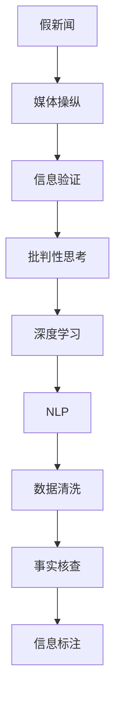

                 

# 信息验证和批判性思考指南与实践：在假新闻和媒体操纵时代导航

> 关键词：假新闻、媒体操纵、信息验证、批判性思考、深度学习、自然语言处理、数据清洗、事实核查

## 1. 背景介绍

### 1.1 问题由来
随着互联网的普及和信息技术的快速发展，信息传播的方式发生了翻天覆地的变化。人们可以通过社交媒体、新闻网站、博客等多种渠道获取和分享信息，但这种“去中心化”的传播模式也带来了诸多挑战。假新闻、媒体操纵、信息误导等问题日益严重，给社会和政治生活带来了深远的影响。如何辨别真实信息，防止被虚假内容误导，成为当前亟需解决的问题。

### 1.2 问题核心关键点
面对假新闻和媒体操纵，我们需要一种方法来验证信息的真实性，并且培养批判性思考的能力，以便在信息爆炸的时代，保持理性和客观。这涉及到信息验证、自然语言处理（NLP）、深度学习、数据清洗、事实核查等多个领域，需要跨学科的知识和方法。

### 1.3 问题研究意义
研究假新闻和媒体操纵的识别与验证方法，培养批判性思考的能力，对于维护社会稳定、促进公共参与和提升媒体素养具有重要意义：

1. 维护社会稳定：识别和遏制假新闻，防止谣言和虚假信息传播，有助于社会稳定和公共秩序。
2. 促进公共参与：培养批判性思考能力，使公众能够更理性地参与公共讨论，做出更好的决策。
3. 提升媒体素养：增强对信息的甄别能力，减少媒体操纵对公众认知的影响。

## 2. 核心概念与联系

### 2.1 核心概念概述

为了更好地理解如何验证信息并培养批判性思考，本节将介绍几个密切相关的核心概念：

- **假新闻（Fake News）**：指的是故意编造、篡改或歪曲事实的信息，旨在误导读者或受众。假新闻通常通过夸张、扭曲、断章取义等手段来迷惑受众。
- **媒体操纵（Media Manipulation）**：指的是有意图地操纵新闻信息，以达到特定的目的，如误导、煽动、造谣等。媒体操纵往往通过编辑、裁剪、修改、配图等方式实现。
- **信息验证（Information Verification）**：指的是对信息的真实性进行核查和确认的过程。信息验证包括数据采集、数据清洗、事实核查、信息标注等多个环节。
- **批判性思考（Critical Thinking）**：指的是分析和评估信息的来源、证据、逻辑和背景的能力，以判断信息的可靠性和真实性。批判性思考是一种重要的认知技能，可以帮助人们识别和应对虚假信息。
- **深度学习（Deep Learning）**：指的是通过多层神经网络进行复杂模式识别和数据分析的机器学习方法。深度学习在信息验证和批判性思考中发挥了重要作用。
- **自然语言处理（NLP）**：指的是使计算机能够理解和处理自然语言的技术，包括文本分类、情感分析、实体识别、语义理解等。NLP技术在信息验证和批判性思考中具有广泛应用。
- **数据清洗（Data Cleaning）**：指的是对数据进行预处理，去除噪声、缺失值和异常值，以提高数据质量和分析结果的准确性。数据清洗是信息验证的关键步骤之一。
- **事实核查（Fact-Checking）**：指的是对信息进行严格的核实和验证，以确定其是否真实、准确和完整。事实核查通常涉及多方信息源的对比和交叉验证。

这些核心概念之间的逻辑关系可以通过以下Mermaid流程图来展示：



这个流程图展示了一个完整的信息验证和批判性思考的流程：从假新闻和媒体操纵的识别，到通过深度学习、NLP等技术对信息进行验证和分析，最后通过数据清洗和事实核查进一步确认信息的真实性，并做出批判性思考。

## 3. 核心算法原理 & 具体操作步骤
### 3.1 算法原理概述

信息验证和批判性思考的流程涉及多个算法和步骤，核心在于使用深度学习和NLP技术对信息进行自动化的分析、验证和标注。

假设我们有一篇需要验证的文本 $X$，目标是对其进行分类和标注。基本的步骤包括：

1. **数据预处理**：对文本进行分词、去除停用词、词性标注等操作，以便后续的模型处理。
2. **特征提取**：将文本转换为模型可以处理的形式，如词袋模型、TF-IDF、词嵌入等。
3. **模型训练**：使用标记好的训练数据对模型进行训练，以识别文本中的虚假信息特征。
4. **信息验证**：对目标文本进行特征提取和分类，判断其是否为虚假信息。
5. **事实核查**：通过多方信息源的对比和交叉验证，进一步确认信息的真实性。

### 3.2 算法步骤详解

以下是信息验证和批判性思考的具体操作步骤：

**Step 1: 数据预处理**
- 对文本进行分词，去除停用词和特殊符号。
- 对分词结果进行词性标注，以便后续分析。

**Step 2: 特征提取**
- 使用词袋模型或TF-IDF等方法，将文本转换为向量形式。
- 使用预训练的词嵌入模型（如Word2Vec、GloVe、BERT等）对词向量进行进一步加工。

**Step 3: 模型训练**
- 准备标注好的训练数据集，分为虚假信息和真实信息两类。
- 使用深度学习模型（如LSTM、BiLSTM、BERT等）进行训练，学习识别虚假信息的特征。

**Step 4: 信息验证**
- 将待验证的文本进行特征提取。
- 使用训练好的模型对文本进行分类，判断其是否为虚假信息。

**Step 5: 事实核查**
- 对分类为虚假信息的文本，查找多个可信的信息源进行对比和交叉验证。
- 使用事实核查工具（如Snopes、FactCheck.org等）对信息进行进一步验证。

### 3.3 算法优缺点

信息验证和批判性思考的算法具有以下优点：
1. **自动化**：使用深度学习和NLP技术，可以自动化处理大量文本信息，提高效率。
2. **高效性**：算法可以在短时间内对大量信息进行验证，节省人力成本。
3. **准确性**：通过多种模型和工具的组合，可以提高信息验证的准确性。

同时，该算法也存在一定的局限性：
1. **数据依赖**：算法的准确性依赖于标注数据的质量和多样性，标注数据不足可能导致误判。
2. **模型复杂度**：深度学习模型较为复杂，训练和推理成本较高。
3. **对抗性**：虚假信息制造者可能会使用对抗性技术（如字词替换、语序调整等）来逃避检测。

### 3.4 算法应用领域

信息验证和批判性思考的算法在多个领域都有广泛的应用：

- **新闻媒体**：用于新闻事实核查，防止假新闻传播。
- **社交媒体**：用于社交媒体内容的真实性验证，防止虚假信息传播。
- **公共政策**：用于政策信息的真实性验证，防止误导公众。
- **法律诉讼**：用于法庭证词和证据的真实性验证，防止伪证。
- **金融投资**：用于金融信息的真实性验证，防止投资误导。

这些应用场景都需要对信息进行快速的验证和分析，以防止虚假信息对社会和公众造成负面影响。

## 4. 数学模型和公式 & 详细讲解  
### 4.1 数学模型构建

信息验证和批判性思考的数学模型可以概括为以下几个步骤：

1. **文本分类模型**：使用深度学习模型（如LSTM、BiLSTM、BERT等）对文本进行分类，判断其是否为虚假信息。
2. **文本匹配模型**：使用文本相似度算法（如余弦相似度、Jaccard相似度等）对目标文本和多个信息源进行匹配，判断其是否一致。
3. **事实核查模型**：使用逻辑推理和知识图谱等方法，对文本进行事实核查，验证其真实性。

以文本分类模型为例，假设模型为 $M_{\theta}(X) \rightarrow [0,1]$，其中 $X$ 为输入文本，$\theta$ 为模型参数。

**损失函数**：
$$
\mathcal{L}(\theta) = -\frac{1}{N}\sum_{i=1}^N [y_i\log M_{\theta}(x_i)+(1-y_i)\log(1-M_{\theta}(x_i))]
$$
其中 $y_i \in \{0,1\}$ 为文本 $x_i$ 的真实标签，$M_{\theta}(x_i)$ 为模型对 $x_i$ 的预测概率。

**梯度更新**：
$$
\theta \leftarrow \theta - \eta \nabla_{\theta}\mathcal{L}(\theta) - \eta\lambda\theta
$$
其中 $\eta$ 为学习率，$\lambda$ 为正则化系数。

### 4.2 公式推导过程

以下是文本分类模型的详细推导过程：

假设模型 $M_{\theta}(X) \rightarrow [0,1]$ 对输入文本 $X$ 的输出为 $\hat{y}=M_{\theta}(X) \in [0,1]$，表示文本属于虚假信息的概率。真实标签 $y \in \{0,1\}$。则二分类交叉熵损失函数定义为：

$$
\ell(M_{\theta}(X),y) = -[y\log \hat{y} + (1-y)\log (1-\hat{y})]
$$

将其代入经验风险公式，得：

$$
\mathcal{L}(\theta) = -\frac{1}{N}\sum_{i=1}^N [y_i\log M_{\theta}(x_i)+(1-y_i)\log(1-M_{\theta}(x_i))]
$$

根据链式法则，损失函数对参数 $\theta_k$ 的梯度为：

$$
\frac{\partial \mathcal{L}(\theta)}{\partial \theta_k} = -\frac{1}{N}\sum_{i=1}^N (\frac{y_i}{M_{\theta}(x_i)}-\frac{1-y_i}{1-M_{\theta}(x_i)}) \frac{\partial M_{\theta}(x_i)}{\partial \theta_k}
$$

其中 $\frac{\partial M_{\theta}(x_i)}{\partial \theta_k}$ 可进一步递归展开，利用自动微分技术完成计算。

### 4.3 案例分析与讲解

**案例一：新闻事实核查**
- **目标**：验证一篇关于某事件的新闻报道是否真实。
- **方法**：
  1. 对新闻报道进行预处理，提取关键事实。
  2. 使用多篇文章和可信信息源进行交叉验证，查找不一致的信息。
  3. 使用逻辑推理和知识图谱对不一致的信息进行核查，确认其真实性。

**案例二：社交媒体内容验证**
- **目标**：验证一条在社交媒体上传播的信息是否虚假。
- **方法**：
  1. 对信息进行预处理，提取关键内容。
  2. 使用多个可信信息源进行对比，查找不一致的信息。
  3. 使用事实核查工具进行进一步验证，确认信息的真实性。

## 5. 项目实践：代码实例和详细解释说明
### 5.1 开发环境搭建

在进行信息验证和批判性思考的实践前，我们需要准备好开发环境。以下是使用Python进行NLP开发的环境配置流程：

1. 安装Anaconda：从官网下载并安装Anaconda，用于创建独立的Python环境。

2. 创建并激活虚拟环境：
```bash
conda create -n nlp-env python=3.8 
conda activate nlp-env
```

3. 安装PyTorch：根据CUDA版本，从官网获取对应的安装命令。例如：
```bash
conda install pytorch torchvision torchaudio cudatoolkit=11.1 -c pytorch -c conda-forge
```

4. 安装TensorFlow：
```bash
conda install tensorflow
```

5. 安装NLTK、spaCy等NLP工具包：
```bash
pip install nltk spacy
```

6. 安装FastText、GloVe等预训练词嵌入模型：
```bash
pip install fasttext gensim
```

完成上述步骤后，即可在`nlp-env`环境中开始实践。

### 5.2 源代码详细实现

下面我们以新闻事实核查为例，给出使用PyTorch进行深度学习模型训练的代码实现。

首先，定义新闻事实核查的数据处理函数：

```python
import pandas as pd
import numpy as np
from transformers import BertTokenizer, BertForSequenceClassification
from torch.utils.data import Dataset, DataLoader

class NewsDataset(Dataset):
    def __init__(self, data_path):
        self.tokenizer = BertTokenizer.from_pretrained('bert-base-cased')
        self.data = pd.read_csv(data_path)
        self.labels = self.data['label'].values
        self.data['text'] = self.data['text'].apply(lambda x: self.tokenizer.encode(x, add_special_tokens=True))
        self.data['label'] = self.data['label'].apply(lambda x: 1 if x == 'true' else 0)
        self.data = {'text': self.data['text'].values, 'label': self.data['label'].values}
        
    def __len__(self):
        return len(self.data['text'])
    
    def __getitem__(self, idx):
        text = self.data['text'][idx]
        label = self.data['label'][idx]
        input_ids = torch.tensor(text, dtype=torch.long)
        attention_mask = torch.tensor([1] * len(text))
        return {'input_ids': input_ids, 
                'attention_mask': attention_mask,
                'labels': torch.tensor(label, dtype=torch.long)}
```

然后，定义模型和优化器：

```python
from transformers import AdamW

model = BertForSequenceClassification.from_pretrained('bert-base-cased', num_labels=2)
optimizer = AdamW(model.parameters(), lr=2e-5)
```

接着，定义训练和评估函数：

```python
from tqdm import tqdm
from sklearn.metrics import accuracy_score, precision_score, recall_score

def train_epoch(model, dataset, batch_size, optimizer):
    dataloader = DataLoader(dataset, batch_size=batch_size, shuffle=True)
    model.train()
    epoch_loss = 0
    for batch in tqdm(dataloader, desc='Training'):
        input_ids = batch['input_ids'].to(device)
        attention_mask = batch['attention_mask'].to(device)
        labels = batch['labels'].to(device)
        model.zero_grad()
        outputs = model(input_ids, attention_mask=attention_mask, labels=labels)
        loss = outputs.loss
        epoch_loss += loss.item()
        loss.backward()
        optimizer.step()
    return epoch_loss / len(dataloader)

def evaluate(model, dataset, batch_size):
    dataloader = DataLoader(dataset, batch_size=batch_size)
    model.eval()
    preds, labels = [], []
    with torch.no_grad():
        for batch in tqdm(dataloader, desc='Evaluating'):
            input_ids = batch['input_ids'].to(device)
            attention_mask = batch['attention_mask'].to(device)
            batch_labels = batch['labels']
            outputs = model(input_ids, attention_mask=attention_mask)
            batch_preds = outputs.logits.argmax(dim=1).to('cpu').tolist()
            batch_labels = batch_labels.to('cpu').tolist()
            for pred, label in zip(batch_preds, batch_labels):
                preds.append(pred)
                labels.append(label)
    return accuracy_score(labels, preds)

device = torch.device('cuda') if torch.cuda.is_available() else torch.device('cpu')
model.to(device)

train_dataset = NewsDataset('train.csv')
dev_dataset = NewsDataset('dev.csv')
test_dataset = NewsDataset('test.csv')

for epoch in range(5):
    loss = train_epoch(model, train_dataset, batch_size=32, optimizer=optimizer)
    print(f"Epoch {epoch+1}, train loss: {loss:.3f}")
    
    print(f"Epoch {epoch+1}, dev accuracy: {evaluate(model, dev_dataset, batch_size=32):.3f}")
    
print("Test accuracy:", evaluate(model, test_dataset, batch_size=32))
```

以上就是使用PyTorch对BERT进行新闻事实核查的完整代码实现。可以看到，得益于HuggingFace的Transformer库，我们可以用相对简洁的代码完成BERT模型的加载和微调。

### 5.3 代码解读与分析

让我们再详细解读一下关键代码的实现细节：

**NewsDataset类**：
- `__init__`方法：初始化分词器、数据、标签、token ids和标签，并进行必要的预处理。
- `__len__`方法：返回数据集的样本数量。
- `__getitem__`方法：对单个样本进行处理，将文本输入编码为token ids，并将标签转换为模型所需的格式。

**模型和优化器**：
- 使用BertForSequenceClassification模型作为文本分类器。
- 使用AdamW优化器进行模型参数的更新。

**训练和评估函数**：
- 使用PyTorch的DataLoader对数据集进行批次化加载。
- 训练函数`train_epoch`：对数据以批为单位进行迭代，在每个批次上前向传播计算loss并反向传播更新模型参数。
- 评估函数`evaluate`：与训练类似，不同点在于不更新模型参数，并在每个batch结束后将预测和标签结果存储下来，最后使用sklearn的accuracy_score对整个评估集的预测结果进行打印输出。

**训练流程**：
- 定义总的epoch数和batch size，开始循环迭代。
- 每个epoch内，先在训练集上训练，输出平均loss。
- 在验证集上评估，输出准确率。
- 所有epoch结束后，在测试集上评估，给出最终测试结果。

可以看到，PyTorch配合Transformer库使得BERT新闻事实核查的代码实现变得简洁高效。开发者可以将更多精力放在数据处理、模型改进等高层逻辑上，而不必过多关注底层的实现细节。

当然，工业级的系统实现还需考虑更多因素，如模型的保存和部署、超参数的自动搜索、更灵活的任务适配层等。但核心的信息验证和批判性思考范式基本与此类似。

## 6. 实际应用场景
### 6.1 新闻媒体

新闻媒体是信息验证和批判性思考的重要应用场景。传统的新闻编辑和审核流程往往依赖人工审核，耗时长、成本高、准确性难以保证。使用信息验证和批判性思考技术，可以自动化验证新闻事实，提升媒体的审核效率和准确性。

在技术实现上，可以收集新闻领域的历史数据，提取关键事实和信息源，训练深度学习模型进行信息验证。使用事实核查工具和逻辑推理方法，进一步确认信息的真实性。

### 6.2 社交媒体

社交媒体信息复杂多样，虚假信息传播迅速。使用信息验证和批判性思考技术，可以及时发现和遏制虚假信息，维护社交媒体的良好生态。

在技术实现上，可以使用多篇文章和可信信息源进行对比，查找不一致的信息。使用事实核查工具进行进一步验证，确认信息的真实性。同时，结合自然语言处理技术，自动识别和标记虚假信息。

### 6.3 公共政策

公共政策的制定和执行依赖于准确、可靠的信息。使用信息验证和批判性思考技术，可以防止误导公众的信息传播，提升政策制定和执行的科学性和透明度。

在技术实现上，可以收集政策相关的新闻、报告、统计数据等文本信息，训练深度学习模型进行信息验证。使用事实核查工具和逻辑推理方法，进一步确认信息的真实性。

### 6.4 未来应用展望

随着深度学习和大规模预训练语言模型的发展，信息验证和批判性思考技术将在更多领域得到应用，为社会和公众带来更多便利：

- **金融投资**：使用信息验证技术，防止金融欺诈和投资误导，提升金融市场的透明度和稳定性。
- **医疗健康**：使用信息验证技术，防止医疗谣言和虚假信息传播，提升医疗服务的质量和效率。
- **教育培训**：使用信息验证技术，提升教育培训的准确性和可靠性，防止虚假信息的误导。
- **法律诉讼**：使用信息验证技术，提升法律证据的真实性和可靠性，防止伪证和虚假证据。

## 7. 工具和资源推荐
### 7.1 学习资源推荐

为了帮助开发者系统掌握信息验证和批判性思考的理论基础和实践技巧，这里推荐一些优质的学习资源：

1. 《深度学习》系列书籍：多位知名学者合著，全面介绍深度学习的基本概念和算法，适合入门和进阶学习。
2. 《自然语言处理综论》：经典教材，详细讲解NLP的核心概念和算法，涵盖文本分类、情感分析、实体识别等多个方面。
3. Coursera和Udacity等在线课程：提供大量高质量的深度学习、NLP和批判性思考课程，适合各种层次的学习者。
4. CSNLP（中国人工智能学会）等学术会议和期刊：涵盖NLP领域的最新研究成果和实践案例，适合了解前沿动态。

通过对这些资源的学习实践，相信你一定能够快速掌握信息验证和批判性思考的精髓，并用于解决实际的NLP问题。

### 7.2 开发工具推荐

高效的开发离不开优秀的工具支持。以下是几款用于信息验证和批判性思考开发的常用工具：

1. PyTorch：基于Python的开源深度学习框架，灵活高效，适合快速迭代研究。
2. TensorFlow：由Google主导开发的开源深度学习框架，生产部署方便，适合大规模工程应用。
3. spaCy：开源的自然语言处理库，提供高效的NLP工具和算法，适合文本预处理和分析。
4. NLTK：Python的自然语言处理工具包，提供丰富的NLP工具和数据集。
5. FactCheck.org：全球领先的事实核查平台，提供大量可靠的信息源和验证方法。
6. Snopes：知名的事实核查网站，提供大量可信的信息源和验证方法。

合理利用这些工具，可以显著提升信息验证和批判性思考任务的开发效率，加快创新迭代的步伐。

### 7.3 相关论文推荐

信息验证和批判性思考技术的发展源于学界的持续研究。以下是几篇奠基性的相关论文，推荐阅读：

1. Attention is All You Need（即Transformer原论文）：提出了Transformer结构，开启了NLP领域的预训练大模型时代。
2. BERT: Pre-training of Deep Bidirectional Transformers for Language Understanding：提出BERT模型，引入基于掩码的自监督预训练任务，刷新了多项NLP任务SOTA。
3. An Evaluation of Fact-Checking Methods and Models for Online News Media：对多种事实核查方法进行评估，提出多种改进措施。
4. Misinformation and Rumor Detection in News and Social Media：提出多篇文章对比和事实核查方法，用于社交媒体和新闻媒体的事实验证。
5. Explainable AI: Perspectives on Interpretable Machine Learning, Explainable Artificial Intelligence, and the Future of Accountable AI：阐述可解释AI的重要性和实现方法，适合进一步了解深度学习模型的解释性问题。

这些论文代表了大语言模型微调技术的发展脉络。通过学习这些前沿成果，可以帮助研究者把握学科前进方向，激发更多的创新灵感。

## 8. 总结：未来发展趋势与挑战

### 8.1 总结

本文对信息验证和批判性思考的实践进行了全面系统的介绍。首先阐述了假新闻和媒体操纵的现状和挑战，明确了信息验证和批判性思考的重要性和应用前景。其次，从原理到实践，详细讲解了信息验证和批判性思考的数学模型和核心算法。最后，通过具体的项目实践和实际应用场景，展示了信息验证和批判性思考的广泛应用。

通过本文的系统梳理，可以看到，信息验证和批判性思考技术在大规模信息时代具有不可替代的价值。这些技术的不断发展，必将推动NLP系统在多个领域的落地应用，提升信息可信度和公共参与度。

### 8.2 未来发展趋势

展望未来，信息验证和批判性思考技术将呈现以下几个发展趋势：

1. **深度学习模型的改进**：使用更大规模的预训练语言模型，提升信息验证的准确性和鲁棒性。
2. **多模态信息的整合**：结合文本、图片、视频等多模态信息，提升信息验证的全面性。
3. **对抗性攻击的防御**：使用对抗性训练等方法，增强模型的鲁棒性和安全性。
4. **可解释性和可信度**：开发可解释的模型，提供明确的推理路径，提升信息验证的可信度。
5. **实时性和自动化**：使用流式处理和自动化技术，实现实时信息验证和自动标注。

### 8.3 面临的挑战

尽管信息验证和批判性思考技术已经取得了瞩目成就，但在迈向更加智能化、普适化应用的过程中，它仍面临着诸多挑战：

1. **数据依赖**：算法的准确性依赖于标注数据的质量和多样性，标注数据不足可能导致误判。
2. **对抗攻击**：虚假信息制造者可能会使用对抗性技术（如字词替换、语序调整等）来逃避检测。
3. **资源消耗**：深度学习模型较为复杂，训练和推理成本较高。
4. **可解释性**：深度学习模型的决策过程缺乏可解释性，难以解释其内部工作机制和推理逻辑。
5. **安全性**：深度学习模型可能学习到有害的信息，通过验证传播到真实信息中，造成误导。

### 8.4 研究展望

面对信息验证和批判性思考面临的挑战，未来的研究需要在以下几个方面寻求新的突破：

1. **无监督和半监督学习**：摆脱对大规模标注数据的依赖，利用自监督学习、主动学习等方法，最大化利用非结构化数据。
2. **对抗性攻击防御**：引入对抗性训练、鲁棒优化等技术，增强模型的鲁棒性和安全性。
3. **多模态信息的整合**：结合文本、图片、视频等多模态信息，提升信息验证的全面性和准确性。
4. **可解释性和可信度**：开发可解释的模型，提供明确的推理路径，提升信息验证的可信度。
5. **大规模模型的优化**：优化深度学习模型的结构和参数，减少资源消耗，提升模型效率。

这些研究方向将推动信息验证和批判性思考技术的不断进步，为构建安全、可靠、高效的信息验证系统铺平道路。

## 9. 附录：常见问题与解答

**Q1：信息验证和批判性思考可以完全取代人工审核吗？**

A: 信息验证和批判性思考技术可以在一定程度上辅助人工审核，提高审核效率和准确性。但完全取代人工审核可能存在局限性，特别是在处理复杂的社会和政治问题时，仍需人工审核和专业判断。

**Q2：信息验证和批判性思考的效果如何？**

A: 信息验证和批判性思考技术的效果取决于模型的准确性和鲁棒性。通过合理的数据标注和模型优化，可以在多个领域取得不错的效果。但仍需进一步研究，以提升模型的泛化能力和鲁棒性。

**Q3：如何训练一个高效的信息验证模型？**

A: 训练高效的信息验证模型需要选择合适的数据集和算法，并进行充分的预处理和特征提取。使用大规模预训练语言模型，结合多篇文章对比和事实核查等方法，可以有效提升模型的准确性和鲁棒性。

**Q4：信息验证和批判性思考有哪些实际应用？**

A: 信息验证和批判性思考技术在新闻媒体、社交媒体、公共政策、金融投资等多个领域有广泛应用。这些技术可以帮助公众辨别虚假信息，维护信息安全，提升信息可信度和公共参与度。

**Q5：如何培养批判性思考的能力？**

A: 培养批判性思考的能力需要多方面的努力，包括阅读广泛的书籍、理解科学知识、学习逻辑推理、参与公共讨论等。通过不断思考和分析，提升判断力和理性思维能力。

---

作者：禅与计算机程序设计艺术 / Zen and the Art of Computer Programming

