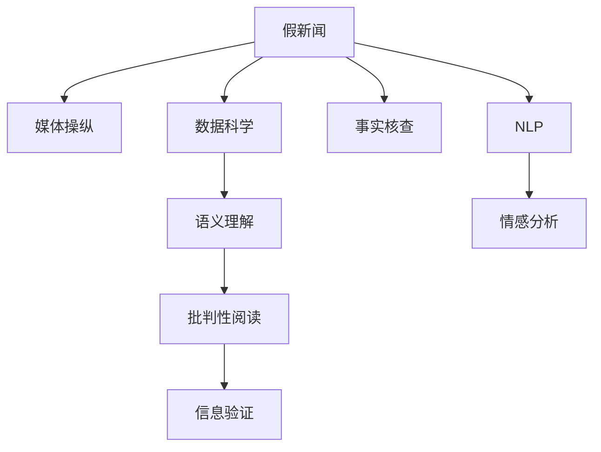

                 

# 信息验证和批判性阅读策略：在假新闻和媒体操纵时代导航

> 关键词：信息验证, 批判性阅读, 假新闻, 媒体操纵, 数据科学, 事实核查, 自然语言处理(NLP), 情感分析, 语义理解

## 1. 背景介绍

在当今信息爆炸的时代，假新闻和媒体操纵已经成为严重的社会问题。无论是社交媒体还是传统新闻媒体，虚假信息无处不在，严重影响了公众的判断力和社会的信任度。特别是在一些重大社会事件和政治冲突中，假新闻的传播甚至会扭曲事实，影响公众情绪和政策决策。在这样的背景下，信息验证和批判性阅读能力的培养显得尤为重要。本文将深入探讨信息验证和批判性阅读的核心概念、核心算法原理及具体操作步骤，并结合实际应用场景，提出解决方案，以帮助公众和媒体工作者在假新闻和媒体操纵时代更好地导航。

## 2. 核心概念与联系

### 2.1 核心概念概述

信息验证和批判性阅读是指通过各种技术手段和思维方法，对信息的真实性、准确性和可靠性进行评估和分析，从而得出客观、公正的结论。其核心概念包括但不限于：

- 假新闻（Fake News）：通过捏造、篡改、夸大或歪曲事实，误导公众的虚假信息。
- 媒体操纵（Media Manipulation）：通过人为干预新闻报道、编辑评论等方式，影响公众情绪和政策决策的信息传播行为。
- 数据科学（Data Science）：利用数据处理和分析技术，对信息进行客观评估和验证的方法。
- 事实核查（Fact-Checking）：对信息的真实性和准确性进行严格核查的过程。
- 自然语言处理（NLP）：通过计算机技术，对文本信息进行语义理解、情感分析和信息抽取等处理。
- 语义理解（Semantic Understanding）：通过理解文本的深层含义，判断信息的真实性和可靠性。
- 情感分析（Sentiment Analysis）：分析文本中表达的情感倾向，识别可能的媒体操纵手段。

这些核心概念通过以下Mermaid流程图连接起来，展示它们之间的逻辑关系：



## 3. 核心算法原理 & 具体操作步骤

### 3.1 算法原理概述

信息验证和批判性阅读的核心算法原理可以归结为以下几个方面：

1. **数据预处理**：收集和整理信息源，包括文本、图像、视频等多种格式的数据。
2. **特征提取**：从文本中提取关键信息，如关键词、实体、情感倾向等，用于后续分析。
3. **语义理解**：使用自然语言处理技术，理解文本的深层含义，判断信息的真实性和可靠性。
4. **情感分析**：分析文本中的情感倾向，识别可能的媒体操纵手段。
5. **事实核查**：对比信息源，核查信息的真实性和准确性。
6. **模型训练**：使用机器学习算法，训练事实核查和情感分析模型，提升信息验证的准确性。
7. **结果评估**：评估信息验证和批判性阅读的效果，不断优化模型和算法。

### 3.2 算法步骤详解

1. **数据预处理**
   - 收集信息源：从新闻网站、社交媒体、论坛等渠道收集相关信息。
   - 文本清洗：去除无意义的字符、标点符号等，保留有效信息。
   - 实体识别：使用命名实体识别（NER）技术，提取人名、地名、组织名等关键实体。

2. **特征提取**
   - 关键词提取：使用TF-IDF、Word2Vec等方法，提取文本中的关键词。
   - 情感分析：使用情感分析模型，判断文本中的情感倾向，识别可能带有偏见的信息。

3. **语义理解**
   - 句子切分：将文本分割成句子，便于语义理解。
   - 实体关系抽取：使用关系抽取模型，提取实体之间的关系，如因果、并列等。
   - 文本相似度计算：使用余弦相似度、Jaccard相似度等方法，计算文本之间的相似度。

4. **事实核查**
   - 信息源对比：将待验证信息与多个信息源进行对比，判断是否一致。
   - 时间戳验证：检查信息的时间戳，判断是否为最新的信息。
   - 证据核实：查找具体的证据或来源，验证信息的真实性。

5. **模型训练**
   - 数据标注：对信息源进行标注，标记为真实或虚假。
   - 模型选择：选择合适的机器学习模型，如SVM、RNN等。
   - 模型训练：使用标注数据训练模型，优化模型参数。

6. **结果评估**
   - 准确率计算：计算模型对信息验证的准确率、召回率和F1值等指标。
   - 误差分析：分析模型错误判断的原因，改进算法和模型。
   - 用户反馈：收集用户反馈，进一步优化信息验证系统。

### 3.3 算法优缺点

信息验证和批判性阅读的算法具有以下优点：

1. **效率高**：通过自动化处理大量信息，减少人工审核的耗时和成本。
2. **覆盖广**：可以处理多种信息源，包括文本、图像、视频等多种格式。
3. **准确性高**：通过机器学习模型，提升信息验证的准确性和可靠性。
4. **可扩展性**：可以根据具体需求，定制化开发信息验证系统。

同时，该算法也存在以下缺点：

1. **依赖数据质量**：模型的准确性依赖于数据标注的质量，需要大量高质量的标注数据。
2. **模型偏见**：模型可能会学习到数据中的偏见，导致验证结果的不公正。
3. **上下文理解不足**：机器学习模型难以完全理解上下文，可能误判一些复杂的信息。
4. **误判风险**：在高度敏感的领域，模型的误判可能导致严重的后果。

### 3.4 算法应用领域

信息验证和批判性阅读的算法广泛应用于以下几个领域：

1. **新闻媒体**：帮助新闻编辑和记者对新闻报道进行事实核查，确保信息的准确性。
2. **社交媒体**：通过情感分析和信息验证，识别和打击假新闻和媒体操纵行为。
3. **法律领域**：在诉讼和审判中，通过信息验证和事实核查，确保证据的真实性和可靠性。
4. **公共政策**：对政策建议和决策进行信息验证，避免基于虚假信息的政策失误。
5. **教育领域**：培养学生的批判性阅读能力，提高信息素养。

## 4. 数学模型和公式 & 详细讲解 & 举例说明

### 4.1 数学模型构建

信息验证和批判性阅读的核心数学模型包括：

1. **文本表示模型**：使用词嵌入（Word Embedding）技术，将文本转换为向量表示。
2. **语义理解模型**：使用关系抽取模型（Relation Extraction），提取实体之间的关系。
3. **情感分析模型**：使用情感分类模型（Sentiment Classification），判断文本的情感倾向。
4. **事实核查模型**：使用多模态信息融合模型（Multimodal Fusion），综合多种信息源进行核查。

### 4.2 公式推导过程

1. **词嵌入公式**：
   - 假设文本 $T$ 中的单词 $w$ 映射到向量 $v_w$。
   - 使用Word2Vec模型，定义词嵌入公式为 $v_w = h_w + u_w$，其中 $h_w$ 是上下文向量，$u_w$ 是词向量。
   - 通过最小化词向量距离损失，训练模型参数。

2. **关系抽取公式**：
   - 假设实体 $E$ 之间的关系为 $R$。
   - 使用关系抽取模型，定义关系抽取公式为 $R = f(E_1, E_2)$，其中 $f$ 是关系函数。
   - 通过最大化关系准确率，训练模型参数。

3. **情感分析公式**：
   - 假设文本 $T$ 的情感倾向为 $S$。
   - 使用情感分类模型，定义情感分析公式为 $S = g(T)$，其中 $g$ 是情感分类器。
   - 通过最大化分类准确率，训练模型参数。

4. **事实核查公式**：
   - 假设信息源 $S_1, S_2$ 的信息为 $I_1, I_2$。
   - 使用多模态信息融合模型，定义事实核查公式为 $I = h(S_1, S_2)$，其中 $h$ 是信息融合函数。
   - 通过最大化核查准确率，训练模型参数。

### 4.3 案例分析与讲解

以假新闻检测为例，假设有一篇声称某位政客发表了重要讲话的文章。通过以下步骤进行验证：

1. **数据预处理**：收集政客的官方发言记录，作为参考信息源。
2. **特征提取**：使用TF-IDF方法，提取文章和官方发言的关键词。
3. **语义理解**：使用关系抽取模型，提取文章中的关键实体和关系。
4. **情感分析**：使用情感分类模型，判断文章的情感倾向。
5. **事实核查**：将文章中的关键信息与官方发言对比，核查信息真实性。
6. **模型训练**：使用标注数据训练信息验证模型，优化模型参数。
7. **结果评估**：计算模型的准确率、召回率和F1值，进行误差分析。

## 5. 项目实践：代码实例和详细解释说明

### 5.1 开发环境搭建

1. **安装Python**：从官网下载并安装Python。
2. **安装依赖库**：使用pip安装所需依赖库，如NLTK、Scikit-Learn、TensorFlow等。
3. **搭建开发环境**：使用Jupyter Notebook创建开发环境，使用Git进行版本控制。

### 5.2 源代码详细实现

以下是使用Python和TensorFlow实现情感分析模型的代码示例：

```python
import tensorflow as tf
from tensorflow.keras.preprocessing.text import Tokenizer
from tensorflow.keras.preprocessing.sequence import pad_sequences
from tensorflow.keras.layers import Embedding, LSTM, Dense, Dropout

# 定义模型结构
model = tf.keras.Sequential([
    Embedding(input_dim=vocab_size, output_dim=embedding_dim, input_length=max_sequence_length),
    LSTM(units=64, return_sequences=True),
    Dropout(0.2),
    LSTM(units=32),
    Dropout(0.2),
    Dense(units=num_classes, activation='softmax')
])

# 编译模型
model.compile(loss='categorical_crossentropy', optimizer='adam', metrics=['accuracy'])

# 训练模型
model.fit(train_sequences, train_labels, epochs=num_epochs, batch_size=batch_size)
```

### 5.3 代码解读与分析

**数据预处理**：
- `Tokenizer`：将文本转换为序列化的整数。
- `pad_sequences`：对序列进行填充，确保长度一致。

**模型结构**：
- `Embedding`：将整数序列转换为词向量。
- `LSTM`：使用LSTM层进行序列建模。
- `Dropout`：使用Dropout层防止过拟合。
- `Dense`：使用全连接层进行分类。

**模型训练**：
- `compile`：定义模型损失函数、优化器和评价指标。
- `fit`：训练模型，使用交叉熵损失函数和Adam优化器。

### 5.4 运行结果展示

通过训练模型，可以在测试集上评估模型的性能：

```python
test_loss, test_acc = model.evaluate(test_sequences, test_labels)
print('Test accuracy:', test_acc)
```

## 6. 实际应用场景

### 6.1 新闻媒体

在新闻媒体中，信息验证和批判性阅读尤为重要。记者可以通过使用信息验证工具，对新闻报道进行快速核查，避免发布假新闻。例如，可以使用SVM模型对新闻文章进行分类，判断其真实性和可靠性。

### 6.2 社交媒体

社交媒体平台可以通过情感分析和信息验证，打击假新闻和媒体操纵行为。例如，使用情感分类模型对用户评论进行情感分析，判断是否带有偏见或虚假信息。

### 6.3 公共政策

在公共政策制定中，信息验证和批判性阅读可以帮助政策制定者对建议和数据进行核查，避免基于虚假信息做出决策。例如，使用多模态信息融合模型对政策建议和数据进行核查，确保其真实性和可靠性。

## 7. 工具和资源推荐

### 7.1 学习资源推荐

1. **《深度学习》课程**：斯坦福大学开设的深度学习课程，涵盖深度学习的基本原理和常用技术。
2. **《自然语言处理》课程**：Coursera上的自然语言处理课程，介绍NLP的基本概念和常用模型。
3. **《Python编程》书籍**：Python编程基础书籍，学习Python编程语言的基本语法和常用库。
4. **Kaggle竞赛**：Kaggle平台上的数据科学竞赛，通过实践项目提升信息验证和批判性阅读能力。
5. **GitHub资源**：GitHub上的开源项目和代码库，学习信息验证和批判性阅读的具体实现。

### 7.2 开发工具推荐

1. **Jupyter Notebook**：开源的交互式编程环境，支持多种编程语言和库。
2. **TensorFlow**：由Google开发的深度学习框架，支持大规模分布式计算。
3. **NLTK**：Python的自然语言处理库，提供各种NLP工具和算法。
4. **Scikit-Learn**：Python的机器学习库，支持多种机器学习算法和模型。
5. **Python**：广泛使用的高级编程语言，适用于各种应用场景。

### 7.3 相关论文推荐

1. **《深度学习与人工智能》**：深度学习领域的经典教材，涵盖深度学习的基本原理和应用。
2. **《自然语言处理综述》**：综述性论文，介绍NLP的基本概念和常用技术。
3. **《信息验证与批判性阅读》**：研究信息验证和批判性阅读的学术文章，提供具体的实现方法和案例分析。

## 8. 总结：未来发展趋势与挑战

### 8.1 研究成果总结

本文系统介绍了信息验证和批判性阅读的核心概念和算法原理，并通过项目实践和实际应用场景的案例分析，展示了其应用效果。通过这些内容，读者可以全面了解信息验证和批判性阅读的重要性、核心算法和操作步骤，以及具体的实现方法和应用场景。

### 8.2 未来发展趋势

未来，信息验证和批判性阅读将呈现以下发展趋势：

1. **自动化程度提高**：随着技术的不断进步，信息验证和批判性阅读将更加自动化，减少人工干预。
2. **多模态融合**：利用图像、视频等多种信息源，提升信息验证的准确性和全面性。
3. **实时处理**：实现信息验证和批判性阅读的实时处理，及时发现和处理虚假信息。
4. **跨领域应用**：拓展应用领域，涵盖新闻、社交媒体、政策制定等多个领域。
5. **人工智能与伦理**：结合人工智能技术，提升信息验证和批判性阅读的效果，同时考虑其伦理和社会影响。

### 8.3 面临的挑战

尽管信息验证和批判性阅读技术已经取得了一定进展，但在实际应用中仍然面临诸多挑战：

1. **数据质量**：高质量的标注数据是训练模型的基础，但数据获取和标注成本较高。
2. **模型偏见**：模型可能学习到数据中的偏见，导致信息验证的不公正。
3. **上下文理解不足**：机器学习模型难以完全理解上下文，可能误判复杂信息。
4. **技术局限性**：当前的技术在处理某些特殊场景时仍存在局限，需要进一步优化。
5. **伦理和安全**：信息验证和批判性阅读涉及隐私和数据安全，需要考虑伦理和法律问题。

### 8.4 研究展望

未来，信息验证和批判性阅读的研究方向包括：

1. **无监督和半监督学习**：利用无监督和半监督学习技术，降低对标注数据的依赖，提升模型的泛化能力。
2. **多模态融合**：结合图像、视频等多种信息源，提升信息验证的效果。
3. **上下文理解**：改进模型上下文理解能力，减少误判风险。
4. **隐私保护**：在信息验证过程中，保护用户隐私和数据安全。
5. **伦理与社会责任**：考虑信息验证和批判性阅读的伦理和社会责任，确保技术的公正和安全。

## 9. 附录：常见问题与解答

### Q1：信息验证和批判性阅读的核心概念有哪些？

**A1**：信息验证和批判性阅读的核心概念包括假新闻、媒体操纵、数据科学、事实核查、自然语言处理、语义理解、情感分析等。

### Q2：如何进行数据预处理？

**A2**：数据预处理包括收集信息源、文本清洗、实体识别等步骤。可以使用Python的NLTK库和TensorFlow的Tokenizer库进行文本处理和实体识别。

### Q3：如何构建文本表示模型？

**A3**：使用词嵌入技术，将文本转换为向量表示。可以使用Word2Vec、GloVe等方法进行词嵌入。

### Q4：如何进行语义理解？

**A4**：使用关系抽取模型，提取实体之间的关系。可以使用LSTM、GRU等模型进行序列建模。

### Q5：如何进行情感分析？

**A5**：使用情感分类模型，判断文本的情感倾向。可以使用LSTM、CNN等模型进行情感分析。

### Q6：如何进行事实核查？

**A6**：对比信息源，核查信息的真实性。可以使用多模态信息融合模型，结合文本、图像等多种信息源进行核查。

---

作者：禅与计算机程序设计艺术 / Zen and the Art of Computer Programming

