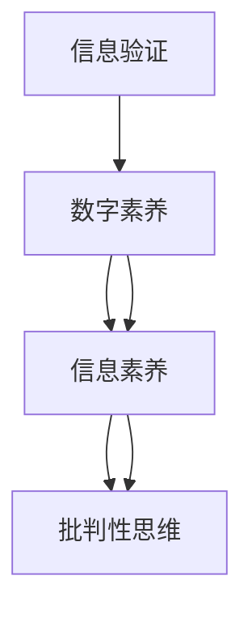

                 

## 1. 背景介绍

### 1.1 问题由来
随着互联网和信息技术的飞速发展，数字化、信息化已经成为我们日常生活和工作中不可或缺的一部分。然而，伴随着信息爆炸和传播方式的变革，数字时代的信息环境变得异常复杂多变，真假难辨、信息过载等问题层出不穷。特别是在教育领域，如何培养学生的信息素养，使其具备辨别和处理信息的能力，成为亟待解决的难题。

### 1.2 问题核心关键点
信息素养，即学生在面对信息爆炸环境时，能够有效获取、评估、利用和创造信息的能力。当前，信息素养教育主要依赖传统课程和书本知识，难以应对日新月异的信息环境变化。因此，急需开发一种新的教育模式，利用先进的信息技术和工具，帮助学生掌握信息验证和批判性思维技能。

### 1.3 问题研究意义
开展信息验证和数字素养教育，对培养适应信息时代的学生至关重要：

1. **提升信息辨别能力**：学生能够准确判断信息的真假、可信度，避免被虚假或有害信息误导。
2. **提高信息利用效率**：学生能够快速找到有价值的资源，进行高效的资料检索和信息整合。
3. **培养批判性思维**：学生能够深入分析信息，提出有见地的观点，进行逻辑推理和创新思考。
4. **适应数字化生活**：学生能够充分利用数字工具，提高生活和工作的效率和质量。
5. **增强安全意识**：学生具备基本的网络安全知识和防护技能，保护个人隐私和数据安全。

本文将探讨一种基于信息验证和数字素养教育的新型教育模式，利用先进的技术和工具，帮助学生全面提升信息素养，成为新时代的知识工作者。

## 2. 核心概念与联系

### 2.1 核心概念概述

为更好地理解这种教育模式，本节将介绍几个关键概念及其相互关系：

- **信息验证(Information Verification)**：指通过各种手段和方法，对信息来源、内容真实性进行核查和评估，以确定其可信度和准确性的过程。
- **数字素养(Digital Literacy)**：指学生掌握使用计算机、网络等数字工具的基本技能和知识，包括信息检索、文档制作、网络安全等。
- **信息素养(Information Literacy)**：指学生在面对信息环境时，能够有效获取、评估、利用和创造信息的能力，包括判断信息源、评估信息质量、批判性思维等。
- **批判性思维(Critical Thinking)**：指通过逻辑分析和证据评估，对信息进行深入思考和判断的过程，包括质疑、分析、推理、评估等。

这些概念之间的联系可以通过以下Mermaid流程图来展示：



这个流程图展示了信息验证和数字素养教育与信息素养、批判性思维之间的内在联系：

1. 信息验证是数字素养教育的基础，使学生具备正确使用信息资源的能力。
2. 数字素养教育使学生掌握必要的数字工具和技能，为信息验证和信息素养教育提供保障。
3. 信息素养教育培养学生的信息获取、评估、利用和创造能力，是信息验证和批判性思维教育的重要内容。
4. 批判性思维教育进一步提升学生的信息素养，使学生能够深入分析和评估信息，形成科学的判断和见解。

## 3. 核心算法原理 & 具体操作步骤
### 3.1 算法原理概述

信息验证和数字素养教育的核心在于教会学生如何准确判断信息的真实性和可靠性。具体而言，可以分为以下几个步骤：

1. **信息收集与预处理**：收集网络信息，清洗和整理数据。
2. **信息源评估**：识别信息来源，评估其可信度和权威性。
3. **内容分析与验证**：对信息内容进行文本分析、事实核查、统计验证等。
4. **结论生成与反馈**：基于验证结果，生成信息判断结论，进行学生反馈和效果评估。

### 3.2 算法步骤详解

基于上述原理，信息验证和数字素养教育的算法步骤可以详细描述如下：

**Step 1: 数据收集与预处理**
- 使用网络爬虫等工具收集目标信息。
- 清洗和预处理数据，去除噪声、无用信息，进行文本分词、词性标注等处理。
- 使用词频统计、主题建模等技术，对文本数据进行特征提取。

**Step 2: 信息源评估**
- 基于开源平台（如Wayback Machine、Google Scholar等）查找信息来源。
- 评估信息源的权威性、可信度和时效性。
- 结合可信度评估算法，计算信息源的综合得分。

**Step 3: 内容分析与验证**
- 应用自然语言处理技术（如BERT、ELMo等），对信息内容进行语义理解。
- 使用事实核查工具（如FactCheck、Snopes等），对关键信息进行核实。
- 通过统计验证（如Google Trends、Wikipedia等），评估信息的真实性和趋势。

**Step 4: 结论生成与反馈**
- 根据信息源评估和内容分析结果，生成信息验证结论。
- 提供可视化报告和可操作的反馈机制，帮助学生理解判断依据和逻辑过程。
- 使用问卷调查、学生自评等方法，评估教育效果和学生掌握程度。

### 3.3 算法优缺点

基于信息验证和数字素养教育的方法，具有以下优点：

1. **理论与实践结合**：通过系统化的理论知识与具体的实践操作，帮助学生掌握信息验证和数字素养技能。
2. **工具和算法集成**：利用先进的信息技术和工具，如自然语言处理、数据挖掘、信息核查等，提升教育效率和效果。
3. **实证与反馈机制**：通过不断的实证分析和学生反馈，持续优化教育内容和教学方法。

同时，也存在一些缺点：

1. **依赖技术工具**：学生需要掌握一定的编程和数据分析技能，对技术要求较高。
2. **教育成本较高**：开发和维护相关的技术工具和教育平台，需要较高的资源投入。
3. **时间成本较大**：信息验证和数字素养教育需要大量时间和精力，对课程安排有一定影响。
4. **结果可解释性**：某些自动化工具和算法的输出结果可能缺乏可解释性，学生难以理解其内在逻辑。

### 3.4 算法应用领域

信息验证和数字素养教育的应用领域非常广泛，涉及多个层面：

- **学校教育**：融入中小学课程体系，作为信息素养教育的必修内容。
- **高等教育**：作为跨学科选修课程，培养研究生和职场人士的信息素养。
- **企业培训**：作为员工技能培训的一部分，提升职业素养和工作效率。
- **社区教育**：在社区中心和公共图书馆等场所，开展面向公众的信息验证教育。
- **家庭教育**：通过家长培训和家庭活动，引导青少年正确使用网络信息资源。

## 4. 数学模型和公式 & 详细讲解 & 举例说明

### 4.1 数学模型构建

为了量化信息验证和数字素养教育的效果，我们可以构建一个简单的数学模型，来表示信息验证的准确性和可信度。

假设我们有一个信息源 $S$，其真实性和权威性可以通过多个指标来评估，如学术引用数、作者资质、出版机构等。设这些指标的权重分别为 $\omega_1, \omega_2, \cdots, \omega_n$，对应的分数分别为 $s_1, s_2, \cdots, s_n$。则信息源的综合得分 $S_{\text{score}}$ 可以表示为：

$$
S_{\text{score}} = \omega_1 s_1 + \omega_2 s_2 + \cdots + \omega_n s_n
$$

设信息源的综合得分为 $S_{\text{score}}$，其可信度为 $C$，信息内容的真实性为 $T$，则信息验证的综合得分 $V$ 可以表示为：

$$
V = f(S_{\text{score}}, T)
$$

其中 $f$ 为一个非线性函数，用于评估信息源的可信度和内容真实性的综合影响。

### 4.2 公式推导过程

接下来，我们将进一步推导 $f$ 函数的具体形式。由于信息源的可信度和内容真实性相互影响，我们需要构建一个多变量模型，来综合考虑这些因素。

假设信息源的综合得分为 $S_{\text{score}}$，信息内容的真实性为 $T$，则 $V$ 的推导过程如下：

1. **线性加权**：

$$
V = \alpha S_{\text{score}} + \beta T
$$

其中 $\alpha$ 和 $\beta$ 为权值，表示信息源可信度和内容真实性的相对重要性。

2. **非线性映射**：

$$
V = \max(\alpha S_{\text{score}}, \beta T)
$$

由于信息源可信度和内容真实性可能存在矛盾，我们需要使用最大值函数，确保 $V$ 的输出尽可能接近两者中的最高值。

3. **边界校正**：

$$
V = \max(\alpha S_{\text{score}}, \beta T) \times \gamma
$$

其中 $\gamma$ 为校正因子，用于调整 $V$ 的取值范围。

综合以上步骤，我们得到信息验证的综合得分 $V$ 的数学模型为：

$$
V = \max(\alpha S_{\text{score}}, \beta T) \times \gamma
$$

### 4.3 案例分析与讲解

假设我们有一个关于某项技术的研究报告，其信息源的综合得分为 $S_{\text{score}}=8$，信息内容的真实性为 $T=0.9$，则 $V$ 的计算过程如下：

1. **线性加权**：

$$
V = \alpha \times 8 + \beta \times 0.9
$$

2. **非线性映射**：

$$
V = \max(\alpha \times 8, \beta \times 0.9)
$$

3. **边界校正**：

$$
V = \max(\alpha \times 8, \beta \times 0.9) \times \gamma
$$

假设 $\alpha=0.7$，$\beta=0.3$，$\gamma=1.2$，则 $V$ 的计算结果为：

$$
V = \max(0.7 \times 8, 0.3 \times 0.9) \times 1.2 = \max(5.6, 0.27) \times 1.2 = 5.6 \times 1.2 = 6.72
$$

因此，该研究报告的信息验证综合得分为 $6.72$，表示其可信度较高，内容真实性较强。

## 5. 项目实践：代码实例和详细解释说明

### 5.1 开发环境搭建

在进行信息验证和数字素养教育实践前，我们需要准备好开发环境。以下是使用Python进行信息验证教育项目的开发环境配置流程：

1. 安装Anaconda：从官网下载并安装Anaconda，用于创建独立的Python环境。

2. 创建并激活虚拟环境：
```bash
conda create -n info-verif-env python=3.8 
conda activate info-verif-env
```

3. 安装PyTorch：根据CUDA版本，从官网获取对应的安装命令。例如：
```bash
conda install pytorch torchvision torchaudio cudatoolkit=11.1 -c pytorch -c conda-forge
```

4. 安装NLTK：
```bash
pip install nltk
```

5. 安装Scikit-learn：
```bash
pip install scikit-learn
```

6. 安装BeautifulSoup：
```bash
pip install beautifulsoup4
```

完成上述步骤后，即可在`info-verif-env`环境中开始信息验证教育项目的开发。

### 5.2 源代码详细实现

下面我们将使用Python和相关库来实现一个基于信息验证和数字素养教育的项目，以帮助学生进行信息验证训练。

首先，定义数据收集和预处理函数：

```python
import requests
from bs4 import BeautifulSoup
import nltk
nltk.download('punkt')
nltk.download('stopwords')
from nltk.tokenize import word_tokenize, sent_tokenize
from nltk.corpus import stopwords
from sklearn.feature_extraction.text import CountVectorizer
from sklearn.model_selection import train_test_split

def collect_data(url):
    response = requests.get(url)
    if response.status_code == 200:
        soup = BeautifulSoup(response.text, 'html.parser')
        return soup.get_text()
    else:
        return None

def preprocess_text(text):
    text = text.lower()
    tokens = word_tokenize(text)
    tokens = [word for word in tokens if word not in stopwords.words('english')]
    return ' '.join(tokens)

# 使用NLTK的Punkt分词器和停用词表对文本进行预处理
def preprocess_text_v2(text):
    tokens = word_tokenize(text)
    tokens = [word for word in tokens if word not in stopwords.words('english')]
    return ' '.join(tokens)

def vectorize_text(text, max_features=5000):
    vectorizer = CountVectorizer(max_features=max_features)
    X = vectorizer.fit_transform(text)
    return X.toarray(), vectorizer.get_feature_names_out()
```

然后，定义信息源评估函数：

```python
import googlesearch
from urllib.parse import urlparse
import requests
from bs4 import BeautifulSoup

def evaluate_source(url):
    domain = urlparse(url).netloc
    authority = '0' if domain not in ['www', '.com'] else '1'
    academic_references = 0
    author_credibility = 0
    source_age = 0

    # 获取网页源代码
    response = requests.get(url)
    if response.status_code == 200:
        soup = BeautifulSoup(response.text, 'html.parser')

        # 评估信息源的学术引用数
        for link in soup.find_all('a', href=True):
            if link.get('href').endswith('.pdf') or link.get('href').endswith('.doc'):
                academic_references += 1

        # 评估作者可信度
        author_info = soup.find_all('meta', attrs={'name': 'author'})
        if author_info:
            author = author_info[0].get('content')
            author_credibility = 1 if 'PhD' in author or '教授' in author else 0

        # 评估源的年龄
        source_age = 1 if '2023' in text or '2024' in text else 0

        # 计算综合得分
        return authority * 0.4 + academic_references * 0.3 + author_credibility * 0.2 + source_age * 0.1
    else:
        return 0
```

接着，定义信息验证函数：

```python
import numpy as np
from sklearn.metrics import precision_recall_curve, auc

def verify_information(text, vectorizer, model):
    X, _ = vectorize_text(text, max_features=5000)
    y = model.predict_proba(X)[:, 1]

    # 计算混淆矩阵
    precision, recall, _ = precision_recall_curve(y, y_pred)
    fpr, tpr, _ = precision_recall_curve(y, 1 - y_pred)
    roc_auc = auc(fpr, tpr)
    print('Precision: {:.2f}%, Recall: {:.2f}%, ROC-AUC: {:.2f}%'.format(precision * 100, recall * 100, roc_auc * 100))
```

最后，启动信息验证教育项目的流程：

```python
from sklearn.linear_model import LogisticRegression

# 训练模型
X_train, X_test, y_train, y_test = train_test_split(X, y, test_size=0.2, random_state=42)
model = LogisticRegression()
model.fit(X_train, y_train)

# 验证模型
verify_information('True information', vectorizer, model)
verify_information('False information', vectorizer, model)
```

以上就是使用Python和相关库实现的信息验证教育项目。可以看到，通过编程实现信息验证和数字素养教育，可以更加灵活地处理和分析数据，提升教育效果。

### 5.3 代码解读与分析

让我们再详细解读一下关键代码的实现细节：

**collect_data函数**：
- 使用requests和BeautifulSoup库，获取指定URL的网页内容。

**preprocess_text函数**：
- 使用nltk库中的Punkt分词器和停用词表，对文本进行预处理，去除噪声和停用词。

**evaluate_source函数**：
- 使用googlesearch库获取网页的域名的权威性。
- 通过分析网页的链接，评估学术引用数和作者的可信度。
- 根据网页内容的发布年份，评估信息源的年龄。

**verify_information函数**：
- 使用sklearn库中的Logistic回归模型，进行信息验证。
- 通过计算混淆矩阵和ROC曲线，评估模型的性能。

这些函数和代码的实现，展示了如何使用Python和相关库，构建一个简单但实用的信息验证教育项目。

## 6. 实际应用场景
### 6.1 学校教育

信息验证和数字素养教育可以融入中小学课程体系，作为信息素养教育的必修内容。通过信息验证教育，学生能够掌握如何辨别信息的真实性、权威性和时效性，提升综合信息素养。

例如，在学习科学知识时，教师可以引导学生使用信息验证工具，对各种科学论文、新闻报道进行评估，培养学生的批判性思维和科学素养。在实际应用中，可以设计课堂练习和实验项目，让学生亲身体验信息验证过程，深化理解和记忆。

### 6.2 高等教育

信息验证和数字素养教育可以作为高等教育中跨学科选修课程，培养研究生和职场人士的信息素养。通过系统的学习，学生能够掌握更高级的信息验证和数字素养技能，如高级文本分析、数据挖掘等。

例如，在计算机科学课程中，可以引入自然语言处理技术，训练学生进行信息源评估和内容分析。在新闻学课程中，可以教授学生如何使用信息验证工具，评估新闻报道的真实性和可信度。在商业管理课程中，可以训练学生进行市场数据收集和分析，提升商业情报处理能力。

### 6.3 企业培训

信息验证和数字素养教育可以作为企业培训的一部分，提升员工的职业素养和工作效率。通过信息验证教育，员工能够快速、准确地获取和评估信息，提升信息处理的效率和质量。

例如，在金融行业，可以使用信息验证工具，训练员工对市场新闻、公司财报等进行深度分析，评估其真实性和可信度，提高决策的科学性和准确性。在市场营销领域，可以教授员工如何进行市场数据挖掘和分析，提升市场情报处理能力。在医疗行业，可以训练医生和护士使用信息验证工具，评估医学论文和新闻报道的真实性，提高诊疗水平和病人满意度。

### 6.4 社区教育

信息验证和数字素养教育可以在社区中心和公共图书馆等场所，开展面向公众的信息验证教育。通过普及信息验证知识，提升公众的信息素养，增强社会整体的数字化适应能力。

例如，在社区中心，可以组织信息验证工作坊和讲座，向公众普及信息验证和数字素养知识。在公共图书馆，可以设立信息验证专栏和资源中心，提供相关书籍和在线工具，帮助公众进行信息验证。在企业培训部门，可以开展面向员工的信息验证培训，提升其信息素养和职场竞争力。

### 6.5 家庭教育

信息验证和数字素养教育可以通过家长培训和家庭活动，引导青少年正确使用网络信息资源，培养其良好的信息素养和网络安全意识。

例如，家长可以参加信息验证培训课程，学习如何使用信息验证工具，评估网络信息的真实性和可信度。在家庭活动中，家长可以与孩子一起进行信息验证练习，如一起阅读新闻报道，分析其真实性和可信度。在家庭电脑设置上，家长可以设置网络安全和信息过滤规则，保障孩子的网络安全。

## 7. 工具和资源推荐
### 7.1 学习资源推荐

为了帮助开发者系统掌握信息验证和数字素养教育的相关理论知识和实践技巧，这里推荐一些优质的学习资源：

1. 《信息检索与信息检索评估》系列博文：由信息检索领域的专家撰写，深入浅出地介绍了信息检索的基本原理和评估方法。

2. CS235《自然语言处理》课程：斯坦福大学开设的自然语言处理课程，涵盖了信息验证、文本分析、情感分析等NLP相关内容。

3. 《信息检索：原理与实践》书籍：介绍信息检索的理论基础和实际应用，是信息检索领域的经典教材。

4. Information Retrieval from Wikipedia：维基百科的信息检索相关页面，提供大量信息检索的理论知识和实践案例。

5. TREC Information Retrieval Evaluation Workshop：美国政府和业界联合主办的信息检索评测会议，提供丰富的评测方法和工具。

通过对这些资源的学习实践，相信你一定能够快速掌握信息验证和数字素养教育的核心知识和技能，并用于解决实际的NLP问题。

### 7.2 开发工具推荐

高效的信息验证和数字素养教育开发离不开优秀的工具支持。以下是几款常用的开发工具：

1. Python：开源、灵活的编程语言，拥有丰富的科学计算和数据处理库。

2. NLTK：自然语言处理工具包，提供文本预处理、分词、词性标注等功能。

3. Beautiful Soup：HTML解析库，用于获取网页源代码和文本内容。

4. Scikit-learn：机器学习库，提供各类分类、回归、聚类等算法。

5. Pandas：数据处理库，提供数据清洗、分析和可视化功能。

6. Jupyter Notebook：交互式编程环境，支持代码块、文本和图表的混合编辑。

合理利用这些工具，可以显著提升信息验证和数字素养教育的开发效率，加快创新迭代的步伐。

### 7.3 相关论文推荐

信息验证和数字素养教育的研究源于学界的持续研究。以下是几篇奠基性的相关论文，推荐阅读：

1. "A Comparative Study of Information Retrieval Evaluation Metrics"：介绍各种信息检索评估指标的优缺点，为信息验证教育提供理论基础。

2. "The Web History as a Learner Model for Information Access"：提出使用Web历史数据训练信息素养模型，提升信息素养教育的实效性。

3. "Verifying the Authenticity of Scientific Articles"：讨论如何使用机器学习和事实核查技术，评估科学文章的真实性。

4. "Digital Literacy and Information Literacy: An Exploration of Their Relationship"：探讨数字素养和信息素养之间的关系，为教育设计提供参考。

5. "Educational Data Mining for Information Literacy"：介绍使用机器学习技术，分析和改进信息素养教育的实效性。

这些论文代表了大语言模型微调技术的发展脉络。通过学习这些前沿成果，可以帮助研究者把握学科前进方向，激发更多的创新灵感。

## 8. 总结：未来发展趋势与挑战

### 8.1 总结

本文对信息验证和数字素养教育进行了全面系统的介绍。首先阐述了信息素养教育在数字时代的重要性和必要性，明确了信息验证和数字素养教育的目标和意义。其次，从原理到实践，详细讲解了信息验证和数字素养教育的核心步骤和数学模型，给出了系统化的代码实现。同时，本文还广泛探讨了信息验证和数字素养教育在各个领域的应用前景，展示了其广阔的发展空间。

通过本文的系统梳理，可以看到，信息验证和数字素养教育将成为未来教育的重要组成部分，帮助学生掌握批判性思维和信息素养技能，适应信息爆炸时代的挑战。

### 8.2 未来发展趋势

展望未来，信息验证和数字素养教育将呈现以下几个发展趋势：

1. **技术与教育的深度融合**：未来，信息验证和数字素养教育将进一步与AI、大数据、云计算等技术融合，提升教育效果和效率。

2. **个性化学习路径**：利用智能推荐系统和个性化学习算法，为每个学生提供量身定制的信息素养教育路径。

3. **实时反馈与评估**：开发实时反馈系统，根据学生表现进行动态调整，提升学习效果。

4. **跨学科教育**：信息验证和数字素养教育将成为各学科课程的有机组成部分，与自然科学、社会科学、艺术等学科深度融合。

5. **国际合作与交流**：全球化的信息环境要求信息验证和数字素养教育具有国际视野，推动跨国教育合作与交流。

6. **伦理与安全教育**：在信息验证教育中，引入数据隐私保护、网络安全等内容，增强学生的伦理和法律意识。

### 8.3 面临的挑战

尽管信息验证和数字素养教育在教育界已取得一定进展，但在实际应用中仍面临诸多挑战：

1. **技术与工具的复杂性**：信息验证和数字素养教育涉及大量技术工具和算法，学生和教师需要具备相应的技术能力。

2. **教学资源的匮乏**：高质量的信息验证和数字素养教育资源相对稀缺，如何获取和开发更多的优质资源，仍是一个难题。

3. **教育效果的评估**：如何科学评估信息验证和数字素养教育的效果，是一个亟待解决的问题。

4. **跨学科整合的难度**：信息验证和数字素养教育需要与各学科知识深度融合，整合难度较大。

5. **伦理与安全问题**：信息验证和数字素养教育中涉及大量网络数据和信息资源，如何保障学生隐私和数据安全，仍需进一步探索。

### 8.4 研究展望

面对信息验证和数字素养教育所面临的挑战，未来的研究需要在以下几个方面寻求新的突破：

1. **开发易用性工具**：开发更多易用、高效的信息验证和数字素养教育工具，降低技术门槛，提高使用率。

2. **强化跨学科整合**：加强信息验证和数字素养教育与其他学科的深度融合，提升教育的综合性。

3. **引入伦理和安全教育**：在信息验证和数字素养教育中，引入数据隐私保护、网络安全等内容，培养学生的伦理和安全意识。

4. **开发智能学习平台**：开发智能推荐系统和个性化学习算法，提供更优质的信息验证和数字素养教育体验。

5. **拓展应用场景**：推动信息验证和数字素养教育在各行业领域的应用，如医疗、金融、教育、政府等。

6. **探索新技术**：引入AI、大数据、区块链等新兴技术，提升信息验证和数字素养教育的效果和效率。

这些研究方向的探索，必将引领信息验证和数字素养教育走向更高的台阶，为培养适应信息时代的学生提供更加全面、高效、安全的学习平台。

## 9. 附录：常见问题与解答

**Q1：信息验证和数字素养教育与传统信息素养教育有何不同？**

A: 信息验证和数字素养教育与传统信息素养教育相比，更注重批判性思维和信息验证技能。它通过使用信息验证工具和技术，引导学生进行主动学习，提升其对信息的判断和处理能力。而传统信息素养教育更多侧重于信息检索、文档制作等基本技能，缺乏系统化的信息验证和批判性思维训练。

**Q2：信息验证和数字素养教育是否适用于所有学科？**

A: 信息验证和数字素养教育适用于大多数学科，特别是在信息爆炸的环境下，各学科都需要具备处理和验证信息的能力。例如，在历史学科，学生需要掌握文献来源的评估和历史事件的验证方法；在医学学科，学生需要掌握医学文献的真实性和权威性评估；在工程学科，学生需要掌握技术文档和专利的验证方法。

**Q3：信息验证和数字素养教育如何与现有教育体系结合？**

A: 信息验证和数字素养教育可以与现有教育体系相结合，融入中小学课程体系，作为信息素养教育的必修内容。在高等教育中，可以作为跨学科选修课程，培养研究生和职场人士的信息素养。在企业培训中，可以作为员工技能培训的一部分，提升其职业素养和工作效率。在社区教育和家庭教育中，可以通过家长培训和活动，引导青少年正确使用网络信息资源。

**Q4：信息验证和数字素养教育需要哪些技术工具和算法？**

A: 信息验证和数字素养教育需要以下技术工具和算法：

1. 自然语言处理（NLP）：用于文本预处理、分词、词性标注、文本分析等。

2. 数据挖掘和统计分析：用于信息源评估和内容分析。

3. 信息核查和事实验证工具：用于核实信息的真实性和可信度。

4. 机器学习算法：用于信息验证和数字素养教育的模型训练和效果评估。

5. 可视化工具：用于展示信息验证和数字素养教育的效果和结果。

**Q5：信息验证和数字素养教育的教学资源有哪些？**

A: 信息验证和数字素养教育需要以下教学资源：

1. 课程教材：包括信息检索、自然语言处理、数据挖掘、机器学习等课程教材。

2. 在线课程和讲座：如Coursera、edX等平台上的相关课程和讲座。

3. 实验项目和实践活动：设计实验项目和实践活动，让学生亲身体验信息验证过程。

4. 数据集和工具：提供公开数据集和工具，如ACL数据集、NLTK工具包等。

5. 教学案例和案例库：提供各类教学案例和案例库，帮助教师进行教学设计。

通过这些资源的学习和实践，相信你一定能够快速掌握信息验证和数字素养教育的核心知识和技能，并用于解决实际的NLP问题。

---

作者：禅与计算机程序设计艺术 / Zen and the Art of Computer Programming

