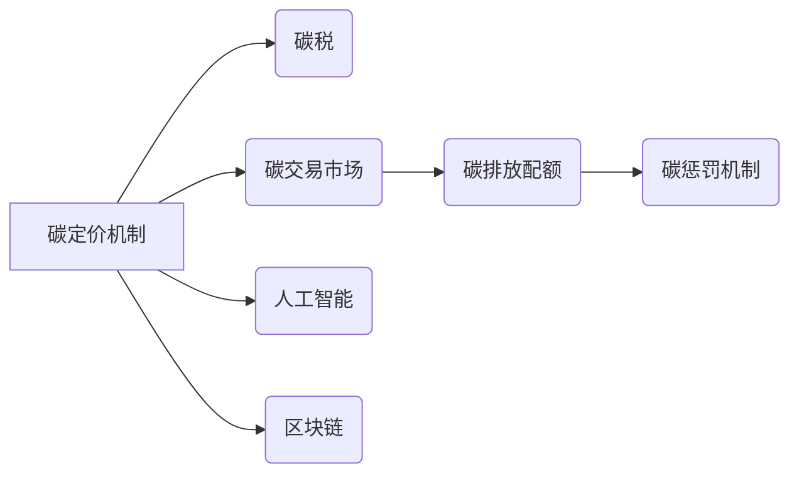

> 碳定价机制、碳税、碳惩罚、人工智能、区块链、可持续发展、全球减排

## 1. 背景介绍

全球气候变化已成为人类面临的严峻挑战，其带来的极端天气、海平面上升和生态系统破坏对人类社会和经济造成巨大威胁。为了应对气候变化，国际社会达成共识，致力于实现碳中和目标，减少温室气体排放。碳定价机制作为一种重要的政策工具，被广泛认为是推动减排、促进绿色转型的重要手段。

传统的碳税机制简单直接，但缺乏灵活性，难以应对不同行业和地区的减排需求。随着人工智能、区块链等技术的快速发展，新的碳定价机制应运而生，它们更加智能化、透明化和高效化，能够更好地促进全球减排。

## 2. 核心概念与联系

**2.1 碳定价机制**

碳定价机制是指通过设定碳排放的经济成本，引导企业和个人减少碳排放的行为。其主要形式包括碳税和碳交易市场。

* **碳税:** 对碳排放进行直接征税，税收收入可用于支持清洁能源发展、减排技术研发等。
* **碳交易市场:** 通过设立碳排放配额，企业可以买卖碳排放权，鼓励低排放企业出售排放权，高排放企业购买排放权，实现碳排放量的市场化调节。

**2.2 碳惩罚机制**

碳惩罚机制是指对超出碳排放配额的企业或个人进行经济处罚，以提高碳排放成本，激励企业和个人减少碳排放。

**2.3 人工智能与区块链技术**

* **人工智能 (AI):** AI技术能够分析海量数据，识别碳排放模式，预测未来碳排放趋势，为碳定价机制提供数据支持和决策依据。
* **区块链 (BC):** BC技术能够实现数据透明、安全和不可篡改，为碳交易市场提供可靠的交易平台，保障碳排放权的真实性和有效性。

**2.4 核心概念关系图**



## 3. 核心算法原理 & 具体操作步骤

**3.1 算法原理概述**

碳定价机制的算法原理主要基于经济学原理，通过设定碳排放成本，引导企业和个人减少碳排放。具体算法包括碳排放量计算、碳价格确定、碳交易配额分配等环节。

**3.2 算法步骤详解**

1. **碳排放量计算:** 利用传感器、卫星遥感等技术，收集企业和个人的碳排放数据，并进行计算和分析，确定每个主体排放的碳量。
2. **碳价格确定:** 根据市场供求关系、碳排放成本、环境效益等因素，确定碳排放的市场价格，即碳税或碳排放权的价格。
3. **碳交易配额分配:** 根据国家或地区的减排目标，将碳排放配额分配给企业和个人，并设定交易规则，允许企业和个人买卖碳排放权。
4. **碳惩罚机制:** 对超出碳排放配额的企业或个人，按照设定比例进行经济处罚，以提高碳排放成本，激励企业和个人减少碳排放。

**3.3 算法优缺点**

* **优点:** 能够有效地减少碳排放，促进绿色转型，提高资源利用效率。
* **缺点:** 碳排放量计算复杂，数据准确性难以保证，碳价格波动较大，对经济发展可能造成一定影响。

**3.4 算法应用领域**

碳定价机制的算法广泛应用于能源、交通、工业、农业等领域，旨在推动各行业实现碳中和目标。

## 4. 数学模型和公式 & 详细讲解 & 举例说明

**4.1 数学模型构建**

碳定价机制的数学模型可以描述碳排放量、碳价格、碳交易量之间的关系。

* **碳排放量模型:**  $E = f(P, T, I)$

其中:

* $E$：碳排放量
* $P$：碳价格
* $T$：技术水平
* $I$：经济发展水平

* **碳价格模型:** $P = g(E, D, S)$

其中:

* $P$：碳价格
* $E$：碳排放量
* $D$：碳需求
* $S$：碳供应

**4.2 公式推导过程**

碳价格模型的推导过程可以基于供求关系，假设碳市场是一个完全竞争的市场，则碳价格等于碳需求和碳供应的均衡点。

**4.3 案例分析与讲解**

假设一个国家设定碳税为每吨碳排放10美元，企业A的碳排放量为1000吨，则企业A需要支付的碳税为10000美元。

## 5. 项目实践：代码实例和详细解释说明

**5.1 开发环境搭建**

* 操作系统: Ubuntu 20.04
* 编程语言: Python 3.8
* 开发工具: Jupyter Notebook

**5.2 源代码详细实现**

```python
# 碳排放量计算
def calculate_carbon_emission(energy_consumption, emission_factor):
  return energy_consumption * emission_factor

# 碳价格确定
def determine_carbon_price(supply, demand):
  # 根据供求关系确定碳价格
  return ...

# 碳交易配额分配
def allocate_carbon_credits(total_credits, industries):
  # 根据行业排放量分配碳排放配额
  return ...

# 碳惩罚机制
def apply_carbon_penalty(excess_emissions, penalty_rate):
  return excess_emissions * penalty_rate
```

**5.3 代码解读与分析**

* `calculate_carbon_emission()` 函数计算企业或个人的碳排放量，根据能源消耗和排放系数进行计算。
* `determine_carbon_price()` 函数根据碳市场供求关系确定碳价格，可以采用多种算法，例如拍卖机制、竞价机制等。
* `allocate_carbon_credits()` 函数根据国家或地区的减排目标，将碳排放配额分配给不同行业，可以采用多种分配机制，例如按比例分配、竞价分配等。
* `apply_carbon_penalty()` 函数对超出碳排放配额的企业或个人进行经济处罚，可以根据排放超额量和惩罚率计算罚款金额。

**5.4 运行结果展示**

通过运行上述代码，可以模拟碳定价机制的运作过程，计算企业或个人的碳排放成本，并分析碳交易市场的价格波动和碳排放量变化趋势。

## 6. 实际应用场景

**6.1 能源行业**

碳定价机制可以鼓励能源企业开发清洁能源，减少化石燃料的使用，促进能源结构转型。

**6.2 交通行业**

碳定价机制可以鼓励企业和个人使用新能源汽车，减少燃油汽车的使用，降低交通运输行业的碳排放量。

**6.3 工业行业**

碳定价机制可以鼓励企业提高生产效率，减少能源消耗，采用清洁生产技术，降低工业生产的碳排放量。

**6.4 未来应用展望**

随着人工智能、区块链等技术的不断发展，碳定价机制将更加智能化、透明化和高效化，能够更好地促进全球减排。

## 7. 工具和资源推荐

**7.1 学习资源推荐**

* **书籍:**《碳定价机制》
* **网站:**国际碳市场协会 (ICMA)

**7.2 开发工具推荐**

* **Python:** 广泛用于数据分析、机器学习和软件开发。
* **Jupyter Notebook:** 用于交互式编程和数据可视化。

**7.3 相关论文推荐**

* **“碳定价机制的经济学分析”**
* **“人工智能在碳定价机制中的应用”**

## 8. 总结：未来发展趋势与挑战

**8.1 研究成果总结**

碳定价机制是应对气候变化的重要政策工具，通过设定碳排放成本，引导企业和个人减少碳排放。人工智能、区块链等技术的应用，将使碳定价机制更加智能化、透明化和高效化。

**8.2 未来发展趋势**

* **碳定价机制的全球化:** 国际社会将进一步加强碳定价机制的合作，建立全球碳市场，促进全球减排。
* **碳定价机制的智能化:** 人工智能将被广泛应用于碳排放量计算、碳价格确定、碳交易配额分配等环节，提高碳定价机制的效率和准确性。
* **碳定价机制的透明化:** 区块链技术将被用于构建碳交易平台，实现碳排放权的透明、安全和不可篡改，提高碳定价机制的公信力。

**8.3 面临的挑战**

* **碳排放量计算的准确性:** 碳排放量计算复杂，数据准确性难以保证，需要进一步提高数据采集和分析技术。
* **碳价格的波动性:** 碳价格波动较大，对经济发展可能造成一定影响，需要建立有效的碳价格管理机制。
* **碳定价机制的公平性:** 碳定价机制的实施需要考虑不同行业和地区的差异，确保公平性。

**8.4 研究展望**

未来研究将重点关注以下几个方面:

* **开发更准确、更智能的碳排放量计算模型。**
* **建立有效的碳价格管理机制，稳定碳价格波动。**
* **研究不同碳定价机制的优缺点，选择最适合的机制。**
* **加强国际合作，推动碳定价机制的全球化。**

## 9. 附录：常见问题与解答

**9.1 碳定价机制的实施会对经济发展造成什么影响？**

碳定价机制的实施可能会对经济发展造成一定影响，但长期来看，它可以促进绿色转型，提高资源利用效率，推动经济的可持续发展。

**9.2 碳定价机制的实施会对不同行业造成什么影响？**

不同行业对碳定价机制的影响不同，高碳排放行业会面临更高的成本压力，而低碳排放行业则可能获得竞争优势。

**9.3 碳定价机制的实施需要哪些条件？**

碳定价机制的实施需要政府的支持、企业的参与和公众的理解。


作者：禅与计算机程序设计艺术 / Zen and the Art of Computer Programming 
<end_of_turn>